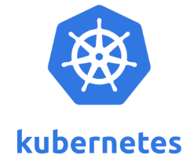
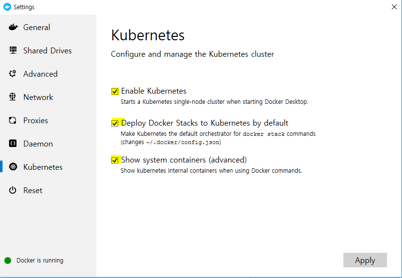
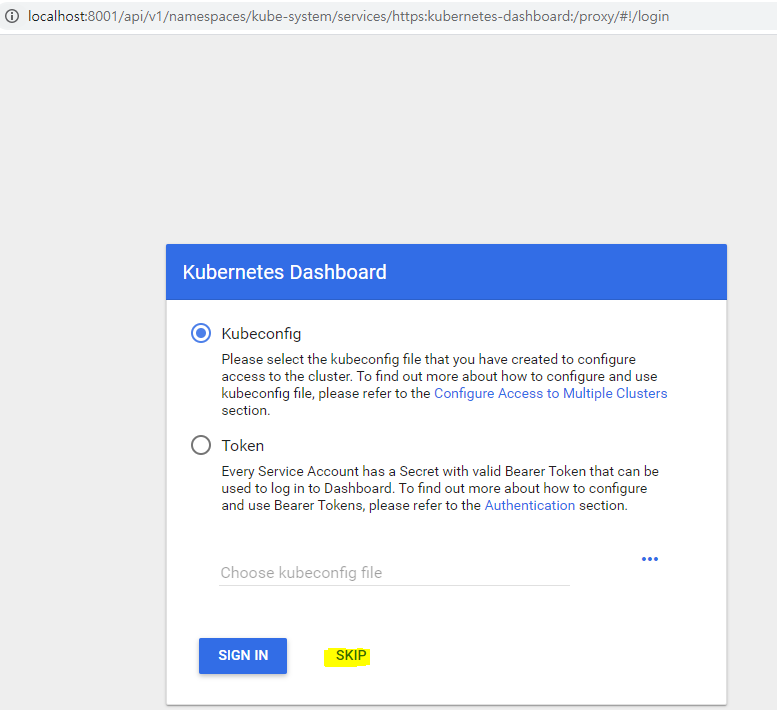
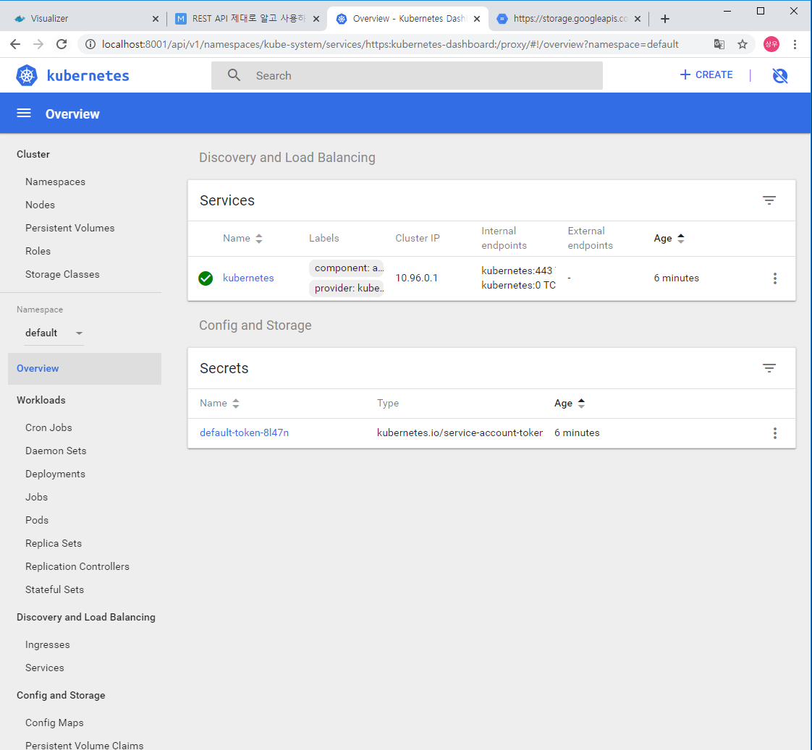

## Kubernetes


#### Kubernetes 란 ?? 




- Docker Container 운영을 자동화하기 위한 컨테이너 오케스트레이션 툴 
  - 컨테이너 배포 및 배치 전략 
  - Scale in / Scale out ( 기존의 작업을 확장 ) 
  - Service discovery 
  - 기타 운용 
- 구글의 Borg 프로젝트에서 시작
- 2017년 Docker 에  정식으로 통합된 사실상 표준 

- Swarm 보다 충실한 기능을 갖춘 컨테이너 오케스트레이션 시스템 


#### Kubernetes 설치 

- Minikube

  - 이전에는 로컬환경에서 kubernetes 를 구축하기 위해 사용 

- 2018년부터 안정버전에서도 설치 가능 

- 윈도우 설치 ) 

  - 바탕화면 트레이 > 도커아이콘(오른쪽클릭) > setting 메뉴 > Kubernetes 

    


#### Kubectl 설치 

- Kubernetes를 다루기 위한 Command Line interface

- 윈도우 설치) 

  - https://storage.googleapis.com/kubernetes-release/release/v1.17.0/bin/windows/amd64/kubectl.exe
  - 다운로드, PATH 추가 

- ```bash
  $ kubectl version  
  # PATH 에 추가하지 않았을 경우 kubectl.exe 가 있는 디렉터리에서 실행
  
  Client Version: version.Info{Major:"1", Minor:"17", GitVersion:"v1.17.0", GitCommit:"70132b0f130acc0bed193d9ba59dd186f0e634cf", GitTreeState:"clean", BuildDate:"2019-12-07T21:20:10Z", GoVersion:"go1.13.4", Compiler:"gc", Platform:"windows/amd64"}
  Server Version: version.Info{Major:"1", Minor:"14", GitVersion:"v1.14.8", GitCommit:"211047e9a1922595eaa3a1127ed365e9299a6c23", GitTreeState:"clean", BuildDate:"2019-10-15T12:02:12Z", GoVersion:"go1.12.10", Compiler:"gc", Platform:"linux/amd64"}
  ```


#### 대시보드 설치 


대쉬 보드를 통해서 실 운영상태에서는 사용x  --> 패스워드가 모두 노출된다. 

따라서 대쉬보드는 가급적 개발 환경에서 사용하기를 권장 


로컬 쿠버네티스 환경에서 대시보드를 아래와 같이 배포할 수 있다. 

```bash
$ kubectl apply -f https://raw.githubusercontent.com/kubernetes/dashboard/v1.8.3/src/deploy/recommended/kubernetes-dashboard.yaml

secret/kubernetes-dashboard-certs created
serviceaccount/kubernetes-dashboard created
role.rbac.authorization.k8s.io/kubernetes-dashboard-minimal created
rolebinding.rbac.authorization.k8s.io/kubernetes-dashboard-minimal created
deployment.apps/kubernetes-dashboard created
service/kubernetes-dashboard created
```


웹 브라우저로 대시보드를 볼 수 있도록 프록시 서버를 설정 

```bash
$ kubectl proxy 

Starting to serve on 127.0.0.1:8001
```


웹 브라우저로 다음 URL 을 접근하면 대시보드를 볼 수 있다. 



위의 화면에서 SKIP 을 하면 아래와 같이 대시보드가 실행되는 것을 확인할 수 있다. 



