# MSSQL JDBC 실행하기 


## 1. SQL Server 용 JDBC 드라이버 다운로드 


https://docs.microsoft.com/ko-kr/sql/connect/jdbc/download-microsoft-jdbc-driver-for-sql-server?view=sql-server-2017


- JDBC 버전에 따라서 지원되는 Java 버전이 다르기 때문에 자신의 Java 버전을 확인하고 다운로드 진행

  현재 나는 PC 에 1.7 과 1.8 버전 2개가 존재하기 때문에 이 2개를 지원하는 6.4 버전을 설치할 예정 

  

  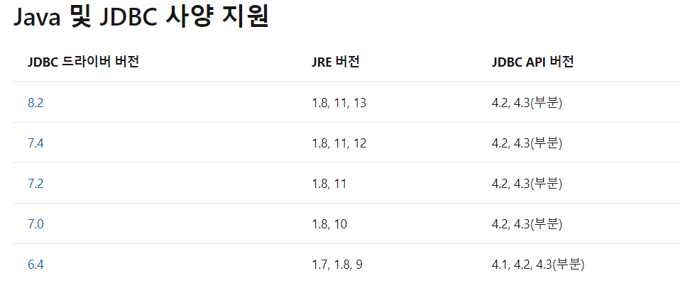

  

- 다운로드 이후 압축을 해제한다. 


**※ MSSQL 이 Windows 인증인경우 아래 작업을 진행** 

- `Microsoft JDBC Driver 6.4 for SQL Server\sqljdbc_6.4\kor\auth` 디렉터리에 자신의 사양에 맞는 `x64` 를 들어가서 `sqljdbc_auth.dll` 파일을 `C:\Windows\System32` 로 복사해준다. 

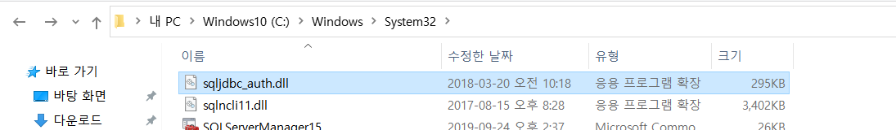


## 2. MSSQL - JDBC 사용을 위한 환경 설정  


### SQL Server 구성 관리자 실행 

#### 1. TCP/IP '사용'

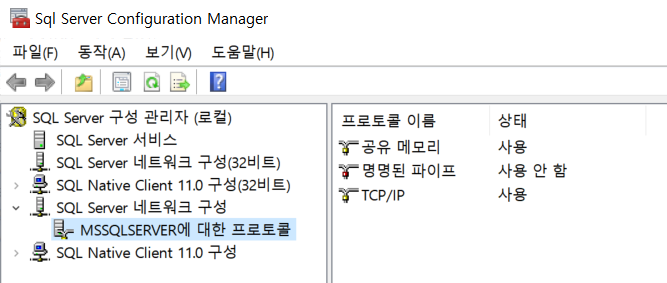


#### 2. SQL Server 재실행 

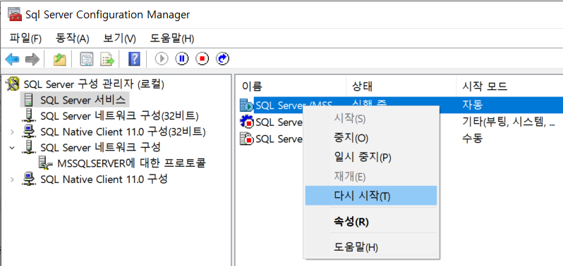


#### 3. TCP/IP 속성 변경 

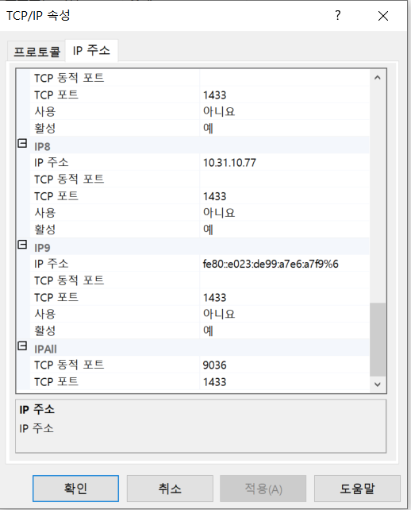

- `IPAll` 에서 TCP 동적 포트 설정하기 ( 난 임의로 9036 으로 설정 )


## JAVA - JDBC 사용을 위한 환경 설정 


### 자바 버전에 해당하는 `jar` 파일 복사 

- `Microsoft JDBC Driver 6.4 for SQL Server\sqljdbc_6.4\kor` 경로 밑에 자신의 java 버전에 해당하는 jar 파일을 복사한다.

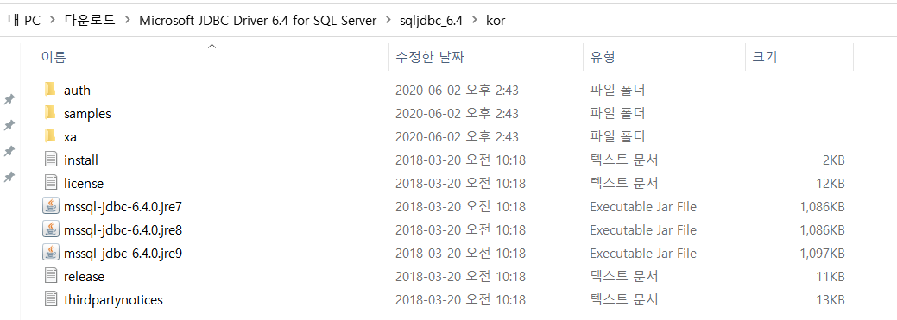

- JAVA 밑에 디렉터리에 복사 ( Tomcat 이용시 Tomcat 디렉터리 밑에도 복사 )

  - `Java\jre1.8.0_251\lib\ext` 밑에 jar 파일 붙여넣기 

    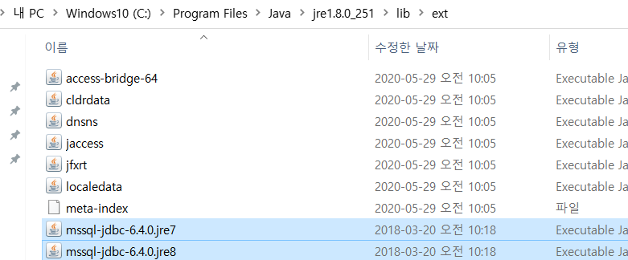

  - `apache-tomcat-7.0.104\lib` 밑에 jar 파일 붙여넣기 

    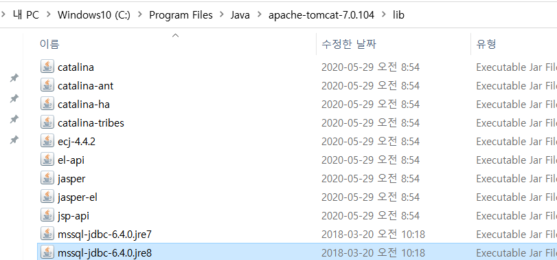

  - 이클립스 재 실행 


## JDBC 사용 


- **사전작업 )** MSSQL DB 에 테이블을 생성해놓고, Dummy Data 를 생성

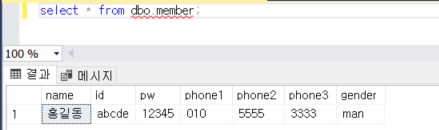


- **진행 순서**

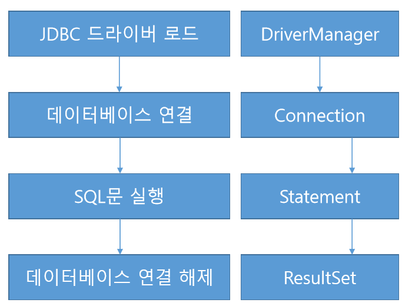


```java
package com.javalec.ex;

import java.sql.Connection;
import java.sql.DriverManager;
import java.sql.ResultSet;
import java.sql.SQLException;
import java.sql.Statement;

public class Test {
	private Connection connection; 
	private Statement stmt; 
	private ResultSet resultSet;
	
	public static void main(String[] args) throws ClassNotFoundException, SQLException{
		
		Class.forName("com.microsoft.sqlserver.jdbc.SQLServerDriver");
	    String url = "jdbc:sqlserver://localhost:9036;database=master;integratedSecurity=true";
	    Connection connection = DriverManager.getConnection(url);
	    Statement stmt = connection.createStatement();
	    
	    String query = "select * from member"; 
	    
        ResultSet resultSet = stmt.executeQuery(query); 
        
        String id="", pw="", name="", phone1="", phone2="", phone3="", gender=""; 
        
		try{
			
			while(resultSet.next()){
				 id = resultSet.getString("id"); 
				 pw = resultSet.getString("pw"); 
				 name = resultSet.getString("name"); 
				 phone1 = resultSet.getString("phone1");
				 phone2 = resultSet.getString("phone2"); 
				 phone3 = resultSet.getString("phone3");
				 gender = resultSet.getString("gender"); 
			}
			
			System.out.println("아이디 : " + id + ", 비밀번호 : " + pw + ", 이름 : " + name + ", 폰번호 : " + phone1 + " - " + phone2 + " - " + phone3);
						
		}catch(Exception e){
			e.printStackTrace();
		}finally{
			try{
				if(connection != null) connection.close(); 
				if(stmt != null) stmt.close(); 
				if(resultSet != null) resultSet.close(); 
				
			}catch(Exception e2){
				e2.printStackTrace();
			}
		}
	}
}
```

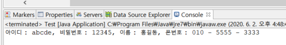

