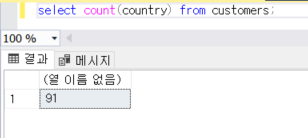
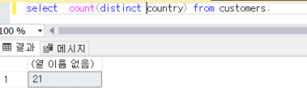
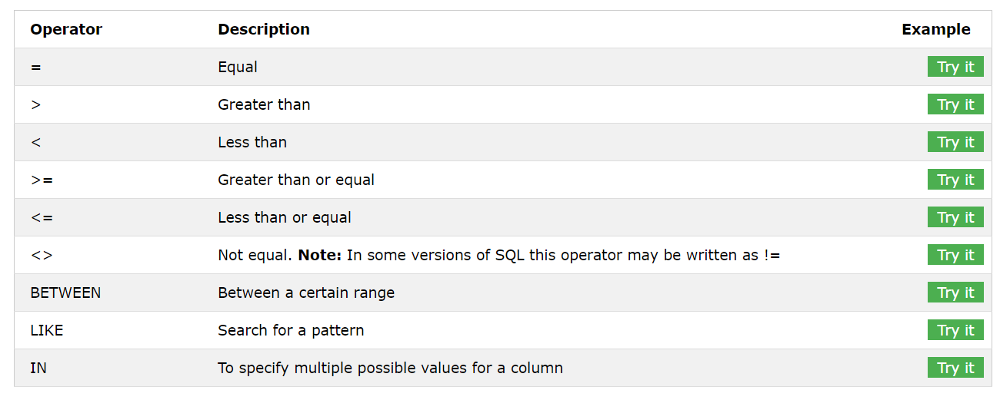
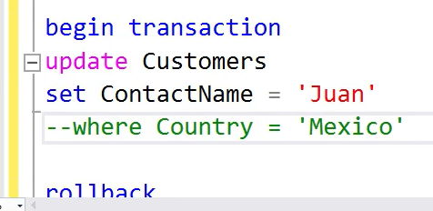
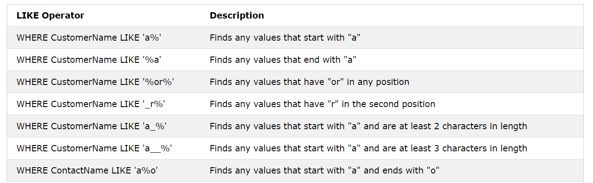
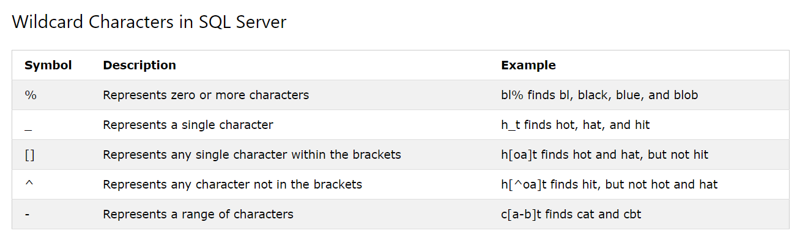
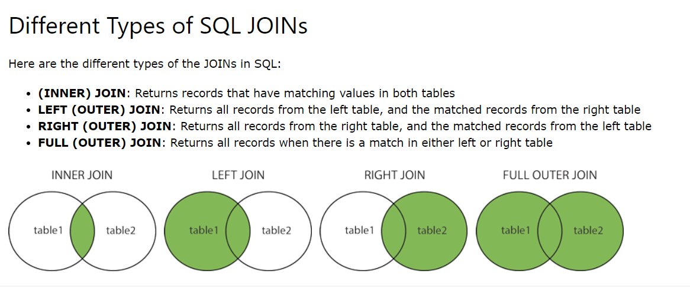
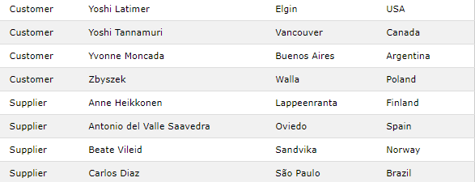
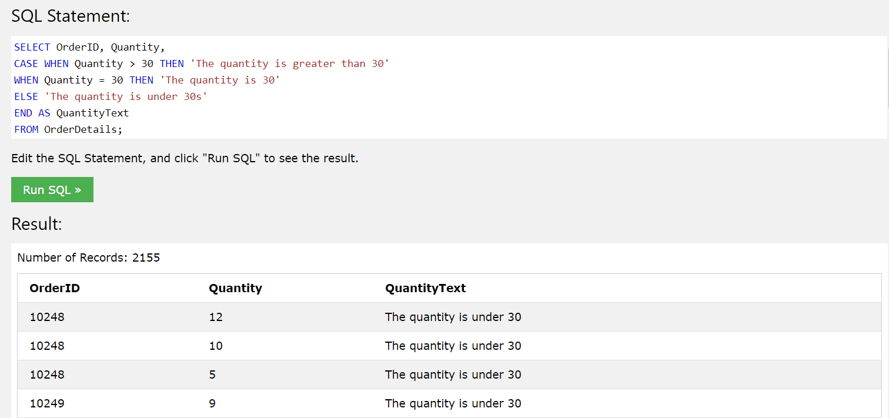

# SQL Syntax


- 대소문자를 구분하지 않는다. 
- 세미콜론은 서버에 대한 동일한 호출에서 둘 이상의 SQL문을 실행할 수 있는 데이터 베이스 시스템에서 각 SQL 문을 분리하는 표준방법이다. 


## `SELECT` 


```mssql
select 열1, 열2 from 테이블 이름 ;
```


## `SELECT DISTINCT` 


- 중복된 값을 다 제거하고 유일한 값들만 보여준다. 


```mssql
select distinct 열1, 열2 ... from 테이블 이름; 
```







## `SELECT TOP` 


```mssql
select top number 열이름 from 테이블 이름 where 조건; 
```

```mssql
select top 숫자 percent 열이름 from 테이블이름 where 조건;
```


## `Where` 


```mssql
select 열1, 열2 ... from 테이블이름 where 조건; 
```




## `And` , `Or` , `Not` 


### `And` 

```mssql
select 열1, 열2...from 테이블이름 where 조건1 and 조건2 ;
```


### `Or` 

```mssql 
select 열1, 열2...from 테이블이름 where 조건1 or 조건2; 
```


### `Not` 

```mssql
select 열1, 열2...from 테이블이름 where not 조건; 
```


## `Order by` 


- 오름차순 정렬 `asc` 

```mssql 
select 열1, 열2 from 테이블 이름 order by 열이름 asc; 
```

- 내림차순 정렬 `desc` 

```mssql
select 열1, 열2 from 테이블 이름 order by 열이름 desc;
```


## `insert into` 


**2가지 방법** 

1. ```mssql
   insert into 테이블이름 (열1, 열2) values (값1, 값2); 
   ```

2. 모든 열의 값을 다 넣어서 입력할 경우에는 열 이름을 따로 쓰지 않아도 된다. 

   ```mssql
   insert into 테이블이름 values (값1, 값2, ...); 
   ```


- `into` 구문이 없어도 잘 동작한다. 


## `Null Value` 


- null value 는 값이 없는 것을 의미한다. 


### `IS NULL` 

```mssql 
select 열이름 from 테이블이름 where 열이름 is null;
```


### `IS NOT NULL` 

```mssql
select 열이름 from 테이블이름 where 열이름 is not null;
```


## `Update` 


```mssql 
update 테이블이름 set 열1=값1, 열2=값2, ... where 조건; 
```


- where 없이 update 문을 사용한다면, 전체 데이터가 바뀌니 주의해야한다. 


## `Delete` 


```mssql
delete from 테이블이름 where 조건; 
```


- 전체 삭제되는 것을 방지하면서 테스트하기 위해 `begin transcation` - `rollback` 을 사용하기도 한다. 




## `MIN` , `MAX` 


### `MIN` 

```mssql 
select min(열이름) from 테이블이름 where 조건; 
```


### `MAX` 

```mssql 
select max(열이름) from 테이블이름 where 조건; 
```


## `COUNT` , `AVG` , `SUM` 


### `COUNT` 

```mssql 
select count(열이름) from 테이블이름 where 조건; 
```


### `AVG` 

```mssql
select avg(열이름) from 테이블이름 where 조건; 
```


### `SUM` 

```mssql 
select sum(열이름) from 테이블이름 where 조건; 
```


## `Like` 


```mssql
select 열이름1, 열이름2 from 테이블이름 where 열 like 패턴; 
```





## Wildcards 

- 와일드카드 문자는 문자열에서 하나 이상의 문자를 대체하는 데 사용된다.




## `In` 


```mssql
select 열이름 from 테이블이름 where 열이름 in (값1, 값2, ...); 
```

```mssql
select 열이름 from 테이블이름 where 열이름 in (select 상태);
```


## `Between and ` 


- 범위를 표시할 때 사용하며, 값으로는 숫자, 문자 또는 날짜가 가능하다. 

```mssql
select 열이름 from 테이블이름 where 열이름 between 값1 and 값2; 
```


## Aliases 


- Aliases 는 테이블이나, 열에 일시적인 이름을 부여할 때 사용한다. 

```mssql
select 열이름 as 별칭 from 테이블이름; 
```

```mssql
select 열이름 from 테이블 as 별칭; 
```


예시) 

```mssql
select companyName, address+','+postalcode+','+city+','+countery as address from customers; 
```


## `Join` 





### `Inner Join`


```mssql
select 열이름 from 테이블1 inner join 테이블2 on 테이블1.열이름 = 테이블2.열이름; 
```


- 3개의 테이블 조인 예시 

  ```mssql
  select o.orderid, c.customername, s.shippername 
  from ( (orders as o inner join customers as c on o.customerid = c.customerid) 
       	inner join shipper as s on o.shipperid = s.shipperid); 
  ```


### `Left Join` 

```mssql 
select 열이름 from 테이블1 left join 테이블2 on 테이블1.열이름=테이블2.열이름; 
```


### `Right Join` 

```mssql
select 열이름 from 테이블1 right join 테이블2 on 테이블1.열이름=테이블2.열이름; 
```


### `Full Join` 

```mssql
select 열이름 from 테이블1 full outer join 테이블2 on 테이블1.열이름=테이블2.열이름 where condition; 
```


### `Self Join` 

```mssql
select 열이름 from 테이블 T1, 테이블 T2 where 조건; 
```

- T1 과 T2 는 같은 테이블의 다른 별칭이다. 

```mssql
select 열이름 from 테이블 T1 join 테이블T2 on T1.열이름 = T2.열이름 ; 
```


## `Union` 


```mssql
select 열이름 from 테이블1 union select 열이름 from 테이블2; 
```


- 중복값을 허용하려면 `Union All` 을 사용해야한다. 

  ```mssql
  select 열이름 from 테이블1 union all select 열이름 from 테이블2; 
  ```

  

예시 ) - 별칭 사용 

```mssql
SELECT 'Customer' As Type, ContactName, City, Country
FROM Customers
UNION
SELECT 'Supplier', ContactName, City, Country
FROM Suppliers;
```




## `Group By` 


- 결과 집합을 하나 이상의 열로 그룹화하기 위해 Count, Max, Min, Sum, Avg 와 함께 종종 사용된다. 

```mssql
select 열이름 from 테이블이름 where 조건 group by 열이름 order by 열이름; 
```


## `Having`


```mssql
select 열이름 from 테이블 where 조건 group by 열이름 having 조건 order by 열이름; 
```


## `Exist` 


```mssql
select 열이름 from 테이블이름 where exists (select 열이름 from 테이블이름 where 조건 );  
```


## `Select Into` 


- 새로운 테이블에 열들을 복사

```mssql
select * into 새로운테이블 [in externaldb] from 기존테이블 where 조건; 
```

```mssql
select 열이름1,열이름2, ... into 새로운테이블 [in externaldb] from 기존테이블 where 조건; 
```


## `Insert Into Select` 


- 기존의 테이블에 있는 데이터를 목사하여 다른 테이블에 삽입 

```mssql
insert into 테이블2 select * from 테이블1 from 조건; 
```

```mssql
insert into 테이블2 (열이름1, 열이름2, ...) select 열이름1, 열이름2 ... from 테이블1 where 조건; 
```


## `case` 


```mssql
CASE 
	WHEN 조건1 THEN 결과1
	WHEN 조건2 THEN 결과2 
	ELSE
END; 
```




## `DECLARE` 


- 변수 선언 

  ```mssql
  DECLARE @변수명 데이터형식
  
  --ex)
  DECLARE @a INT
  ```

- 변수 사용 

  ```mssql 
  SET @변수명=값
  
  --ex)
  SET @a=1
  ```

- 변수의 값을 출력 시 

  ```mssql
  SELECT 변수명 
  
  --ex)
  SELECT @a; 
  ```

  