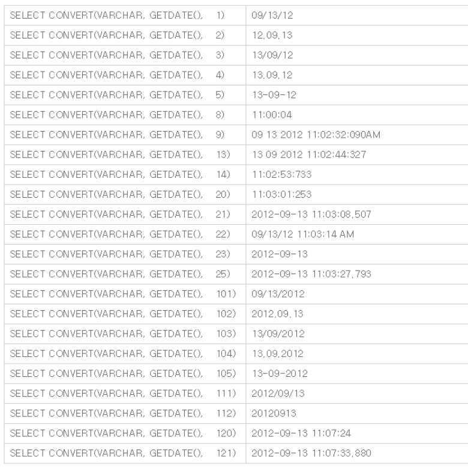

# MSSQL 함수 


### LTRIM 

- 해당 문자열의 왼쪽에 있는 공백을 제거해주는 함수 
- 문자열을 합칠 경우, 왼쪽에 공백이 생기는데 이를 제거할 때 유용하게 사용된다. 

```MSSQL
-- 문법 
LTRIM(문자열)

-- EX 
DECLARE @SQL NVARCHAR(200) SET @SQL = ' SPACE' 
LTRIM(@SQL)
```


### RTRIM

- 해당 문자열의 오른쪽에 있는 공백을 제거해주는 함수 

```MSSQL 
--문법--
LTRIM(문자열)
-- EX --
DECLARE @SQL NVARCHAR(200) SET @SQL = 'SPACE '
RTRIM(@SQL)
```


### CHARINDEX

- 문자열에서 지정한 식의 시작 위치를 반환하는 함수 . 


- 사용법 1 

```MSSQL
-- 문법 -- 
-- b에서 a라는 문자열이 시작되는 위치를 반환.
CHARINDEX('찾을 문자열a', '지정문자열b')
```

- 사용법 2 

```MSSQL
-- 문법 --
-- b에서 지정숫자 c부터 검색을 시작하라는 말 
CHARINDEX('찾을문자열a', '지정문자열b', 숫자c )
```


```MSSQL
-- EX -- 
SELECT CHARINDEX('다','가나다라마') --결과: 3

SELECT CHARINDEX('다','가나다라마',2) --결과: 3
--(문자열의 2번째 위치한 '나'부터 검색을 시작!  '나다라마' 에서 '다'를 찾는 것이다.
-- 찾을경우 '다'는 전체 문자열에 대한 '다'의 위치를 반환하기에 결과는 3 이다.)

SELECT CHARINDEX('다','가나다라마',4) --결과: 0
-- 4번째 위치한 '라'부터 검색을 시작! '라마'에서 '다'를 찾는 것이다.
--'라마'에는 '다'가 없기에 0을 반환.
```


### ROUND 

- 구하려는 소수점 자리수의 한 자리 아래의 숫자를 반올림 혹은 버림한다. 
- 반올림 여부의 값을 0 또는 생략할 경우 반올림, 음수값일 경우 버림. 

```mssql
-- 문법 -- 
ROUND(값, 반올림 자릿수, [반올림여부])

-- Ex -- 
SELECT ROUND(10.349, 1) -- 10.300 
SELECT ROUND(10.349, 2) -- 10.350 
SELECT ROUND(10.349, 2, 0) -- 10.350 
SELECT ROUND(10.349, 2, -1) -- 10.340
```


### CEILING 

- 올림 함수. - 무조건 정수값으로 출력 

```MSSQL 
SELECT CEILING(28.34) -- 29
SELECT CEILING(27.1) -- 28
```


### FLOOR

- 버림 함수. - 무조건 정수값으로 출력 

```MSSQL
SELECT CEILING(28.34) -- 28
SELECT CEILING(27.1) -- 27
```


### CONVERT 

- 하나의 유형에서 다른 유형으로 데이터를 변환하는 함수 

- 날짜 변환하는데 유용하게 사용 
- 부동 소수점 또는 숫자에서 정수로 변환할 때 CONVERT() 함수는 결과를 자른다. 다른 변환일 경우에는 반올림. 

```MSSQL
--문법--
CONVERT(data_type[(length)], expression[style])
```

`expression  `: 유효한 식

`data_type` : 대상 데이터 형식 별칭 데이터 형식은 사용할 수 없습니다.

`length` : 대상 데이터 형식의 길이를 지정하는 선택적 정수입니다. 기본값은 30입니다.

`style` : Convert 함수가 식을 변환하는 방법을 지정하는 정수 식입니다. style이 Null이면 Null값이 반환됩니다.

```MSSQL
-- EX --
--테이블(MY_TABLE)의 나이(AGE)칼럼을 INT에서 CHAR로 형변환--
SELECT CONVERT(NVARCHAR(10),AGE)+'세'AS 나이 FROM MY_TABLE

--테이블(MY_TALBE)에서 날짜(DTS)칼럼을 INT에서 DATE로 형변환--
SELECT CONVERT(DATE,SUBSTRING(DTS,1,8))AS 날짜 FROM MY_TABLE
```


- CONVERT 날짜 변환표 




### CAST

- 하나의 유형에서 다른 유형으로 데이터를 변환하는 함수 

- FLOAT 또는 NUMBERIC 에서 INTEGER 로 변환할 때 CAST() 함수는 결과를 자른다. 

```MSSQL
-- 문법 --
CAST(expression AS data_type(length))

-- EX --
SELECT CAST(29.8 AS INT) -- 29 
SELECT CAST(3 AS VARCHAR) + 'AGE'  -- 3AGE
```

