## 11.1 저장 프로시저 

- SQL Server에서 제공되는 프로그래밍 기능. 


### 11.1.1 저장 프로시저의 개요 

- 한마디로 쿼리문의 집합으로, 어떤 동작을 일괄처리할 때 사용한다. 


#### 저장 프로시저의 정의 형식 

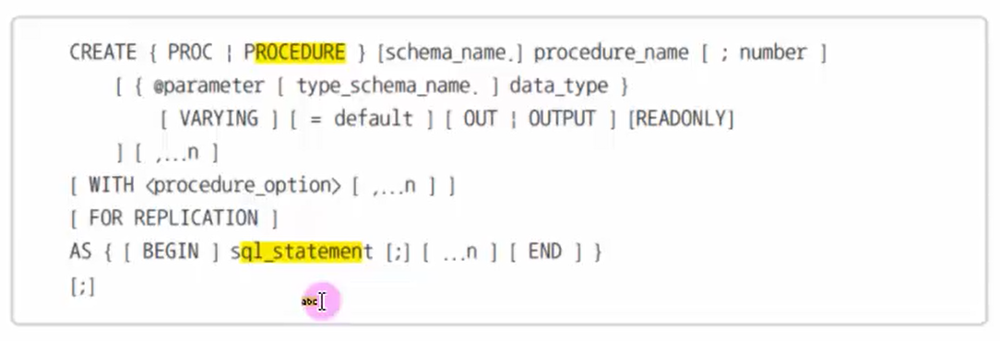


- 저장 프로시저를 생성한다고 자동으로 실행되는 것은 아니다. 


#### 프로시저 생성 문법

```mssql
CREATE PROC [프로시저명] 
AS
	[쿼리문]
```


#### 프로시저 삭제 문법 

```mssql
DROP PROCEDURE [프로시저명]
```


#### 저장 프로시저의 수정과 삭제 

- 수정 : `ALTER PROCEDURE` 
- 삭제 : `DROP PROCEDURE` 


#### 매개변수의 사용 

- 저장 프로시저에는 실행 시 입력 매개변수를 지정할 수 있다. 
- 입력된 매개변수는 저장 프로시저의 내부에서 다양한 용도로 사용될 수 있다. 
- 저장 프로시저에서 처리된 결과를 출력 매개변수를 통해서 얻을 수도 있다. 

```
@입력_매개변수_이름 데이터_형식 [=디폴트값]
```

디폴트 값은 프로시저의 실행 시 매개변수에 값을 전달하지 않았을 때, 사용되는 값이다. 

```sql
EXECUTE 프로시저_이름 [전달 값]
```


```
@출력_매개변수_이름 데이터_형식 OUTPUT
```

```
EXECUTE 프로시저_이름 @변수명 OUTPUT
```


##### 매개 변수 1개

```mssql
CREATE PROCEDURE usp_users1 
	@userName NVARCHAR(10)
AS
	SELECT * FROM userTbl WHERE name=@userName; 
GO

EXEC usp_users1 '조관우'; 
```

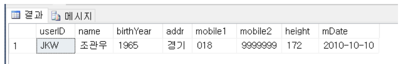


##### 매개 변수 2개 

```mssql
CREATE PROCEDURE usp_users2 
	@userBirth INT, @userHeight INT 
AS
	SELECT * FROM userTbl WHERE birthYear > @userBirth AND height > @userHeight; 
Go 

EXECURE usp_users2 1970, 178; 
```

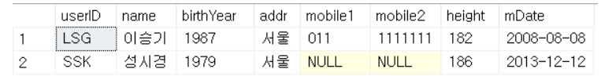


##### 매개변수 2개 순서 바꾸기 

```mssql
CREATE PROCEDURE usp_users2 
	@userBirth INT, 
	@userHeight INT 
AS 
	SELECT * FROM userTbl WHERE birthYear > @userBirth AND height > @userHeight ; 
GO

EXEC usp_users2 @userHeight=178, @userBirth=1970; 
```

실행 시에 매개변수를 언급하고 값을 대입하면 순서를 바꿀 수 있다. 


##### 매개 변수 default 값 

```mssql
CREATE PROCEDURE usp_users3 
	@userBirth INT=1970, 
	@userHeight INT=178
AS 
	SELECT * FROM userTbl WHERE birthYear > @userBirth AND height > @userHeight ; 
GO

EXEC usp_users3; 
```


##### OUTPUT 매개변수 사용 

```mssql
CREATE PROCEDURE usp_users4
	@txtValue NCHAR(10), 
	@outValue INT OUTPUT
AS 
	INSERT INTO testTbl VAlUeS(@txtValue); 
	SELECT @outValue = IDENT_CURRENT('testTbl'); 
GO

-- 테스트용 테이블 생성 
CREATE TABLE testTbl (id INT IDENTITY, txt NCHAR(10)); 
GO

-- 저장 프로시저 생성 
DECLARE @myValue INT; 

EXEC ups_users4 '테스트값1', @myValue OUTPUT; 
PRINT '현재 입력된 ID값 ===> ' + CONVERT(CHAR(5),@myValue)
```

저장 프로시저를 사용할 때 테이블이나 뷰가 미리 있어야 하는것은 아니다. 실행시에만 존재하면 된다.

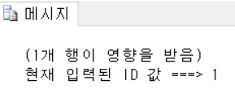


##### IF_ELSE 문 사용 

```mssql 
CREATE PROC usp_ifelse
	@userName NVARCHAR(10) 
AS
	DECLARE @bYear INT 
	SELECT @bYear = birthYear FROM userTbl 
	WHERE name=@userName; 
	IF(@bYear >= 1980)
		BEGIN 
			PRINT N'아직 젊군요..'
		END 
	ELSE
		BEGIN
        	PRINT N'나이가 지긋하네요..'
        END
GO

EXEC usp_ifelse '조용필';
```

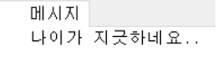

##### CASE 문 사용 

```mssql
CREATE PROC usp_case 
	@userName NVARCHAR(10)
AS 
	DECLARE @bYear INT 
	DECLARE @tti NCHAR(3) 
	SELECT @bYear = birthyear FROM userTbl 
		WHERE name = @userName 
	SET @tti = 
	CASE 
		WHEN(@bYear % 12 = 0) THEN '원숭이'
		WHEN(@bYear % 12 = 1) THEN '닭'
		WHEN(@bYear % 12 = 2) THEN '개'
		WHEN(@bYear % 12 = 3) THEN '돼지'
		WHEN(@bYear % 12 = 4) THEN '쥐'
		WHEN(@bYear % 12 = 5) THEN '소'
		WHEN(@bYear % 12 = 6) THEN '호랑이'
		WHEN(@bYear % 12 = 7) THEN '토끼'
		WHEN(@bYear % 12 = 8) THEN '용'
		WHEN(@bYear % 12 = 9) THEN '뱀'
		WHEN(@bYear % 12 = 10) THEN '말'
		ELSE '양'
	END
PRINT @userName + '의 띠 ==> ' + @tti; 
Go 

EXEC usp_case '성시경'
```

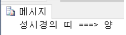


##### WHILE 문 사용 

```mssql

```


### 11.1.2 저장 프로시저의 특징 

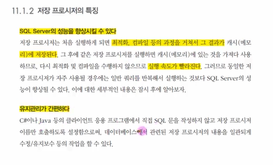

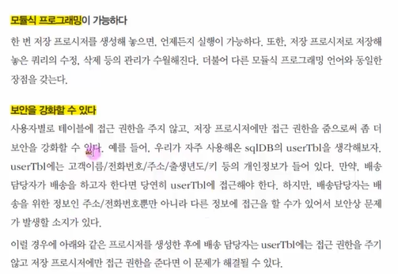

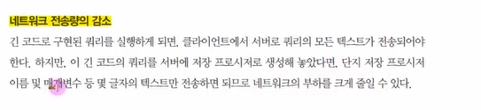


### 11.1.3 저장 프로시저의 종류 

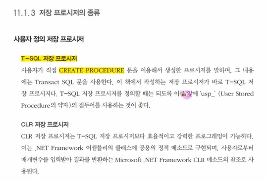

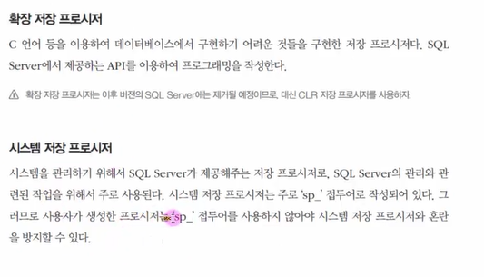


## 11.2 저장 프로시저의 작동 

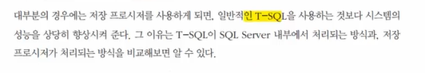

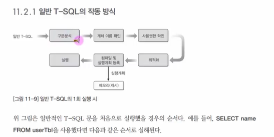

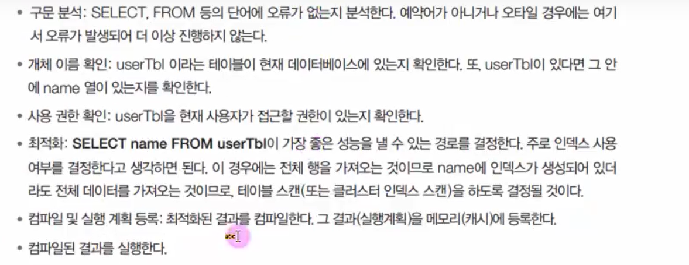

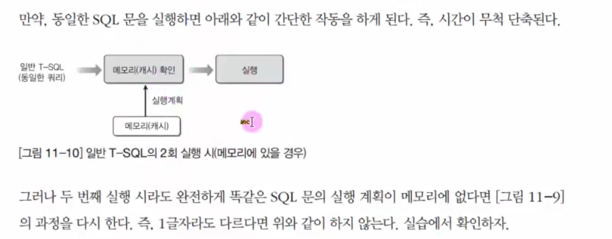


### 11.2.2 저장 프로시저의 작동 방식 

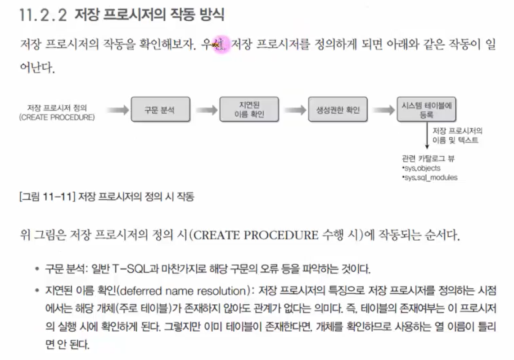


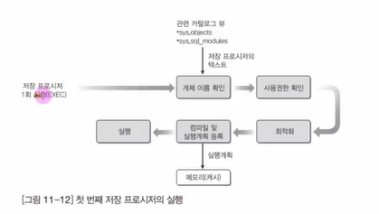

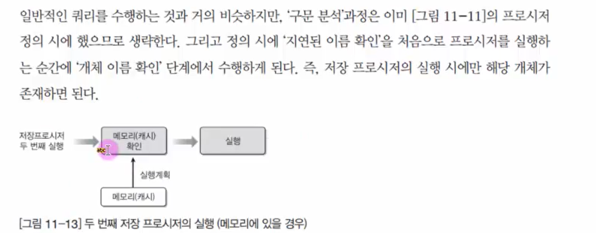


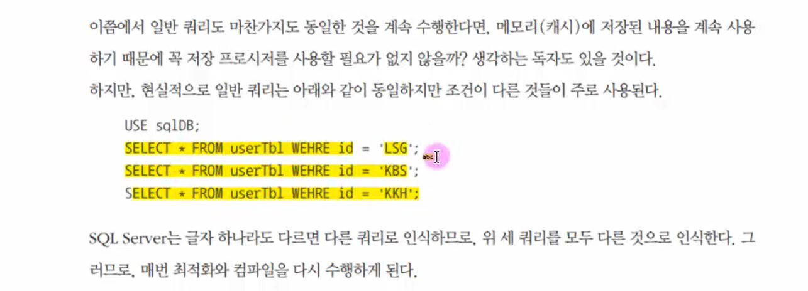


### 11.2.3

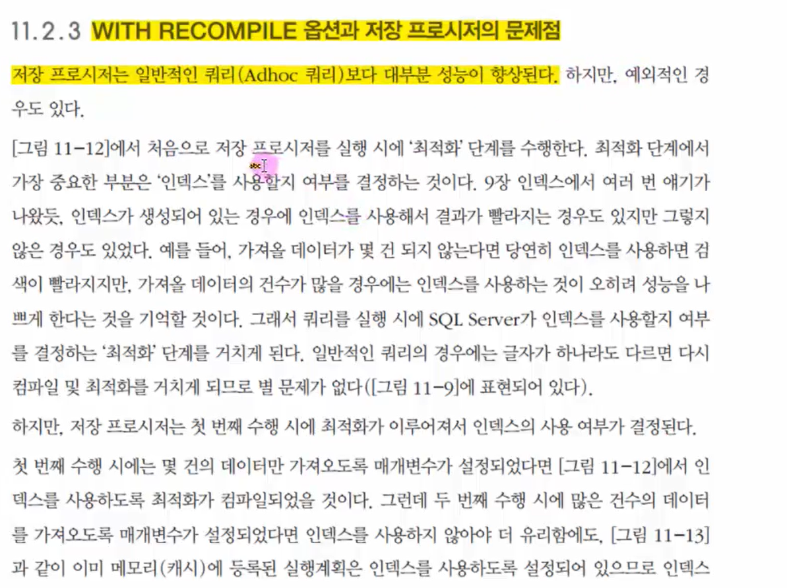

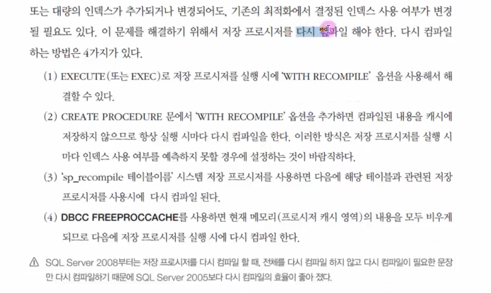


## 11.3 사용자 정의 함수

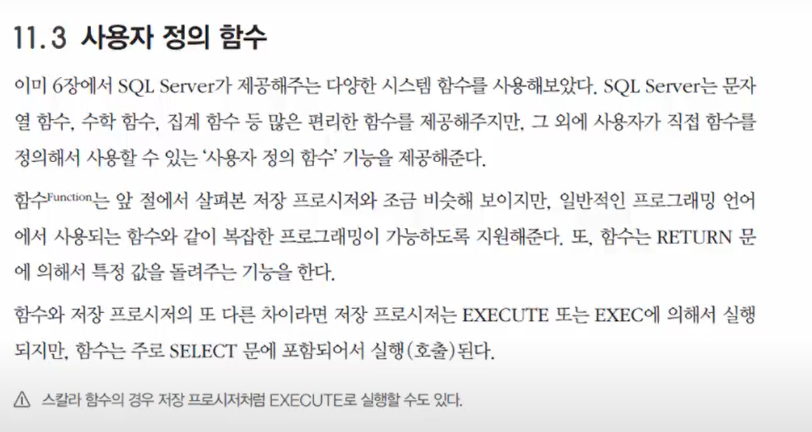

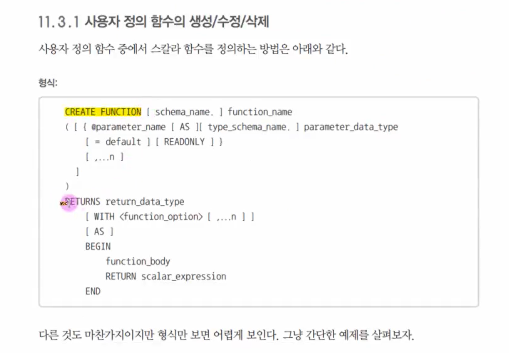

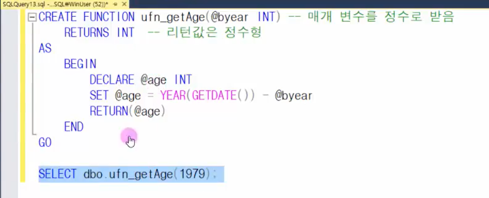

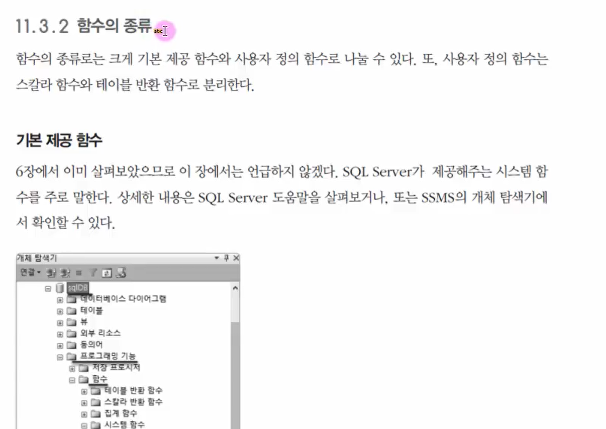

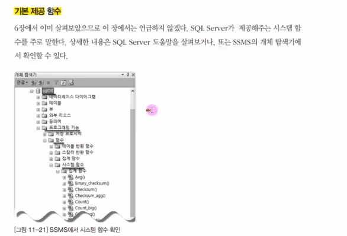

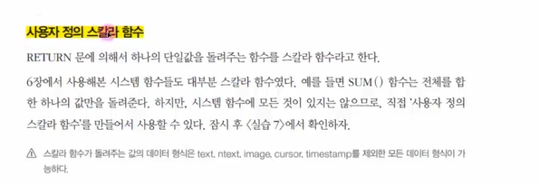

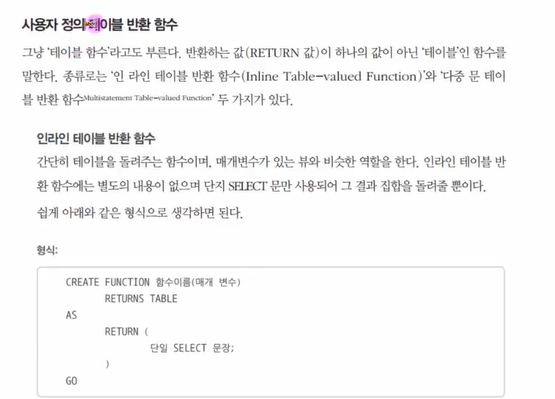

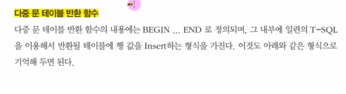

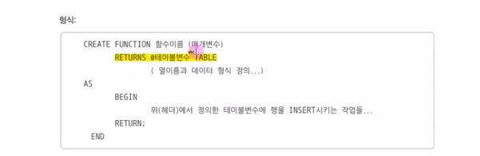

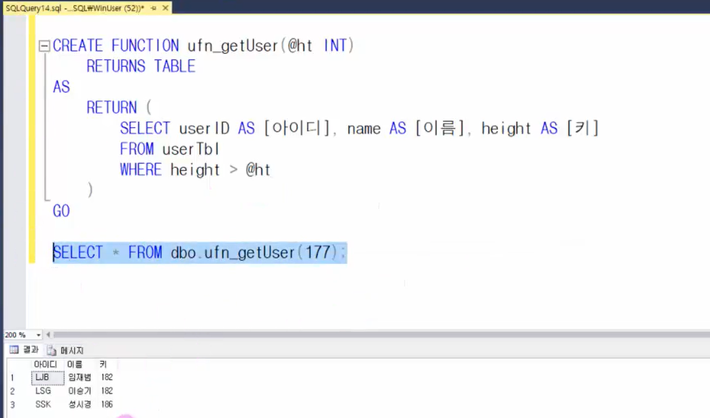


### 11.3.3

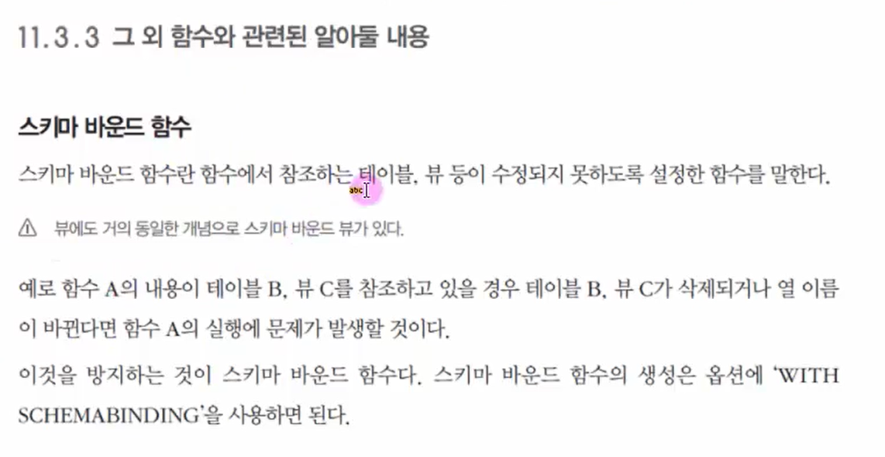

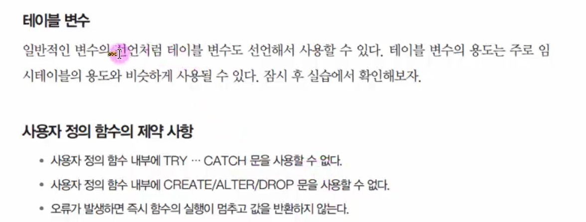