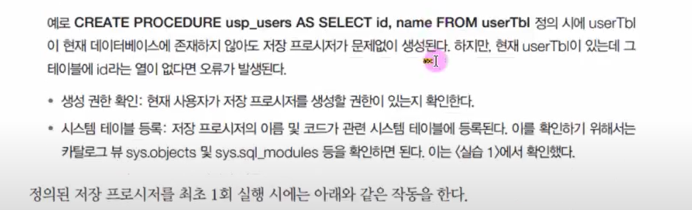

## 11.1 저장 프로시저 

- SQL Server에서 제공되는 프로그래밍 기능. 


### 11.1.1 저장 프로시저의 개요 

- 한마디로 쿼리문의 집합으로, 어떤 동작을 일괄처리할 때 사용한다. 


#### 저장 프로시저의 정의 형식 


- 저장 프로시저를 생성한다고 자동으로 실행되는 것은 아니다. 


#### 프로시저 생성 문법

```mssql
CREATE PROC [프로시저명] 
AS
	[쿼리문]
```


#### 프로시저 삭제 문법 

```mssql
DROP PROCEDURE [프로시저명]
```


#### 저장 프로시저의 수정과 삭제 

- 수정 : `ALTER PROCEDURE` 
- 삭제 : `DROP PROCEDURE` 


#### 매개변수의 사용 

- 저장 프로시저에는 실행 시 입력 매개변수를 지정할 수 있다. 
- 입력된 매개변수는 저장 프로시저의 내부에서 다양한 용도로 사용될 수 있다. 
- 저장 프로시저에서 처리된 결과를 출력 매개변수를 통해서 얻을 수도 있다. 

```
@입력_매개변수_이름 데이터_형식 [=디폴트값]
```

디폴트 값은 프로시저의 실행 시 매개변수에 값을 전달하지 않았을 때, 사용되는 값이다. 

```mssql
EXECUTE 프로시저_이름 [전달 값]
```


```
@출력_매개변수_이름 데이터_형식 OUTPUT
```

```
EXECUTE 프로시저_이름 @변수명 OUTPUT
```


##### 매개 변수 1개

```mssql
CREATE PROCEDURE usp_users1 
	@userName NVARCHAR(10)
AS
	SELECT * FROM userTbl WHERE name=@userName; 
GO

EXEC usp_users1 '조관우'; 
```


##### 매개 변수 2개 

- `,` 로 연결해서 사용. 

```mssql
CREATE PROCEDURE usp_users2 
	@userBirth INT, @userHeight INT 
AS
	SELECT * FROM userTbl WHERE birthYear > @userBirth AND height > @userHeight; 
Go 

EXECURE usp_users2 1970, 178; 
```


##### 매개변수 2개 순서 바꾸기

- 실행 시 매개변수 이름과 함께 값을 대입하면, 순서를 바꿔서 사용할 수 있다. 

```mssql
CREATE PROCEDURE usp_users2 
	@userBirth INT, 
	@userHeight INT 
AS 
	SELECT * FROM userTbl WHERE birthYear > @userBirth AND height > @userHeight ; 
GO

EXEC usp_users2 @userHeight=178, @userBirth=1970; 
```


##### 매개 변수 default 값 

```mssql
CREATE PROCEDURE usp_users3 
	@userBirth INT=1970, 
	@userHeight INT=178
AS 
	SELECT * FROM userTbl WHERE birthYear > @userBirth AND height > @userHeight ; 
GO

EXEC usp_users3; 
```


##### OUTPUT 매개변수 사용 

```mssql
CREATE PROCEDURE usp_users4
	@txtValue NCHAR(10), 
	@outValue INT OUTPUT
AS 
	INSERT INTO testTbl VAlUES(@txtValue); 
	SELECT @outValue = IDENT_CURRENT('testTbl'); 
GO

-- 테스트용 테이블 생성 
CREATE TABLE testTbl (id INT IDENTITY, txt NCHAR(10)); 
GO

-- 저장 프로시저 생성 
DECLARE @myValue INT; 

EXEC ups_users4 '테스트값1', @myValue OUTPUT; 
PRINT '현재 입력된 ID값 ===> ' + CONVERT(CHAR(5),@myValue)
```

저장 프로시저를 사용할 때 테이블이나 뷰가 미리 있어야 하는것은 아니다. 실행시에만 존재하면 된다.


##### IF_ELSE 문 사용 

```mssql 
CREATE PROC usp_ifelse
	@userName NVARCHAR(10) 
AS
	DECLARE @bYear INT 
	SELECT @bYear = birthYear FROM userTbl 
	WHERE name=@userName; 
	IF(@bYear >= 1980)
		BEGIN 
			PRINT N'아직 젊군요..'
		END 
	ELSE
		BEGIN
        	PRINT N'나이가 지긋하네요..'
        END
GO

EXEC usp_ifelse '조용필';
```


##### CASE 문 사용 

```mssql
CREATE PROC usp_case 
	@userName NVARCHAR(10)
AS 
	DECLARE @bYear INT 
	DECLARE @tti NCHAR(3) 
	SELECT @bYear = birthyear FROM userTbl 
		WHERE name = @userName 
	SET @tti = 
	CASE 
		WHEN(@bYear % 12 = 0) THEN '원숭이'
		WHEN(@bYear % 12 = 1) THEN '닭'
		WHEN(@bYear % 12 = 2) THEN '개'
		WHEN(@bYear % 12 = 3) THEN '돼지'
		WHEN(@bYear % 12 = 4) THEN '쥐'
		WHEN(@bYear % 12 = 5) THEN '소'
		WHEN(@bYear % 12 = 6) THEN '호랑이'
		WHEN(@bYear % 12 = 7) THEN '토끼'
		WHEN(@bYear % 12 = 8) THEN '용'
		WHEN(@bYear % 12 = 9) THEN '뱀'
		WHEN(@bYear % 12 = 10) THEN '말'
		ELSE '양'
	END
PRINT @userName + '의 띠 ==> ' + @tti; 
Go 

EXEC usp_case '성시경'
```


##### WHILE 문 사용 

```mssql
-- 기존 테이블에 등급 열 추가 
ALTER TABLE userTbl
	ADD grade NVARCHAR(5); 
GO

-- 저장 프로시저 생성 
CREATE PROCEDURE usp_while
AS
	DECLARE userCur CURSOR FOR -- 커서 선언 
	SELECT U.userid, sum(price*amount)
	FROM buyTbl AS B 
		RIGHT OUTER JOIN userTbl U 
		ON B.userID = U.userID 
	GROUP BY U.userID, U.name 
	
	OPEN userCur -- 커서 열기 
	
	DECLARE @id NVARCHAR(10) 		-- 사용자 아디디를 저장할 변수 
	DECLARE @sum BIGINT				-- 총 구매액을 저장할 변수 
	DECLARE @userGrande NCHAR(5)	-- 고객 등급 변수 
	
	FETCH NEXT FROM userCur INTO @id, @sum 	-- 촉 행 값을 대입 
	WHILE (@@FECTH_STATUS = 0)	-- 행이 없을 때 까지 반복 (즉, 모든 행 처리)
	BEGIN 
		SET @userGrade = 
			CASE 
				WHEN (@sum >= 1500) THEN N'최우수고객'
				WHEN (@sum >= 1000) THEN N'우수고객'
				WHEN (@sum >= 1) THEN N'일반고객'
				ELSE '유령고객'
			END
		UPDATE userTbl SET grade = @userGrade WHERE userID = @id 
		FETCH NEXT FROM userCur INTO @id, @sum 	-- 다음 행 값을 대입 
	END 
	
	CLOSE userCr 	-- 커서 닫기 
	DEALLOCATE userCur  -- 커서 해제 
GO

-- 저장 프로시저 호출 후 확인 
EXEC usp_while; 
SELECT * FROM userTbl; 
```


##### RETURN 문을 이용한 프로시저의 성공 여부 확인 


####  저장 프로시저 에러 

##### `@@ERROR~` 함수를 사용한 오류 처리 


##### 저장 프로시저에 TRY CATCH 사용하기 


#### 저장 프로시저 암호화 


#### 임시 저장 프로시저 

- 접두사 `#` : 로컬 임시 저장 프로시저, tempdb에 생성되며, 생성한 사용자만 사용 가능, 쿼리 종료시 소멸 
- 접두사 `##` : 전역 임시 저장 프로시저, tempdb에 생성되며 외부에서도 사용 가능, 외부에서 접속한 사용자가 없고 쿼리 종료시 소멸

```mssql
-- 저장 프로시저 생성 
CREATE PROC #usp_temp
AS 
	SELECT * FROM userTbl; 
Go

-- 저장 프로시저 
EXEC #usp_temp; 
```


단, 한번만 사용될 저장 프로시저를 생성할 목적이라면, 다음과 같이 `sp_executesql` 시스템 저장 프로시저를 활용하는 것이 시스템 성능을 위해 더 낫다. 

```mssql
EXEC sp_executesql N'SELECT * FROM userTbl'; 
```


### 11.1.2 저장 프로시저의 특징 


- **SQL Server의 성능을 향상시킬 수 있다.** 

  저장 프로시저는 처음 실행하게 되면 최적화, 컴파일 등의 과정을 거쳐서 그 결과가 캐시(메모리)에 저장된다. 그 후에 같은 저장 프로시저를 실행하면 캐시(메모리)에 있는 것을 가져다 사용하므로, 다시 최적화 및 컴파일을 수행하지 않으므로 실행 속도가 빨라진다. 그러므로 동일한 저장 프로시저가 자주 사용될 경우에는 일반 쿼리를 반복해서 실행하는 것보다 SQL Server의 성능이 향상될 수 있다. 

- **유지 관리가 간편하다.** 

  C#이나 Java 등의 클라이언트 응용 프로그램에서 직접 SQL 문을 작성하지 않고, 저장 프로시저 이름만 호출하도록 설정함으로서, 데이터베이스에서 관련된 저장 프로시저의 내용을 일관되게 수정/유지보수 등의 작업을 할 수 있다. 

- **모듈식 프로그래밍이 가능하다**

  한 번 저장 프로시저를 생성해놓으면, 언제든지 실행이 가능하다. 또한 저장 프로시저로 저장해놓은 쿼리의 수정, 삭제 등의 관리가 수월해진다. 더불어 다른 모듈식 프로그래밍 언어와 동일한 장점을 갖는다. 

- **보안을 강화할 수 있다.** 

  사용자별로 테이블에 접근 권한을 주지않고, 저장 프로시저에만 접근 권한을 줌으로써 좀 더 보안을 강화할 수 있다. 예를 들어, 우리가 자주 사용해온 sqlDB의 userTbl을 생각해보자. userTbl에는 고객이름/전화번호/주소/출생년도/키 등의 개인정보가 들어있다. 만약 배송 담당자가 배송을 하고자 한다면 당연히 userTbl에 접근해야 한다. 하지만, 배송담당자는 배송을 위한 정보인 주소/전화번호뿐만 아니라 다른 정보에 접근을 할 수가 있어서 보안상 문제가 발생할 소지가 있다. 이럴 경우에 아래와 같은 프로시저를 생성한후, 배송담당자는 userTbl에는 접근 권한을 주지않고 저장프로시저에만 접근 권한을 준다면 이 문제가 해결될 수 있다. 

- **네트워크 전송량의 감소**

  긴 코드록 구현된 쿼리를 실행하게 되면, 클라이언트에서 서버로 쿼리의 모든 텍스트가 전송되어야 한다. 하지만, 이 긴 코드의 쿼리를 서버에 저장 프로시저로 생성해 놓았다면, 단지 저장 프로시저 이름 및 매개변수 등 몇 글자의 텍스트만 전송하면 되므로 네트워크의 부하를 크게 줄일 수 있다. 


### 11.1.3 저장 프로시저의 종류 

#### 사용자 정의 저장 프로시저 

- T-SQL 저장 프로시저

  사용자가 직접 CREATE PROCEDURE 문을 이용해서 생성한 프로시저를 말하며, 그 내용에는 Transcat SQL문을 사용한다. 이 책에서 작성하는 저장 프로시저가 바로 T-SQL 저장 프로시저다. T-SQL 저장 프로시저를 정의할 때는 되도록 이름 앞에 `usp_` (User Stored Procedure)의 접두어를 사용하는 것이 좋다. 

- CLR 저장 프로시저 

  CLR 저장 프로시저는 T-SQL 저장 프로시저보다 효율적이고 강력한 프로그래밍이 가능하다. 이는 .NET Framework 어셈블리의 클래스에 공용용의 정적 메소드러 구현되며, 사용자로부터 매개변수를 입력받아 결과를 반환하는 Microsoft .NET Framework CLR 메소드의 참조로 사용된다. 

#### 확장 저장 프로시저 

C언어 등을 이용하여 데이터베이스에서 구현하기 어려운 것들을 구현한 저장 프로시저다. SQL Server에서 제공하는 API를 이용하여 프로그래밍을 작성한다. 


#### 시스템 저장 프로시저 

시스템을 관리하기 위해서 SQL Server가 제공해주는 저장 프로시저로, SQL Server의 관리와 관련된 작업을 위해서 주로 사용된다. 시스템 저장 프로시저는 주로 `sp_` 접두어로 작성되어있다. 그러므로 사용자가 생성한 프로시저는 `sp_` 접두어를 사용하지 않아야 시스템 저장 프로시저와 혼란을 방지할 수 있다. 


## 11.2 저장 프로시저의 작동 


대부분의 경우에는 저장 프로시저를 사용하게 되면 일반적인 T-SQL 을 사용하는 것보다 시스템의 성능을 상당히 향상시켜준다. 그 이유는 T-SQL이 SQL Server 내부에서 처리되는 방식과, 저장 프로시저가 처리되는 방식을 비교해보면 알 수 있다. 


### 11.2.2 저장 프로시저의 작동 방식 





### 11.2.3 WITH RECOMPILE 옵션과 저장 프로시저의 문제점 


## 11.3 사용자 정의 함수


### 

### 11.3.1 사용자 정의 함수의 생성/수정/삭제


```mssql
-- 예시 
CREATE FUNCTION ufn_getAge(@byear INT)	 -- 매개변수를 정수로 받음 
	RETURNS INT -- 리턴값은 정수형
AS
	BEGIN 
		DECLARE @age INT 
		SET @age = YEAR(GETDATE()) - @byear
		RETURN (@age)
	END
GO

-- 실행 
SELECT dbo.ufn_getAge(1979); 
```


###  11.3.2 함수의 종류 


함수의 종류로는 크게 기본 제공 함수와 사용자 정의함수로 나눌 수 있다. 또 사용자 정의함수는 스칼라 함수와 테이블 반환 함수로 분리한다. 


```mssql
-- 예시 
CREATE FUNCTION ufn_getUser(@ht INT)
	RETURNS TABLE 
AS
	RETURN (
    	SELECT userID AS [아이디], name AS [이름], height AS [키]
        FROM userTbl
        WHERE height > @ht
    )
GO


-- 실행 
SELECT * FROM dbo.ufn_getUser(177); 
```


### 11.3.3 그 외 함수와 관련된 알아둘 내용 


