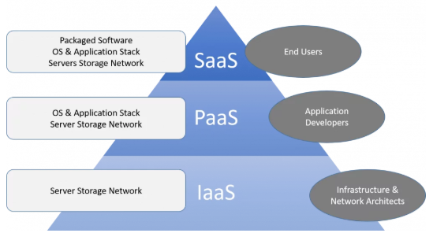

## Openstack 

AWS 와 유사한 환경을 local 에 구축하는 솔루션 

### 1. 오픈스택 개요

- **클라우드 컴퓨팅** 

  - 사용자의 요청에 따라 공유된 컴퓨터의 자원이나 데이터를 사용자가 이용하는 컴퓨터 및 휴대폰과 같은 다른 장치로 제공하는 인터넷 기반의 컴퓨팅 환경을 의미. 
  - 'A-Z as a Service' 라고 불릴만큼 다양한 서비스를 제공. 

  - Cloud Service Models 

    

    SaaS의 주요 고객은 엔드 유저 ( 개인, 기업 )

    IaaS 의 주요 고객은 IT 관계자 .

    PaaS 의 주요 고객은 개발자 (관리형 서비스)

    

  public cloud 와 private cloud 를 나누는 기준은 누가 사용하는가, 누구를 대상으로하는가 

- public cloud - 사용자 : 누구나  .   저장소 : 실제 제공자 (provider)

- private cloud - 사용자: 제한적 사용자 .  저장소 : 기업체의 데이터 센터.  

- Swift : 오브젝트 스토리지 서비스   

- Nova : Compute 서비스, 인스턴스 서비스. 

- Cellometer : 각 사용자의 리소스 사용량을 계측하는 서비스 

- Heat : 클라우드 컴퓨팅 서비스의 자동화 서비스 ( 오케스트레이션 서비스 )

- Cinder : 블록 스토리지 서비스 

- Horizon : 대쉬보드 서비스 

- Keystone : 통합 인증 서비스 

- 스토리지 유형 

  |     Storage 유형      |         Client 접근 방식         |          예시           |
  | :-------------------: | :------------------------------: | :---------------------: |
  |  Block 기반 Storage   |          장치 파일 형태          | Cinder, EBS, iscsi. SAN |
  |  Object 기반 Storage  |      HTTP 기반 Restful API       |     Swift, S3, Ceph     |
  |   File 기반 Storage   | 특정 디렉토리와 연결해서 (mount) | Manila, EFS, glusterfs  |
  | Database 기반 Storage |               Sql                |  Trove , Dynamodb, RDS  |

  - 스토리지 유형에 따라 Client 의 접근 방식이 다르다. 

Scale up : 성능 리소스 박스(물리적 시스템) 내에서 cpu 나 메모리를 증설하는 방식.

Scale out :  복제를 이용하여 박스(물리적 시스템) 단위로 확장하는 방식. 

---

#### 수업 복습 Day01 

Cloud Computing 이해 ( On-premise  vs  Cloud )

: 사용자 요청에 따라 공유된 자원이나 데이터를 인터넷 기반으로 제공하는 기술로 

여러 유형의 서비스를 사용한 만큼 지불하는 종량과금제로 제공되는 computing 

클라우드 서비스 유형 

- IaaS , PaaS, SaaS 

클라우드 배치 유형 

- Public, Private, Hybrid, Community Cloud 

오픈 스택이란 ?

​		클라우드 운영체제 

- Core Service 이해 
  - compute - Nova
  - image - Glance
  - object storage - Swift
  - block storage - Cinder
  - network - Neutron
  - dashoboard - Horizon 
  - Identity - Keystone
  - orchestration - Heat 