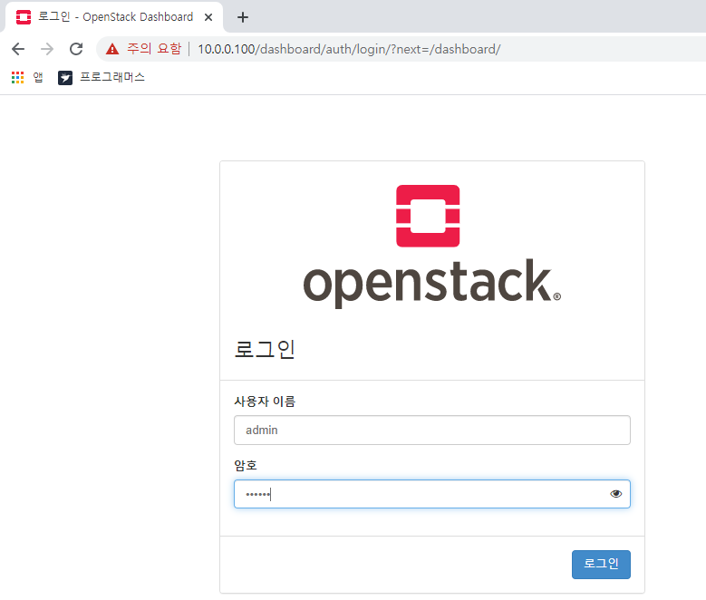
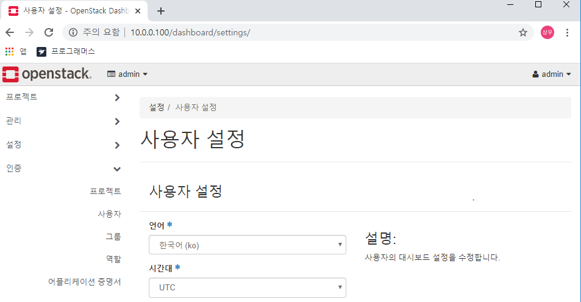

서비스 타임이 동기화 되지 않을 경우 실제 서비스 fail 이 발생 


리눅스에서 타임서버 구축 시 패키지 2가지 선택 가능 

- ntp ( 레거시 - 예전부터 사용 )
- Chrony : ntp 의 단점을 보완한 최신 패키지.


```bash
$ getenforce

Enforcing
```

```bash
$ setenforce 

usage:  setenforce [ Enforcing | Permissive | 1 | 0 ]
```

```bash
$ setenforce 0 
$ getenforce 

Permissive
```


```bash
$ ps -efZ

# 프로세스 별 Label 이 무엇이 설정되었는지 확인할 수 있다. 
```


보안 메커니즘으로 사용하는 것 2가지 

- 방화벽 :  iptables(버전6.x) , firewalld(버전 7.x) . 포트기반 Access 를 제어하는 방식 
- SELinux : Label 기반 Access 를 제어하는 방식 


```bash
$ vi /etc/selinux/config

disabled = No S... # <- disabled 로 변경 
```


```bash
$ chronyc sources 

210 Number of sources = 6
MS Name/IP address         Stratum Poll Reach LastRx Last sample               
===============================================================================
^? 127.127.1.0                   0   6     0     -     +0ns[   +0ns] +/-    0ns
^? 106.247.248.106               2   6     3     1   -196us[ -196us] +/-   49ms
^? ec2-54-180-134-81.ap-nor>     2   6     3     2   +817us[ +817us] +/-   51ms
^+ dadns.cdnetworks.co.kr        2   6    17     0   -670us[ -670us] +/-   59ms
^- 210.183.236.141               2   6    17     3  -1858us[-1858us] +/-   40ms
^+ send.mx.cdnetworks.com        2   6    17     4   +332us[ +332us] +/-   58ms
```

Controller 가 클라이언트이자 서버가 된다. 


```bash
[root@controller ~]# packstack --gen-answer-file=/root/openstack.txt
Packstack changed given value  to required value /root/.ssh/id_rsa.pub

[root@controller ~]# cp /root/openstack.txt  /root/openstack.old # 파일 복사하기
[root@controller ~]# vi /root/openstack.txt # 파일 편집 
```


/root/openstack.txt 파일 아래와 같이 수정하기 

```bash
11번라인 : CONFIG_DEFAULT_PASSWORD=abc123
46번라인 : CONFIG_CEILOMETER_INSTALL=n
50번라인 : CONFIG_AODH_INSTALL=n
1185번라인 : CONFIG_PROVISION_DEMO=n
326번라인 :  CONFIG_KEYSTONE_ADMIN_PW=abc123
873번라인 : CONFIG_NEUTRON_OVS_BRIDGE_IFACES=br-ex:ens33
```


복사해둔 이전 파일과 변경한 파일을 비교하여 몇개의 라인이 수정되었는지 확인. 

```bash
[root@controller ~]# diff /root/openstack.txt /root/openstack.old
11c11
< CONFIG_DEFAULT_PASSWORD=abc123
---
> CONFIG_DEFAULT_PASSWORD=
46c46
< CONFIG_CEILOMETER_INSTALL=n
---
> CONFIG_CEILOMETER_INSTALL=y
50c50
< CONFIG_AODH_INSTALL=n
---
> CONFIG_AODH_INSTALL=y
326c326
< CONFIG_KEYSTONE_ADMIN_PW=abc123
---
> CONFIG_KEYSTONE_ADMIN_PW=e79d601ad46c4ab9
873c873
< CONFIG_NEUTRON_OVS_BRIDGE_IFACES=br-ex:ens33
---
> CONFIG_NEUTRON_OVS_BRIDGE_IFACES=
1185c1185
< CONFIG_PROVISION_DEMO=n
---
> CONFIG_PROVISION_DEMO=y
```


설치 

``` bash
[root@controller ~]# time packstack --answer-file=/root/openstack.txt
Welcome to the Packstack setup utility

The installation log file is available at: /var/tmp/packstack/20200108-140542-U13YS1/openstack-setup.log

Installing:
Clean Up                                             [ DONE ]
Discovering ip protocol version                      [ DONE ]
Setting up ssh keys                                  [ DONE ]
Preparing servers                                    [ DONE ]
```


- Horizon 접속 정보 

아래의 명령어를 통해서 대시보드에 로그인할 아이디와 비밀번호를 알 수 있다. 

``` bash
[root@controller ~]# cat keystonerc_admin  

unset OS_SERVICE_TOKEN
    export OS_USERNAME=admin
    export OS_PASSWORD='abc123'
    export OS_REGION_NAME=RegionOne
    export OS_AUTH_URL=http://10.0.0.100:5000/v3
    export PS1='[\u@\h \W(keystone_admin)]\$ '
    
export OS_PROJECT_NAME=admin
export OS_USER_DOMAIN_NAME=Default
export OS_PROJECT_DOMAIN_NAME=Default
export OS_IDENTITY_API_VERSION=3
```


- Horizon 접속 

  http://10.0.0.100/dashboard

  

  

  

  관리 메뉴는 관리 권한을 부여받은 사용자에게만 보인다. 일반 사용자에게는 보이지 않는다. 

  인증 메뉴 -> 클라우드 운영체제에도 사용자 정보가 존재. (Keystone 이 mysqlDB로 저장하고 관리 )

  

  `관리->개요` 각 프로젝트 별로 리소스 사용량을 확인할 수 있다.  

  `관리->Compute->하이퍼바이저->Compute 호스트` 는 Scale out 방식으로 계속 붙일 수 있다. 

  `관리->Compute->호스트 집합` 은 클라우드 사용자가 볼 수 없으며 관리 목적으로 사용. 

  `관리->Compute->인스턴스` 는 Nova 서비스를 사용하는 것. 

  `관리->Compute->이미지` 는 Glance 서비스를 사용하는 것. 

  `관리->볼륨` 은 Cinder 서비스 

  `관리->네트워크` 는 Nuturan 서비스

  `관리->시스템->Compute서비스` 의 statte 상태가 모두 UP 이어야한다.  

- 


- 네트워크 설정 확인 

특정 인터페이스만 보는 명령어

```bash
$ ip a s br-ex

6: br-ex: <BROADCAST,MULTICAST,UP,LOWER_UP> mtu 1500 qdisc noqueue state UNKNOWN group default qlen 1000
    link/ether 00:0c:29:35:f2:c3 brd ff:ff:ff:ff:ff:ff
    inet 10.0.0.100/24 brd 10.0.0.255 scope global br-ex
       valid_lft forever preferred_lft forever
    inet6 fe80::446d:b3ff:fed0:6d4d/64 scope link 
       valid_lft forever preferred_lft forever
```


ens33 은 ip 가없어야 한다. 만약 존재할 경우 충돌 발생 

```bash
$ ip a s ens33 

2: ens33: <BROADCAST,MULTICAST,UP,LOWER_UP> mtu 1500 qdisc pfifo_fast master ovs-system state UP group default qlen 1000
    link/ether 00:0c:29:35:f2:c3 brd ff:ff:ff:ff:ff:ff
    inet6 fe80::20c:29ff:fe35:f2c3/64 scope link 
       valid_lft forever preferred_lft forever
```


```bash
$ ovs-vcstl show 

654548c9-a37d-44bf-b329-6c20a74c5fdb
    Manager "ptcp:6640:127.0.0.1"
        is_connected: true
    Bridge br-tun
        Controller "tcp:127.0.0.1:6633"
            is_connected: true
        fail_mode: secure
        Port patch-int
            Interface patch-int
                type: patch
                options: {peer=patch-tun}
        Port br-tun
            Interface br-tun
                type: internal
    Bridge br-int
        Controller "tcp:127.0.0.1:6633"
            is_connected: true
        fail_mode: secure
        Port int-br-ex
            Interface int-br-ex
                type: patch
                options: {peer=phy-br-ex}
        Port br-int
            Interface br-int
                type: internal
        Port patch-tun
            Interface patch-tun
                type: patch
                options: {peer=patch-int}
    Bridge br-ex
        Controller "tcp:127.0.0.1:6633"
            is_connected: true
        fail_mode: secure
        Port br-ex
            Interface br-ex
                type: internal
        Port "ens33"
            Interface "ens33"
        Port phy-br-ex
            Interface phy-br-ex
                type: patch
                options: {peer=int-br-ex}
    ovs_version: "2.11.0"
```


----

Day02 수업 복습 


1. 컨트롤러 준비작업 

   - os update
   - /etc/hosts , ntp server 구축
   - centos 최적화 (firewalld/ NetworkManager/ SELinux) 
   - repository 추가

2. 오픈 스택 설치 (packstack on centos)

   - vi /etc/chrony.conf

     ```bash
     server 0.centos.pool.ntp.org iburst
     server 1.centos.pool.ntp.org iburst
     #server 2.centos.pool.ntp.org iburst
     #server 3.centos.pool.ntp.org iburst
     server 2.kr.pool.ntp.org iburst
     server 127.127.1.0 
     
     allow 10.0.0.0/24
     ```

   - vi openstack.txt

     ```bash
     326 CONFIG_KEYSTONE_ADMIN_PW=abc123
     1185 CONFIG_PROVISION_DEMO=n
     11 CONFIG_DEFAULT_PASSWORD=abc123
     46 CONFIG_CEILOMETER_INSTALL=n
      50 CONFIG_AODH_INSTALL=n
     873 CONFIG_NEUTRON_OVS_BRIDGE_IFACES=br-ex:ens33
     ```

3. packstack 를 이용한 all-in-one 구성 

4. 오픈스택 서비스 사용하기

   - Horizon 접속 
   - Horizon 메뉴
   - Openstack 용어 정의
   - 프로젝트/사용자/Flavor 생성 


```
네트워크/라우터
Floating IP용: ext1->subext1->10.0.0.0/24,gw: 10.0.0.2, dns:10.0.0.2,dhcp X, 사용 IP pool(10.0.0.210,10.0.0.220),외부네트워크
Fixed IP 용: int1->subint1->192.168.0.0/24,gw:192.168.0.254,dns:10.0.0.2,dhcp 활성화)
router1 생성
외부 네트워크과 router간 연결: 게이트웨이 설정
내부 네트워크와 router간 연결: 인터페이스 추가
```