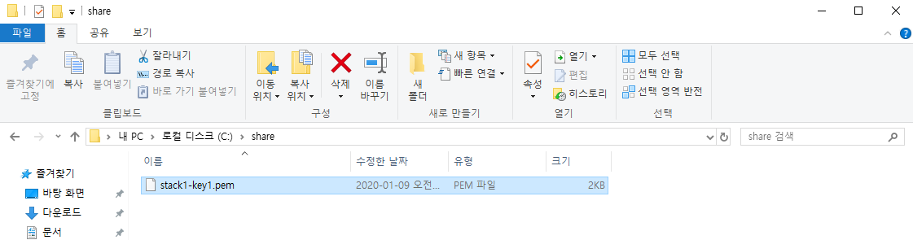
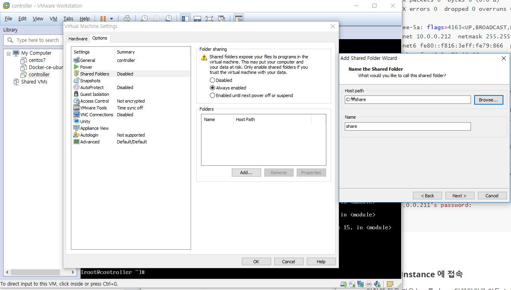
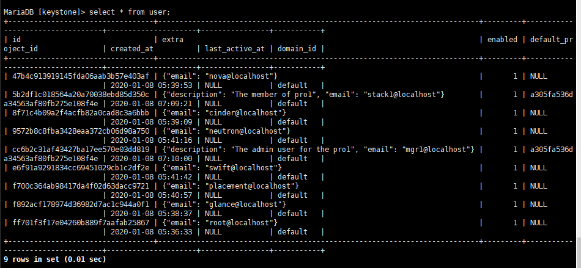

방화벽 정책 

- 블랙리스트 정책 
- 화이트리스트 정책


##### Openstack Instance 생성 오류 시 

```bash
$ yum install -y openstack-utils
```

```bash
$ openstack-status
```

위의 명령어 실행 시 `fail check` 가 확인이 된다면 개별 서비스를 `systemctl` 을 이용하여 다시 실행해라. 

만약 전체 서비스를 restart 해야할 경우 `openstack-service` 를 이용하여 그룹으로 다시 실행해라. 

```bash
$ openstack-service [status, start, stop] [glance, cinder, nova]
```

```bash
$ neutron-openvswitch-agent inactive
```

```bash
$ systemctl start neutron-openvswitch-agent
```


#### SSH 접속 


텍스트로 openstack 을 설치할 경우 controller 에서 바로 인스턴스로 접속이 불가하기 때문에, 

라우터로 접속하고 라우터에서 인스턴스로 접근하는 방법을 이용한다. 

```bash
$ ip netns 

qrouter-e4cb6e60-f84e-4ea3-9dc3-7b5a1b9dc75b (id: 1)
qdhcp-34da5f70-ebcf-4e2c-b082-067bfe2ea959 (id: 0)
```

라우터가 컨테이너의 형태로 등록이 되어있다. 

```bash
[root@controller ~]# ip netns exec qrouter-e4cb6e60-f84e-4ea3-9dc3-7b5a1b9dc75b /bin/sh

sh-4.2#
```

```bash
sh-4.2# ifconfig

lo: flags=73<UP,LOOPBACK,RUNNING>  mtu 65536
        inet 127.0.0.1  netmask 255.0.0.0
        inet6 ::1  prefixlen 128  scopeid 0x10<host>
        loop  txqueuelen 1000  (Local Loopback)
        RX packets 0  bytes 0 (0.0 B)
        RX errors 0  dropped 0  overruns 0  frame 0
        TX packets 0  bytes 0 (0.0 B)
        TX errors 0  dropped 0 overruns 0  carrier 0  collisions 0

qg-14608aee-5a: flags=4163<UP,BROADCAST,RUNNING,MULTICAST>  mtu 1450
        inet 10.0.0.212  netmask 255.255.255.0  broadcast 10.0.0.255
        inet6 fe80::f816:3eff:fe79:866  prefixlen 64  scopeid 0x20<link>
        ether fa:16:3e:79:08:66  txqueuelen 1000  (Ethernet)
        RX packets 0  bytes 0 (0.0 B)
        RX errors 0  dropped 0  overruns 0  frame 0
        TX packets 37  bytes 2090 (2.0 KiB)
        TX errors 0  dropped 0 overruns 0  carrier 0  collisions 0

qr-ca5d2b68-00: flags=4163<UP,BROADCAST,RUNNING,MULTICAST>  mtu 1450
        inet 192.168.0.254  netmask 255.255.255.0  broadcast 192.168.0.255
        inet6 fe80::f816:3eff:fe8f:d93b  prefixlen 64  scopeid 0x20<link>
        ether fa:16:3e:8f:d9:3b  txqueuelen 1000  (Ethernet)
        RX packets 111  bytes 9418 (9.1 KiB)
        RX errors 0  dropped 0  overruns 0  frame 0
        TX packets 83  bytes 8432 (8.2 KiB)
        TX errors 0  dropped 0 overruns 0  carrier 0  collisions 0
```

```bash
sh-4.2# ssh cirros@10.0.0.211
cirros@10.0.0.211's password:				#패스워드 : cubswin:)

$
```


#### Key 기반 Instance 에 접속

이전에 다운 받은 key 를 share 디렉터리로 이동  ( share 디렉터리는 C 드라이브 밑에 생성한다. )




Vm --> Settings --> Options ..




```bash
$ vmhgfs-fuse /mnt

$ cd /mnt/hgfs/ 	# 마운트한 폴더로 이동 
$ ls
share
```

```bash
$ cd share/
$ ls

stack1-key1.pem
```

```bash
$ cp stack1-key1.epm /root     # share 디렉터리의 개인 키를 /root 에 복사 
```


```bash
$ ip netns

qrouter-e4cb6e60-f84e-4ea3-9dc3-7b5a1b9dc75b (id: 1)
qdhcp-34da5f70-ebcf-4e2c-b082-067bfe2ea959 (id: 0)
```

```bash
$ ip netns exec qrouter-e4cb6e60-f84e-4ea3-9dc3-7b5a1b9dc75b ssh -i /root/stack1-key1.pem cirros@10.0.0.211

@@@@@@@@@@@@@@@@@@@@@@@@@@@@@@@@@@@@@@@@@@@@@@@@@@@@@@@@@@@
@         WARNING: UNPROTECTED PRIVATE KEY FILE!          @
@@@@@@@@@@@@@@@@@@@@@@@@@@@@@@@@@@@@@@@@@@@@@@@@@@@@@@@@@@@
Permissions 0755 for '/root/stack1-key1.pem' are too open.
It is required that your private key files are NOT accessible by others.
This private key will be ignored.
Load key "/root/stack1-key1.pem": bad permissions   ## 잘못된 접근 오류 발생
cirros@10.0.0.211's password: 
```

위의 오류가 뜬다. 키에 권한을 부여하고 다시 실행하면 비밀번호 입력 없이 키로 바로 접속 가능. 

```bash
[root@controller share]# chmod 600 /root/stack1-key1.pem
[root@controller share]# ip netns exec qrouter-e4cb6e60-f84e-4ea3-9dc3-7b5a1b9dc75b ssh -i /root/stack1-key1.pem cirros@10.0.0.211
$ 
```

인스턴스에서는 공개키가 등록되어있어야 key 기반 인증이 가능하다. 인스턴스 올릴 때 키가 설정되어있으면 nova 에서 자동으로 키를 내장시킨다. 내장으로 설정되어있지 않으면 key 기반 인증이 안된다. 


.ssh 에 공개키가 등록되어있다. 

```bash
$ ls .ssh
authorized_keys

$ cat .ssh/authorized_keys
ssh-rsa AAAAB3NzaC1yc2EAAAADAQABAAABAQDTYIDKT0pe8JCp1u3NLtJMb6DKHqtNvBI8t5ssZTlr36lSl96FuXqJltKhUG4G7DgkZlvhkBcabCzV182lChDe5Wr6Jvl/x1LgksAldsR2DMmygAlvhbbYdQmlNE6xoh8ygro/RdRZtW/6isP/7c1coDmoWHDSY+WwhYGf2ptTqmKVAzaj4Y+xPo0Dg1HIAiSLy9WVoz6uOr5HlPD7lEkIERlkRinnbhhovxw99K9G+awi131uG4VwI7q1ZhHB1Ng6O9old6BkHZzi3GINL5BsK0M6su6grfiTgGCk67qTYGFHpsjyblfZVqAT9vN3G5aogtMoZdNJuCnv6RwtkdfP Generated-by-Nova
```


---


**Keystone 은 DB 로 관리 된다 **

mysql 의 공개버전 -> MariaDB

```bash
[root@controller ~]# mysql -uroot

Welcome to the MariaDB monitor.  Commands end with ; or \g.
Your MariaDB connection id is 331
Server version: 10.1.20-MariaDB MariaDB Server

Copyright (c) 2000, 2016, Oracle, MariaDB Corporation Ab and others.

Type 'help;' or '\h' for help. Type '\c' to clear the current input statement.

MariaDB [(none)]>
```

```bash
MariaDB [(none)]> show databases;
+--------------------+
| Database           |
+--------------------+
| cinder             |
| glance             |
| information_schema |
| keystone           |
| mysql              |
| neutron            |
| nova               |
| nova_api           |
| nova_cell0         |
| nova_placement     |
| performance_schema |
| test               |
+--------------------+
12 rows in set (0.04 sec)
```


keystone 으로 들어가서 관리정보를 확인할 수 있다. 

```bash
MariaDB [(none)]> use keystone; 
Reading table information for completion of table and column names
You can turn off this feature to get a quicker startup with -A

Database changed
```

```bash
MariaDB [keystone]> show tables;
+-----------------------------+
| Tables_in_keystone          |
+-----------------------------+
| access_token                |
| application_credential      |
| application_credential_role |
| assignment                  |
| config_register             |
| consumer                    |
| credential                  |
| endpoint                    |
| endpoint_group              |
| federated_user              |
| federation_protocol         |
| group                       |
| id_mapping                  |
| identity_provider           |
| idp_remote_ids              |
| implied_role                |
| limit                       |
| local_user                  |
| mapping                     |
| migrate_version             |
| nonlocal_user               |
| password                    |
| policy                      |
| policy_association          |
| project                     |
| project_endpoint            |
| project_endpoint_group      |
| project_tag                 |
| region                      |
| registered_limit            |
| request_token               |
| revocation_event            |
| role                        |
| sensitive_config            |
| service                     |
| service_provider            |
| system_assignment           |
| token                       |
| trust                       |
| trust_role                  |
| user                        |
| user_group_membership       |
| user_option                 |
| whitelisted_config          |
+-----------------------------+
44 rows in set (0.00 sec)
```

위의 테이블 중 user 테이블의 정보를 확인




**Keystone 을 CLI 로 관리**

keystone 을 관리하기 위해 권한을 부여해야한다 . `keystonerc_admin` 파일을 수정하여 부여. 

```bash
[root@controller ~]# ls
anaconda-ks.cfg  keystonerc_admin  openstack.old  openstack.txt  stack1-key1.pem
```

```bash
[root@controller ~]# cat keystonerc_admin 
unset OS_SERVICE_TOKEN
    export OS_USERNAME=admin        # export 전역변수로 선언할 때 사용. 
    export OS_PASSWORD='abc123'
    export OS_REGION_NAME=RegionOne
    export OS_AUTH_URL=http://10.0.0.100:5000/v3
    export PS1='[\u@\h \W(keystone_admin)]\$ '        # PS1 프롬프트 모양 바꿀 때 사용 
    
export OS_PROJECT_NAME=admin
export OS_USER_DOMAIN_NAME=Default
export OS_PROJECT_DOMAIN_NAME=Default
export OS_IDENTITY_API_VERSION=3
```


`source` 또는 `.` 을 이용하여 환경의 변경을 바로 적용해서 CLI 환경에서 확인할 수 있다. 

```bash
[root@controller ~]# . keystonerc_admin 
[root@controller ~(keystone_admin)]# 
```

```bash
[root@controller ~(keystone_admin)]# openstack user list
+----------------------------------+-----------+
| ID                               | Name      |
+----------------------------------+-----------+
| 47b4c913919145fda06aab3b57e403af | nova      |
| 5b2df1c018564a20a70038ebd85d350c | stack1    |
| 8f71c4b09a2f4acfb82a0cad8c3a6bbb | cinder    |
| 9572b8c8fba3428eaa372cb06d98a750 | neutron   |
| cc6b2c31af43427ba17ee570e03dd819 | mgr1      |
| e6f91a9291834cc69451029cb1c2df2e | swift     |
| f700c364ab98417da4f02d63dacc9721 | placement |
| f892acf178974d36982d7ac1c944a0f1 | glance    |
| ff701f3f17e04260b889f7aafab25867 | admin     |
+----------------------------------+-----------+
```

```bash
[root@controller ~(keystone_admin)]# openstack service list
+----------------------------------+-----------+--------------+
| ID                               | Name      | Type         |
+----------------------------------+-----------+--------------+
| 1522998382c642759975d8e652c1831f | glance    | image        |
| 274e1e301b774cb6ab9893786e950242 | cinderv3  | volumev3     |
| 3507e6411afb4c4b80275d34b17c7d49 | cinderv2  | volumev2     |
| 8cd93e2825bb450ead70396df776abfd | neutron   | network      |
| 8e35f33f3a5e4a3494f54397b918442e | cinder    | volume       |
| add4207732d0445db4482550d8e9e85a | placement | placement    |
| c6f2f4195dde4bb9883574ba4f38763a | keystone  | identity     |
| fb27b2f1bb0342e7b424774ca04af872 | swift     | object-store |
| fea55bdae902410ba182e27de7c6f1ee | nova      | compute      |
+----------------------------------+-----------+--------------+
```


기존의 `keystonerc_admin` 파일을 복사하여 수정해여 권한을 부여하며 사용. 

```bash
[root@controller ~(keystone_admin)]# cp keystonerc_admin keystonerc_stack1
[root@controller ~(keystone_admin)]# vi keystonerc_stack1

## keystonerc_stack1 을 아래와 같이 변경. 
unset OS_SERVICE_TOKEN
    export OS_USERNAME=stack1
    export OS_PASSWORD='abc123'
    export OS_REGION_NAME=RegionOne
    export OS_AUTH_URL=http://10.0.0.100:5000/v3
    export PS1='[\u@\h \W(keystone_stack1)]\$ '

export OS_PROJECT_NAME=pro1
export OS_USER_DOMAIN_NAME=Default
export OS_PROJECT_DOMAIN_NAME=Default
export OS_IDENTITY_API_VERSION=3
```


```bash
[root@controller ~(keystone_admin)]# . keystonerc_stack1
[root@controller ~(keystone_stack1)]# openstack service list
You are not authorized to perform the requested action: identity:list_services. (HTTP 403) (Request-ID: req-cb866c7c-b941-44e1-8ba8-bf3bb9290abf)
```

권한이 없기 때문에 오류, 그러나 토큰 재발급은 가능 .  토큰 재발급 명령어 --> `openstack token issue`

일반 사용자가 관리자 명령을 수행하면 권한 오류가 뜬다. 


---

Day 03 복습 


보안그룹 / Floating IP 생성 

Keypair 생성

이미지


http://download.cirros-cloud.net/

인스턴스 시작


yum install -y openstack -utils


인스턴스 오류 시 

$ openstack-status

$ neutron-openvswitch-agent inactive --> systemctl start neutron-openvswitch-agent


볼륨 생성 후 연결하여 사용 

```bash
$ lsblk
$ sudo sh
$ fdisk /dev/vdb   # partition 생성 
```

