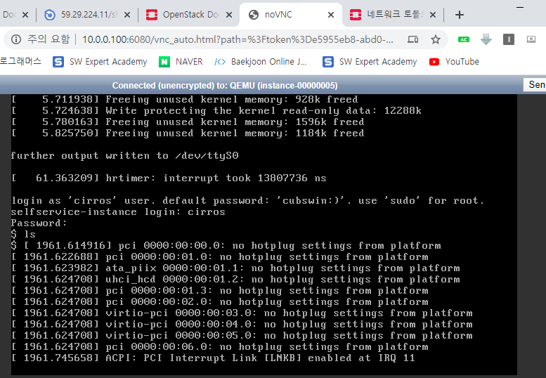
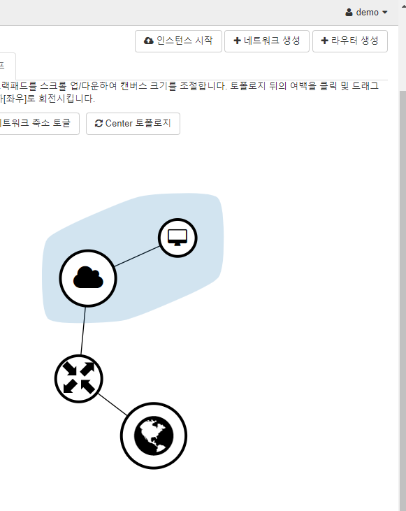

## Compute Service 

#### Install and Configure a compute node 


https://docs.openstack.org/nova/rocky/install/compute-install-rdo.html


##### Install and configure componets 


1. 패키지 설치 

   ```bash
   [root@compute1 ~]# yum install openstack-nova-compute
   ```

2.  `nova.conf` 파일 수정하기 ( 수정하기 이전에 미리 `conf` 파일을 백업해두고 진행 )

   ```bash
   # 백업 
   [root@compute1 ~]# cp /etc/nova/nova.conf /etc/nova/nova.conf.old
   [root@compute1 ~]# scp controller:/etc/nova/nova.conf /etc/nova
   ```

   controller 의 conf 파일 일부를 가져다 수정하기 때문에 아래와 같이 일부분만 수정하고 진행. 

   ```bash
   # 1254 번 라인 my_ip 에 10.0.0.101(현재 자신의 IP)로 설정
   my_ip=10.0.0.101
   
   # 11017 번 라인 
   vncserver_proxyclient_address=10.0.0.101	
   
   
   ## Controller 의 conf 파일을 가져와 수정은 하지 않지만 상세 설명. 
   
   firewall_driver = nova.virt.firewall.NoopFirewallDriver  # 방화벽을 Neutron 쪽에서 제공하기 때문에, Nova 쪽의 방화벽 드라이버를 사용하지 않도록 설정 (Noop). 
   
   server_proxyclient_address = $my_ip	# 콘솔 접속 안될 경우 server_proxyclinet_address 확인
   ```

3.  서비스 재시작.

   2개의 서비스는 의존성이 있기때문에 `livbirtd` 를 먼저 올린 이후에 `openstack-nova` 를 올려야한다. 

   ```bash 
   [root@compute1 ~]# systemctl enable libvirtd.service openstack-nova-compute.service
   Created symlink from /etc/systemd/system/multi-user.target.wants/openstack-nova-compute.service to /usr/lib/systemd/system/openstack-nova-compute.service.
   ```

   ```bash
   [root@compute1 ~]# systemctl start libvirtd.service openstack-nova-compute.service
   ```

   그리고 위의 명령어가 실행이 잘 되지 않는다. 따라서 `controller ` 쪽에서 아래와 같은 설정을 한 이후에 진행을 하면 위의 명령어가 실행이 된다. 

   **Controller  )**

   ```bash
   [root@controller ~]# vi /etc/sysconfig/iptables
   
   # 13 번 라인 하단에 아래 구문 추가 
   -A INPUT -s 10.0.0.101/32 -p tcp -m multiport --dports 5671,5672 -m comment --comment "001 amqp incoming amqp_10.0.0.101" -j ACCEPT
   -A INPUT -s 10.0.0.101/32 -p tcp -m multiport --dports 5671,5672 -j ACCEPT
   -A INPUT -s 10.0.0.100/32 -p tcp -m multiport --dports 5671,5672 -j ACCEPT
   ```

   ```bash
   [root@controller ~]# systemctl reload iptables
   ```

4.  (3) 에서 실행한 서비스가 잘 실행되었는지 확인 

   ```bash
   [root@compute1 ~]# systemctl status libvirtd.service 
   ● libvirtd.service - Virtualization daemon
      Loaded: loaded (/usr/lib/systemd/system/libvirtd.service; enabled; vendor preset: enabled)
      Active: active (running) since 화 2020-01-14 09:52:05 KST; 2min 6s ago
        Docs: man:libvirtd(8)
              https://libvirt.org
    Main PID: 2322 (libvirtd)
       Tasks: 17 (limit: 32768)
      CGroup: /system.slice/libvirtd.service
              └─2322 /usr/sbin/libvirtd
   
    1월 14 09:52:05 compute1 systemd[1]: Starting Virtualization daemon...
    1월 14 09:52:05 compute1 systemd[1]: Started Virtualization daemon.
    1월 14 09:52:06 compute1 libvirtd[2322]: 2020-01-14 00:52:06.388+0000: 2338: info : libvirt version: 4.5.0, packa...s.org)
    1월 14 09:52:06 compute1 libvirtd[2322]: 2020-01-14 00:52:06.388+0000: 2338: info : hostname: compute1
    1월 14 09:52:06 compute1 libvirtd[2322]: 2020-01-14 00:52:06.388+0000: 2338: error : virHostCPUGetTscInfo:1389 : …없습니다
    1월 14 09:52:06 compute1 libvirtd[2322]: 2020-01-14 00:52:06.852+0000: 2338: error : virHostCPUGetTscInfo:1389 : …없습니다
   Hint: Some lines were ellipsized, use -l to show in full.
   
   ```

   ```bash
   [root@compute1 ~]# systemctl status openstack-nova-compute.service
   ● openstack-nova-compute.service - OpenStack Nova Compute Server
      Loaded: loaded (/usr/lib/systemd/system/openstack-nova-compute.service; enabled; vendor preset: disabled)
      Active: active (running) since 화 2020-01-14 09:56:49 KST; 10s ago
    Main PID: 2339 (nova-compute)
       Tasks: 22
      CGroup: /system.slice/openstack-nova-compute.service
              └─2339 /usr/bin/python2 /usr/bin/nova-compute
   
    1월 14 09:52:05 compute1 systemd[1]: Starting OpenStack Nova Compute Server...
    1월 14 09:56:49 compute1 systemd[1]: Started OpenStack Nova Compute Server.
   ```

5.  Controller 쪽에서 Compute1 이 추가가 되었는지 확인

   ```bash
   [root@controller ~]# . keystonerc_admin
   [root@controller ~(keystone_admin)]# openstack compute service list --service nova-compute
   +----+--------------+------------+------+---------+-------+-------------------------+
   | ID | Binary       | Host       | Zone | Status  | State | Updated At                 
   +----+--------------+------------+------+---------+-------+-------------------------+
   |  6 | nova-compute | controller | nova | enabled | up    | 2020-01-14T01:02:20.000000 
   |  7 | nova-compute | compute1   | nova | enabled | up    | 2020-01-14T01:02:20.000000 
   +----+--------------+------------+------+---------+-------+-------------------------+
   ```

6.  Compute 의 호스트를 Discover. ( Controller 에서 진행 )

    ```bash
   [root@controller ~(keystone_admin)]# su -s /bin/sh -c "nova-manage cell_v2 discover_hosts --verbose" nova
   
   Found 2 cell mappings.
   Skipping cell0 since it does not contain hosts.
   Getting computes from cell 'default': 945a2f7f-93c8-4f1d-b13a-f9eb75f7c2d9
   Checking host mapping for compute host 'compute1': ead023ae-6dcf-4401-a1ed-3da59a8ed696
   Creating host mapping for compute host 'compute1': ead023ae-6dcf-4401-a1ed-3da59a8ed696
   Found 1 unmapped computes in cell: 945a2f7f-93c8-4f1d-b13a-f9eb75f7c2d9
   ```

   `/etc/nova/nova.conf` 설정파일 수정.  Compute1  Node를 Discovery 해서 레코드에 추가. 

   ```bash
   [root@controller ~(keystone_admin)]# vi /etc/nova/nova.conf 
   
   # 9760 번 라인의 설정을 300 으로 변경한다. 
   discover_hosts_in_cells_interval=300  	# 300 초 주기로 discovery 하도록 설정. 
   ```


---


```bash
grep NEU openstack.txt	# Neutron 관련 파라미터 리스트 확인 

...
CONFIG_NEUTRON_FWAAS=n 	# Neutron 의 방화벽 설정이 No 로 되어있다. 설치해야 사용이 가능하다. 
...
```

```bash
grep LB openstack.txt	# LoadBalance 관련 파라미터 리스트 확인 

...
CONFIG_LBAAS_INSTALL=n 	# LoadBalance 를 설치해서 HA구조로 사용할 수 있다. 
...
```


```bash
[root@controller ~(keystone_admin)]# neutron agent-list
neutron CLI is deprecated and will be removed in the future. Use openstack CLI instead.
+--------------------------------------+--------------------+------------+-------------+
| id                                   | agent_type         | host       | availability_zone | alive | admin_state_up | binary                    |
+--------------------------------------+--------------------+------------+--------------+
| 1cbd5982-013d-45a7-bb74-25d0a5ad0a63 | DHCP agent         | controller | nova              | :-)   | True           | neutron-dhcp-agent        |
| 6893b2bc-2ba0-4ce8-8f71-fc03b691779c | L3 agent           | controller | nova              | :-)   | True           | neutron-l3-agent          |
| 8a5bc8b7-2965-48bd-8603-6ffcb6151d35 | Metering agent     | controller |                   | :-)   | True           | neutron-metering-agent    |
| a43e053f-94a2-437b-ae62-d9a8812d337d | Open vSwitch agent | controller |                   | :-)   | True           | neutron-openvswitch-agent |
| c69ca40c-520f-47a8-82ec-0879824dc386 | Metadata agent     | controller |                   | :-)   | True           | neutron-metadata-agent    |
+--------------------------------------+--------------------+------------+--------------+
```

```bash
# Rocky 에서 지원하는 리스트 확인 가능 
[root@controller ~(keystone_admin)]# neutron ext-list

neutron CLI is deprecated and will be removed in the future. Use openstack CLI instead.
+--------------------------------+-------------------------------------------------------
| alias                          | name                                                   
+--------------------------------+-------------------------------------------------------
| default-subnetpools            | Default Subnetpools                                   
| qos                            | Quality of Service                                     
							..............
| qos-fip                        | Floating IP QoS                                       
+--------------------------------+-------------------------------------------------------
```


​		


```bash
[root@controller ~]# ip netns
qdhcp-34da5f70-ebcf-4e2c-b082-067bfe2ea959 (id: 1)
qrouter-e4cb6e60-f84e-4ea3-9dc3-7b5a1b9dc75b (id: 0)
```

```bash
# 라우터로 접속
[root@controller ~]# ip netns exec qrouter-e4cb6e60-f84e-4ea3-9dc3-7b5a1b9dc75b /bin/bash
```

```bash
[root@controller ~]# ip a

1: lo: <LOOPBACK,UP,LOWER_UP> mtu 65536 qdisc noqueue state UNKNOWN group default qlen 1000
    link/loopback 00:00:00:00:00:00 brd 00:00:00:00:00:00
    inet 127.0.0.1/8 scope host lo
       valid_lft forever preferred_lft forever
    inet6 ::1/128 scope host 
       valid_lft forever preferred_lft forever
13: qr-ca5d2b68-00: <BROADCAST,MULTICAST,UP,LOWER_UP> mtu 1450 qdisc noqueue state UNKNOWN group default qlen 1000
    link/ether fa:16:3e:8f:d9:3b brd ff:ff:ff:ff:ff:ff
    inet 192.168.0.254/24 brd 192.168.0.255 scope global qr-ca5d2b68-00
       valid_lft forever preferred_lft forever
    inet6 fe80::f816:3eff:fe8f:d93b/64 scope link 
       valid_lft forever preferred_lft forever
14: qg-14608aee-5a: <BROADCAST,MULTICAST,UP,LOWER_UP> mtu 1450 qdisc noqueue state UNKNOWN group default qlen 1000
    link/ether fa:16:3e:79:08:66 brd ff:ff:ff:ff:ff:ff
    inet 10.0.0.212/24 brd 10.0.0.255 scope global qg-14608aee-5a
       valid_lft forever preferred_lft forever
    inet 10.0.0.217/32 brd 10.0.0.217 scope global qg-14608aee-5a
       valid_lft forever preferred_lft forever
    inet 10.0.0.211/32 brd 10.0.0.211 scope global qg-14608aee-5a
       valid_lft forever preferred_lft forever
    inet6 fe80::f816:3eff:fe79:866/64 scope link 
       valid_lft forever preferred_lft forever
```


라우터에서 외부 네트워크와 연결하는 작업 : 게이트웨이 설정 

Floating IP 는 라우터에서 관리 


```bash
[root@controller ~]# iptables -t nat -L

Chain PREROUTING (policy ACCEPT)
target     prot opt source               destination         
neutron-l3-agent-PREROUTING  all  --  anywhere             anywhere            

Chain INPUT (policy ACCEPT)
target     prot opt source               destination         

Chain OUTPUT (policy ACCEPT)
target     prot opt source               destination         
neutron-l3-agent-OUTPUT  all  --  anywhere             anywhere            

Chain POSTROUTING (policy ACCEPT)
target     prot opt source               destination         
neutron-l3-agent-POSTROUTING  all  --  anywhere             anywhere            
neutron-postrouting-bottom  all  --  anywhere             anywhere            

Chain neutron-l3-agent-OUTPUT (1 references)
target     prot opt source               destination         
DNAT       all  --  anywhere             controller           to:192.168.0.2
DNAT       all  --  anywhere             controller           to:192.168.0.12

Chain neutron-l3-agent-POSTROUTING (1 references)
target     prot opt source               destination         
ACCEPT     all  --  anywhere             anywhere             ! ctstate DNAT

Chain neutron-l3-agent-PREROUTING (1 references)
target     prot opt source               destination         
DNAT       all  --  anywhere             controller           to:192.168.0.2
DNAT       all  --  anywhere             controller           to:192.168.0.12
REDIRECT   tcp  --  anywhere             169.254.169.254      tcp dpt:http redir ports 9697

Chain neutron-l3-agent-float-snat (1 references)
target     prot opt source               destination         
SNAT       all  --  192.168.0.2          anywhere             to:10.0.0.217
SNAT       all  --  192.168.0.12         anywhere             to:10.0.0.211

Chain neutron-l3-agent-snat (1 references)
target     prot opt source               destination         
neutron-l3-agent-float-snat  all  --  anywhere             anywhere            
SNAT       all  --  anywhere             anywhere             to:10.0.0.212
SNAT       all  --  anywhere             anywhere             mark match ! 0x2/0xffff ctstate DNAT to:10.0.0.212

Chain neutron-postrouting-bottom (1 references)
target     prot opt source               destination         
neutron-l3-agent-snat  all  --  anywhere             anywhere             /* Perform source NAT on outgoing traffic. */

```


neutron 사용자에게 admin 역할을 부여 


같은 network 서비스의 네트워크 서비스 유형 3개를 등록 (endpoint port : 9696)


ss -nlp|grep 9696 : endpoint 관련 

```bash
[root@controller ~]# ss -nlp|grep 9696		# endpoint port 9696 

tcp    LISTEN     0      128       *:9696                  *:*                   users:(("neutron-server",pid=3269,fd=7),("neutron-server",pid=3263,fd=7),("neutron-server",pid=3257,fd=7),("neutron-server",pid=3256,fd=7),("neutron-server",pid=3251,fd=7),("neutron-server",pid=3250,fd=7),("neutron-server",pid=1656,fd=7))
```


m12 와 관련된 설정. 


[linux_bridge]

provider 네트워크 인터페이스 지정 -> ens33 으로 지정. 


```bash
$ sysctl -a 		# 전체 커널 파라미터의 리스트가 출력 
```


-----


## Install and configure compute node


**Compute1 )** 에서 진행

`neutron.conf` 파일 백업 이후에 복사 

```bash
[root@compute1 neutron]# cp neutron.conf neutron.conf.old

[root@compute1 neutron]# scp controller:/etc/neutron/neutron.conf neutron.conf
root@controller's password: 
neutron.conf                                                                                      100%   71KB   5.3MB/s   00:00 
```


```bash
[root@compute1 neutron]# vi /etc/neutron/neutron.conf

# DB connect 비활성화 (주석) - 761번 라인 주석 
```


#### Self service Network

```bash
[root@compute1 neutron]# vi /etc/neutron/plugins/ml2/linuxbridge_agent.ini

# 157번라인 아래 문장 추가
physical_interface_mappings = provider:ens33	#

# 205번라인 밑에 추가
 enable_vxlan = true
 local_ip = 10.0.0.101
 l2_population = true

# 182번 라인 밑에 추가
enable_security_group = true
firewall_driver = neutron.agent.linux.iptables_firewall.IptablesFirewallDriver
```


```bash
# 브릿지 기반의 방화벽을 지원하기 위한 모듈을 올리는 작업 ( 그래야 보안그룹이 적용된다. )

[root@compute1 neutron]# sysctl -a|grep nf-call			
sysctl: reading key "net.ipv6.conf.all.stable_secret"
sysctl: reading key "net.ipv6.conf.default.stable_secret"
sysctl: reading key "net.ipv6.conf.ens33.stable_secret"
sysctl: reading key "net.ipv6.conf.lo.stable_secret"

[root@compute1 neutron]# lsmod|grep br_netfilter	# 확인
[root@compute1 neutron]# modprobe br_netfilter		# 수동으로 올려주는 작업
[root@compute1 neutron]# lsmod|grep br_netfilter  	# 올라갔는지 확인 
br_netfilter           22256  0 
bridge                151336  1 br_netfilter

[root@compute1 neutron]# sysctl -a|grep nf-call

net.bridge.bridge-nf-call-arptables = 0
net.bridge.bridge-nf-call-ip6tables = 1
net.bridge.bridge-nf-call-iptables = 1
sysctl: reading key "net.ipv6.conf.all.stable_secret"
sysctl: reading key "net.ipv6.conf.default.stable_secret"
sysctl: reading key "net.ipv6.conf.ens33.stable_secret"
sysctl: reading key "net.ipv6.conf.lo.stable_secret"

```

```bash
[root@compute1 neutron]# systemctl restart openstack-nova-compute.service
[root@compute1 neutron]# systemctl enable neutron-linuxbridge-agent.service
Created symlink from /etc/systemd/system/multi-user.target.wants/neutron-linuxbridge-agent.service to /usr/lib/systemd/system/neutron-linuxbridge-agent.service.
[root@compute1 neutron]# systemctl start neutron-linuxbridge-agent.service
```

```bash
# 만약 해당 명령어가 없을 경우 yum install openstack-utils -y 설치 

[root@compute1 neutron]# openstack-status	
== Nova services ==
openstack-nova-api:                     inactive  (disabled on boot)
openstack-nova-compute:                 active
openstack-nova-network:                 inactive  (disabled on boot)
openstack-nova-scheduler:               inactive  (disabled on boot)
== Support services ==
openvswitch:                            inactive  (disabled on boot)
dbus:                                   active
Warning novarc not sourced
```


**Controller)** 에서 진행

```bash
# Linux bridge agent 가 실행중임을 확인한다. 

[root@controller ~]# . keystonerc_admin
[root@controller ~(keystone_admin)]# openstack network agent list
+--------------------------------------+--------------------+------------+--------------+
| ID                                   | Agent Type         | Host       | Availability Zone | Alive | State | Binary                    |
+--------------------------------------+--------------------+------------+--------------+
| 1cbd5982-013d-45a7-bb74-25d0a5ad0a63 | DHCP agent         | controller | nova              | :-)   | UP    | neutron-dhcp-agent        |
| 43a5f45d-fac6-41ca-8c5f-d1fc67f5c908 | Linux bridge agent | compute1   | None              | :-)   | UP    | neutron-linuxbridge-agent |
| 6893b2bc-2ba0-4ce8-8f71-fc03b691779c | L3 agent           | controller | nova              | :-)   | UP    | neutron-l3-agent          |
| 8a5bc8b7-2965-48bd-8603-6ffcb6151d35 | Metering agent     | controller | None              | :-)   | UP    | neutron-metering-agent    |
| a43e053f-94a2-437b-ae62-d9a8812d337d | Open vSwitch agent | controller | None              | :-)   | UP    | neutron-openvswitch-agent |
| c69ca40c-520f-47a8-82ec-0879824dc386 | Metadata agent     | controller | None              | :-)   | UP    | neutron-metadata-agent    |
+--------------------------------------+--------------------+------------+--------------+
```

만약 위의 경우에 Linux bridge agent 가 확인이 안 될 경우 아래의 명령어를 compute1 에서 실행한 후 controller 에서 `openstack network agent list` 를 이용하여 확인 . 

```bash
[root@compute1 neutron]# setenforce 0
[root@compute1 neutron]# systemctl restart neutron-linuxbridge-agent
[root@compute1 neutron]# vi /etc/selinux/config

# SELINUX 를 disabled 로 수정 
SELINUX=disabled 
```


### Launch an Instance 

**- flavor 란 ?** 

​	VM 의 Profile (CPU, Memory, Disk 를 규격화 한 템플릿).   오케스트레이션에서 사용되는 템플릿 언어는 인프라뿐만 아니라 서비스 및 응용 프로그램의 전체 프로비저닝을 자동화하고 컴퓨팅, 스토리지 및 네트워킹 구성 뿐만 아니라 배포 후 작업을 지정할 수 있다. 


1. flavor 생성하기

   ```bash
   [root@controller ~(keystone_admin)]# openstack flavor create --id 0 --vcpus 1 --ram 64 --disk 1 m1.nano
   +----------------------------+---------+
   | Field                      | Value   |
   +----------------------------+---------+
   | OS-FLV-DISABLED:disabled   | False   |
   | OS-FLV-EXT-DATA:ephemeral  | 0       |
   | disk                       | 1       |
   | id                         | 0       |
   | name                       | m1.nano |
   | os-flavor-access:is_public | True    |
   | properties                 |         |
   | ram                        | 64      |
   | rxtx_factor                | 1.0     |
   | swap                       |         |
   | vcpus                      | 1       |
   +----------------------------+---------+
   ```

   ```bash
   # flavor 생성 확인하기 
   
   [root@controller ~(keystone_admin)]# openstack flavor list
   +--------------------------------------+-----------+-------+------+-----------+------
   | ID                                   | Name      |   RAM | Disk | Ephemeral | VCPUs | Is Public |
   +--------------------------------------+-----------+-------+------+-----------+------
   | 0                                    | m1.nano   |    64 |    1 |         0 |     1 | True      |
   | 1                                    | m1.tiny   |   512 |    1 |         0 |     1 | True      |
   | 2                                    | m1.small  |  2048 |   20 |         0 |     1 | True      |
   | 3                                    | m1.medium |  4096 |   40 |         0 |     2 | True      |
   | 4                                    | m1.large  |  8192 |   80 |         0 |     4 | True      |
   | 5                                    | m1.xlarge | 16384 |  160 |         0 |     8 | True      |
   | 87ceddf6-6bf5-42bc-83e2-8de0fd0f261a | a.nano    |    64 |    1 |         0 |     1 | True      |
   +--------------------------------------+-----------+-------+------+-----------+------
   ```

   

2.  Pair 키 생성하기 

   ```bash
   [root@controller ~(keystone_demo)]# ls .ssh
   
   authorized_keys  id_rsa  id_rsa.pub  known_hosts	# id_rsa 는 개인키 
   ```

   ```bash
   [root@controller ~(keystone_admin)]# . keystonerc_demo 
   [root@controller ~(keystone_demo)]# openstack keypair create --public-key ~/.ssh/id_rsa.pub mykey
   +-------------+-------------------------------------------------+
   | Field       | Value                                           |
   +-------------+-------------------------------------------------+
   | fingerprint | 70:e4:55:72:00:87:10:af:89:1d:46:5e:9c:94:d9:61 |
   | name        | mykey                                           |
   | user_id     | 655eccacb3f548dd935dc905d2f7a8e3                |
   +-------------+-------------------------------------------------+
   ```

   ```bash
   # Keypair 확인하기
   [root@controller ~(keystone_demo)]#  openstack keypair list
   +-------+-------------------------------------------------+
   | Name  | Fingerprint                                     |
   +-------+-------------------------------------------------+
   | mykey | 70:e4:55:72:00:87:10:af:89:1d:46:5e:9c:94:d9:61 |
   +-------+-------------------------------------------------+
   ```

   

3. 

   ```bash
   [root@controller ~(keystone_demo)]# openstack security group rule create --proto icmp default
   +-------------------+--------------------------------------+
   | Field             | Value                                |
   +-------------------+--------------------------------------+
   | created_at        | 2020-01-14T06:19:05Z                 |
   | description       |                                      |
   | direction         | ingress                              |
   | ether_type        | IPv4                                 |
   | id                | 9f614b98-c50d-4857-a7d0-003f160de9c5 |
   | name              | None                                 |
   | port_range_max    | None                                 |
   | port_range_min    | None                                 |
   | project_id        | c979ace4e29046008dd2221c33591ba4     |
   | protocol          | icmp                                 |
   | remote_group_id   | None                                 |
   | remote_ip_prefix  | 0.0.0.0/0                            |
   | revision_number   | 0                                    |
   | security_group_id | 7a0e5e5f-f0f7-4e6c-8440-24461f9469bb |
   | updated_at        | 2020-01-14T06:19:05Z                 |
   +-------------------+--------------------------------------+
   ```

   ```bash
   [root@controller ~(keystone_demo)]# openstack security group rule create --proto tcp --dst-port 22 default
   +-------------------+--------------------------------------+
   | Field             | Value                                |
   +-------------------+--------------------------------------+
   | created_at        | 2020-01-14T06:19:12Z                 |
   | description       |                                      |
   | direction         | ingress                              |
   | ether_type        | IPv4                                 |
   | id                | 371779ac-2356-4423-a95d-1be2ce9f2275 |
   | name              | None                                 |
   | port_range_max    | 22                                   |
   | port_range_min    | 22                                   |
   | project_id        | c979ace4e29046008dd2221c33591ba4     |
   | protocol          | tcp                                  |
   | remote_group_id   | None                                 |
   | remote_ip_prefix  | 0.0.0.0/0                            |
   | revision_number   | 0                                    |
   | security_group_id | 7a0e5e5f-f0f7-4e6c-8440-24461f9469bb |
   | updated_at        | 2020-01-14T06:19:12Z                 |
   +-------------------+--------------------------------------+
   ```

   

   Self-service network

   https://docs.openstack.org/install-guide/launch-instance-networks-selfservice.html


4. ```bash
   [root@controller ~(keystone_demo)]# openstack network create selfservice
   +---------------------------+--------------------------------------+
   | Field                     | Value                                |
   +---------------------------+--------------------------------------+
   | admin_state_up            | UP                                   |
   | availability_zone_hints   |                                      |
   | availability_zones        |                                      |
   | created_at                | 2020-01-14T06:19:41Z                 |
   | description               |                                      |
   | dns_domain                | None                                 |
   | id                        | ccfd06f2-175f-4318-b7fe-a9f1c4609dc9 |
   | ipv4_address_scope        | None                                 |
   | ipv6_address_scope        | None                                 |
   | is_default                | False                                |
   | is_vlan_transparent       | None                                 |
   | mtu                       | 1450                                 |
   | name                      | selfservice                          |
   | port_security_enabled     | True                                 |
   | project_id                | 2f9522eaa35e48bb9bf6117ad1d7d020     |
   | provider:network_type     | None                                 |
   | provider:physical_network | None                                 |
   | provider:segmentation_id  | None                                 |
   | qos_policy_id             | None                                 |
   | revision_number           | 2                                    |
   | router:external           | Internal                             |
   | segments                  | None                                 |
   | shared                    | False                                |
   | status                    | ACTIVE                               |
   | subnets                   |                                      |
   | tags                      |                                      |
   | updated_at                | 2020-01-14T06:19:41Z                 |
   +---------------------------+--------------------------------------+
   ```

5. ```bash
   [root@controller ~(keystone_demo)]# openstack subnet create --network selfservice \
   >   --dns-nameserver 8.8.4.4 --gateway 172.16.1.1 \
   >   --subnet-range 172.16.1.0/24 selfservice
   +-------------------+--------------------------------------+
   | Field             | Value                                |
   +-------------------+--------------------------------------+
   | allocation_pools  | 172.16.1.2-172.16.1.254              |
   | cidr              | 172.16.1.0/24                        |
   | created_at        | 2020-01-14T06:21:56Z                 |
   | description       |                                      |
   | dns_nameservers   | 8.8.4.4                              |
   | enable_dhcp       | True                                 |
   | gateway_ip        | 172.16.1.1                           |
   | host_routes       |                                      |
   | id                | 63925c10-33d8-46da-a47e-d29430d70acd |
   | ip_version        | 4                                    |
   | ipv6_address_mode | None                                 |
   | ipv6_ra_mode      | None                                 |
   | name              | selfservice                          |
   | network_id        | ccfd06f2-175f-4318-b7fe-a9f1c4609dc9 |
   | project_id        | 2f9522eaa35e48bb9bf6117ad1d7d020     |
   | revision_number   | 0                                    |
   | segment_id        | None                                 |
   | service_types     |                                      |
   | subnetpool_id     | None                                 |
   | tags              |                                      |
   | updated_at        | 2020-01-14T06:21:56Z                 |
   +-------------------+--------------------------------------+
   ```

6. ```bash
   # router 생성 
   
   [root@controller ~(keystone_demo)]# openstack router create router
   +-------------------------+--------------------------------------+
   | Field                   | Value                                |
   +-------------------------+--------------------------------------+
   | admin_state_up          | UP                                   |
   | availability_zone_hints |                                      |
   | availability_zones      |                                      |
   | created_at              | 2020-01-14T06:23:05Z                 |
   | description             |                                      |
   | external_gateway_info   | None                                 |
   | flavor_id               | None                                 |
   | id                      | e7a9d2be-0864-461e-8a80-aaa4fef8d8fa |
   | name                    | router                               |
   | project_id              | 2f9522eaa35e48bb9bf6117ad1d7d020     |
   | revision_number         | 1                                    |
   | routes                  |                                      |
   | status                  | ACTIVE                               |
   | tags                    |                                      |
   | updated_at              | 2020-01-14T06:23:05Z                 |
   +-------------------------+--------------------------------------+
   ```

7. ```bash
   [root@controller ~(keystone_demo)]# openstack router add subnet router selfservice
   [root@controller ~(keystone_demo)]# openstack router set router --external-gateway ext1
   ```

   ```
   [root@controller ~(keystone_demo)]# ip netns
   qrouter-fef9e99e-9af9-4890-8979-654584ca108c (id: 3)
   qdhcp-da864699-7fc7-4619-8da4-ae4033fc229f (id: 2)
   qdhcp-34da5f70-ebcf-4e2c-b082-067bfe2ea959 (id: 1)
   qrouter-e4cb6e60-f84e-4ea3-9dc3-7b5a1b9dc75b (id: 0)
   
   ```

8. ```bash
   [root@controller ~(keystone_demo)]# . keystonerc_admin 
   [root@controller ~(keystone_admin)]# openstack port list --router router
   +--------------------------------------+------+-------------------+------------------+
   | ID                                   | Name | MAC Address       | Fixed IP Addresses                                                        | Status |
   +--------------------------------------+------+-------------------+------------------+
   | 5caa2e6f-6958-420b-a68e-3f749a7e213e |      | fa:16:3e:8c:c8:d4 | ip_address='10.0.0.215', subnet_id='44b85023-b59a-4a65-ba5a-b7db4519f411' | ACTIVE |
   | 9213c122-ce8b-42c0-afbd-c0024871a0e1 |      | fa:16:3e:17:87:1c | ip_address='172.16.1.1', subnet_id='63925c10-33d8-46da-a47e-d29430d70acd' | ACTIVE |
   +--------------------------------------+------+-------------------+------------------+
   ```

   


​	


```
openstack router set router --external-gateway ext1
```


#### Launch an instance on the self-service network 

1. ```bash
   [root@controller ~(keystone_admin)]# . keystone_demo
   ```

2. ```bash
   [root@controller ~(keystone_demo)]# openstack flavor list
   +--------------------------------------+-----------+-------+------+-----------+------+
   | ID                                   | Name      |   RAM | Disk | Ephemeral | VCPUs | Is Public |
   +--------------------------------------+-----------+-------+------+-----------+------+
   | 0                                    | m1.nano   |    64 |    1 |         0 |     1 | True      |
   | 1                                    | m1.tiny   |   512 |    1 |         0 |     1 | True      |
   | 2                                    | m1.small  |  2048 |   20 |         0 |     1 | True      |
   | 3                                    | m1.medium |  4096 |   40 |         0 |     2 | True      |
   | 4                                    | m1.large  |  8192 |   80 |         0 |     4 | True      |
   | 5                                    | m1.xlarge | 16384 |  160 |         0 |     8 | True      |
   | 87ceddf6-6bf5-42bc-83e2-8de0fd0f261a | a.nano    |    64 |    1 |         0 |     1 | True      |
   +--------------------------------------+-----------+-------+------+-----------+------+
   ```

3. ```bash
   [root@controller ~(keystone_demo)]# openstack image create "cirros" --container-format bare --disk-format qcow2 --file ./cirros-0.3.5-x86_64-disk.img
   
   [root@controller ~(keystone_demo)]# openstack image list
   ```

   위의 명령어를 실행하고 생성된 이미지를 확인하였을 때 이미지가 없는 경우 wget 을 이용하여 이미지를 다운 받고 **"다시"** 위의 명령어를 실행해야한다.  

   ```bash
   $ yum install -y wget
   $ wget http://download.cirros-cloud.net/0.3.5/cirros-0.3.5-x86_64-disk.img
   ```

4. ```bash
   [root@controller ~(keystone_demo)]# openstack image create "cirros" --container-format bare --disk-format qcow2 --file ./cirros-0.3.5-x86_64-disk.img
   
   +------------------+------------------------------------------------------------------
   | Field            | Value                                                            
   +------------------+------------------------------------------------------------------
   | checksum         | f8ab98ff5e73ebab884d80c9dc9c7290                                 
   | container_format | bare                                                             
   | created_at       | 2020-01-14T07:19:43Z                                             
   | disk_format      | qcow2                                                            
   | file             | /v2/images/73ac4d87-021c-49b2-9ea5-1ccd8000b93c/file             
   | id               | 73ac4d87-021c-49b2-9ea5-1ccd8000b93c                             
   | min_disk         | 0                                                                
   | min_ram          | 0                                                                
   | name             | cirros                                                           
   | owner            | c979ace4e29046008dd2221c33591ba4                                 
   | properties       | os_hash_algo='sha512', os_hash_value='f0fd1b50420dce4ca382ccfbb528eef3a38bbeff00b54e95e3876b9bafe7ed2d6f919ca35d9046d437c6d2d8698b1174a335fbd66035bb3edc525d2cdb187232', os_hidden='False' |
   | protected        | False                                                            
   | schema           | /v2/schemas/image                                                
   | size             | 13267968                                                         
   | status           | active                                                           
   | tags             |                                                                  
   | updated_at       | 2020-01-14T07:19:43Z                                             
   | virtual_size     | None                                                             
   | visibility       | shared                                                           
   +------------------+-----------------------------------------------------------------+
   ```

   ```bash
   [root@controller ~(keystone_demo)]# openstack image list
   +--------------------------------------+--------+--------+
   | ID                                   | Name   | Status |
   +--------------------------------------+--------+--------+
   | 73ac4d87-021c-49b2-9ea5-1ccd8000b93c | cirros | active |
   +--------------------------------------+--------+--------+
   ```

5. ```bash
   [root@controller ~(keystone_demo)]# openstack network list
   +--------------------------------------+-------------+-------------------------------+
   | ID                                   | Name        | Subnets                         
   +--------------------------------------+-------------+-------------------------------+
   | 7c497546-140d-495d-9204-4b13551c3e19 | ext1        | f022258e-e1f2-4573-b0c6-96e3656b41e0 |
   | da864699-7fc7-4619-8da4-ae4033fc229f | selfservice | 1ecbc74c-96fd-4772-b217-bdaea1ddade0 |
   +--------------------------------------+-------------+-------------------------------+
   ```

   위의 network 정보에서 selfservice 의 ID 를 이용하여 6번 과정에서 server 를 생성한다. 

   그리고 keypair list 를 확인하고 존재하는 키로 server 를 생성해야한다. 

6. ```bash
   [root@controller ~(keystone_demo)]# openstack server create --flavor m1.nano --image cirros \
   >    --nic net-id=da864699-7fc7-4619-8da4-ae4033fc229f --security-group default \
   >    --key-name mykey selfservice-instance
   +-----------------------------+-----------------------------------------------+
   | Field                       | Value                                         |
   +-----------------------------+-----------------------------------------------+
   | OS-DCF:diskConfig           | MANUAL                                        |
   | OS-EXT-AZ:availability_zone |                                               |
   | OS-EXT-STS:power_state      | NOSTATE                                       |
   | OS-EXT-STS:task_state       | scheduling                                    |
   | OS-EXT-STS:vm_state         | building                                      |
   | OS-SRV-USG:launched_at      | None                                          |
   | OS-SRV-USG:terminated_at    | None                                          |
   | accessIPv4                  |                                               |
   | accessIPv6                  |                                               |
   | addresses                   |                                               |
   | adminPass                   | q352whRUgoqZ                                  |
   | config_drive                |                                               |
   | created                     | 2020-01-14T07:20:45Z                          |
   | flavor                      | m1.nano (0)                                   |
   | hostId                      |                                               |
   | id                          | 1f9cd696-820b-4c14-a4cd-abe251a3d413          |
   | image                       | cirros (73ac4d87-021c-49b2-9ea5-1ccd8000b93c) |
   | key_name                    | mykey                                         |
   | name                        | selfservice-instance                          |
   | progress                    | 0                                             |
   | project_id                  | c979ace4e29046008dd2221c33591ba4              |
   | properties                  |                                               |
   | security_groups             | name='7a0e5e5f-f0f7-4e6c-8440-24461f9469bb'   |
   | status                      | BUILD                                         |
   | updated                     | 2020-01-14T07:20:45Z                          |
   | user_id                     | 655eccacb3f548dd935dc905d2f7a8e3              |
   | volumes_attached            |                                               |
   +-----------------------------+-----------------------------------------------+
   ```

7. ```bash
   # 6번 명령어에서 생성한 서버가 active 인지 확인 
   [root@controller ~(keystone_demo)]# openstack server list
   +--------------------------------------+----------------------+--------+------------+
   | ID                                   | Name                 | Status | Networks                | Image  | Flavor  |
   +--------------------------------------+----------------------+--------+------------+
   | 1f9cd696-820b-4c14-a4cd-abe251a3d413 | selfservice-instance | ACTIVE | selfservice=172.16.1.13 | cirros | m1.nano |
   +--------------------------------------+----------------------+--------+------------+
   ```

8. ```bash
   # 아래의 명령어를 이용하여 url 을 찾아서 웹 브라우저에서 접속한다. 
   [root@controller ~(keystone_demo)]# openstack console url show selfservice-instance
   +-------+----------------------------------------------------------------------------+
   | Field | Value                                                                      
   +-------+----------------------------------------------------------------------------+
   | type  | novnc                                                                       
   | url   | http://10.0.0.100:6080/vnc_auto.html?path=%3Ftoken%3De5955eb8-abd0-4d29-addc-d6930a7bce4e |
   +-------+---------------------------------------------------------------------------+
   ```

   

9. `10.0.0.100 의 DashBoard` 에서 `Demo` 로 접속하여 네트워크 토폴리지를 확인한다. 

   


## Cinder


```bash
[root@controller ~(keystone_demo)]# vgs

  VG             #PV #LV #SN Attr   VSize   VFree   
  cinder-volumes   1   5   0 wz--n- <20.60g 1012.00m
  cl               1   3   0 wz--n- <75.88g    4.00m
```

```bash
[root@controller ~(keystone_demo)]# pvs
  PV         VG             Fmt  Attr PSize   PFree   
  /dev/loop1 cinder-volumes lvm2 a--  <20.60g 1012.00m
  /dev/sda2  cl             lvm2 a--  <75.88g    4.00m
```

```bash
[root@controller ~(keystone_demo)]# losetup -a
/dev/loop0: [64768]:68586139 (/srv/loopback-device/swiftloopback)
/dev/loop1: [64768]:33771348 (/var/lib/cinder/cinder-volumes)

[root@controller ~(keystone_demo)]# ls -l /var/lib/cinder/cinder-volumes 
-rw-r-----. 1 root root 22118662144  1월 14 09:11 /var/lib/cinder/cinder-volumes
```

```bash
# 
$ lvs 
$ lsblk 
```


#### CLI 로 관리하는 Cinder 

```bash
# 1기가 짜리 demo-v1 Cinder 생성 
[root@controller ~(keystone_demo)]# cinder create --name demo-v1 1		
+------------------------------+--------------------------------------+
| Property                     | Value                                |
+------------------------------+--------------------------------------+
| attachments                  | []                                   |
| availability_zone            | nova                                 |
| bootable                     | false                                |
| consistencygroup_id          | None                                 |
| created_at                   | 2020-01-14T07:51:22.000000           |
| description                  | None                                 |
| encrypted                    | False                                |
| id                           | 611d0184-f86b-412b-8b59-3838a35ca970 |
| metadata                     | {}                                   |
| multiattach                  | False                                |
| name                         | demo-v1                              |
| os-vol-tenant-attr:tenant_id | c979ace4e29046008dd2221c33591ba4     |
| replication_status           | None                                 |
| size                         | 1                                    |
| snapshot_id                  | None                                 |
| source_volid                 | None                                 |
| status                       | creating                             |
| updated_at                   | None                                 |
| user_id                      | 655eccacb3f548dd935dc905d2f7a8e3     |
| volume_type                  | iscsi                                |
+------------------------------+--------------------------------------+
```

```bash
# Cinder 의 상태가 available 임을 확인한다. 

[root@controller ~(keystone_demo)]# cinder list

+--------------------------------------+-----------+---------+------+-------------+-----+
| ID                                   | Status    | Name    | Size | Volume Type | Bootable | Attached to |
+--------------------------------------+-----------+---------+------+-------------+-----+
| 611d0184-f86b-412b-8b59-3838a35ca970 | available | demo-v1 | 1    | iscsi       | false 
+--------------------------------------+-----------+---------+------+-------------+-----+
```

```bash
# selfservice-instance 뒤에 연결할 볼륨의 ID 를 입력 
nova volume-attach selfservice-instance 611d0184-f86b-412b-8b59-3838a35ca970 auto
```

```bash
# loop1 밑에 cinder 밑에 연결시킨 볼륨의 ID 가 연결되어있음을 확인할 수 있다. 

[root@controller ~(keystone_demo)]# lsblk
NAME                                                                   MAJ:MIN RM  SIZE RO TYPE MOUNTPOINT
sda                                                                      8:0    0  100G  0 disk 
├─sda1                                                                   8:1    0    1G  0 part /boot
└─sda2                                                                   8:2    0 75.9G  0 part 
  ├─cl-root                                                            253:0    0   60G  0 lvm  /
  ├─cl-swap                                                            253:1    0  5.9G  0 lvm  [SWAP]
  └─cl-home                                                            253:2    0   10G  0 lvm  /home
sdb                                                                      8:16   0    1G  0 disk 
└─sdb1                                                                   8:17   0 1023M  0 part 
sr0                                                                     11:0    1  4.1G  0 rom  
loop0                                                                    7:0    0    2G  0 loop /srv/node/swiftloopback
loop1                                                                    7:1    0 20.6G  0 loop 
├─cinder--volumes-cinder--volumes--pool_tmeta                          253:3    0   20M  0 lvm  
│ └─cinder--volumes-cinder--volumes--pool-tpool                        253:5    0 19.6G  0 lvm  
│   ├─cinder--volumes-cinder--volumes--pool                            253:6    0 19.6G  0 lvm  
│   ├─cinder--volumes-volume--abbe9186--3d10--41ad--98b0--7fe965cb46db 253:7    0    1G  0 lvm  
│   ├─cinder--volumes-volume--b3e48ce7--da90--41d3--a024--ec56b1bb4f1d 253:8    0    1G  0 lvm  
│   ├─cinder--volumes-volume--ab74bfe2--7aa2--4998--9bbb--aa3549f039e5 253:9    0    1G  0 lvm  
│   └─cinder--volumes-volume--611d0184--f86b--412b--8b59--3838a35ca970 253:10   0    1G  0 lvm  
└─cinder--volumes-cinder--volumes--pool_tdata                          253:4    0 19.6G  0 lvm  
  └─cinder--volumes-cinder--volumes--pool-tpool                        253:5    0 19.6G  0 lvm  
    ├─cinder--volumes-cinder--volumes--pool                            253:6    0 19.6G  0 lvm  
    ├─cinder--volumes-volume--abbe9186--3d10--41ad--98b0--7fe965cb46db 253:7    0    1G  0 lvm  
    ├─cinder--volumes-volume--b3e48ce7--da90--41d3--a024--ec56b1bb4f1d 253:8    0    1G  0 lvm  
    ├─cinder--volumes-volume--ab74bfe2--7aa2--4998--9bbb--aa3549f039e5 253:9    0    1G  0 lvm  
    └─cinder--volumes-volume--611d0184--f86b--412b--8b59--3838a35ca970 253:10   0    1G  0 lvm  
```


## Swift

#### CLI 로 관리하는 Swift

```bash
# d1 이라는 이름의 Swift 생성 
[root@controller ~(keystone_demo)]# swift post d1
```

```bash
# 특정 Swift 에 이미지 파일을 업로드 
[root@controller ~(keystone_demo)]# swift upload d1 cirros-0.3.5-x86_64-disk.img
cirros-0.3.5-x86_64-disk.img
```

```bash
# 업로드한 파일 확인 
[root@controller ~(keystone_demo)]# swift list d1 --lh
 12M 2020-01-14 08:10:07 application/octet-stream cirros-0.3.5-x86_64-disk.img
 12M
```

```bash
# 현재 디렉터리에 파일 다운로드 
[root@controller tmp(keystone_demo)]# swift download d1
cirros-0.3.5-x86_64-disk.img [auth 0.805s, headers 1.551s, total 1.690s, 14.978 MB/s]

# 다운로드 받은 파일 확인
[root@controller tmp(keystone_demo)]# ls -l

....
-rw-r--r--. 1 root root 13267968  1월 10 15:28 cirros-0.3.5-x86_64-disk.img
....
```

