```java
<bean id = "calculator" class = "com.javalec.ex.Calculator" />
```


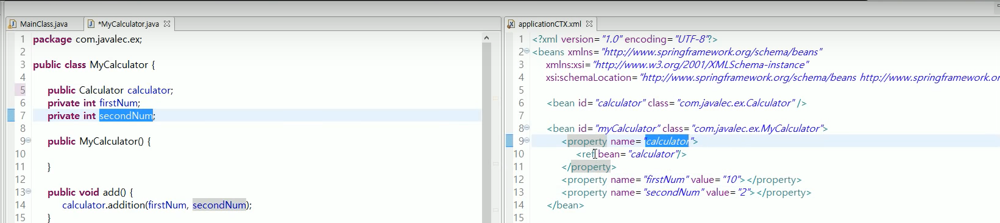

보는 것과 같이 이름을 동일하게 맞춰주어야한다. 

`ref ` : 어떤 파일을 참조하는지


# 11강  스프링 MVC 기초 


### 11-1 . 스프링 MVC 개요 

- Model : 데이터를 처리하는 부분 
- View : 화면을 담당하는 부분 
- Controller : 요청을 처리하는 부분 ( 뷰와 모델 사이의 통신 역할 )

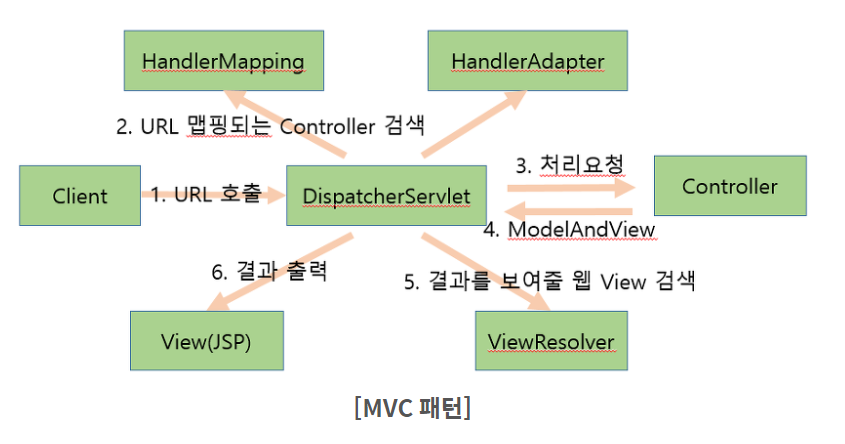


### 11-2 . 스프링 MVC 구조 살펴보기 

- DispatcherServlet 
  - 클라이언트의 요청을 최초로 받아, 컨트롤러에게 전달 
- web.xml 
  - DispatcherServlet 서브릿 맵핑 
  - 스프링 설정 파일 위치 정의 
- servlet-context.xml 
  - 스프링 컨테이너 설정 파일 
- 컨트롤러
  - Dispatcher에서 전달된 요청을 처리 


```xml
<!-- 한글 파일 깨지지 않도록 설정 -->
<!-- web.xml -->
<filter>
    <filter-name>encodingFilter</filter-name>
    <filter-class>
        org.springframework.web.filter.CharacterEncodingFilter     
    </filter-class>
    <init-param>
        <param-name>encoding</param-name>   
        <param-value>UTF-8</param-value>
    </init-param>
    <init-param>
        <param-name>forceEncoding</param-name>  
        <param-value>true</param-value>
    </init-param>
</filter>    

<filter-mapping>
    <filter-name>encodingFilter</filter-name>
    <url-pattern>/*</url-pattern>                 
</filter-mapping> 
```

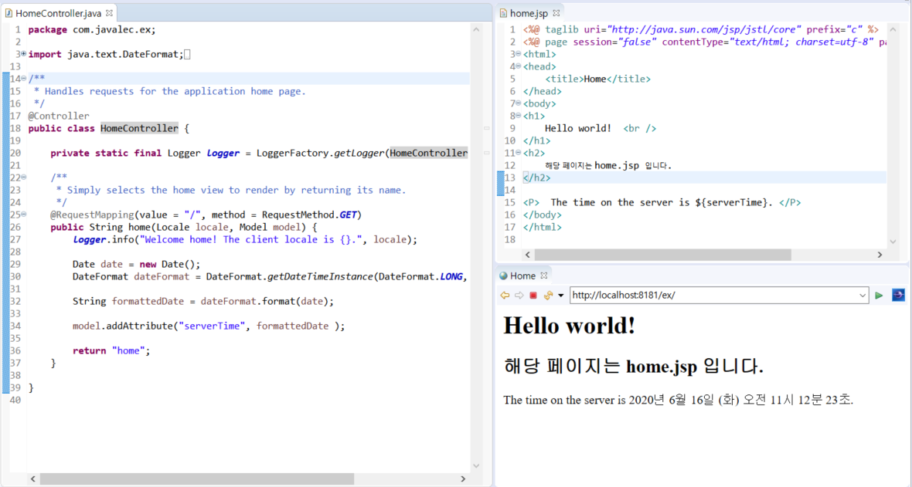


- 이미지 파일은 `resources` 디렉터리 밑에 있어야 한다. 그 이유는 `servlet-context.xml` 파일 내에서 resource 의 경로에 대해서 매핑을 했기 때문. 

  ```xml
  <!-- Handles HTTP GET requests for /resources/** by efficiently serving up static resources in the ${webappRoot}/resources directory -->
  <resources mapping="/resources/**" location="/resources/" />
  ```

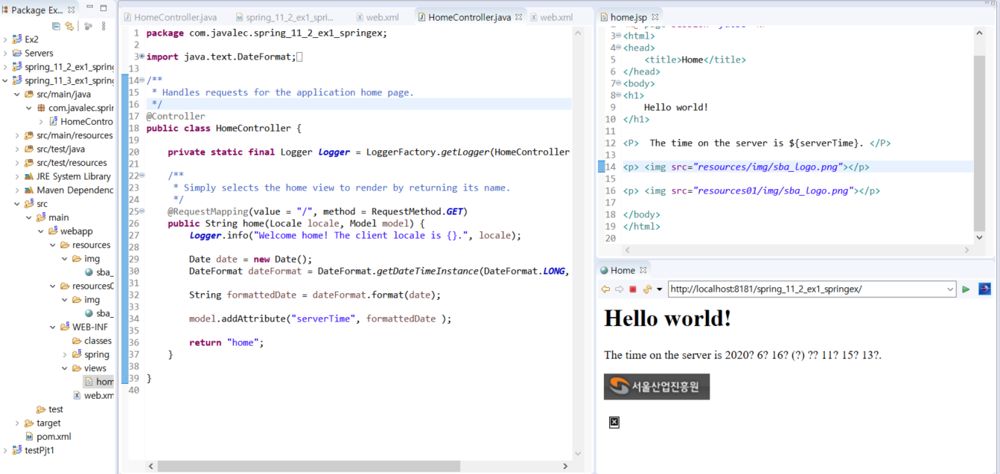


# 12강 컨트롤러 


### **12-1 . 컨트롤러 클래스 제작 순서** 

1. `@Controller` 를 이용하여 클래스 생성 

   ```java
   @Controller
   public class HomeController{
   			....
   }
   ```

2. `@RequestMapping` 을 이용한 요청 경로 지정 

   ```java
   @RequestMapping("/board/view")	// 요청 경로 ( path )
   public String View(){
       return "board/view"; 		// 뷰 페이지 이름 
   }
   ```

3. 요청 처리 메소드 구현 

4. 뷰 이름 리턴 


### **12-2 . 뷰 페이지 이름 생성 방법** 

뷰 페이지 이름 = prefix + 요청 처리 메소드 반환값 + suffix  (`servlet-context.xml` 파일에 명시 )

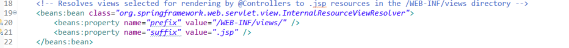


### 12-3. 뷰에 데이터 전달 

- 컨트롤러에서 로직 수행 후 뷰페이지를 반환한다. 이 때 뷰에서 사용하게 될 데이터를 객체로 전달할 수 있다. 

  #### Model 클래스를 이용한 데이터 전달 

  ```java
  @RequestMapping("/board/content")
  public String content(Model model){		// 모델 객체를 파라미터로 받음 
      model.addAttribute("id",30); 		// 모델 객체에 데이터를 담음 
      return "board/content"; 	
  }
  ```

  ```jsp
  <body>
      content.jsp 입니다. <br />
      id : ${id}				<!-- 컨트롤러에서 전달받은 모델 객체의 속성을 이용 -->
  </body>
  ```

  

  #### ModelAndView 클래스를 이용한 데이터 전달 

  ```java
  @RequestMapping("/board/reply")
  public ModelAndView reply(){
      ModelAndView mv = new modelAndView(); 		// ModelAndView 객체 생성 
      mv.addObject("id", 30); 					// Model 객체에 데이터를 담음 
      mv.setViewname("board/reply"); 				// 뷰 이름 설정 
      return mv; 
  }
  ```


### 12-4. 클래스에 @RequestMapping 적용 


- ```java
  @Controller
  @RequestMapping("/board")			// 클래스에 @RequestMapping 적용 
  public class HomeController{
      
      @RequestMapping("/write")		// 메서드에 @RequestMapping 적용
      public String write(Model model){
          model.addAttribute("id", 30); 
          return "/board/write"; 
      }
  }
  ```

  위의 RequestMapping 에 해당하는 경로는 두개의 경로를 더해야한다. -> `/board/write` 


# 13강 Form 데이터 


### 13-1 . HttpServletRequest 클래스 

```java
@RequestMapping("board/confirmId")
public String confirmId(HttpServletRequest httpServletRequest, Model model){
    String id = httpServletRequest.getParameter("id"); 
    String pw = httpServletRequest.getParameter("pw"); 
    model.addAttribute("id", id); 
    model.addAttribute("pw", pw); 
    return "board/confirmId"; 
}
```

- `httpServletRequest` : 사용자가 요청한 데이터를 담는 객체 
- `model` : 뷰에 넘길 데이터를 저장하는 객체 


### 13-2 . @RequestParam 어노테이션 

```java
@RequestMapping("board/checkId")
public String checkId(@RequestParam("id") String id, @RequestParam("pw") String pw, Model model){
    model.addAttribute("identify",id); 
    model.addAttribute("password",pw); 
    return "board/checkId"; 
}
```

- `@RequestParam` 어노테이션은 넘길 때 값을 반드시 넘겨야한다. 만약 값을 넘기지 않을 경우 400 Error 발생 


### 13-3 데이터(커맨트) 객체 

```java
@RequestMapping("/member/join")
public String joinData(Member member){
    return "member/join"; 
}
```

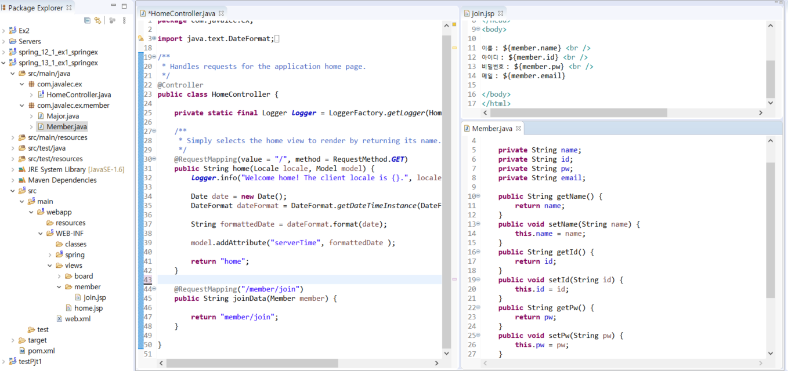


### 13-4 . @PathVariable 

- @PathVariable  어노테이션을 이용하면 경로에 변수를 넣어 요청 메소드에서 파라미터로 이용할 수 있습니다. 

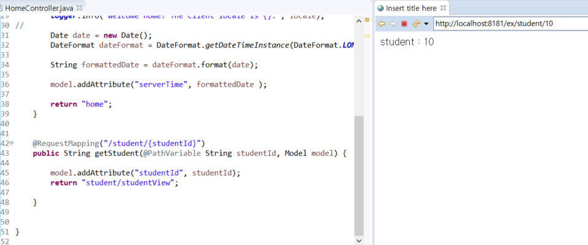


# 16-20강 스프링 MVC 게시판 만들기 

### DataBase 구축 

```mssql
create table mvc_sboard(
	bId int primary key, 
	bName varchar(40), 
	bTitle varchar(200), 
	bContent varchar(200), 
	bDate datetime default sysdatetime(), 
	bHit int default 0 , 
	bGroup int, 
	bStep int, 
	bIndent int 
); 
```


### 시퀀스 생성 

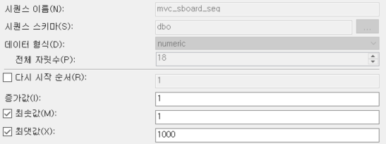

### BDto

```java
package com.javalec.spring_pjt_board.dto;

import java.sql.Timestamp;

public class BDto {
	
	int bId; 
	String bName; 
	String bTitle; 
	String bContent; 
	Timestamp bDate ; 
	int bHit; 
	int bGroup; 
	int bStep; 
	int bIndent; 
	
	public BDto() {
		// TODO Auto-generated constructor stub
	}
	
	public BDto(int bId, String bName, String bTitle, String bContent,  Timestamp bDate, int bHit, int bGroup, int bStep, int bIndent) {
		this.bId = bId; 
		this.bName = bName; 
		this.bTitle = bTitle; 
		this.bContent = bContent; 
		this.bDate = bDate; 
		this.bHit = bHit; 
		this.bGroup = bGroup; 
		this.bStep = bStep; 
		this.bIndent = bIndent; 	
	}

	public int getbId() {
		return bId;
	}

	public void setbId(int bId) {
		this.bId = bId;
	}

	public String getbContent() {
		return bContent;
	}

	public void setbContent(String bContent) {
		this.bContent = bContent;
	}

	public String getbName() {
		return bName;
	}

	public void setbName(String bName) {
		this.bName = bName;
	}

	public String getbTitle() {
		return bTitle;
	}

	public void setbTitle(String bTitle) {
		this.bTitle = bTitle;
	}

	public Timestamp getbDate() {
		return bDate;
	}

	public void setbDate(Timestamp bDate) {
		this.bDate = bDate;
	}

	public int getbHit() {
		return bHit;
	}

	public void setbHit(int bHit) {
		this.bHit = bHit;
	}

	public int getbGroup() {
		return bGroup;
	}

	public void setbGroup(int bGroup) {
		this.bGroup = bGroup;
	}

	public int getbStep() {
		return bStep;
	}

	public void setbStep(int bStep) {
		this.bStep = bStep;
	}

	public int getbIndent() {
		return bIndent;
	}

	public void setbIndent(int bIndent) {
		this.bIndent = bIndent;
	}	
}
```


### 커넥션 풀 사용 

- servers - context.xml 파일에 아래 코드 추가 

  ```xml
  	<Resource 
  		auth = "Container"
  		driverClassName = "com.microsoft.sqlserver.jdbc.SQLServerDriver"
  		url = "jdbc:sqlserver://localhost:9036;database=master;integratedSecurity=true"
  		name = "mssql-jdbc-6.4.0.jre7"
  		type = "javax.sql.DataSource"
  		maxActive = "50"
  		maxWait = "1000"
  	/>
  ```

   

### BController

```java
package com.javalec.spring_pjt_board.controller;

import javax.servlet.http.HttpServletRequest;

import org.springframework.stereotype.Controller;
import org.springframework.ui.Model;
import org.springframework.web.bind.annotation.RequestMapping;
import org.springframework.web.bind.annotation.RequestMethod;

import com.javalec.spring_pjt_board.command.BCommand;
import com.javalec.spring_pjt_board.command.BContentCommand;
import com.javalec.spring_pjt_board.command.BDeleteCommand;
import com.javalec.spring_pjt_board.command.BListCommand;
import com.javalec.spring_pjt_board.command.BModifyCommand;
import com.javalec.spring_pjt_board.command.BReplyCommand;
import com.javalec.spring_pjt_board.command.BReplyViewCommand;
import com.javalec.spring_pjt_board.command.BWriteCommand;

@Controller
public class BController {
	
	BCommand command; 
	
	@RequestMapping("/list")
	public String list(Model model) {
		
		System.out.println("list()");
		
		command = new BListCommand();
		command.execute(model);
		
		return "list"; 
	}
	
	@RequestMapping("/write_view")
	public String write_view(Model model) {
		System.out.println("write_view()");
		return "write_view"; 
	}
	
	@RequestMapping("/write")
	public String write(HttpServletRequest request, Model model) {
		System.out.println("write()");
		
		model.addAttribute("request", request); 
		command = new BWriteCommand(); 
		command.execute(model);
		
		return "redirect:list"; 
	}
	
	@RequestMapping("content_view")
	public String content_view(HttpServletRequest request, Model model) {
		System.out.println("content_view()");
		
		model.addAttribute("request", request); 
		command = new BContentCommand(); 
		command.execute(model);
		
		return "content_view"; 
	}
	
	@RequestMapping(method=RequestMethod.POST, value = "/modify")
	public String modify(HttpServletRequest request, Model model) {
		System.out.println("Modify()"); 
		
		model.addAttribute("request", request); 
		command = new BModifyCommand();
		command.execute(model);
		
		return "redirect:list"; 
	}
	
	@RequestMapping("/reply_view")
	public String reply_view(HttpServletRequest request, Model model) {
		System.out.println("reply_view()");
		
		model.addAttribute("request", request); 
		command = new BReplyViewCommand();
		command.execute(model);
		return "reply_view"; 
	}
	
	@RequestMapping("/reply")
	public String Reply(HttpServletRequest request, Model model) {
		System.out.println("reply()");
		
		model.addAttribute("request", request); 
		command = new BReplyCommand();
		command.execute(model);
		
		return "redirect:list"; 
	}
	
	@RequestMapping("/delete")
	public String delete(HttpServletRequest request, Model model ) {
		System.out.println("delete()");
		
		model.addAttribute("request", request); 
		command = new BDeleteCommand();
		command.execute(model);
		
		return "redirect:list"; 
	}
}
```


### BDao

```java
package com.javalec.spring_pjt_board.dao;

import java.sql.Connection;
import java.sql.PreparedStatement;
import java.sql.ResultSet;
import java.sql.Timestamp;
import java.util.ArrayList;

import javax.naming.Context;
import javax.naming.InitialContext;
import javax.naming.NamingException;
import javax.sql.DataSource;

import com.javalec.spring_pjt_board.dto.BDto;

public class BDao {

	DataSource dataSource; 
	
	public BDao() {
		try {
			Context context = new InitialContext();
			dataSource = (DataSource)context.lookup("java:comp/env/mssql-jdbc-6.4.0.jre7");
		}catch (NamingException e) {
			e.printStackTrace();
		}
	}
	
	public void reply(String bId, String bName, String bTitle, String bContent, String bGroup, String bStep, String bIndent) {
		
		replyShape(bGroup, bStep); 
		
		Connection conn = null; 
		PreparedStatement pstmt = null; 
		
		try {
			
			conn = dataSource.getConnection(); 
			String query = "insert into mvc_sboard(bId, bName, bTitle, bContent, bGroup, bStep, bIndent) values (next value for mvc_sboard_seq, ?,?,?,?,?,?)"; 
			pstmt = conn.prepareStatement(query);
			pstmt.setString(1, bName);
			pstmt.setString(2, bTitle);
			pstmt.setString(3, bContent);
			pstmt.setInt(4, Integer.parseInt(bGroup));
			pstmt.setInt(5, Integer.parseInt(bStep)+1);
			pstmt.setInt(6, Integer.parseInt(bIndent)+1);
			
			int rn = pstmt.executeUpdate(); 
			
		}catch(Exception e){
			e.printStackTrace();
		}finally {
			try {
				if(pstmt != null) pstmt.close(); 
				if(conn != null) conn.close();
			}catch(Exception e2) {
				e2.printStackTrace();
			}
		}
		
	}
	
	public BDto reply_view(String strID) {
		
		BDto dto = null; 
		Connection conn = null; 
		PreparedStatement pstmt = null; 
		ResultSet res = null ; 
		
		
		try {
			conn = dataSource.getConnection(); 
			String query = "select * from mvc_sboard where bId=?"; 
			pstmt = conn.prepareStatement(query); 
			pstmt.setInt(1, Integer.parseInt(strID));
			res = pstmt.executeQuery();
			
			if(res.next()) {
				int bId = res.getInt("bId"); 
				String bName = res.getString("bName"); 
				String bTitle = res.getString("bTitle"); 
				String bContent = res.getString("bContent"); 
				Timestamp bDate = res.getTimestamp("bDate"); 
				int bHit = res.getInt("bHit"); 
				int bGroup = res.getInt("bGroup"); 
				int bStep = res.getInt("bStep"); 
				int bIndent = res.getInt("bIndent"); 
				
				dto = new BDto(bId, bName, bTitle, bContent, bDate, bHit, bGroup, bStep, bIndent);
			}
		}catch(Exception e) {
			e.printStackTrace();
		}finally {
			try {
				if(res != null) res.close();
				if(pstmt != null) pstmt.close(); 
				if(conn != null) conn.close(); 
			}catch(Exception e2) {
				e2.printStackTrace();
			}
		}
		
		return dto; 
	}
	
	public void delete(String bId) {
		Connection conn = null; 
		PreparedStatement pstmt = null; 
		
		try {
			conn = dataSource.getConnection(); 
			String query = "delete from mvc_sboard where bId=?"; 
			pstmt = conn.prepareStatement(query); 
			pstmt.setInt(1, Integer.parseInt(bId));
	
			int rn = pstmt.executeUpdate(); 
			
		}catch(Exception e) {
			e.printStackTrace();
		}finally {
			try {
				if(pstmt != null) pstmt.close(); 
				if(conn != null) conn.close(); 
			}catch(Exception e2) {
				e2.printStackTrace();
			}
		}
	}
	
	public void modify(String bId, String bName, String bTitle, String bContent) {
		
		Connection conn = null; 
		PreparedStatement pstmt = null; 
		
		try {
			conn = dataSource.getConnection(); 
			String query = "update mvc_sboard set bName=?, bTitle =?, bContent =? where bId = ?";  
			pstmt = conn.prepareStatement(query); 
			pstmt.setString(1, bName);
			pstmt.setString(2, bTitle);
			pstmt.setString(3, bContent);
			pstmt.setInt(4, Integer.parseInt(bId));
	
			int rn = pstmt.executeUpdate(); 
			
		}catch(Exception e) {
			e.printStackTrace();
		}finally {
			try {
				if(pstmt != null) pstmt.close(); 
				if(conn != null) conn.close(); 
			}catch(Exception e2) {
				e2.printStackTrace();
			}
		}
	}
	
	public BDto contentView(String strID) {
		
		upHit(strID); 
		
		BDto dto = null; 
		Connection conn = null; 
		PreparedStatement pstmt = null; 
		ResultSet res = null ; 
		
		
		try {
			conn = dataSource.getConnection(); 
			String query = "select * from mvc_sboard where bId=?"; 
			pstmt = conn.prepareStatement(query); 
			pstmt.setInt(1, Integer.parseInt(strID));
			res = pstmt.executeQuery();
			
			if(res.next()) {
				int bId = res.getInt("bId"); 
				String bName = res.getString("bName"); 
				String bTitle = res.getString("bTitle"); 
				String bContent = res.getString("bContent"); 
				Timestamp bDate = res.getTimestamp("bDate"); 
				int bHit = res.getInt("bHit"); 
				int bGroup = res.getInt("bGroup"); 
				int bStep = res.getInt("bStep"); 
				int bIndent = res.getInt("bIndent"); 
				
				dto = new BDto(bId, bName, bTitle, bContent, bDate, bHit, bGroup, bStep, bIndent);
			}
		}catch(Exception e) {
			e.printStackTrace();
		}finally {
			try {
				if(res != null) res.close();
				if(pstmt != null) pstmt.close(); 
				if(conn != null) conn.close(); 
			}catch(Exception e2) {
				e2.printStackTrace();
			}
		}
		
		return dto; 
	}
	
	public void write(String bName, String bTitle, String bContent) {
		
		Connection conn = null; 
		PreparedStatement pstmt = null; 
		
		try {
			
			conn = dataSource.getConnection(); 
			String query = "insert into mvc_sboard(bId, bName, bTitle, bContent, bHit, bGroup, bStep, bIndent) values (next value for mvc_sboard_seq, ?,?,?,0,(select isnull(MAX(bId),0) from mvc_sboard)+1,0,0)"; 
			pstmt = conn.prepareStatement(query);
			pstmt.setString(1, bName);
			pstmt.setString(2, bTitle);
			pstmt.setString(3, bContent);
			
			int rn = pstmt.executeUpdate(); 
			
		}catch(Exception e){
			e.printStackTrace();
		}finally {
			try {
				if(pstmt != null) pstmt.close(); 
				if(conn != null) conn.close();
			}catch(Exception e2) {
				e2.printStackTrace();
			}
		}
	}
	
	
	public ArrayList<BDto> list() {
		ArrayList<BDto> dtos = new ArrayList<BDto>(); 
		Connection connection = null; 
		PreparedStatement pstmt = null; 
		ResultSet res = null ; 
		
		try {
			connection = dataSource.getConnection(); 
			String query = "select bId, bName, bTitle, bContent, bDate, bHit, bGroup, bStep, bIndent from mvc_sboard order by bGroup desc, bStep asc"; 
			pstmt = connection.prepareStatement(query); 
			res = pstmt.executeQuery();
			
			while(res.next()) {
				int bId = res.getInt("bId"); 
				String bName = res.getString("bName"); 
				String bTitle = res.getString("bTitle"); 
				String bContent = res.getString("bContent"); 
				Timestamp bDate = res.getTimestamp("bDate"); 
				int bHit = res.getInt("bHit"); 
				int bGroup = res.getInt("bGroup"); 
				int bStep = res.getInt("bStep"); 
				int bIndent = res.getInt("bIndent"); 
				
				BDto dto = new BDto(bId, bName, bTitle, bContent, bDate, bHit, bGroup, bStep, bIndent);
				dtos.add(dto);
			}
		}catch(Exception e) {
			e.printStackTrace();
		}finally {
			try {
				if(res != null) res.close();
				if(pstmt != null) pstmt.close(); 
				if(connection != null) connection.close(); 
			}catch(Exception e2) {
				e2.printStackTrace();
			}
		}
		
		return dtos; 
	}
	
	public void upHit(String bId) {
		Connection conn = null; 
		PreparedStatement pstmt = null; 
		
		try {
			conn = dataSource.getConnection(); 
			String query = "update mvc_sboard set bHit = bHit+1 where bId = ?";  
			pstmt = conn.prepareStatement(query); 
			pstmt.setString(1, bId);
	
			int rn = pstmt.executeUpdate(); 
			
		}catch(Exception e) {
			e.printStackTrace();
		}finally {
			try {
				if(pstmt != null) pstmt.close(); 
				if(conn != null) conn.close(); 
			}catch(Exception e2) {
				e2.printStackTrace();
			}
		}
	}
	
	public void replyShape(String strGroup, String strStep) {
		Connection conn = null; 
		PreparedStatement pstmt = null; 
		
		try {
			conn = dataSource.getConnection(); 
			String query = "update mvc_sboard set bStep = bStep+1 where bGroup=? and bStep >?";   
			pstmt = conn.prepareStatement(query); 
			pstmt.setInt(1, Integer.parseInt(strGroup));
			pstmt.setInt(2, Integer.parseInt(strStep));
	
			int rn = pstmt.executeUpdate(); 
			
		}catch(Exception e) {
			e.printStackTrace();
		}finally {
			try {
				if(pstmt != null) pstmt.close(); 
				if(conn != null) conn.close(); 
			}catch(Exception e2) {
				e2.printStackTrace();
			}
		}
	}
}
```


### BCommand

```java
// 인터페이스
package com.javalec.spring_pjt_board.command;

import org.springframework.ui.Model;

public interface BCommand {
	public void execute(Model model); 
}
```


### BContentCommand

```java
package com.javalec.spring_pjt_board.command;

import java.util.Map;

import javax.servlet.http.HttpServletRequest;

import org.springframework.ui.Model;

import com.javalec.spring_pjt_board.dao.BDao;
import com.javalec.spring_pjt_board.dto.BDto;

public class BContentCommand implements BCommand {

	@Override
	public void execute(Model model) {
		
		Map<String, Object> map = model.asMap(); 
		HttpServletRequest request = (HttpServletRequest)map.get("request");
		String bId = request.getParameter("bId"); 
		
		BDao dao = new BDao(); 
		BDto dto = dao.contentView(bId); 
		
		model.addAttribute("content_view",dto); 
    }
}
```


### BDeleteCommand

```java
@Override
	public void execute(Model model) {
		
		Map<String, Object> map = model.asMap(); 
		HttpServletRequest request = (HttpServletRequest)map.get("request");
		
		String bId = request.getParameter("bId") ; 
		BDao dao = new BDao();
		dao.delete(bId); 
	}
```


### BListCommand

```java
	@Override
	public void execute(Model model) {
		
		BDao dao = new BDao(); 
		ArrayList<BDto> dtos = dao.list(); 
		
		model.addAttribute("list", dtos); 
	}
```


### BModifyCommand

```java
@Override
	public void execute(Model model) {

		Map<String, Object> map = model.asMap(); 
		HttpServletRequest request = (HttpServletRequest)map.get("request"); 
		
		String bId = request.getParameter("bId"); 
		String bName = request.getParameter("bName");
		String bTitle = request.getParameter("bTitle");
		String bContent = request.getParameter("bContent");
		
		BDao dao = new BDao(); 
		dao.modify(bId, bName, bTitle, bContent );

	}
```


### BReplyCommand

```java
	@Override
	public void execute(Model model) {
		
		Map<String, Object> map = model.asMap(); 
		HttpServletRequest request = (HttpServletRequest)map.get("request");
		
		String bId = request.getParameter("bId");
		String bName = request.getParameter("bName");
		String bTitle = request.getParameter("bTitle");
		String bContent= request.getParameter("bContent");
		String bGroup= request.getParameter("bGroup");
		String bStep = request.getParameter("bStep");
		String bIndent = request.getParameter("bIndent");
		
		BDao dao = new BDao(); 
		dao.reply(bId, bName, bTitle, bContent, bGroup, bStep, bIndent); 
	}

```


### BReplyViewCommand

```java
@Override
	public void execute(Model model) {
		
		Map<String, Object> map = model.asMap(); 
		HttpServletRequest request = (HttpServletRequest)map.get("request"); 
		
		String bId = request.getParameter("bId"); 
		BDao dao = new BDao(); 
		BDto dto = dao.reply_view(bId); 
		
		model.addAttribute("reply_view", dto); 
	}
```


### BWriteCommand

```java
@Override
	public void execute(Model model) {
		
		Map<String, Object> map = model.asMap(); 
		HttpServletRequest request = (HttpServletRequest)map.get("request"); 
		
		String bName = request.getParameter("bName"); 
		String bTitle = request.getParameter("bTitle"); 
		String bContent = request.getParameter("bContent"); 
		
		BDao dao = new BDao();
		dao.write(bName, bTitle, bContent); 
	}
```


# 21강 JDBC 


### JDBC Template 만들기 

- 스프링이 제공하는 JDBC 를 사용하기 위해서는 Dependency 를 추가해야한다 

  ```xml
  <!-- pom.xml  -->
  <!--  JDBC -->
  <dependency>
      <groupId>org.springframework</groupId>
      <artifactId>spring-jdbc</artifactId>
      <version>4.1.4.RELEASE</version>
  </dependency>
  ```

- `servlet-context.xml` 에 bean 추가 

  ```xml
  <!-- servlet-context.xml -->
  <beans:bean name="dataSource" class="org.springframework.jdbc.datasource.DriverManagerDataSource">
      <beans:property name="driverClassName" value="com.microsoft.sqlserver.jdbc.SQLServerDriver" />
      <beans:property name="url" value="jdbc:sqlserver://localhost:9036;database=master;integratedSecurity=true" />
  </beans:bean>
  ```

  ```xml
  <!-- servlet-context.xml -->
  <beans:bean name ="template" class= "org.springframework.jdbc.core.JdbcTemplate">
      <beans:property name="dataSource" ref="dataSource"></beans:property>
  </beans:bean>
  ```

  

- BController 에 아래 코드 추가 

  ```java
  public JdbcTemplate template; 
  
  @Autowired
  public void setTemplate(JdbcTemplate template) {
      this.template = template;
      Constant.template = this.template; 
  }
  ```


- 패키지와 클래스를 하나 생성하여 선언 

  ```java
  package com.javalec.spring_pjt_board.util;
  import org.springframework.jdbc.core.JdbcTemplate;
  
  public class Constant {
  	
  	public static JdbcTemplate template;  
  }
  ```


### JDBC Template 주요 사용 메서드 

#### `execute` 메서드 

- 주로 DDL 을 실행시킬 때 사용 

  ```java
  @Service
  public class DdlJdbc {
  
    private final JdbcTemplate jdbcTemplate;
  
    public DdlJdbc(JdbcTemplate jdbcTemplate) {
      this.jdbcTemplate = jdbcTemplate;
    }
  
    public void execute (String sql) {
      this.jdbcTemplate.execute(sql);
    }
  }
  
  ddlJdbc.execute("drop table persons if exists");
  ddlJdbc.execute("create table persons("id serial, name varchar(255))");
  ```

  

#### `update` 메서드 

- Read 를 제외한 insert, update, delete 는 모두 이 메서드를 사용

  ```java
  @Service
  public class UpdateJdbc {
  
    private final JdbcTemplate jdbcTemplate;
  
    public UpdateJdbc(JdbcTemplate jdbcTemplate) {
      this.jdbcTemplate = jdbcTemplate;
    }
  
    public int insert(String name) {
      return jdbcTemplate.update("insert into persons (name) values (?)", name);
    }
  }
  ```


#### `queryForObject` 메서드 

- 하나의 도메인 객체를 리턴받거나 하나의 컬럼을 리턴받을 때 사용한다. 

  ```java
  <T> T queryForObject(String sql, Class<T> requiredType, @Nullable Object... args) throws DataAccessException;
  
  <T> T queryForObject(String sql, RowMapper<T> rowMapper, @Nullable Object... args) throws DataAccessException;
  ```

  ```java
  public BDto contentView(String strID) {
  
      upHit(strID); 
      String query = "select * from mvc_sboard where bId="+strID; 
      return  template.queryForObject(query, new BeanPropertyRowMapper<BDto>(BDto.class)); 
  }
  ```

  

#### `query` 메서드 

```java
<T> List<T> query(String sql, RowMapper<T> rowMapper) throws DataAccessException;
<T> List<T> query(String sql, RowMapper<T> rowMapper, @Nullable Object... args) throws DataAccessException;
```


### JDBC를 이용해 변경 

#### BDao 클래스의 list 함수 변경 

```java
public ArrayList<BDto> list() {
    String query = "select bId, bName, bTitle, bContent, bDate, bHit, bGroup, bStep, bIndent from mvc_sboard order by bGroup desc, bStep asc"; 
    return (ArrayList<BDto>)template.query(query, new BeanPropertyRowMapper<BDto>(BDto.class)); 
}
```

#### ContentView 함수 변경 

```java
public BDto contentView(String strID) {
    upHit(strID); 
	String query = "select * from mvc_sboard where bId="+strID; 
    return  template.queryForObject(query, new BeanPropertyRowMapper<BDto>(BDto.class)); 
}
```

#### upHit 함수 변경 

```java
public void upHit(final String bId) {
    String query = "update mvc_sboard set bHit = bHit+1 where bId = ?";  
    template.update(query, new PreparedStatementSetter(){	// 익명클래스 생성 	
        @Override
        public void setValues(PreparedStatement ps) throws SQLException{
            ps.setInt(1, Integer.parseInt(bId));
        }
    }); 
}
```

#### write 함수 변경 

```java
public void write(final String bName, final String bTitle, final String bContent) {
    template.update(new PreparedStatementCreator() {

        @Override
        public PreparedStatement createPreparedStatement(Connection con) throws SQLException {
            String query = "insert into mvc_sboard(bId, bName, bTitle, bContent, bHit, bGroup, bStep, bIndent) values (next value for mvc_sboard_seq, ?,?,?,0,(select isnull(MAX(bId),0) from mvc_sboard)+1,0,0)";
            PreparedStatement pstmt = con.prepareStatement(query); 
            pstmt.setString(1, bName);
            pstmt.setString(2, bTitle); 
            pstmt.setString(3, bContent);

            return pstmt;
        }
    });
}
```

#### modify 함수 변경 

```java
public void modify(final String bId, final String bName, final String bTitle, final String bContent) {

    String query = "update mvc_sboard set bName=?, bTitle =?, bContent =? where bId = ?";
    template.update(query, new PreparedStatementSetter() {

        @Override
        public void setValues(PreparedStatement ps) throws SQLException{
            ps.setString(1, bName);
            ps.setString(2, bTitle);
            ps.setString(3, bContent); 
            ps.setInt(4, Integer.parseInt(bId));
        }
    });
}
```

#### delete 함수 변경 

```java
public void delete(final String bId) {
    String query = "delete from mvc_sboard where bId=?"; 
    template.update(query, new PreparedStatementSetter() {

        @Override
        public void setValues(PreparedStatement ps) throws SQLException {
            ps.setString(1, bId);

        }
    });

```

#### reply_view 함수 변경 

```java
public BDto reply_view(String strID) {
    String query = "select * from mvc_sboard where bId="+strID; 
    return template.queryForObject(query, new BeanPropertyRowMapper<BDto>(BDto.class));
}
```

#### reply 함수 변경 

```java
public void reply(final String bId, final String bName, final String bTitle, final String bContent, final String bGroup, final String bStep, final String bIndent) {

    replyShape(bGroup, bStep); 
    String query = "insert into mvc_sboard(bId, bName, bTitle, bContent, bGroup, bStep, bIndent) values (next value for mvc_sboard_seq, ?,?,?,?,?,?)";
    template.update(query, new PreparedStatementSetter() {

        @Override
        public void setValues(PreparedStatement ps) throws SQLException {

            ps.setString(1,bName); 
            ps.setString(2, bTitle);
            ps.setString(3, bContent);
            ps.setInt(4, Integer.parseInt(bGroup));
            ps.setInt(5, Integer.parseInt(bStep)+1);
            ps.setInt(6, Integer.parseInt(bIndent)+1);
        }
    });	
}
```

#### replyShape 함수 변경 

```java
public void replyShape(final String strGroup, final String strStep) {
    String query = "update mvc_sboard set bStep = bStep+1 where bGroup=? and bStep >?";
    template.update(query, new PreparedStatementSetter() {

        @Override
        public void setValues(PreparedStatement ps) throws SQLException {
            ps.setInt(1, Integer.parseInt(strGroup));
            ps.setInt(2, Integer.parseInt(strStep));
        }
    });
}
```


# 22강 트랜잭션 처리 


### Dao

```java
package com.javalec.spring_pjt_ex.dao;

import java.sql.Connection;
import java.sql.PreparedStatement;
import java.sql.SQLException;

import org.springframework.jdbc.core.JdbcTemplate;
import org.springframework.jdbc.core.PreparedStatementCreator;
import org.springframework.transaction.PlatformTransactionManager;
import org.springframework.transaction.TransactionDefinition;
import org.springframework.transaction.TransactionStatus;
import org.springframework.transaction.support.DefaultTransactionDefinition;

import com.javalec.spring_pjt_ex.dto.TicketDto;

public class TicketDao {

	JdbcTemplate template;
	
	PlatformTransactionManager transactionManager;
	
	public void setTemplate(JdbcTemplate template) {
		this.template = template;
	}
	
	public void setTransactionManager( PlatformTransactionManager transactionManager) {
		this.transactionManager = transactionManager;
	}
	
	public TicketDao() {
		System.out.println(template);
	}
	
	public void buyTicket(final TicketDto dto) {
		System.out.println("buyTicket()");
		System.out.println("dto.getConsumerId() : " + dto.getConsumerId());
		System.out.println("dto.getAmount() : " + dto.getAmount());
		
		TransactionDefinition definition = new DefaultTransactionDefinition();
		TransactionStatus status = transactionManager.getTransaction(definition);
		
		try {
		
			template.update(new PreparedStatementCreator() {
				
				@Override
				public PreparedStatement createPreparedStatement(Connection con)
						throws SQLException {
					String query = "insert into card (consumerId, amount) values (?, ?)";
					PreparedStatement pstmt = con.prepareStatement(query);
					pstmt.setString(1, dto.getConsumerId());
					pstmt.setString(2, dto.getAmount());
					
					return pstmt;
				}
			});
			
			template.update(new PreparedStatementCreator() {
				
				@Override
				public PreparedStatement createPreparedStatement(Connection con)
						throws SQLException {
					String query = "insert into ticket (consumerId, countnum) values (?, ?)";
					PreparedStatement pstmt = con.prepareStatement(query);
					pstmt.setString(1, dto.getConsumerId());
					pstmt.setString(2, dto.getAmount());
					
					return pstmt;
				}
			});
		
			transactionManager.commit(status);
			
		} catch (Exception e) {
			e.printStackTrace();
			
			transactionManager.rollback(status);
		}
    }	
}
```

- 트랜잭션 처리가 필요한 부분을 `try-catch` 로 감싸준다. 

### servlet-context.xml

```xml
<?xml version="1.0" encoding="UTF-8"?>
<beans:beans xmlns="http://www.springframework.org/schema/mvc"
	xmlns:xsi="http://www.w3.org/2001/XMLSchema-instance"
	xmlns:beans="http://www.springframework.org/schema/beans"
	xmlns:context="http://www.springframework.org/schema/context"
	xsi:schemaLocation="http://www.springframework.org/schema/mvc http://www.springframework.org/schema/mvc/spring-mvc.xsd
		http://www.springframework.org/schema/beans http://www.springframework.org/schema/beans/spring-beans.xsd
		http://www.springframework.org/schema/context http://www.springframework.org/schema/context/spring-context.xsd">

	<!-- DispatcherServlet Context: defines this servlet's request-processing infrastructure -->
	
	<!-- Enables the Spring MVC @Controller programming model -->
	<annotation-driven />

	<!-- Handles HTTP GET requests for /resources/** by efficiently serving up static resources in the ${webappRoot}/resources directory -->
	<resources mapping="/resources/**" location="/resources/" />

	<!-- Resolves views selected for rendering by @Controllers to .jsp resources in the /WEB-INF/views directory -->
	<beans:bean class="org.springframework.web.servlet.view.InternalResourceViewResolver">
		<beans:property name="prefix" value="/WEB-INF/views/" />
		<beans:property name="suffix" value=".jsp" />
	</beans:bean>
	
	<context:component-scan base-package="com.javalec.spring_pjt_ex" />
	
	<beans:bean name="dataSource" class="org.springframework.jdbc.datasource.DriverManagerDataSource">
		<beans:property name="driverClassName" value="oracle.jdbc.driver.OracleDriver" />
		<beans:property name="url" value="jdbc:oracle:thin:@localhost:1521:xe" />
		<beans:property name="username" value="scott" />
		<beans:property name="password" value="tiger" />
	</beans:bean>
	
	<beans:bean name="template" class="org.springframework.jdbc.core.JdbcTemplate">
		<beans:property name="dataSource" ref="dataSource" />
	</beans:bean>
	
	<beans:bean name="transactionManager" class="org.springframework.jdbc.datasource.DataSourceTransactionManager">
		<beans:property name="dataSource" ref="dataSource" />
	</beans:bean>
	
	<beans:bean name="dao" class="com.javalec.spring_pjt_ex.dao.TicketDao" >
		<beans:property name="template" ref="template" />
		<beans:property name="transactionManager" ref="transactionManager" />
	</beans:bean>
	
</beans:beans>

```


# 25강. Security 


### 보안 관련 라이브러리 추가 

- `pom.xml` 파일에 dependency 추가 

  ```xml
  <!-- Security --> 
  <dependency>
      <groupId>org.springframework.security</groupId>
      <artifactId>spring-security-web</artifactId>
      <version>3.2.5.RELEASE</version>
  </dependency>
  
  <dependency>
      <groupId>org.springframework.security</groupId>
      <artifactId>spring-security-config</artifactId>
      <version>3.2.5.RELEASE</version>			
  </dependency>
  
  <dependency>
      <groupId>org.springframework.security</groupId>
      <artifactId>spring-security-core</artifactId>
      <version>3.2.5.RELEASE</version>			
  </dependency>
  
  <dependency>
      <groupId>org.springframework.security</groupId>
      <artifactId>spring-security-taglibs</artifactId>
      <version>3.2.4.RELEASE</version>			
  </dependency>
  ```

- 위와 같이 추가하거나 아니면 `Dependencies` 에서 클릭해서 추가할 수 있다. 

  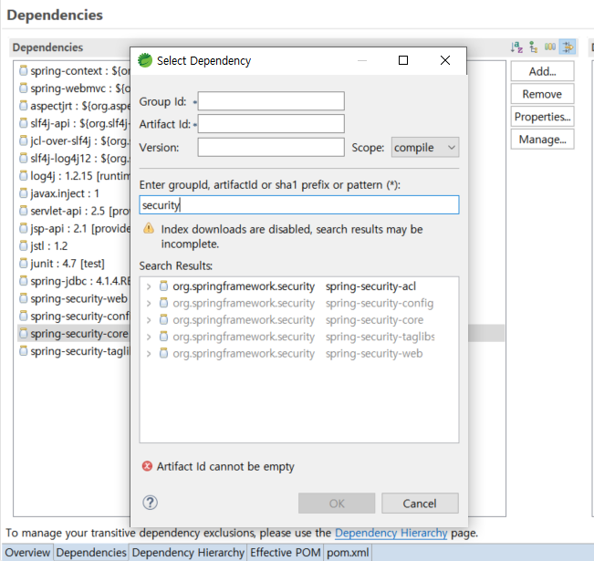


### 보안 관련 설정 파일 만들기 

- `security-context.xml` 파일 생성 

  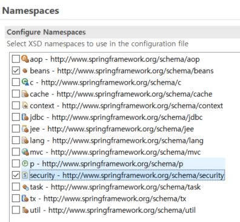

  ```xml
  <!-- 설정 파일 작성 --> 
  <security:http auto-config="true">
  	<security:intercept-url pattern="/login.html*" access="ROLE_USER" />
      <security:intercept-url pattern="/welcome.html*" access="ROLE_ADMIN" />
  </security:http>
  
  <security:authentication-manager>
  	<security:authentication-provider>
      	<security:user-service>
          	<security:user name="user" password="123" authorities="ROLE_USER" />
              <security:user name="admin" password="123" authorities="ROLE_ADMIN,ROLE_USER" />
          </security:user-service>
      </security:authentication-provider>
  </security:authentication-manager>
  ```

  - `ROLE_USER` , `ROLE_ADMIN` 은 개발자가 마음대로 이름 정의 


- `web.xml` 파일에 추가  ( 가독성을 위해 servlet-context.xml 과 security-context.xml 을 분리하였기 때문 )

  ```xml
  <init-param>
      <param-name>contextConfigLocation</param-name>
      <param-value>
          /WEB-INF/spring/appServlet/servlet-context.xml
          /WEB-INF/spring/appServlet/security-context.xml
      </param-value>
  </init-param>
  ```


- `web.xml` 파일에 filter 작성 

  ```xml
  <filter>
  	<filter-name>springSecurityFilterChain</filter-name>
      <filter-class>org.springframework.web.filter.DelegatingFilterProxy</filter-class>
  </filter>
  <filter-mapping>
  	<filter-name>springSecurityFilterChain</filter-name>
      <url-pattern>/*</url-pattern>
  </filter-mapping>
  ```

  

- Controller 

  	```java
  @RequestMapping("/login.html")
  public String login(Locale locale, Model model) {
  
      return "security/login";
  }
  
  @RequestMapping("/welcome.html")
  public String welcome(Locale locale, Model model) {
  
      return "security/welcome";
  }
  ```
  
  

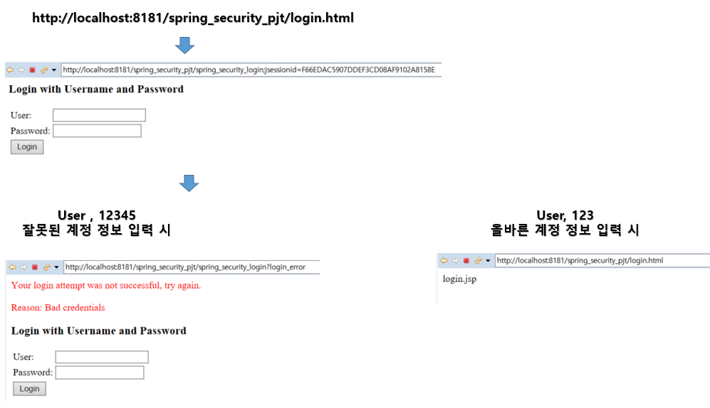

위의 화면의 로그인 페이지는 스프링 securtiy 에서 제공하는 로그인 페이지. 


