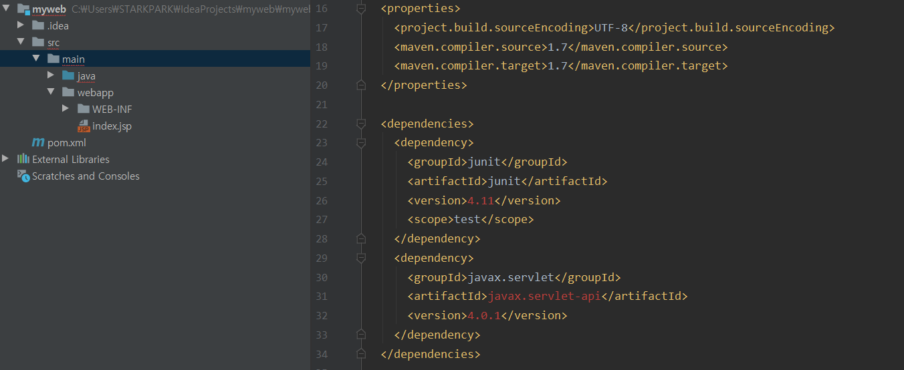

## IntelliJ IDEA 살펴보기 


- 각각의 프로젝트 당 하나의 IntelliJ 윈도우를 실행하는 것이 가장 일반적이다. 

- 하나의 윈도우 안에 여러개의 프로젝트를 실행하고 싶다면 module 등록하여 사용한다. 

- Eclipse    vs    IntelliJ IDEA 


- intelliJ 의 특징을 볼 수 있는 사이트 : https://www.jetbrains.com/ko-kr/idea/features/

- 별도의 프로그램을 사용하지 않고 애플리케이션을 개발할 수 있다. 
- **ployglot** : 다양한 언어와 다양한 DB 그리고 그 환경들을 지원할 수 있는 다양한 프레임 워크를 조합해서 사용할 수 있는 새로운 패러다임 


### IntelliJ 환경 설정 

- 크게 2가지에 의해서 한다. 

  - IntelliJ 전반적인 환경 설정 

    `File` -> `Settings` 

    - Maven 설정 변경 

    

  - 프로젝트마다 가진 고유한 환경 설정 

    `File` -> `Project Structure` 

    - 외부의 spring 이나 DB 등과 같은 라이브러리를 사용할 경우에는 Libary 에 등록하여 관리 할 수 있다. 

    


### 첫번째 웹 프로젝트 생성 


- maven 으로 시작하게 되면 프로젝트 초기에 시작시 사용할 수 있는 템플릿을 지정할 수 있다. 

  ```
  1. 왼쪽에서 maven 선택
  2. Create from archetype 클릭
  3. maven-archetype-webapp 선택
  ```

  


- 
  - groupid : 애플리케이션을 개발하고 있는 회사의 이름을 쓰는 것이 일반적 

  - ArtifacId : 해당하는 회사에서 프로젝트를 진행할 때 프로젝트 이름별로 아이디를 지정하는 것이 일반적. 

    

- 


- `pom.xml` : maven 의 기본적인 환경 설정 파일 


- `<dependencies>` : 프로젝트 개발 시 필요한 외부 라이브러리나 모듈을 등록해서 사용할 수 있다. 

  - servlet 과 jsp 를 이용할 것이기 때문에 dependencies 에 추가 

    ```xml
    // pom.xml 코드 안의 dependencies 아래 
    
     <dependencies>
        <dependency>
          <groupId>junit</groupId>
          <artifactId>junit</artifactId>
          <version>4.11</version>
          <scope>test</scope>
        </dependency>
        <dependency>
          <groupId>javax.servlet</groupId>
          <artifactId>javax.servlet-api</artifactId>
          <version>4.0.1</version>
        </dependency>
      </dependencies>
    ```




저장 이후 아래 import Changes 를 꼭 해줘야한다 !! 

