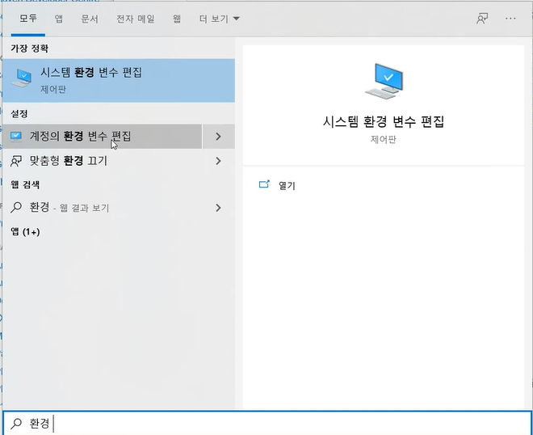
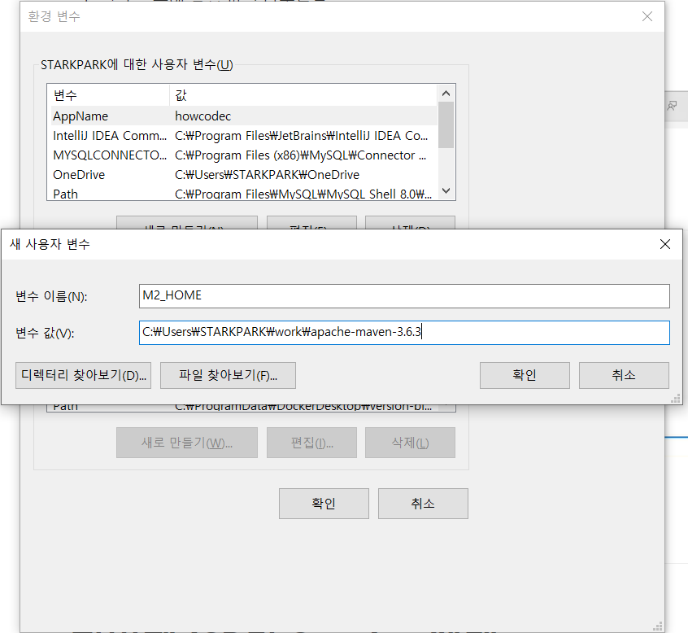
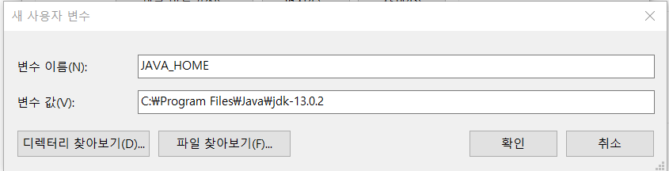
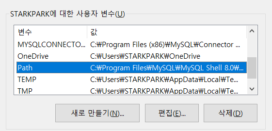
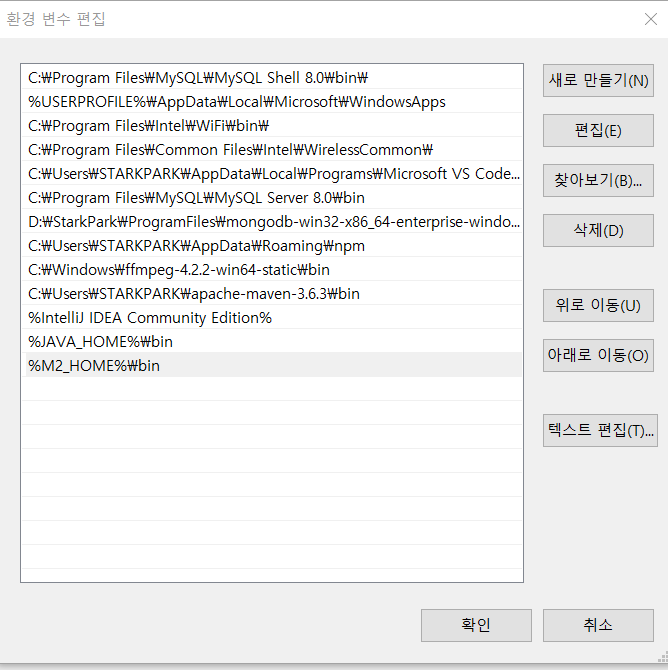
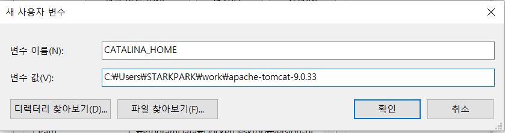
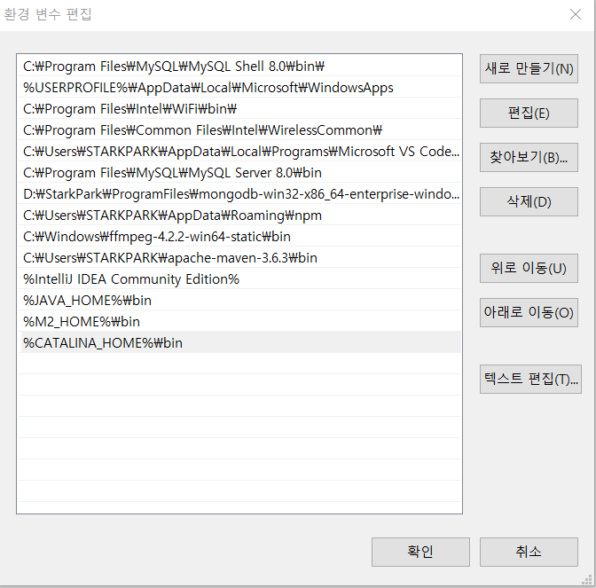
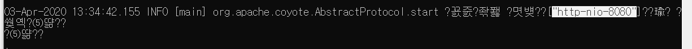
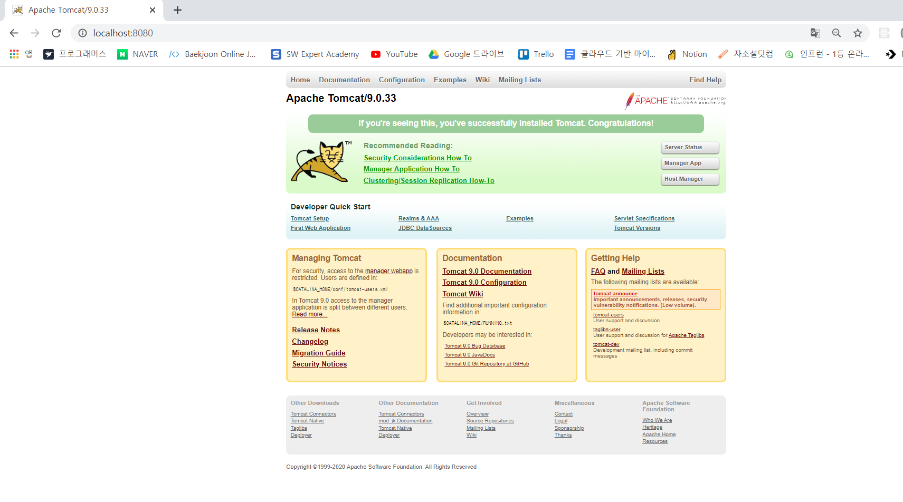

# Web Application 을 개발하기 위한 개발 환경 준비 


- **Java** 

  https://www.oracle.com/technetwork/java/javase/downloads/index.html

  

- **Maven** : 작성되어있는 웹 애플리케이션을 빌드하고 배포하기 위해 사용 

  https://maven.apache.org/download.cgi

  

- **IntelliJ**  

  https://www.jetbrains.com/idea

  

- **Tomcat** : 개발한 웹 애플리케이션은 Apache Tomcat 웹 서버에서 구동 .

  https://tomcat.apache.org/download-80.cgi


## 프로젝트 관리를 위한 Maven 도구 

- Apache software foundation 에서 개발한 Java 기반 프로젝트 관리 
- 프로젝트의 컴파일, 빌드, 수행 및 테스트 
- 서버 측 Deploy 자원과 라이브러리 관리 


### Maven 과 JDK 설치 및 환경 변수 설정 

1. 링크를 통해 Maven 알집 파일과 JDK 다운로드 

2. 원하는 디렉터리에 알집 압축 해제 

3. 환경 변수 설정 

   

   ​																				          ▼




5. JDK 가 설치된 작업 공간도 환경 변수에 추가 

   

   

6. Path 라는 환경 변수에 추가 시킨 환경 변수 등록 

   

   ​																				          ▼




7. 환경 변수 설정 확인 

   ```bash
   C:\Users\STARKPARK>java -version
   java version "1.8.0_191"
   Java(TM) SE Runtime Environment (build 1.8.0_191-b12)
   Java HotSpot(TM) 64-Bit Server VM (build 25.191-b12, mixed mode)
   ```

   ```bash
   C:\Users\STARKPARK>javac -version
   javac 13.0.2
   ```

   ```bash
   C:\Users\STARKPARK>mvn -version
   Apache Maven 3.6.3 (cecedd343002696d0abb50b32b541b8a6ba2883f)
   Maven home: C:\Users\STARKPARK\apache-maven-3.6.3\bin\..
   Java version: 13.0.2, vendor: Oracle Corporation, runtime: C:\Program Files\Java\jdk-13.0.2
   Default locale: ko_KR, platform encoding: MS949
   OS name: "windows 10", version: "10.0", arch: "amd64", family: "windows"
   ```

   

## IntelliJ IDEA 의 시작 

- IDE _ integrated Development Environment 
  - Net Beans 
  - Eclipse
  - IntelliJ IDEA


## Tomcat Server 


- Web Application Server 
  -  웹 애플리케이션과 서버 환경을 만들어 동작시키는 SW 
  - Apache Tomcat 
  - JBoss
  - Jetty
  - Netty


- 웹 애플리케이션 실행을 위한 Tomcat Server 


1. Tomcat 9 버전 알집파일 다운로드 

2. 환경 변수 설정

    

   

   ​                                                                                        ▼

   

   

3. Tomcat 서버 작동 확인 

윈도우 버전과 리눅스 버전 2가지가 같이 존재한다.  ( sh 파일과 bat 파일 2개 존재 )

```bash
C:\Users\STARKPARK>cd C:\Users\STARKPARK\work\apache-tomcat-9.0.33

C:\Users\STARKPARK\work\apache-tomcat-9.0.33>cd bin

C:\Users\STARKPARK\work\apache-tomcat-9.0.33\bin>dir/w
 C 드라이브의 볼륨에는 이름이 없습니다.
 볼륨 일련 번호: 20CD-DA16

 C:\Users\STARKPARK\work\apache-tomcat-9.0.33\bin 디렉터리

[.]                            [..]                           bootstrap.jar
catalina-tasks.xml             catalina.bat                   catalina.sh
ciphers.bat                    ciphers.sh                     commons-daemon-native.tar.gz
commons-daemon.jar             configtest.bat                 configtest.sh
daemon.sh                      digest.bat                     digest.sh
makebase.bat                   makebase.sh                    setclasspath.bat
setclasspath.sh                shutdown.bat                   shutdown.sh
startup.bat                    startup.sh                     tomcat-juli.jar
tomcat-native.tar.gz           tool-wrapper.bat               tool-wrapper.sh
version.bat                    version.sh
              27개 파일             834,276 바이트
               2개 디렉터리  26,377,039,872 바이트 남음

```

```bash
// bin 디렉터리 내부에서 
$ startup.bat
```



위와 같이 서버가 실행되면서 몇번 포트에 바인딩 되어있는지 정보를 확인할 수 있다.  ( 알 수 없는 문자는 인코딩 방식이 달라서 글자가 깨져서 발생하는 현상 같다. )




바인딩 된  포트 8080 으로 들어가보면 위와 같이 Tomcat 서버가 실행됨을 확인할 수 있다. 


