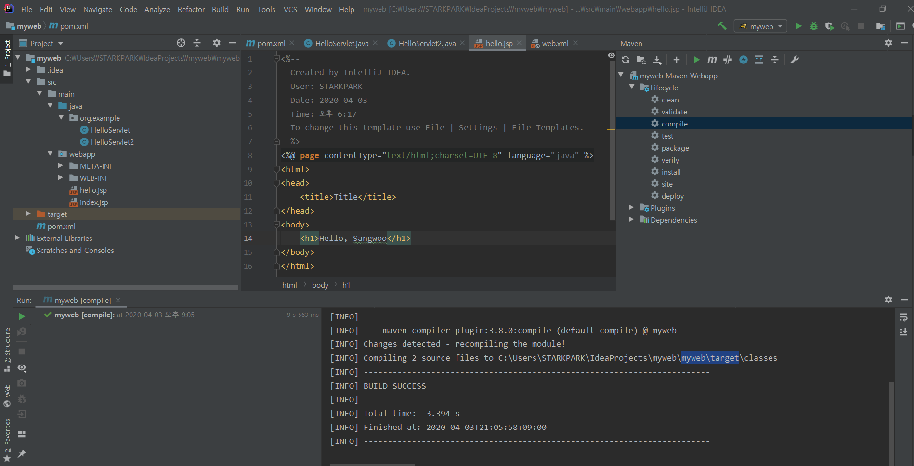
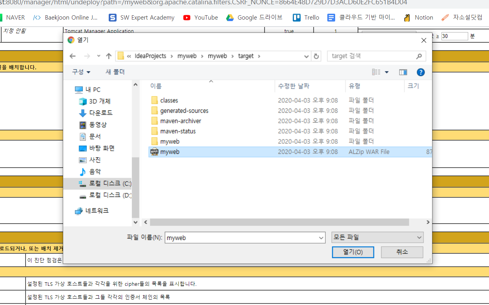

## 서버 개발 환경 


- **Local**  : 개발자 개인이 가지고 있는 환경 ( 개발자 PC 및 Test 환경 )

  

- **Dev** : 개발자 코드들을 하나로 합쳐서 서브 환경을 구축하는 것을 Dev 환경 

  

- **Integration** : Dev 환경의 서버가 여러개 있을 경우 이를 하나로 합해주는 환경. ( 존재하지 않을 수도 있다. )

  

- **QA** : QA 엔지니어들에 의해서 사용되는 테스트 환경 

  

- **Staging** : 운영환경과 거의 동일한 환경을 구축하고, 운영환경으로 이전하기 전 비기능적 테스트를 검증하는 단계 

  

- **Production** : 실제 서비스를 운영하는 단계 


위의 단계를 자동화 하기 위해서  CI/CD  사용. 


**운영환경** : 개발과 테스트가 완료된 프로그램을 서비스하기 위한 환경

**개발환경** : 실제 프로그램을 개발하는 환경으로, 구현과 배포, 테스트 , 형상관리 같은 것을 지원

효율적인 서버 개발을 하기위해서는 개발환경과 운영환경을 구분해서 나누는게 좋다. 


## Maven 빌드와 Tomcat Server 실행 


`compile` 

- 이전에 작업했던 myweb 디렉터리로 이동하여 `target` 디렉터리 삭제 이후 maven 빌드가 어떻게 target 디렉터리를 만드는지 확인하는 실습 
  - maven 의 compile 을 클릭하면 빌드하면서 삭제했던 target 디렉터리가 다시 생성된다. 




`clean` 

- target 폴더를 삭제하는 역할. 


`package` 

- 우리가 만든 프로젝트를 export 하는 작업 
-  compile 과 packaging , test 그리고 우리가 지정했던 폴더로 이동시키는 작업 모두 포함되어 있다. 

- war 파일이 생성되는 위치를 확인해라. 
- compile 옵션과 다른 점은 package 는 `war` 파일이 생성된다. 


- `war` 파일을 복사하여 Tomcat 서버가 설치된 위치로 이동 → `webapps` 폴더에 `war` 파일을 복사 

이후 Tomcat 서버 기동 ( `bin` → `startup.bat` 파일을 실행 )


## Tomcat manager 이용 


- 웹 브라우저에서 manager 를 이용하면 웹 애플리케이션을 배포하고 삭제하는 작업이 가능하다.  
- 이 작업을 하기위해서는 Tomcat 서버가 설치되어있는 경로의  `tomcat-users.xml` 파일에 설정작업을 해야한다. 


```bash
$ cd C:\Users\STARKPARK\work\apache-tomcat-9.0.33\conf
$ code tomecat-users.xml
```

```xml
// tomcat-users.xml 코드 수정 

<?xml version="1.0" encoding="UTF-8"?>
<!--
  Licensed to the Apache Software Foundation (ASF) under one or more
  contributor license agreements.  See the NOTICE file distributed with
  this work for additional information regarding copyright ownership.
  The ASF licenses this file to You under the Apache License, Version 2.0
  (the "License"); you may not use this file except in compliance with
  the License.  You may obtain a copy of the License at

      http://www.apache.org/licenses/LICENSE-2.0

  Unless required by applicable law or agreed to in writing, software
  distributed under the License is distributed on an "AS IS" BASIS,
  WITHOUT WARRANTIES OR CONDITIONS OF ANY KIND, either express or implied.
  See the License for the specific language governing permissions and
  limitations under the License.
-->
<tomcat-users xmlns="http://tomcat.apache.org/xml"
              xmlns:xsi="http://www.w3.org/2001/XMLSchema-instance"
              xsi:schemaLocation="http://tomcat.apache.org/xml tomcat-users.xsd"
              version="1.0">
<!--
  NOTE:  By default, no user is included in the "manager-gui" role required
  to operate the "/manager/html" web application.  If you wish to use this app,
  you must define such a user - the username and password are arbitrary. It is
  strongly recommended that you do NOT use one of the users in the commented out
  section below since they are intended for use with the examples web
  application.
-->
<!--
  NOTE:  The sample user and role entries below are intended for use with the
  examples web application. They are wrapped in a comment and thus are ignored
  when reading this file. If you wish to configure these users for use with the
  examples web application, do not forget to remove the <!.. ..> that surrounds
  them. You will also need to set the passwords to something appropriate.
-->

  <role rolename="manager"/>
  <role rolename="manager-gui"/>
  <role rolename="manager-script"/>
  <role rolename="manager-jmx"/>
  <role rolename="manager-status"/>
  <role rolename="admin"/>

  <user username="admin" password="tomcat" roles="manager, manager-gui, manager-script, manager-jmx, manager-status, admin"/>

</tomcat-users>
```

위의 완성된 코드를 저장한 이후 , 톰캣 서버를 재구동 


- manager 을 이용해서 war 파일을 삭제 


기존에 존재하는 `myweb.war` 파일을 삭제 ( `중지` -> `배치된 것을 제거`  클릭 )


- war 파일 배포 

하단의 배치 라는 메뉴에서 `war` 파일을 지정해서 열기 -> 배치 




삭제하고 배치할 경우 war 파일이 삭제되고 새롭게 생성됨을 확인할 수 있다. 