## Servlet 파일 생성 


1. `main ` -> `java` 디렉터리 생성 

2. `package` 생성 -> `HelloServlet.java` 파일 생성 

3. 마우스 오른쪽 클릭 -> `generate` -> `override Method` 

   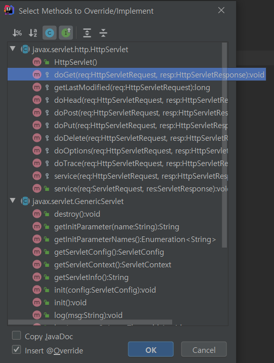

4. ```java
   // HelloServlet.java
   
   package org.example;
   
   import javax.servlet.ServletException;
   import javax.servlet.http.HttpServlet;
   import javax.servlet.http.HttpServletRequest;
   import javax.servlet.http.HttpServletResponse;
   import java.io.IOException;
   import java.io.PrintWriter;
   
   public class HelloServlet extends HttpServlet {
       @Override
       protected void doGet(HttpServletRequest req, HttpServletResponse resp) 
               throws ServletException, IOException {
           resp.setContentType("text/html;charset=UTF-8");
           PrintWriter out = resp.getWriter(); 
           out.println("Hello, there!!"); 
           out.close();
       }
   }
   ```

5. 모든 Servlet 클래스가 완성된다면, 본 프로젝트에서 Servlet 에서 사용하기 위해서는 `web.xml` 파일에 등록해야한다. 

   ```xml
   <!DOCTYPE web-app PUBLIC
    "-//Sun Microsystems, Inc.//DTD Web Application 2.3//EN"
    "http://java.sun.com/dtd/web-app_2_3.dtd" >
   
   <web-app>
     <display-name>Archetype Created Web Application</display-name>
     <servlet>
       <servlet-name>hello-servlet</servlet-name>
       <servlet-class>org.example.HelloServlet</servlet-class>
     </servlet>
     <servlet-mapping>
       <servlet-name>hello-servlet</servlet-name>
       <url-pattern>/HelloServlet</url-pattern>
     </servlet-mapping>
   </web-app>
   
   ```


위와 동일한 방식으로 Servlet 를 만들고 5번의 방식이 아닌 annotation 방식으로 웹 맵핑을 진행하는 방식 

4. ```java
   // HelloServlet2.java
   package org.example;
   
   import javax.servlet.ServletException;
   import javax.servlet.http.HttpServlet;
   import javax.servlet.http.HttpServletRequest;
   import javax.servlet.http.HttpServletResponse;
   import java.io.IOException;
   import java.io.PrintWriter;
   
   public class HelloServlet2 extends HttpServlet {
       @Override
       protected void doGet(HttpServletRequest req, HttpServletResponse resp)
               throws ServletException, IOException {
           resp.setContentType("text/html;charset=UTF-8");
           PrintWriter out = resp.getWriter();
           out.println("Hi, there!!");
           out.close();
       }
   }
   ```

5. ```java
   // HelloServlet2.java 코드 상단에 아래 코드 추가 
   import javax.servlet.annotation.WebServlet;
   
   @WebServlet("/HelloServlet2")
   ```

   

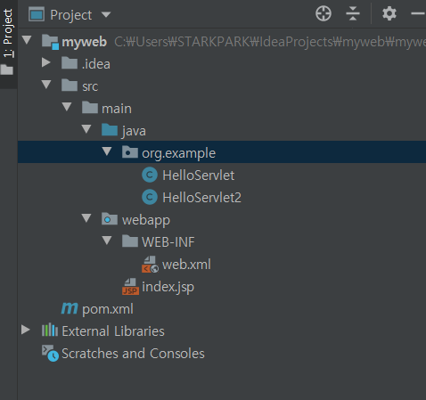


## Tomcat Server 등록 

- IntelliJ 에서 Tomcat Server 로 등록해서 바로 사용하는 실습 


우측 상단에 `Add Configuration` 클릭 

추가 버튼 클릭하여 Tomcat Server - local 클릭 

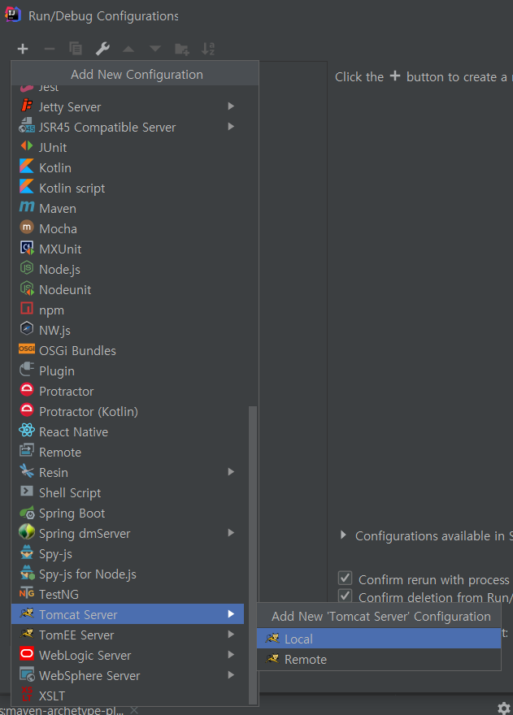


Tomcat 기본 서버는 8080 포트 번호를 사용한다.

VM options : 톰캣 서버를 구동하는데 필요한 자바 옵션을 지정할 수 있다. 

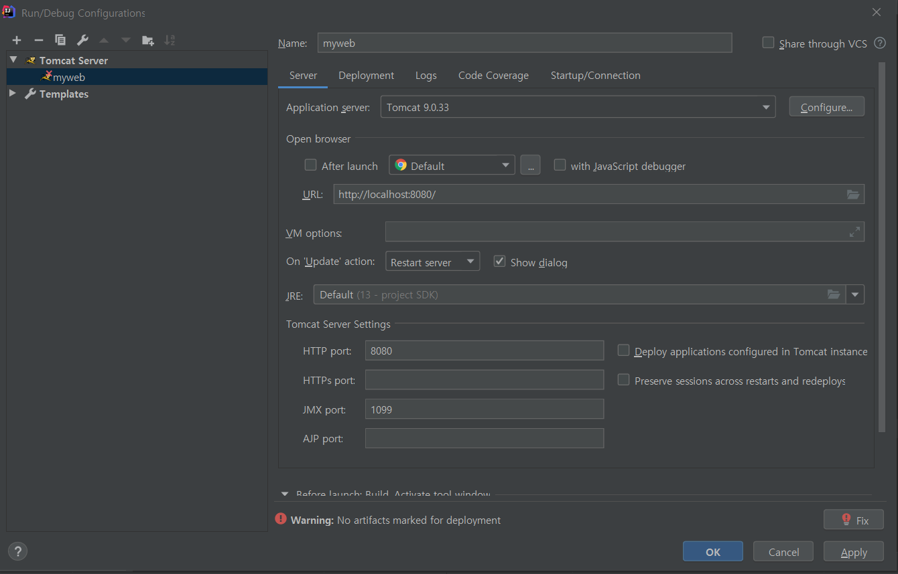

 

Warning 이 뜨는 이유는 Tomcat Server 와 작성한 myweb  이 연결되어있지 않기 때문이다. 


이를 연결하기 위해서는 우측 하단의 `Fix` 를 누르거나 상단 탭에 `Deployment` 를 눌러서 연결해야한다. 


Deployment 에서 `+` 버튼 클릭 -> `artifact` 클릭 

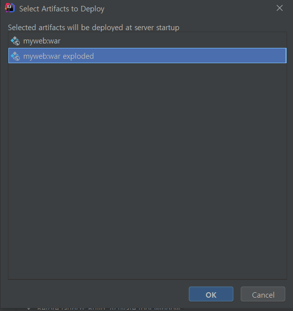


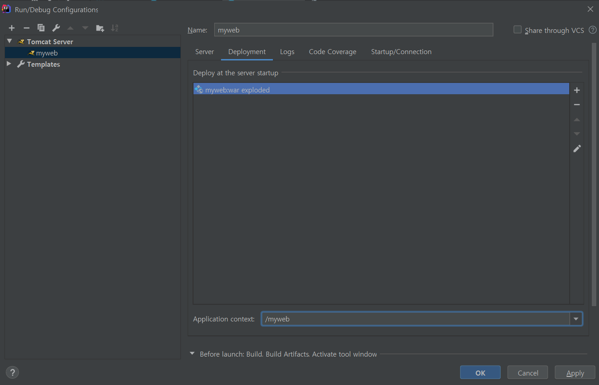

하나의 Tomcat server 에 여러개의 context 가 존재할 수 있다. 

만든 프로젝트에 접근하기 위해서 포트번호 뒤에 입력해야 하는 부분 : Application context 


컴파일을 진행하면 아래 하단에 Service 에서 Tomcat 서버가 구동됨을 확인할 수 있다. 

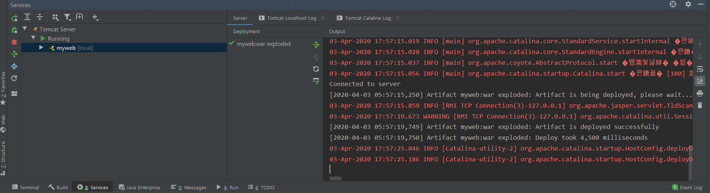


웹에서 실행한 결과 


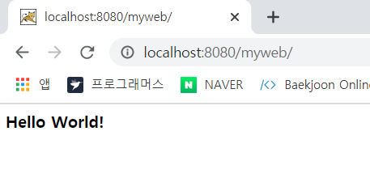

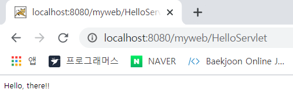


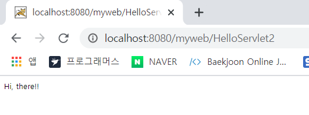


Servlet 코드를 수정한 이후에 반영하기 위해서는 서버를 다시 재 가동해야한다. 


- 아래와 같이 글자가 깨질 경우 Tomcat 서버 실행 시 글자가 깨지지 않도록 하기 위해 환경설정 추가 

  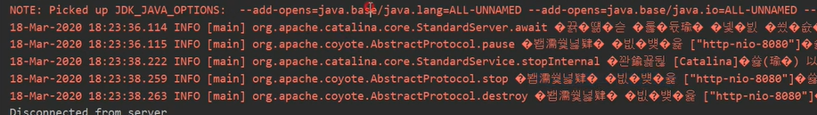

  VM Options 에 `-Duser.language=en -Duser.region=us` 추가 

  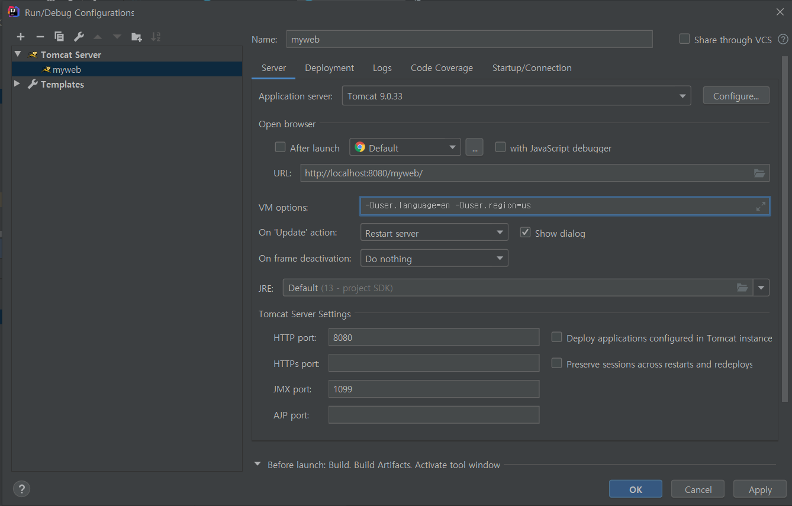

​                                                                                                        ▼

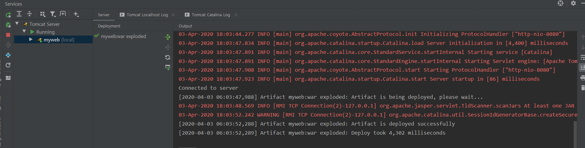


## JSP 파일 생성 


1. webapp 디렉터리 밑의 hello.jsp 파일 생성 

   ```jsp
   <%@ page contentType="text/html;charset=UTF-8" language="java" %>
   <html>
   <head>
       <title>Title</title>
   </head>
   <body>
       Hello, JSP
   </body>
   </html>
   ```

2. Tomcat 서버 실행해서 구동 되는지 확인 

   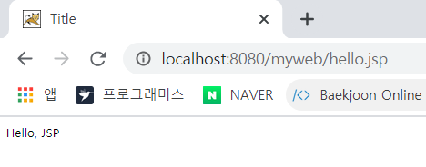

3. hello.jsp 코드 수정하고 웹 브라우저에서 새로고침을 눌러서 변경 되는지 확인 

   -> hello.jsp 파일이 변경되지 않고 그대로 남아있다. 


우리가 myweb 이 어떤 형태로 연결되어있는지에 따라 서버를 종료하고 보여줘야 하는지, 그냥 바로 보여줘야하는지 달라진다. 


현재 우리는 myweb:war , war 파일 형태  즉, 자바에서 패키징 되어있는 파일 형태로 Tomcat 서버에 등록되어있기 때문에  JSP 를 변경한다 하더라도 바로 보여지지 않는다. 

아래와 같이 폴더를 변경 . 

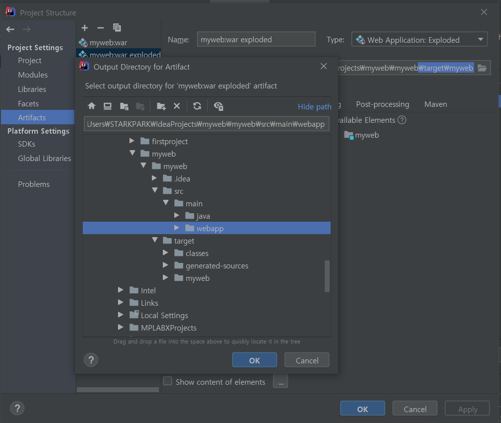


이후 적용 시키고 hello.jsp 파일의 코드를 변경하면 화면에 바로 반영된다. 