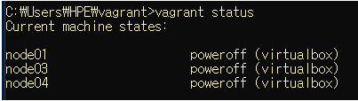
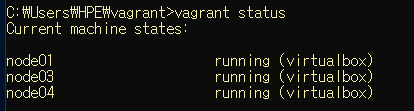
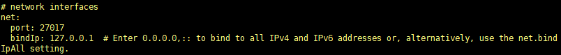
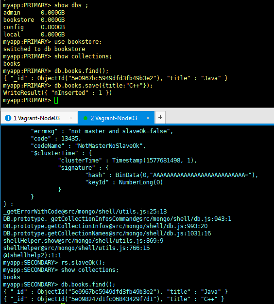

## Vagrant 실행하기 

``` bash
> vagrant status 
```



``` bash
> vagrant up 
```

``` bash
> vagrant status
```




## Vagrant 에 MongoDB 설치

패키지 업데이트 

```bash
$ sudo yum -y update 
```

#### MongoDB 4.0 저장소 메타 정보 생성 

``` bash
$ sudo touch /etc/yum.repos.d/mongodb-org.repo
```

```bash
$ sudo bash -c 'echo "[mongodb-org-4.0]" >> /etc/yum.repos.d/mongodb-org.repo'
```

``` bash
$ sudo bash -c 'echo "name=MongoDB Repository" >> /etc/yum.repos.d/mongodb-org.repo'
```

``` bash
$ sudo bash -c 'echo "baseurl=https://repo.mongodb.org/yum/redhat/7/mongodb-org/4.0/x86_64/" >> /etc/yum.repos.d/mongodb-org.repo'
```

``` bash
$ sudo bash -c 'echo "gpgcheck=1" >> /etc/yum.repos.d/mongodb-org.repo'
```

``` bash
$ sudo bash -c 'echo "enabled=1" >> /etc/yum.repos.d/mongodb-org.repo'
```

``` bash
$ sudo bash -c 'echo "gpgkey=https://www.mongodb.org/static/pgp/server-4.0.asc" >> /etc/yum.repos.d/mongodb-org.repo'
```


#### MongoDB 4.0 설치

```bash
$ sudo yum install -y mongodb-org
```

설치가 완료된 이후에 아래의 명령어를 입력하면 설치된 버전을 확인할 수 있다. 

``` bash
$ mongo

MongoDB shell version v4.0.14
```


#### 환경 설정

``` bash
$ sudo vi /etc/mongod.conf

net:
  port: 27017
  ### 내부망에 연결된 모든 노드로부터의 원격 접속을 허용
  ### 개발 및 테스트 환경에서만 사용, 운영 환경에서는 보안 문제로 비추천
  bindIp: 0.0.0.0
```


## Vagrant 에서 ReplicaSet 테스트

#### Vagrant 및 각각의 호스트 사전 작업 

기존의 `vagrantfile` 에서  각 노드마다 `private_network` 를 추가하고, `forwarded_port` 를 추가해준다. 

``` bash 
# Node01
....
cfg.vm.network "private_network", ip: "10.0.0.11"
....
cfg.vm.network "forwarded_port", guest: 27017, host: 27017
....
```

``` bash
# Node02
....
cfg.vm.network "private_network", ip: "10.0.0.12"
....
cfg.vm.network "forwarded_port", guest: 27017, host: 27018
....
```

``` bash
# Node03
....
cfg.vm.network "private_network", ip: "10.0.0.13"
....
cfg.vm.network "forwarded_port", guest: 27017, host: 27019
....
```


**Node01**  ->  10.0.0.11 ( 40001) 

**Node03**  ->  10.0.0.12 ( 40002) 

**Node04**  ->  10.0.0.13 ( 40003) 


**hostname** : 모든 pc 가 가지고 있는 고유 이름. 

`/etc/hostname` : 각각의 호스트ip 와 이름을 맵핑 시켜둔 파일   

``` bash
$ ping 10.0.0.12

PING 10.0.0.12 (10.0.0.12) 56(84) bytes of data.
64 bytes from 10.0.0.12: icmp_seq=1 ttl=64 time=0.324 ms
```

```bash
$ ping node03

ping: node03: Name or service not known
```

현재 node03 의 ip 주소로 핑을 보내면 전송이 됨을 확인. 그러나 node03 의 호스트 이름으로 핑을 보내면 전송이 안되는 것을 알 수 있다. 그 이유는` /etc/hosts` 파일에 등록이 안되어있기 때문이다.  따라서 ip 주소를 hostname 과 동일하게 이용하기위해서는 `/etc/hosts` 파일을 수정해야한다.

``` bash
$ sudo vi /etc/hosts

10.0.0.11       node01
10.0.0.12       node03
10.0.0.13       node04
```

위의 설정을 각 노드(node01, node02, node03) 마다 전부 수정해준다. 


#### 각각의 호스트에서 실행

``` bash
$ mkdir ./mongo/data
```

`mongo` 디렉터리와 그 안에 `data` 라는 디렉터리 생성. 

``` bash
$ mongod --dbpath ./mongo/data --port 40001 --replSet myapp --bind_ip_all
$ mongod --dbpath ./mongo/data --port 40002 --replSet myapp --bind_ip_all
```

서버를 실행하면서, 외부에 있는 ip 에서 접근하는 것을 허용하겠다는 명령어. 

``` bash
$ sudo vi /etc/mongod.conf
```



bind_ip_all 옵션이 설정 되었음을 위의 사진에서 확인할 수 있다. 


서버를 실행한 이후에 추가로 탭을 하나 더 열어서 **클라이언트 실행** 

```  bash
$ mongo --host 10.0.0.11 --port 40001
```

그리고 레플리카셋을 사용하기 위해 네트워크를 세팅 

```bash
$ rs.initiate(); 

{
	"info2" : "no configuration specified. Using a default configuration for the set",
	"me" : "node01:40001",
	"ok" : 1,
	"operationTime" : Timestamp(1577679136, 1),
	"$clusterTime" : {
		"clusterTime" : Timestamp(1577679136, 1),
		"signature" : {
			"hash" : BinData(0,"AAAAAAAAAAAAAAAAAAAAAAAAAAA="),
			"keyId" : NumberLong(0)
		}
	}
}
```

현재 rs.initate 한 곳 (Primary) 에서 rs.add 명령어를 이용하여 secondary 와 arbiter 를 추가한다.  

아래의 명령어를 실행하기 위해서는 **추가하려는 호스트에서 `mongod` 가 실행**되고 있어야한다. 

``` bash
$ rs.add("10.0.0.12:40002");

{
	"ok" : 1,
	"operationTime" : Timestamp(1577680739, 1),
	"$clusterTime" : {
		"clusterTime" : Timestamp(1577680739, 1),
		"signature" : {
			"hash" : BinData(0,"AAAAAAAAAAAAAAAAAAAAAAAAAAA="),
			"keyId" : NumberLong(0)
		}
	}
}

```

``` bash
$ rs.add("10.0.0.13:40003",{arbiteOnly:true});

{
	"ok" : 1,
	"operationTime" : Timestamp(1577680894, 1),
	"$clusterTime" : {
		"clusterTime" : Timestamp(1577680894, 1),
		"signature" : {
			"hash" : BinData(0,"AAAAAAAAAAAAAAAAAAAAAAAAAAA="),
			"keyId" : NumberLong(0)
		}
	}
}
```


이제 Primary 에서 추가한 데이터를 Secondary 에서 확인하기 위해서는 아래 명령어를 실행하면 확인할 수 있다. 


