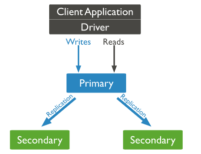
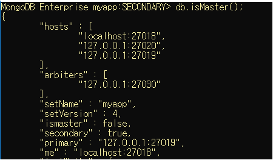
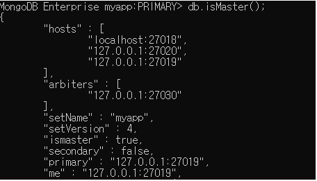
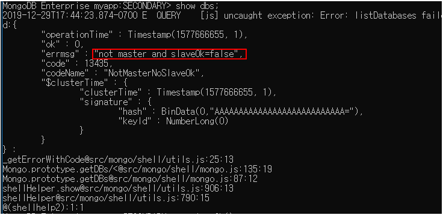
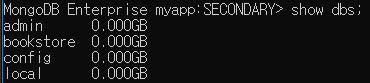
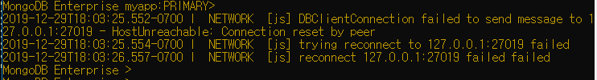
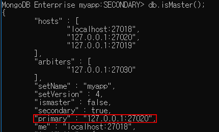
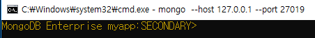

## ReplicaSet 복제


#### ReplicaSet 

- 빅데이터 환경에서 예기치 못한 시스템 장애로 인한 데이터의 유실을 막기 위한 백업 솔루션 중 하나로 안정성을 보장한다. 

- 여러 서버를 통한 데이터의 동기화를 진행하는 솔루션. 

  

  


##### Master & Slave 서버

- Master 서버 
  - 데이터를 저장하는 메인 서버 역할 
- Slave 서버
  - Master 서버와 동일한 구조를 가지고 있는 복제 서버. 


##### MongoDB 서버 4 개 실행 및 클라이언트 실행

``` bash
$ tree 
```

디렉터리 구조를 확인하는 명령어  


```bash
> mongod --dbpath .\data\node01 --port 27018 --replSet myapp 
> mongod --dbpath .\data\node02 --port 27019 --replSet myapp 
> mongod --dbpath .\data\node03 --port 27020 --replSet myapp 
> mongod --dbpath .\data\arbiter --port 27030 --replSet myapp 
```

4 개의 cmd 창에서 각 명령어들을 실행하여 4개의 서버를 동시 실행한다. 


``` bash 
> mongo --host 127.0.0.1 --port 27018
```

또 다른 cmd 창을 열어 `mongo` 를 입력하여 클라이언트를 실행한다. 

```bash
> db.isMaster(); 
```



위의 사진에서 2가지를 확인하라. `ismaster` 가 `true` 일 경우 `primary` 인 경우, 만약 `primary` 가 아닐 경우 `ismaster` 는 `false` 라고 나올것이다. 


##### Master 에서 작업 ( Primary )

```bash
> mongo --host 127.0.0.1 --port 27019
```

다른 cmd 창으로 node02 클라이언트로 접속. 그리고 아래 명령어를 실행하여 `ismaster` 을 확인. 

```bash 
> db.isMaster(); 
```




```bash
> show dbs; 
```

위의 명령어를 마스터에서 접근하면 데이터 

``` bash
> use bookstore; 

switched to db bookstore
```

bookstore 라는 명령어가 없을 경우 `bookstore` 라는 이름의 데이터 베이스 생성. 

``` json
> db.books.save( {title : "MongoDb basic"} );

WriteResult({ "nInserted" : 1 })
```

현재 저장하는 타입은 Json 타입으로 `key-value` 형식으로 저장. 

``` json
> show collections; 

books
```

현재 데이터베이스의 컬렉션 목록을 출력하는 명령어 

``` json
> db.books.find(); 

{ "_id" : ObjectId("5e094800417fed3adf102a6e"), "title" : "MongoDb basic" }
```

현재 컬렉션내의 값들을 출력하는 명령어


##### Slave 에서 작업  ( Secondary ) 

``` json
> show dbs; 
```

Slave 에서 command 를 실행할 수 있는 옵션이  false 이기 때문에 db 에 접근하기 위해서는 해당 옵션을 `true` 로 바꿔주어야한다. 



``` json
> rs.slaveOk(); 
```

Secondary 에서 슬레이브 역할로서 command 를 수행하겠다고 선언하는 명령어. ( 옵션을 `true` 로 바꿔주는 명령어)

command 를 실행할 수 있는 옵션을 true 로 선언한 이후에 `show dbs` 명령어를 수행하면 데이터 베이스에 접근하는 것을 확인할 수 있다. 




`Master` 에서 데이터를 추가하거나 삭제하면 `Slave` 쪽에서 데이터가 똑같이 추가되거나 삭제되는 것을 확인할 수 있다. 


##### Primary 서버를 강제로 종료하는 작업

primary 서버 ( port 27019 ) 의 cmd 창으로 이동하여 `Ctrl+C` 를 입력하여 서버를 강제로 종료한다. 

그렇다면 primary 에 접속해있던 클라이언트는 접속이 끊어지는 상태가 된다.




그리고 다른 `Secondary` 의 서버 중 하나가 `Primary` 가 된다. 



그리고 이후 종료되었던 서버 ( port 27019 ) 가 재실행된다하더라도 해당 서버는 `primary` 서버가 아닌 `secondary` 서버가 된다. 




##### ReplicaSet - 실습 시나리오

1. Primary, Secondary 동작 확인

   ```json
   > show dbs; 
   > use bookstore; 
   > db.books.find(); 
   ```

2. Primary 작동 중지

   `Ctrl+C` 또는 `db.shutdownServer()` 

3.  Secondary 중에서 Primary 로 승견 된 것 확인 

   - Secondary 중 하나의 노드에 접속

   - `db.isMaster()` 로 Master 가 누구인지 확인

4. 이전 Primary였던 Node 다시 실행 
   - `db.isMaster()` 에서 현재 상태 확인 
   - 기존에 primary 였어도 현재는 Secondary 

​     

​     


