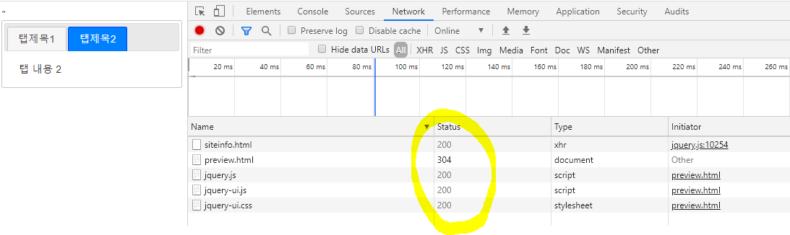
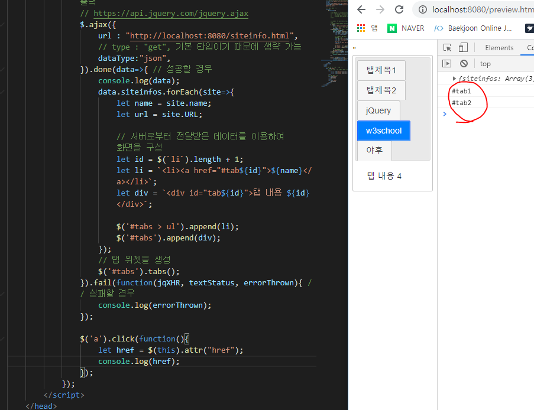
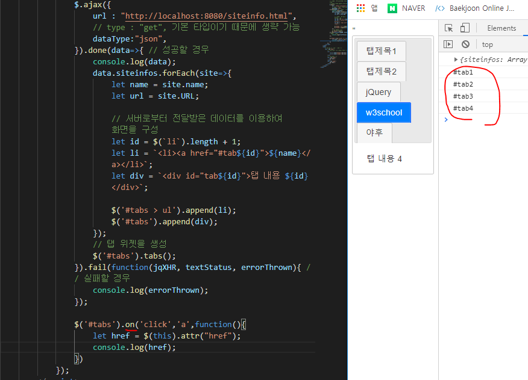

## LAB - 사이트 미리보기 제작

- LAB사이트 미리 보기를 제작

- jquery UI에서 제공하는 TAB 위젯을 이용
- 미리 보기 사이트 명과 주소(URL)은 ajax 통신으로 가져오기
- /preview.html ⇒ 미리 보기 사이트 
- /siteinfo.html ⇒ 미리 보기 사이트 명과 주소를 포함한 JSON 형식의 파일


- https://chrome.google.com/webstore/category/extensions?hl=koAllow CORS: Access-Control-Allow-Origin 확장 프로그램 설치


---


#### CORS 란 ? 


웹은 교차 자원 요청이 가능하다. 

기본적으로 다 짜집기해서 쓸 수 있지만 딱 한군데 ! 자바 스크립트를 이용하여 가져오는 자원은 쓸 수 없도록 막혀있다. 


자바스크립트를 이용하여 뭔가를 가져오는 것 ajax 통신으로, 


XMLHttpRequest --> XHR 


**SOP (same origin policy)** :  자바 스크립트 내에서 XHR 객체를 이용하여 다른 기원(origin) 의 자원의 사용을 막는 것. 브라우저에 적용되어있는 보안기술. 


SOP 를 완화해서 나온것 ==> CORS ( Cross Origin Resource Sharing ) - HTML5 스펙에서 새롭게 추가. 

가져오는 것을 막는것이 아니라, 가져온 자원을 사용하지 못하도록 막는 것. 


Access-Control-Allow-Origin 헤더에 어떠한 값을 준다 ( 대표적으로 * ) 

: 이 기원에 대해서 접근을 허용한다. --> 브라우저는 가져온 자원을 쓸 수 있는지 없는지 판단한 이후에 사용자에게 보여주거나 실행할 수 있다. 


#### siteinfo.html 파일 

json 형식으로 객체를 표현할 때 이름에 `따옴표`를 하지 않거나 , 맨 마지막에 `,` 를 찍을 경우에는 오류가 발생. 

```javascript
{		// 자바에서는 아래와 같이 따옴표 없어도 되고, 끝에 , 가 있어도 오류가 발생하지 않는다. 
    "siteinfos" : [
        { name : "jQuery", "URL" : "https://jquery.com/" }, 
        { name : "w3school", "URL" : "https://www.w3schools.com/" }, 
        { name : "야후", "URL" : "https://www.yahoo.com" },
    ]
}
```

```json
// 반면 JSON 형식으로 객체를 표현시에는 따옴표는 해야하고 끝에 , 는 없어야한다. 
{
    "siteinfos" : [
        { "name" : "jQuery", "URL" : "https://jquery.com/" }, 
        { "name" : "w3school", "URL" : "https://www.w3schools.com/" }, 
        { "name" : "야후", "URL" : "https://www.yahoo.com" }
    ]
}
```

JSON 문법 확인 --> JSON Validator 검색 ⇒ https://jsonformatter.curiousconcept.com/


`dataType:"json"` -> 서버가 준 데이터를 처리할 때 해당 데이터 타입으로 처리한다. 


- Network-Status




200 : 서버는 요청을 잘 처리했다는 것을 확인할 수 있다. 

400번대 : 브라우저에서 잘못 요청한것 . 

404 : 서버가 가지고 있지 않은 것을 달라고 하는 것이다 ( 대부분 URL 이 틀린 경우 )

500번대 : 만들어서 제공해주는 서버쪽 모듈을 봐야한다 ( 서버 문제 )


ajax 를 통해 가져온 정보를 이용하여 자바 스크립트를 이용해 동적으로 만든 것들은 이벤트 핸들링이 불가능하다. 



위의 그림에서 보면 새롭게 생성된 tab3,4,5 에 대해서는 이벤트 핸들링이 적용되지 않는것을 확인할 수 있다. 


새롭게 추가 되는 것에도 동일한 이벤트 핸들링이 적용되게 하기 위해서는 `on` 이라는 메소드를 이용해야한다.




- 실습 코드 ) 

  ```html
  <!DOCTYPE html>
  <html>
      <head>
          <!-- 필요한 JS 파일과 CSS 파일을 Import -->
          <script src="jquery-ui-1.12.1/external/jquery/jquery.js"></script>"
          <script src="jquery-ui-1.12.1/jquery-ui.js"></script>
          <link rel="stylesheet" href="jquery-ui-1.12.1/jquery-ui.css">
          
          <!-- 처리 기능 -->
          <script>
              $(function(){
  
                  // $('#tabs a').click(function(){
                  //     let divid = $(this).attr('href'); 
                  //     $('#tabs div').hide(); 
                  //     $('#tabs div'+divid).show(); 
                  // })
                  
  
                  // 서버로부터 미리보기 (이름, 주소) 정보를 가져와서 출력 
                  // https://api.jquery.com/jquery.ajax
                  $.ajax({
                      url : "http://localhost:8080/siteinfo.html",
                      // type : "get", 기본 타입이기 때문에 생략 가능 
                      dataType:"json",
                  }).done(data=>{ // 성공할 경우 
                      console.log(data);
                      data.siteinfos.forEach(site=>{
                          let name = site.name; 
                          let url = site.URL; 
  
                          // 서버로부터 전달받은 데이터를 이용하여 화면을 구성
                          let id = $(`li`).length + 1; 
                          let li = `<li><a href="#tab${id}" url="${url}">${name}</a></li>`; 
                          let div = `<div id="tab${id}">탭 내용 ${id}</div>`;
  
                          $('#tabs > ul').append(li);
                          $('#tabs').append(div);
                      });
                      // 탭 위젯을 생성 
                      $('#tabs').tabs(); 
                  }).fail(function(jqXHR, textStatus, errorThrown){ // 실패할 경우 
                      console.log(errorThrown);
                  });
  
                  $('#tabs').on('click','a',function(){
                      let href = $(this).attr("href");
                      let url = $(this).attr("url");
                      $(href).load(url);
                      console.log(url);
                  });
  
                 // $('a:first').trigger('click');
              });
          </script>
      </head>
      <body>
          <!--탭 UI 를 적용할 태그 -->
          <div  id="tabs">
              <!-- 탭 제목 - ul 태그를 이용 -->
              <ul>
              </ul>
              <!-- 탭 본문 -->
          </div>
      </body>
  </html>
  ```

  


---

### 문제 상황 및 해결 


