# jQuery


#### jQuery

- 모든 브라우저에서 동작하는 클라이언트 자바 스크립트 라이브러리 
- 무료로 사용가능한 오픈소스 라이브러리 
- 아래 기능을 위해 jQuery 가 제작됨
  - 문서 객체 모델(DOM)과 관련된 처리를 쉽게 구현 
  - 일관된 이벤트 연결을 쉽게 구현 ( 이벤트란 문서 내에서 발생하는 메시지나 행위. )
  - 시각적 효과를 쉽게 구현 -> style 이라는 것을 다뤄야한다. 
  - ajax 애플리케이션을 쉽게 개발 ( ajax 란 화면이 움직이는 것이 아니라 자바스크립트를 이용하여 서버쪽으로 요청하는 것. 서버쪽에서는 요청에 대한 응답을 자바스크립트 쪽에 주는데 데이터만 간다. 화면에 출력될 데이터만 서버에서 만들어서 준다. 그것을 가능케 하는것이 ajax . )
- 다운로드 -> https://jquery.com/download/


#### CDN ( Content Delivery Network )

- 콘텐츠를 효율적으로 전달하기 위해 전 세계 여러 지점의 서버에 파일을 저장해두고, 사용자와 가까운 지역에서 해당 파일을 제공해주는 네트워크 시스템을 의미. 

- Google CDN -> `3.snippet` 복사해서 코드에 붙여넣기. 아래와 같이 `network` 창에서 jquery 를 사용함을 확인할 수 있다 .

  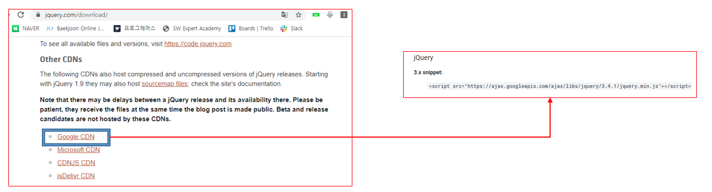

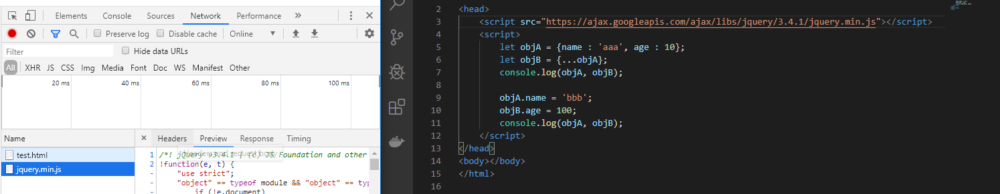


- 설치해서 사용 

```bash
C:\javascript> npm install jquery

npm notice created a lockfile as package-lock.json. You should commit this file.
npm WARN javascript@1.0.0 No description
npm WARN javascript@1.0.0 No repository field.

+ jquery@3.4.1
added 1 package from 1 contributor and audited 1 package in 0.781s
found 0 vulnerabilities
```

 소스코드에 추가

```bash 
<script src="/node_modules/jquery/dist/jquery.js"></script>	 
```

```javascript
<html>
<head>
    <script src="/node_modules/jquery/dist/jquery.js"></script>	 
    <script>
        // 문서가 준비되면 매개변수로 전달한 콜백함수를 실행하라는 의미.
        $(document).ready(function(){	
            console.log("Hello jQuery");
            $("body").text("Hello jQuery");	// body 태그에 text 를 출력하라. 
        });
    </script>
</head>
    <body>
    </body>
</html>
```

​																							▼

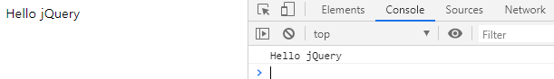

`$(document).ready(function(){ }` 와 `window.onload = function() { }`  는 유사한 기능. 

- jQuery 를 사용하는 다양한 방법. 

  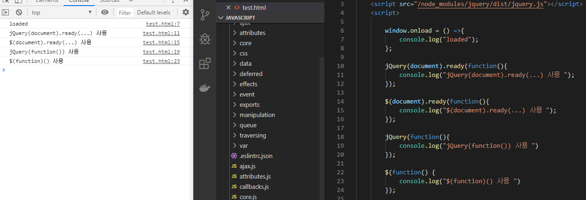

  ```javascript
  window.jQuery = window.$ = jQuery; 
  ```


- DOM 에서 특정 위치를 지정(선택) 하기 위한 방법 : selector ( 선택자 )

  -> selector 는 CSS 의 selector 와 유사하다. 

  

#### 선택자 ( selector )

  - **$("*")** : 전체 선택자, all selector  
    - HTML 내에 있는 모든 태그들을 다 가져오는 것. 

  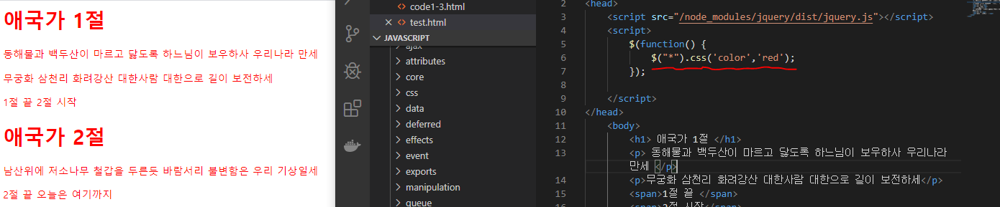


  - **$("body *")** :  후손 선택자 
    - body 태그 안에 있는 모든 태그들.

 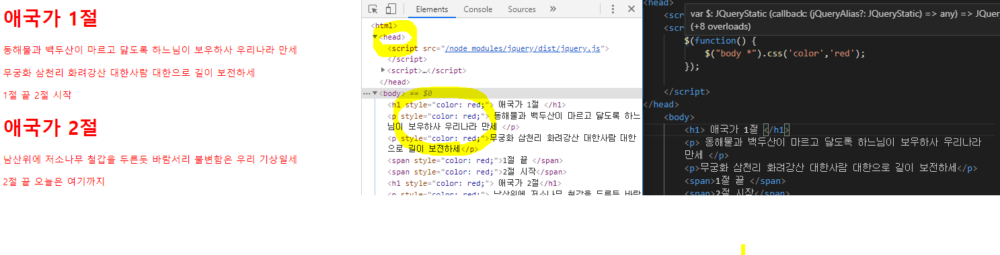

  - **$(".class")** : 클래스 선택자 


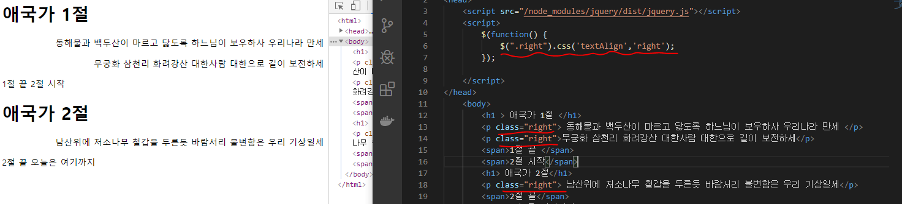

  - **$("#id")** : 아이디 선택자 
- id 는 해당 문서에서 **유일**해야한다.

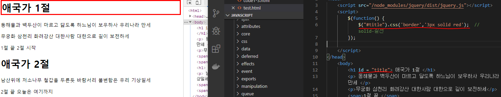

  

  - **$("element")** : 요소(태그, element ) 선택자

  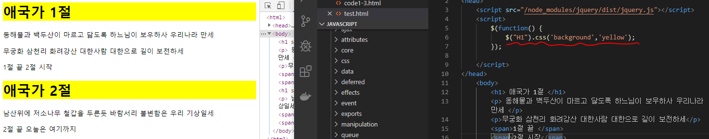

  

  - **$("selector1, selector2, ... , selectorN")** : 다중 선택자 (multiple selector)

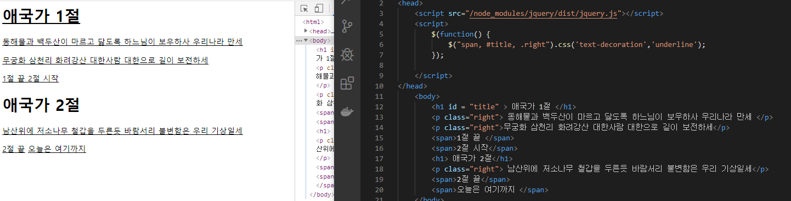


`<p></p>` 태그는 뒤에 공간이 남아도 다음 줄로 넘어가지만, 

`<span></span>` 태그는 뒤에 공간이 남으면 계속 이어서 쓴다. 

**block 요소** : 특별하게 지정하지 않으면 이 내용이 화면 전체에 다 안차더라도 다른 내용이 못 들어오도록 한다 ( 한 줄을 다 차지한다. )

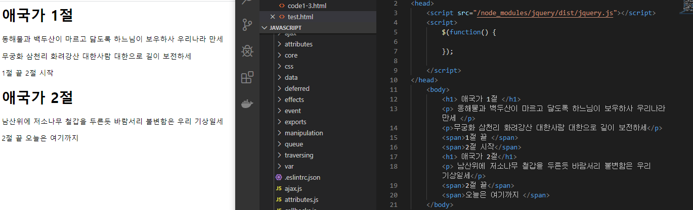


- jQuery 를 사용하지 않고 태그의 스타일 변경 

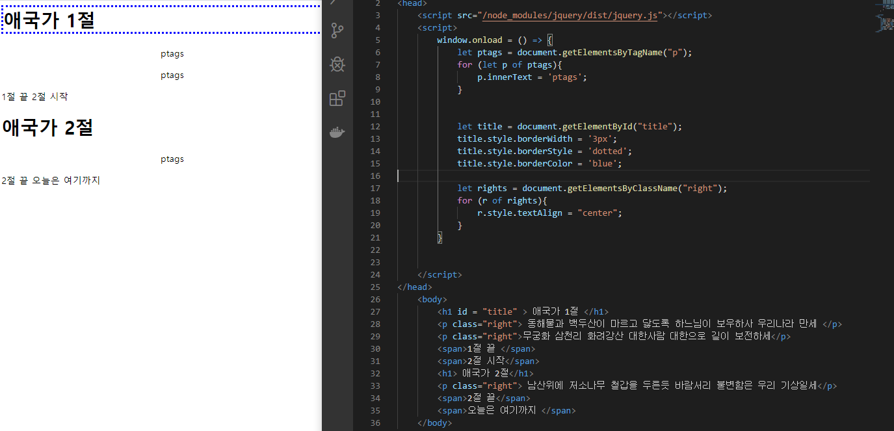


#### 자식 선택자, 후손 선택자

https://api.jquery.com/child-selector/


**자식 선택자** :  $("parent > child") - 부모 바로 밑에 있는 태그 선택 

**후손 선택자** : $("parent child") - 부모 밑에 있는 모든 태그 선택

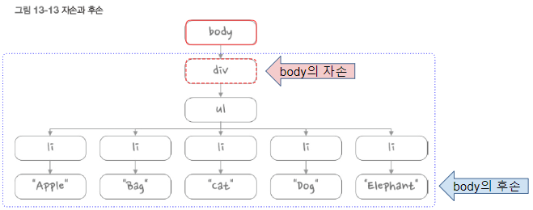

- body 밑에 있는 모든 태그들은 후손. 

- body 바로 밑에 있는 태그는 자식. 

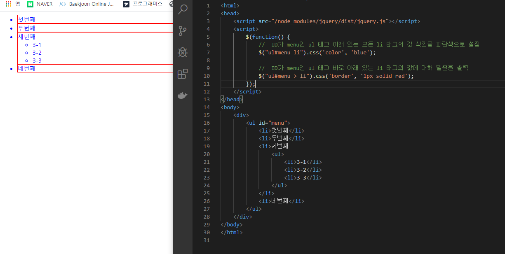


#### 속성 선택자

- `element이름[속성이름='속성값']`

- `<form>` 아래에서 사용하는 사용자 입력을 처리하는 태그를 제어할 때 사용한다. 

- <input type="text"> <input type="number"> <input type="radio"> ...

```html
**** html ****

<!--
	<태그명 속성명 = "속성값" 속성명="속성값">태그값</태그명>
	태그 -> element
	속성 -> attribute 
-->
```

https://api.jquery.com/category/selectors/attribute-selectors/

- E[A=V]  속성값이 같은 문서 객체 선택

- E[A!=V] 속성값이 다른 문서 객체 선택

- E[A~=V] 속성값에 단어가 포함된 객체를 선택    

- E[A^=V] 속성값이 글자로 시작하는 객체를 선택

- E[A$=V] 속성값이 글자로 끝나는 객체를 선택

- E[A*=V] 속성값에 글자를 포함한 객체를 선택


```html
<!DOCTYPE html>
<html>
<head>
    <script src="/node_modules/jquery/dist/jquery.js"></script>
    <script>
        $(function() {
            //  성, 이름 입력창에 OOO을 입력하세요. 문장을 추가
            //  $("#lastName").val('성을 입력하세요.');
            $('input[name="lastName"]').val("성을 입력하세요.");
            $('input[name="firstName"]').val("이름을 입력하세요.");

            //  파일 선택창을 제외하고 나머지 입력창에 대해서 (필수입력) 표시
            $('input[type!="file"]').prev().append("(필수입력)").css('color', 'red');

            //  name 속성에 pw이 포함된 것을 검색
            $('input[name~="pw"]').css('background', 'yellow');

            //  name 속성이 pw로 시작하는 입력창
            $('input[name^="pw"]').css('border', '3px dotted blue');

            //  name 속성이 Name으로 끝나는 입력창
            $('input[name$="Name"]').css('border', '3px solid black');

            //  type 속성에 o가 들어가 있는 입력창을 삭제
            //$('input[type*="o"]').hide();
        });
    </script>
</head>
<body>
<form action="#" method="get">
    <label>성</label>
    <input type="text" name="lastName" value=""><br>

    <label>이름</label>
    <input type="text" name="firstName"><br>
    
    <label>패스워드</label>
    <input type="password" name="pw"><br>
    
    <label>패스워드(확인)</label>
    <input type="password" name="pw2"><br>
    
    <label>결혼여부</label>
    <input type="radio" name="ismarried" value="Y"> 네
    <input type="radio" name="ismarried" value="N"> 아니오<br>
    
    <label>좋아하는 색깔</label>
    <input type="checkbox" name="color" value="red"> 빨강
    <input type="checkbox" name="color" value="blue"> 파랑
    <input type="checkbox" name="color" value="yellow"> 노랑<br>
    
    <label>사진</label>
    <input type="file" name="photo"><br>
    <input type="submit" value="전송">
</form>
</body>
</html>

```

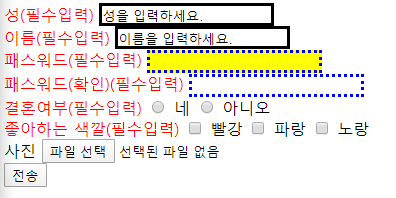


---

- **DOM ( Document Object Model )** 
  - 트리의 자료구조로 구성. 
  - 객체 지향 모델로서 구조화된 문서를 표현하는 방식 

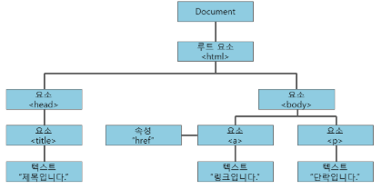