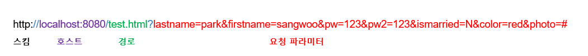

## jQuery

- HTML 문서를 구성하는 요소 - 태그와 속성


- radio 버튼은 배타적으로 선택 시 사용한다. 동시에 선택되는 경우에 radio 버튼을 쓰는 것은 안좋은 인터페이스
- 동시에 여러개를 선택할 때는 checkbox 를 사용한다. 
- password 는 일반 텍스트창과는 다르게 입력하는 값들이 마스킹되어 보여진다. 


- 서버쪽으로 값을 보낼 때 name 의 어떤 value  형태로 전송이 된다. 위의 예제에서 전송 버튼을 누르면 

  http://localhost:8080/test.html?lastname=park&firstname=sangwoo&pw=123&pw2=123&ismarried=N&color=red&photo=# 와 같이 입력한 값들이 서버로 전달됨을 URL에서 확인할 수 있습니다. 


- HTTP 프로토콜을 이용하여 서버에 무언가를 전달할 때 사용하는 방식 
  - **Get 방식** : 요청 파라미터를 URL 주소에 포함시켜서 전달하는 방식.  ( default 방식 )
    - URL 에 이어붙기 때문에 길이제한에 있어 많은 양의 데이터는 보내기 어렵다.
    - 가져오는 개념 . 서버에서 어떤 데이터를 가져와 보여주는 용도 ( 상태 변경 용도 x )
    - URL 에 데이터가 노출되어 보안에 취약하다. 
    - 캐싱할 수 있다 .

  
  - **POST방식** : form 을 이용하여 submit 하는 형태.
    - 데이터를 Body 에 포함시킨다. 
    - URL 에 데이터가 노출되지않아서 기본 보안은 되어있다. 
    - 많은 양의 정보를 보내기에 적합하다 ( 단 용량제한은 존재한다. )
    - 수행하는 개념 . 서버의 값이나 상태를 바꾸기 위해 사용. 

```html
<form action="#" method="get"></form> 		-> get 방식 
<form action="#" method="post"></form> 		-> post 방식
```


- jQuery 속성 선택자 

| 선택자 형태 | 설명                                     |
| ----------- | ---------------------------------------- |
| E[A=V]      | 속성과 값이 같은 문서 객체를 선택        |
| E[A!=V]     | 속성 값에 '단어'와 다른 문서 객체를 선택 |
| E[A~=V]     | 속성값에 '단어'를 포함하는 객체를 선택   |
| E[A^=V]     | 속성값이 '글자'로 시작하는 객체를 선택   |
| E[A$=V]     | 속성값이 '글자'로 끝나는 객체를 선택     |
| E[A*=V]     | 속성값에 '글자'를 포함한 객체를 선택     |


`padding` : 요소의 내부 공간으로서 내용과 테두리 사이의 여백을 의미. 

`margin` : 테두리와 테두리 사이의 공간으로 외부 여백. 


`each` : 여러개 중에서 순차적으로 가져와서 사용. 


#### 이벤트 

- `click()` : element 를 마우스 포인터로 눌렀다 떼었을 때 발생 . ( ) 안에 이벤트 발생시 실행할 함수를 정의


- **실습 )** div 박스를 클릭하면 동일한 data가 있으면 다른 class 의 박스를 숨기기 ( hide ) 없으면 다른 class 의 박스를 보임 (show)

  ```html
  <!DOCTYPE html>
  <html>
  <head>
      <script src="/node_modules/jquery/dist/jquery.js"></script>
      <script>
          $(function() {
              // div 박스를 클릭하면 동일한 data가 
              // 있으면 다른 class 의 박스를 숨기기 ( hide )
              // 없으면 다른 class 의 박스를 보임 (show)
              $('div').click(function() {
                  let cls = $(this).attr('class');
                  let val = $(this).attr('value');
  
                  // 현재 클릭된 div 와 value가 같고 class가 다른 div 를 선택. 
                  let div = $('div[value="'+val+'"][class!="'+cls+'"]');
  
                  // if(div.is(':visible')){
                  //     div.hide();
                  // } else{
                  //     div.show();
                  // }
                  div.toggle();
              });
          });
      </script>
      <style>
          div {
              border: 1px solid black;
              padding: 10px;
              margin: 10px 20px;
              width: auto;
              height: auto;
              font-size: 30px;
              float: left;
          }
      </style>
  </head>
  <body>
      <div class="no" value="1">1</div>
      <div class="no" value="2">2</div>
      <div class="no" value="3">3</div>
      <div class="no" value="4">4</div>
  
      <div class="ch" value="1">one</div>
      <div class="ch" value="2">two</div>
      <div class="ch" value="3">three</div>
      <div class="ch" value="4">four</div>
  </body>
  </html>
  
  ```

  `$().is(':visible')` : 보일 경우 반환값은 true, 보이지 않으면 반환값은 false. 

  `toggle()` : 보였다 안보였다 반전시키는 역할. 

- **실습)** 숫자를 선택하면 그 숫자의 구구단을 출력해라 

  ```html
  <!DOCTYPE html>
  <html>
  <head>
      <script src="/node_modules/jquery/dist/jquery.js"></script>
      <script>
          $(function() {
              $('select').change(function(){
                  $('div').empty();
                  let num = $(this).val();
                  if(num == "")	return; 
                  for(let i=1; i<=9; i++)
                      $('div').append(`${num} x ${i} = ${i*num}<br>`);
                  
              });
          });
      </script>
      <style>
      </style>
  </head>
  <body>
      <select>
          <option value=""> 선택하세요. </option>
          <option value="1">1</option>
          <option value="2">2</option>
          <option value="3">3</option>
          <option value="4">4</option>
          <option value="5">5</option>
          <option value="6">6</option>
          <option value="7">7</option>
          <option value="8">8</option>
          <option value="9">9</option>
      </select>
      <div>
  
      </div>
  </body>
  </html>
  
  ```

   														실행결과 :      

- **실습 )**  홀수번째 red, 짝수번째 : blue, 첫번째 : yellow. 마지막 : green

  ```html
  <!DOCTYPE html>
  <html>
  <head>
      <script src="/node_modules/jquery/dist/jquery.js"></script>
      <script>
          $(function() {
              // p430
              // 홀수번째 : red 
              // 짝수번쨰 : blue 
              // 첫번째 : yellow
              // 마지막 : green 
              $('div:even').css('background','blue');
              $('div:odd').css('background','red');
              $('div:first').css('background','yellow');
              $('div:last').css('background','green');
          });
      </script>
      <style>
          div{
              width:100px; 
              height:100px; 
              border: 1px solid blue; 
              float:left; 
              margin:20px;   
          }
      </style>
  </head>
  <body>
      <div></div>
      <div></div>
      <div></div>
      <div></div>
  </body>
  </html>
  ```

  ​				실행결과   :     

- **실습)**   위의 실습에서 추가적으로 div 태그 내부에 마우스가 들어가면 배경색을 검정색으로 빠져나오면 원래 색으로 변경 

  ```html
  <!DOCTYPE html>
  <html>
  <head>
      <script src="/node_modules/jquery/dist/jquery.js"></script>
      <script>
          $(function() {
              $('div:even').css('background','blue');
              $('div:odd').css('background','red');
              $('div:first').css('background','yellow');
              $('div:last').css('background','green');
  
              let orgColor; 
              $('div').mouseover(function(){
                  orgColor = $(this).css('background');
                  $(this).css('background','black');
              })
              .mouseleave(function(){
                  $(this).css('background',orgColor)
              });
          });
      </script>
      <style>
          div{
              width:100px; 
              height:100px; 
              border: 1px solid blue; 
              float:left; 
              margin:20px;   
          }
      </style>
  </head>
  <body>
      <div></div>
      <div></div>
      <div></div>
      <div></div>
  </body>
  </html>
  
  ```

  ​									실행결과 : 

---

### jQuery UI

- 일반적으로 웹 사이트를 만들 때 사용되는 UI 기능들을 쉽게 만들 수 있도록 제공해준다. 

- https://jqueryui.com/

- jQuery ui 설치 .

  ```bash
  C:\javascript>npm install jquery-ui
  
  npm WARN javascript@1.0.0 No description
  npm WARN javascript@1.0.0 No repository field.
  
  + jquery-ui@1.12.1
  added 1 package from 1 contributor and audited 2 packages in 1.866s
  found 0 vulnerabilities
  ```

- jQuery ui-css 설치 

  ```bash
  C:\javascript>npm install jquery-ui-css
  npm WARN javascript@1.0.0 No description
  npm WARN javascript@1.0.0 No repository field.
  
  + jquery-ui-css@1.11.5
  added 1 package from 1 contributor and audited 3 packages in 0.544s
  found 0 vulnerabilities
  ```


- **사용방법** - selector 에서 jquery-ui 에서 제공하는 메소드를 이용하면 된다. 


-  **테마 **: 스타일을 별도로 뽑아서 사용자 환경에 맞춰주는 것. 

- **UI 테마를 적용** (https://jqueryui.com/themeroller/)

  갤러리 -> 원하는 테마를 선택해서 다운로드 -> 다운 받은 디렉터리를 자바스크립트 밑의 디렉터리로 이동 -> code 에서 `link` 와 `script` 를 변경해서 사용. 


- 포커스는 윈도우 전체에서 단 한곳만 입력받을 수 있다. 


- **toast-plugin** 설치.

  ```bash
  C:\javascript>npm install jquery-toast-plugin
  npm WARN javascript@1.0.0 No description
  npm WARN javascript@1.0.0 No repository field.
  
  + jquery-toast-plugin@1.3.2
  added 1 package and audited 4 packages in 0.572s
  found 0 vulnerabilities
  ```

- 설치 이후 `script` 와 `link` 를 추가해준다. 


- **실습 )**

  ```html
  <!DOCTYPE html>
  <html>
  <head>
      <link rel="stylesheet" href="/jquery-ui-1.12.1/jquery-ui.css">
      <link rel="stylesheet" href="/jquery-ui-1.12.1/jquery-ui.theme.css">
      <script src="/jquery-ui-1.12.1/external/jquery/jquery.js"></script>
      <script src="/jquery-ui-1.12.1/jquery-ui.js"></script>
      <script src="/node_modules/jquery-toast-plugin/dist/jquery.toast.min.js"></script>
      <link rel="stylesheet" href="node_modules/jquery-toast-plugin/dist/jquery.toast.min.css">
      <script>
          $(function(){
              $("#tabs").tabs();
  
              $('input[name="userid"]').focusout(function(){
                  if($(this).val() == "") 
                      //$("#dialog").dialog();
                      $.toast({
                          text: "아이디를 입력하세요. ",
                          sohwHideTransition : 'fade',
                          bgColor : '#E01A31'
                      });
              });
          });
      </script>
      <style>
      </style>
  </head>
  <body>
      <div id="tabs">
          <ul>
            <li><a href="#matzip">맛집예약</a></li>
            <li><a href="#hospital">병원예약</a></li>
            <li><a href="#car">공유자동차예약</a></li>
          </ul>
          <div id="matzip">
            <p>맛집 예약과 관련한 컨텐츠</p>
          </div>
          <div id="hospital">
            <p>병원 예약과 관련한 컨텐츠</p>
          </div>
          <div id="car">
            <p>공유자동차 예약과 관련한 컨텐츠</p>
          </div>
      </div>
  
      <input type="text" name="userid" />
  
      <div id="dialog" title="알림">
          <p>아이디 중복 여부를 체크하지 않았습니다.</p>
      </div>
  </body>
  </html>
  ```

  


- **jquery-colorbox** 설치. 

  ```bash
  C:\javascript>npm install jquery-colorbox
  npm WARN javascript@1.0.0 No description
  npm WARN javascript@1.0.0 No repository field.
  
  + jquery-colorbox@1.6.4
  added 1 package from 1 contributor and audited 6 packages in 0.961s
  found 0 vulnerabilities
  ```

- **실습)**

  ```html
  <!DOCTYPE html>
  <html>
  <head>
      <link rel="stylesheet" href="/jquery-ui-1.12.1/jquery-ui.css">
      <script src="/jquery-ui-1.12.1/external/jquery/jquery.js"></script>
      <script src="/jquery-ui-1.12.1/jquery-ui.js"></script>
      
      <script src="/node_modules/jquery-colorbox/jquery.colorbox.js"></script>
      <link rel="stylesheet" href="/node_modules/jquery-colorbox/example1/colorbox.css">
  
      <script>
          $(function() {
              $('a').colorbox();
          });
      </script>
      <style>        
      </style>
  </head>
  <body>    
      <a href="node_modules/jquery-colorbox/content/daisy.jpg">데이지</a>
      <a href="node_modules/jquery-colorbox/content/homer.jpg">호머</a>
  </body>
  </html>
  ```

---

### Ajax 통신

Ajax 를 사용하면 페이지를 전환하지 않고 서버에서 데이터를 받아와 사용자에게 보여줄 수 있습니다. 


- 기존의 방식 
  - 브라우저에서 링크를 누르거나 주소를 치면 서버에서는 새로운 문서 전체를 보내준다. 
  - 페이지를 나눠서 보여주는 방식
- Ajax 방식 
  - 기존화면이 유지되면서 새로운 것들을 서버로 받아오는 방법. 사용자가 보는 화면은 계속 유지가 되며, 필요하다면 서버에서 필요한 것들을 받아와 보여주는 형식. 


#### 데이터 전송 형식 

- **CSV ( Comma Separated Values )**   
  - 데이터를 , 를 찍어서 구분한다. 
  - 데이터의 의미를 구분하기 힘들다
  - 콤마가 한 번 깨질경우 전체 데이터가 다 깨진다. 
- **XML 형식**
  - HTML 형식처럼 태그로 데이터를 표현하는 방법. 
  - 수식어를 넣을 경우 매우 복잡해보인다. 
  - 닫는 태그와 여는 태그 등 쓸데없이 용량을 차지하는 문제가 있다. 
- **JSON (JavaScript Object Notation )**
  - 객체 형태로 데이터를 표현하는 방법. 
  - 기존의 XML 의 장점을 그대로 유지. 
  - JSON 에는 객체, 배열, 문자열, 숫자, 불, null 만 들어갈 수 있다
  - 문자열은 무조건 큰 따옴표를 사용해야한다. 
  - 데이터의 양이 많을 경우 데이터 추출 속도가 현저히 떨어진다. -> 데이터의 양이 많을 경우 CSV 형식 추천 


- **Ajax 통신 실습 )**

  `test.html 파일 내용 `

  ```html
  <!DOCTYPE html>
  <html>
  <head>
      <script src="/node_modules/jquery/dist/jquery.js"></script>
      <script>
          $(function() {
              $('button').click(function() {
                  $.ajax({
                      url: "http://localhost:8080/students.json", 
                      type: "GET", 
                      dataType: "json"
                  })
                  .done(function(res) {
                      res.students.forEach(student => {
                          let x = `
                              <tr>
                                  <td>${student.name}</td>
                                  <td>${student.age}</td>
                                  <td>${student.score}</td>
                              </tr>
                          `;
                          $('table').html($('table').html() + x);
                      });
                  });
              });
          });
      </script>
  </head>
  <body>    
      <button>가져오기</button>
      <table border="1"></table>   
  </body>
  </html>
  ```

  `students.json` 파일 내용

  ```json
  {
      "students":
      [
          {"name" : "홍길동", "age" : 23, "score" : "B+" },
          {"name" : "박상우", "age" : 32, "score" : "A+" },
          {"name" : "고구마", "age" : 12, "score" : "C+" },
          {"name" : "감자깡", "age" : 11, "score" : "B+" }
      ]
  }
  ```

  ​															실행결과 : 

  가져오기 버튼을 누를 경우 비동기적으로 데이터를 가져와 갱신한다. 

  


---

GET 방식과 POST 방식의 차이. 

퍼머링크란. (고유링크)

​	특정 페이지의 고유한 URL 주소. 

p441. jQuery 충돌방지 