## 1.4 CSS 작성 방법 결정하기 

리액트로 프로그래밍을 할 때는 컴포넌트를 중식으로 생각하는 게 좋다. 

UI 는 컴포넌트의 조합으로 표현되며, 컴포넌트 하나를 잘 만들어서 여러 곳에 재 사용하는게 좋다. 

그러기 위해서는 컴포넌트는 서로 간의 의존성을 최소화하면서 내부적으로는 응집도를 높여야한다. 

응집도가 높은 컴포넌트를 작성하기 위해서는 CSS 코드도 컴포넌트 내부에서 관리하는게 좋다. 


### 1.4.1 일반적인 CSS 파일로 작성 

```jsx
// button1.js
import React from 'react';
import './Button1.css';

const Button1 = ({size}) => {
    if(size === 'big'){
        return <button className = "button big"> 큰 버튼 </button>
    }else {
        return <button  className = "button small"> 작은 버튼 </button>
    }
};

export default Button1; 
```

```css
// button1.css
.big{
    width : 100px; 
}

.small {
    width : 50px; 
}

.box {
    height : 30px; 
    background-color : #aaaaaa; 
}
```

```jsx
// box1.js
import React from 'react';
import './Box1.css';

const Box1 = ({size}) => {
    if(size === 'big'){
        return <button className = "button big"> 큰 박스 </button>
    }else {
        return <button  className = "button small"> 작은 박스 </button>
    }
};

export default Box1;
```

```css
// box1.css
.big{
    width : 200px; 
}

.small {
    width : 100px; 
}

.box {
    height : 50px; 
    background-color : #aaaaaa; 
}
```

```jsx
// app.js
import React, { Component } from 'react';
import Button from './Button1'; 
import Box from './Box1';

class App extends Component {
  render() {
    return (
      <div>
        <Button size= "big" />
        <Button size = "small" />
        <Box size = "big" />
        <Box size = "small" />
      </div>
    );
  }
}
export default App;       
```


위의 코드의 실행 결과를 보면 버튼의 너비가 이상함을 알 수 있다. ( 박스의 스타일이 버튼의 스타일을 덮어 쓴다. )

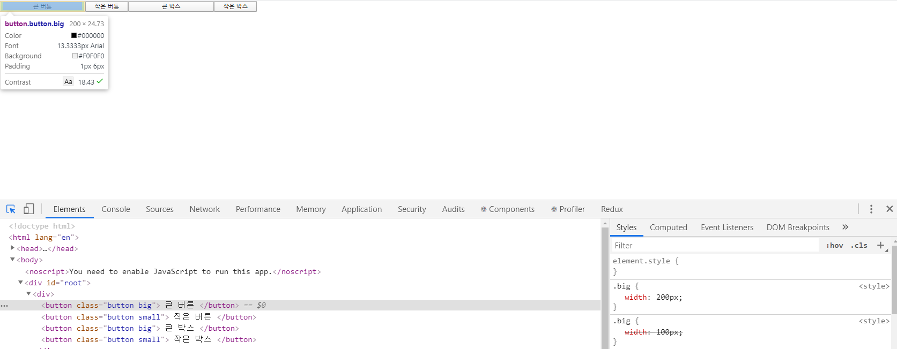


위의 그림처럼 일반적인 CSS 파일에서는 클래스명이 충돌할 수 있다는 단점이 있다. 


### 1.4.2 css-module 로 작성하기 

css-module 을 사용하면 일반적인 CSS 파일에서 클래스명이 충돌하는 단점을 극복할 수 있다. 

css-module은 간결한 클래스명을 이용해서 컴포넌트 단위로 스타일을 적용할 때 좋다. 

**작성 권장** :  `{이름}.module.css` 

```jsx
// Button2.js
import React from 'react';
import style from './Button2.module.css'; 

const Button2 = ({size}) => {
    if(size === 'big'){
        return <button className={`${style.button} ${style.big}`}>큰 버튼 </button>
    }else {
        return <button className={`${style.button} ${style.small}`}>작은 버튼 </button>
    }
};

export default Button2;
console.log(style); 
```

```css
// Button2.module.css
.big{
    width : 100px; 
}

.small {
    width : 50px; 
}

.button {
    height : 30px; 
    background-color : #aaaaaa; 
}
```

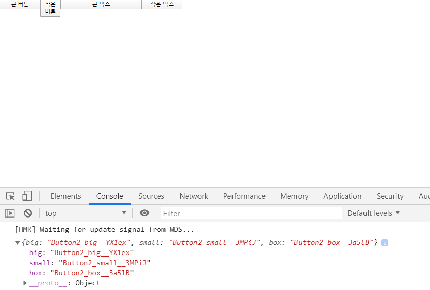

각 클래스명에 고유한 해시값이 들어있다. ( 클래스명에 해시값이 포함되어있기 때문에 다른 CSS 파일에서 같은 이름의 클래스명을 사용하더라도 이름 충돌은 발생하지 않는다. )


위의 코드는 className 에 속성값을 입력하는 코드가 번거롭기도 하고 가독성도 좋지 않다 -> `classnames` 패키지를 이용하면 코드를 개선할 수 있다. 

```bash
> npm install classnames 
```

```jsx
// Box2.js 
import React from 'react';
import style from './Box2.module.css';
import cn from 'classnames';

const Box2 = ({size}) => {
    const isBig = size ==='big'; 
    const label = isBig ? '큰 박스' : '작은 박스'; 
    
    return (
        <div className = {cn(style.box, {[style.big]: isBig, [style.small] : !isBig})}>
            {label}
        </div>
    )
};

export default Box2;
```

cn  함수의 인수로 객체를 사용하면 조건부로 클래스 명을 입력할 수 있다. 


### 1.4.3 Sass 로 작성하기 

Sass는 별도의 문법을 이용해서 생산성이 높은 스타일 코드를 작성할 수 있게 도와준다. 

Sass 문법에 있는 변수 , 믹스인 등의 개념을 이용하면 스타일 코드를 재사용할 수 있다. 

```css
$sizeNormal : 100px; 

.box{
    width : $sizeNormal; 
    height : 80px; 
}
.button{
    width : $sizeNormal;
    height : 50px; 
}
```

일반적인 프로그래밍 언어처럼 변수를 정의할 수 있으며, 이를 이용하여 코드 중복을 없앨 수 있다. 

Sass 문법으로 작성한 파일은 별도의 빌드 단계를 거쳐서 CSS 파일로 변환된다. 

`create-react-app` 에서 `Saas` 를 사용하고 싶다면 아래 패키지를 설치해야한다. 

```bash
> npm install node-sass 
```

Button2.module.css, Button2.js 파일 복사 => Button3.module.scss, Button3.js 파일 생성

Button3.js 파일에서 Button2.module.css 파일 가져오는 부분을 Button3.module.scss 파일로 변경

```scss
// shared.scss 파일 
$infoColor : #aaaaaa;
```

```scss
// Button3.module.scss
@import './shared.scss';

.big {
    width: 100px;
}
.small {
    width: 50px;
}
.button {
    height: 30px;
    background-color: $infoColor;
}
```

```scss
// Box3.module.scss
@import './shared.scss';

.big {
    width: 200px;
}
.small {
    width: 100px;
}
.box {
    height: 50px;
    background-color: $infoColor;
}
```

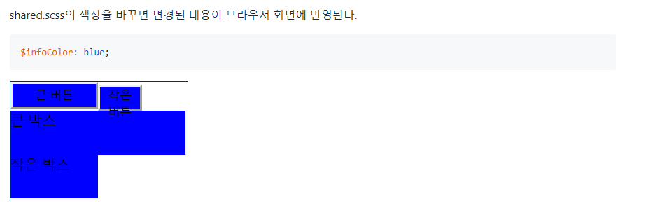


### 1.4.4 css-in-js 로 작성하기 

CSS 코드를 자바스크립트 파일 안에서 작성하는 방법. 

CSS 코드가 자바스크립트 안에서 관리되기 때문에 공통되는 CSS 코드를 변수로 관리할 수 있다. 또한 동적으로 CSS 코드를 작성하기도 쉽다. 


css-in-js 를 지원하는 패키지 중에서 가장 유명한 styled-components 를 사용해 간단한 코드 작성 

```bash
> npm install styled-components
```

```jsx
import React from 'react';
import styled from 'styled-components';

const BoxCommon = styled.div`
    height: 50px;
    background-color: #aabbbb;
`;
const BoxBig = styled(BoxCommon)`
    width: 200px;
`;
const BoxSmall = styled(BoxCommon)`
    width: 100px;
`;

function Box({ size }) {
    if (size === 'big') {
        return <BoxBig>큰 박스</BoxBig>;
    } else {
        return <BoxSmall>작은 박스</BoxSmall>
    }
}
export default Box;
```

styled-components 컴포넌트는 일반적인 리액트 컴포넌트처럼 사용될 수 있고, 이는 ES6에 추가된 태그된 템플릿 리터럴 문법이다. 

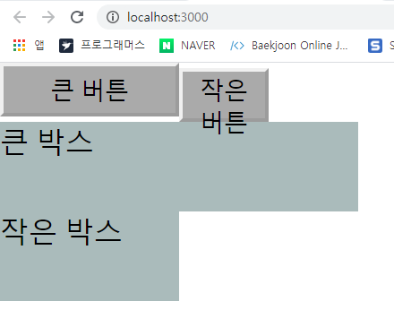

```jsx
// 동적 스타일이 적용된 Box4.js
import React from 'react';
import styled from 'styled-components';

const BoxCommon = styled.div`
    width: ${props => (props.isBig ? 200 : 100)}px;
    height: 50px;
    background-color: #aaaaaa;
`;

function Box({ size }) {
    const isBig = size === 'big';
    const label = isBig ? '큰 박스' : '작은 박스';
    return <BoxCommon isBig={isBig}>{label}</BoxCommon>;
}
export default Box;
```

템플릿 리터럴에서 표현식을 사용하면 컴포넌트의 속성값을 매개변수로 갖는 함수를 작성할 수 있다. 


## 1.5 단일 페이지 애플리케이션 만들기 

리액트 애플리케이션의 페이지 전환은 단일 페이지 애플리케이션 방식으로 개발하는 것이 정석이다. 

단일 페이지 애플리케이션은 최초 요청시 서버에서 첫 페이지를 처리하고 이후의 라우팅은 클라이언트에서 처리하는 웹 애플리케이션. 

페이지 전환에 의한 렌더링을 클라이언트에서 처리하기 때문에 자연스럽게 동작한다. 


### 1.5.1 브라우저 히스토리 API 

단일페이지 애플리케이션 구현이 가능하려면 아래 2가지 기능이 필요 

- 자바스크립트에서 브라우저로 페이지 전환 요청을 보낼 수 있다. (단, 브라우저는 서버로 요청을 보내지 않아야한다. )
- 브라우저의 뒤로 가기와 같은 사용자의 페이지 전환 요청을 자바스크립트에서 처리할 수 있다. 이때도 브라우저는 서버로 요청을 보내지 않아야한다. 

위의 조건을 만족하는 브라우저 API는 `pushState`, `replaceState` 함수와 `popstate` 이벤트이다. ( API 이름에서 알 수 있듯이 브라우저에는 히스토리에 state 를 저장하는 스택(stack) 이 존재한다. )

```jsx
// App.js 
import React, { Component } from 'react';

class App extends Component {
  componentDidMount(){
    window.onpopstate = function(event){
      console.log(`location: ${document.location}, state : ${event.state}`);
    };
  }
  render() {
    return (
      <div>
        <button onClick = { () => window.history.pushState('v1', '', '/page1')}> page1 </button> 
        <button onClick = { () => window.history.pushState('v2', '', '/page2')}> page2 </button> 
      </div>
    );
  }
}

export default App;
```

구글에 접속한다 -> localhost:3000 에 접속 -> page1, page2 버튼을 번갈아가며 여러번 누르면 주소창에서 

`http://localhost:3000/page1` 이나 `http://localhost:3000/page2` 로 변경되는 것을 확인할 수 있다.


이제 뒤로가기 버튼을 누르면 콘솔창에서 onpopstate 함수가 호출되는 것을 확인할 수 있으며, 계속해서 뒤로가기를 누르면 스택이 비워질때까지 `onpopstate ` 함수가 호출되다가 구글 홈페이지로 돌아간다. 

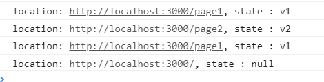

`replaceState` 함수는 `pushState` 와 거의 같지만 스택에 state를 쌓지 않고 가장 최신의 state 를 대체한다. 

위와 같이 `pushState` , `replaceState` 와 `popState` 이벤트만 있으면 클라이언트에서 라우팅처리가 되는 단일 페이지 애플리케이션을 만들 수 있다. 


```jsx
// App.js 
import React, { Component } from 'react';

class App extends Component {
  state = {
    pageName: '',
  };
  componentDidMount() {
    window.onpopstate = event => {
      this.onChangePage(event.state);
    };
  }
  onChangePage = pageName => {
    this.setState({ pageName });
  };
  onClick1 = () => {
    const pageName = 'page1';
    window.history.pushState(pageName, '', '/page1');
    this.onChangePage(pageName);
  };
  onClick2 = () => {
    const pageName = 'page2';
    window.history.pushState(pageName, '', '/page2');
    this.onChangePage(pageName);
  };
  render() {
    const { pageName } = this.state;
    return (
      <div>
        <button onClick={this.onClick1}>page1</button>
        <button onClick={this.onClick2}>page2</button>
        {!pageName && <Home />}
        {pageName === 'page1' && <Page1 />}
        {pageName === 'page2' && <Page2 />}
      </div>
    );
  }
}

const Home = ()=> {
  return <h2>여기는 홈페이지입니다. 원하는 페이지 버튼을 클릭하세요.</h2>;
}

const Page1 = ()=>{
  return <h2>여기는 Page1입니다.</h2>;
}

const Page2 = ()=>{
  return <h2>여기는 Page2입니다.</h2>;
}

export default App;
```


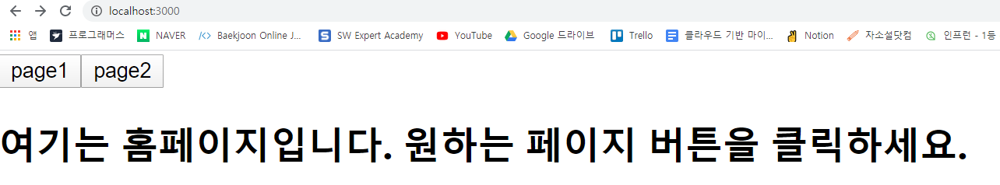

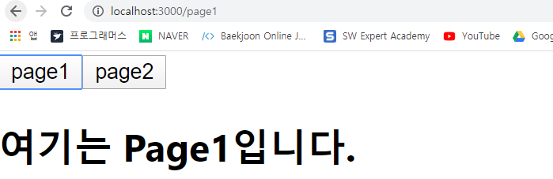

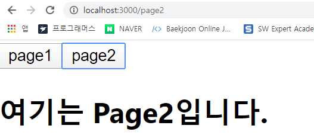


### 1.5.2 react-router-dom 사용하기 

react-router-dom 패키지도 내부적으로 브라우저 히스토리 API 를 사용한다. 

패키지 설치 

```bash
> npm install react-router-dom
```

react-router 은 웹 뿐만 아니라 리액트 네이티브도 지원한다. 

```jsx
// App.js
import React , {Component} from 'react'; 
import { BrowserRouter, Route, Link } from 'react-router-dom'; 
import Rooms from './Rooms'; 

class App extends Component {
  render() {
    return (
      <BrowserRouter>
        <div style={{ padding: 20, border: '5px solid gray' }}>
          <Link to="/">홈</Link>
          <br />
          <Link to="/photo">사진</Link>
          <br />
          <Link to="/rooms">방 소개</Link>
          <br />
          <Route exact path="/" component={Home} />
          <Route path="/photo" component={Photo} />
          <Route path="/rooms" component={Rooms} />
        </div>
      </BrowserRouter>
    );
  }
}
```

- `react-router-dom` 을 사용하기 위해서는 전체를 `BrowserRouter` 컴포넌트로 감싸야한다. 

- 버튼을 통해서 페이지를 전환할 때는 `react-router-dom` 에서 제공하는 `Link `컴포넌트를 사용한다. 

- `Link` 컴포넌트에서 `to` 속성은 이동할 주소를 나타낸다. 

- `react-router-dom` 의 `Route` 컴포넌트를 이용해서 각 페이지를 정의한다. 현재 주소가 `path` 속성값으로 시작하면 `component` 속성값이 가리키는 컴포넌트를 렌더링한다. 

- `exact` 속성값을 입력하면 그 값이 완전히 일치해야 해당 컴포넌트가 렌더링 된다. 

- 흥미로운 점은 같은 `path` 속성값을 갖는 `Route` 컴포넌트를 여러번 작성해도 된다는 점. 

```jsx
import React from 'react';
import { Route, Link } from 'react-router-dom';

const Rooms = ({ match }) => {
    console.log(match);
    return (
        <div>
            <h2>여기는 방을 소개하는 페이지입니다.</h2>
            <Link to={`${match.url}/blueRoom`}>파란 방입니다</Link>
            <br />
            <Link to={`${match.url}/greenRoom`}>초록 방입니다</Link>
            <br />
            <Route path={`${match.url}/:roomId`} component={Room} />
            <Route
                exact
                path={match.url}
                render={() => <h3>방을 선택해 주세요.</h3>}
            />
        </div>
    );
}
export default Rooms;

const Room = ({ match }) => {
    return <h2>{`${match.params.roomId} 방을 선택하셨습니다.`}</h2>;
}
```

- Rooms 컴포넌트 내부에는 또 다시 라우팅을 처리하는 코드가 들어있다. 
- Route 를 통해서 렌더링되는 컴포넌트는 `match` 라는 속성값을 사용할 수 있다. 

- `match.url` 은 Route 컴포넌트의 `path` 속성값과 같다. 따라서 Rooms 컴포넌트의 match.url 은 ` /rooms` 와 같다. 

- Route 컴포넌트의 `path` 속성값에서 콜론을 사용하면 파라미터를 나타낼 수 있다. 
- 추출된 파라미터는 `match.params.{파라미터이름}` 형식으로 사용될 수 있다. 

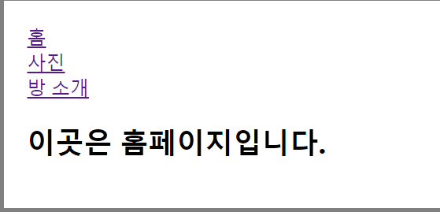

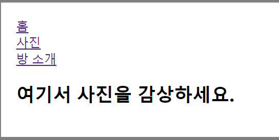

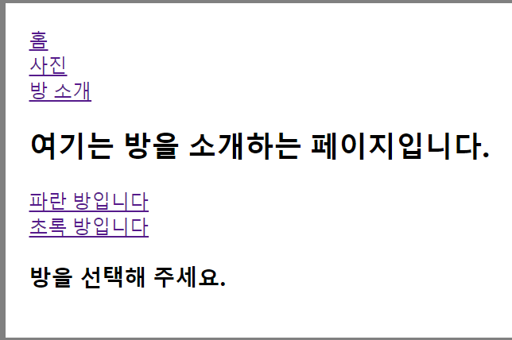

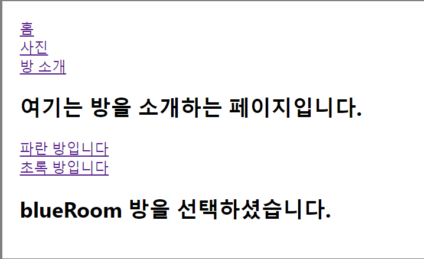