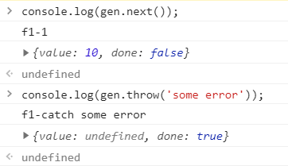

## 2.1 변수를 정의하는 새로운 방법 : const, let 

### 2.1.1 var 가 가진 문제 

**var 의 첫번째문제** : **함수 스코프** ( 스코프 - 변수가 사용될 수 있는 영역 ) ->함수를 벗어난 영역에서 사용하면 에러

함수 안에서 var 키워드 사용하지 않고 변수에 값을 할당하면 그 변수는 전역 변수가 된다. 

```jsx
function example1(){
    i = 1; 
}
function example2(){
    console.log(i); 
}
example1(); 
example2(); // 1 이 출력된다. 
```

**var 의 두번째 문제 : 호이스팅** - var로 정의된 변수는 그 변수가 속한 스코프의 최상단으로 끌어올려진다. 

```jsx
console.log(myVar); // undefined 출력 
var myVar = 1; 
```

​																						▼

```jsx
var myVar = undefined; 
console.log(myVar); 
myVar = 1; 
```

변수의 정의만 끌어올려지고 값은 원래 정의했던 위치에서 할당된다. 또한 특이하게 변수가 정의된 곳 위에서 값을 할당할 수도 있다.

```jsx
console.log(myVar); // undefined 출력 
myVar = 2; 
console.log(myVar); // 2 출력 
myVar = 1; 
```

**var 의 기타 문제들** : var 를 이용하면 한 번 정의된 변수를 재정의할 수 있다.  그리고 var 은 재할당 가능한 변수로밖에 만들 수 없기 때문에 상수처럼 쓸 값도 무조건 재할당 가능한 변수로 만들어야한다. 

```jsx
var myVar = 1 ;
var myVar = 2 ; 
```


### 2.1.2 var 의 문제를 해결하는 const, let 

**const, let 은 블록 스코프**이다. 

```jsx
if(true){
    const i =0; 
}
console.log(i); // 참조 에러 
```

```jsx
// 블록 스코프에서 같은 이름을 갖는 변수 사용의 예시 
let foo = 'bar1';
console.log(foo);  // bar1
if (true) {
    let foo = 'bar2';
    console.log(foo);  // bar2
}
console.log(foo);  // bar1
```

const, let 으로 정의된 변수도 호이스팅이되지만, 변수를 정의하기전에 그 변수를 사용하려고 하면 참조 에러가 발생한다. 

```jsx
console.log(foo);  // 참조에러 
const foo = 1 ; 
```

변수가 정의된 위치와 호이스팅된 위치 사이에서 변수를 사용하려고 하면 에러 발생 . 이 구간을 **임시적 사각지대** 라고 부른다. 

```jsx
// const 에서 호이스팅의 역할을 설명하기 위한 예시
const foo = 1;
{
    console.log(foo);  // 참조 에러
    const foo = 2;
}
```

```jsx
// var 에서 호이스팅의 효과를 확인하는 코드 
var foo = 1;
(function() {
    console.log(foo);  // undefined
    var foo = 2;
})();
```

**const는 변수를 재할당 불가능하게 만든다.** 

```jsx
const bar = 'a';
bar = 'b';  // 에러 발생
var foo = 'a';
foo = 'b';  // 에러 없음
let value = 'a';
value = 'b';  // 에러 없음
```

const로 정의된 객체의 내부 속성값은 수정이 가능하다. ( 이미 존재하는 속성값을 수정하거나 새로운 속성값을 추가하는 것 모두 가능하다 )

```jsx
const bar = { prop1: 'a' };
bar.prop1 = 'b';
bar.prop2 = 123;
console.log(bar);  // { prop1: 'b', prop2: 123 }
const arr = [10, 20];
arr[0] = 100;
arr.push(300);
console.log(arr);  // [ 100, 20, 300 ]
```


만약 객체의 내부 속성값도 수정 불가능하게 만들고 싶다면 `immer`, `immutable.js` 등의 외부 패키지를 활용하는게 좋다. 이러한 외부 패키지는 객체를 수정하려고 할 때 기존 객체는 변경하지 않고 새로운 객체를 생성한다. 

새로운 객체를 생성하는 편의기능은 필요없고 단지 수정만 할 수 없도록 차단하고 싶다면 아래의 자바스크립트 내장함수를 이용하면 된다. 

`Object.preventExtensions`  ,  `Object.seal`  , `Object.freeze` 

```jsx
// const 로 정의된 변수에 재할당은 불가능하다. 
const bar = { prop1 : 'a' }; 
bar = {prop2 : 123}; // 에러 발생 
```


### 2.2 객체와 배열의 사용성 개선 

#### 2.1.1 객체와 배열을 간편하게 생성하고 수정하기 

**단축속성명** : 객체 리터럴 코드를 간편하게 작성할 목적으로 만들어진 문법. 

```jsx
// 단축 속성명을 사용해서 객체 생성 
const name = 'mike';
const obj = {
    age: 21,
    name, // 새로 만들려는 객체의 속성값 일부가 이미 변수로 존재시 간단하게 변수 이름만 적어준다. 
    getName() {return this.name;}, // 속성값이 함수이면 function 키워드 없이 함수명만 적어도 된다
};
```

```jsx
// 단축 속성명을 사용하지 않은 코드와 사용한 코드 비교
function makePerson1(age, name) {		
    return { age: age, name: name };	// 사용 x
}
function makePerson2(age, name) {
    return { age, name };				// 사용
}
```

```jsx
// 콘솔 로그 출력 시 단축 속성명 활용하기 
const name = 'mike';
const age = 21;
console.log('name = ', name, ', age = ', age);  // name = mike , age = 21
console.log({ name, age });  // { name: 'mike', age: 21 }
```

**계산된 속성명** : 객체의 속성명을 동적으로 결정하기 위해 나온 문법 

```jsx
// 계산된 속성명을 사용하지 않은 코드와 사용한 코드 비교 
function makeObject1(key, value) {
    const obj = {};
    obj[key] = value;
    return obj;
}
function makeObject2(key, value) {
    return { [key]: value };
}
```

```jsx
// 계산된 속성명을 사용해서 컴포넌트 상탯값 변경하기 
class MyComponent extends React.Component {
    state = {
        count1: 0,
        count2: 0,
        count3: 0,
    };
	// ...
	onClick = index => {
        const key = `count${index}`;
        this.setState({ [key]: value + 1 }); // setState 호출 시 계산된 속성명을 사용할 수 있다
        const value = this.state[key]; 
    };
}
```


#### 2.2.2 객체와 배열의 속성값을 간편하게 가져오기 

**전개연산자** : 배열이나 객체의 모든 속성을 풀어놓을 때 사용하는 문법 . 그리고 매개변수가 많은 함수를 호출할 때 유용하다. 

- 전개 연산자를 이용해서 함수의 매개변수를 입력하기

  ```jsx
  Math.max(1, 3, 7, 9);
  const numbers = [1, 3, 7, 9];
  Math.max(...numbers);
  ```

- 전개 연산자를 사용하면 동적으로 함수의 매개변수를 전달할 수 있다. 

- 전개 연산자는 배열이나 객체를 복사할 때도 유용하다. 

  ```jsx
  // 전개 연산자를 이용해서 배열과 객체를 복사하기. 
  const arr1 = [1, 2, 3];
  const obj1 = { age: 23, name: 'mike' };
  const arr2 = [...arr1];
  const obj2 = { ...obj1 };
  arr2.push(4);		// arr2 = [1,2,3,4]
  obj2.age = 80;		// obj2 = {age:80, name:"mike"}
  ```

- 전개 연산자를 사용해서 새로운 객체와 배열 생성 -> 속성을 추가하거나 변경해도 원래의 객체에 영향을 주지 않는다. 

  ```jsx
  // 배열에서 전개 연산자를 사용하면 순서가 유지된다. 
  [1, ...[2, 3], 4];  // [1, 2, 3, 4]
  new Date(...[2018, 10, 24]);  // Sat Nov 24 2018 00:00:00 GMT+0900 (대한민국 표준시)
  ```

- 전개 연산자를 사용하면 서로 다른 두 배열이나 객체를 쉽게 합칠 수 있다. 

  ```jsx
  const obj1 = { age: 21, name: 'mike' };
  const obj2 = { hobby: 'soccer' };
  const obj3 = { ...obj1, ...obj2 };
  console.log(obj3);  // { age: 21, name: 'mike', hobby: 'soccer' }
  ```

- ES6 부터는 중복된 속성명이 허용된다. ( 중복된 속성명 사용 시 최종 결과는 마지막 속성명의 값이 된다. )

  ```jsx
  const obj1 = { x: 1, x: 2, y: 'a' };  // { x: 2, y: 'a' }
  const obj2 = { ...obj1, y: 'b' };  // { x: 2, y: 'b' }
  ```

  

**배열 비구조화** : 배열의 여러 속성값을 변수로 쉽게 할당할 수 있는 문법 

```jsx
const arr = [1, 2];
const [a, b] = arr;
console.log(a);  // 1
console.log(b);  // 2
```

```jsx
// 배열 비구조화로 이미 존재하는 변수에 값을 할당하기 
let a, b; 
[a, b] = [1, 2]; 
```

- 배열 비구조화 시 기본값을 정의할 수 있다. 배열의 속성값이 undefined 라면 정의된 기본값이 할당되고, 그렇지 않다면 원래의 속성값이 할당된다. 

  ```jsx
  const arr = [1];
  const [a = 10, b = 20] = arr;
  console.log(a);  // 1
  console.log(b);  // 20
  ```

- 배열 비구조화를 이용해서 두 변수의 값을 교환하기 

  ```jsx
  let a = 1;
  let b = 2;
  [a, b] = [b, a];
  console.log(a);  // 2
  console.log(b);  // 1
  ```

- 배열에서 일부 속성값을 무시하고 진행하고 싶다면 건너뛰는 개수만큼 쉼표를 입력하면 된다. 

  ```jsx
  const arr = [1, 2, 3];
  const [a, , c] = arr;
  console.log(a);  // 1
  console.log(c);  // 3
  ```

- 쉼표 개수만큼을 제외한 나머지를 새로운 배열로 만들수도 있다.( 나머지 속성값이 존재하지 않으면 빈 배열 생성. )

  ```jsx
  const arr = [1, 2, 3];
  const [first, ...rest1] = arr;
  console.log(rest1);  // [2, 3]
  const [a, b, c, ...rest2] = arr;
  console.log(rest2);  // []
  ```

  

**객체 비구조화** : 객체의 여러 속성값을 변수로 쉽게 할당할 수 있는 문법. 객체 비구조화에서는 중괄호를 사용. 

객체의 비구조화에서는 순서는 무의미하고, 기존 속성명을 그대로 사용해야한다. 

```jsx
const obj = { age: 21, name: 'mike' };
const { age, name } = obj;
console.log(age);  // 21
console.log(name);  // mike
```

- 객체 비구조화에서는 속성명이 중요 

  ```jsx
  const obj = { age: 21, name: 'mike' };
  const { age, name } = obj;
  const { name, age } = obj;
  const { a, b } = obj;	// 존재하지 않는 속성명 -> undefined 할당 
  ```

- 속성명과 다른 이름으로 변수 생성 ( 중복된 변수명을 피하거나 좀 더 구체적인 변수명을 만들 때 좋다. )

  ```jsx
  const obj = { age: 21, name: 'mike' };
  const { age: theAge, name } = obj;
  console.log(theAge);  // 21
  console.log(age);  // 참조 에러
  ```

- 기본값 정의 ( 속성값이 undefined 인 경우에는 기본값이 들어간다. )

  ```jsx
  const obj = { age: undefined, name: null, grade: 'A' };
  const { age = 0, name = 'noName', grace = 'F' } = obj;
  console.log(age);  // 0
  console.log(name);  // null
  console.log(grade);  // A
  ```

- 기본값을 정의하면서 별칭을 함께 사용. 

  ```jsx
  const obj = { age: undefined, name: 'mike' };
  const { age: theAge = 0, name } = obj;
  console.log(theAge);  // 0
  ```

- 기본값으로 함수의 반환값을 넣을 수 있다. ( 기본값이 사용될 때만 함수가 호출 )

  ```jsx
  function getDefaultAge() {
      console.log('hello');
      return 0;
  }
  const obj = { age: 21, grade: 'A' };
  const { age = getDefaultAge(), grade } = obj;  // hello 출력되지 않음
  console.log(age);  // 21
  ```

- 사용되지않은 나머지 속성들을 별도의 객체로 생성할 수 있다. 

  ```jsx
  const obj = { age: 21, name: 'mike', grade: 'A' };
  const { age, ...rest } = obj;
  console.log(rest);  // { name: 'mike', grade: 'A' }
  ```

- for 문에서 객체를 원소로 갖는 배열을 순회할 때 편리 

  ```jsx
  const people = [{ age: 21, name: 'mike' }, { age: 51, name: 'sara' }];
  for (const { age, name } of people) {
      // ...
  }
  ```


**비구조화 심화학습** 

- 비구조화는 객체와 배열이 중첩되어있을 때도 사용할 수 있다. 

  ```jsx
  const obj = { name: 'mike', mother: { name: 'sara' } };
  const {
      name,
      mother: { name: motherName },
  } = obj;
  console.log(name);  // mike
  console.log(motherName);  // sara
  console.log(mother);  // 참조 에러
  ```

- 기본값의 정의는 변수로 한정되지 않는다. 기본값은 변수 단위가 아니라 패턴 단위로 적용된다. 

  ```jsx
  const [{ prop: x } = { prop: 123 }] = []; // 1번 
  console.log(x);  // 123
  const [{ prop: x } = { prop: 123 }] = [{}]; // 2번 
  console.log(x);  // undefined
  ```

  1번은 `{ prop: x }` 는 배열의 첫 번째 원소를 가리키고,  `{ prop: 123 }` 은 기본값을 정의한다.

  첫 번째 원소가 존재하지 않으면 기본값이 할당된다. 

  2번은 배열의 첫 번째 원소가 존재하기 때문에 기본값이 할당되지 않고, 첫번째 원소에 prop 속성이 없기떄문에 x 에 undefined 가 할당된다. 

- 객체 비구조화에서 계산된 속성명을 사용할 때에는 반드시 별칭을 입력해야한다. 

  ```jsx
  const index = 1;
  const { [`key${index}`]: valueOfTheIndex } = { key1: 123 };
  console.log(valueOfTheIndex);  // 123
  ```

- 별칭을 이용해서 다른 객체와 배열의 속성값 할당 

  ```jsx
  const obj = {};
  const arr = [];
  ({ foo: obj.prop, bar: arr[0] } = { foo: 123, bar: true });
  console.log(obj);  // {prop:123}
  console.log(arr);  // [true]
  ```


### 2.3 강화된 함수의 기능 


#### 2.3.1 매개변수에 추가된 기능 

- **매개변수 기본값** : ES6 부터 함수 매개변수에 기본값을 줄 수 있다. 

  ```jsx
  function printLob(a=1){ 
  	console.log({a}); 
  }
  printLog(); // {a:1}
  ```

- 객체 비구조화처럼 기본값으로 함수 호출을 넣을 수 있고, 기본값이 필요한 경우에만 함수가 호출된다. ( 입력값이 undefined 인 경우에만 호출된다 )

  ```jsx
  function getDefault(){ 
  	return 1 ;
  }
  function printLog(a = getDefault()){
      console.log({a});
  }
  printLog(); // { a : 1 }
  ```

- 매개변수 기본값을 이용해서 필숫값을 표현하는 방법

  ```jsx
  function required() {
      throw new Error('no parameter');
  }
  function pringLog(a = required()) {
      console.log({ a });
  }
  printLog(10);  // { a: 10 }
  printLog();  // 에러 발생: no parameter
  ```

- 나머지 매개변수는 입력된 인수 중에서 정의된 매개변수 개수만큼을 제외한 나머지를 배열로 만들어준다. 나머지 매개변수는 매개변수 개수가 가변적일 때 유용하다. 

  ```jsx
  function printLog(a, ...rest){
      console.log({a, rest}); 
  }
  printLog(1,2,3);  // { a:1, rest:[2,3] }
  ```

- ES5 에서는 `arguments` 키워드가 비슷한 역할을 한다. 

  ```jsx
  // arguments 키워드로 나머지 매개변수 따라하기 
  function printLog(a){ 
  	const rest = Array.from(arguments).splice(1); 
      console.log({a,rest}); 
  }
  printLog(1,2,3);  // { a:1, rest:[2,3] }
  ```

  arguments 의 존재가 명시적으로 드러나지않기때문에 가독성이 좋지 않고, 배열이 아니기때문에 배열처럼 사용하기 위해서는 배열로 변환하는 과정이 필요하다는 단점이 있다. 


**명명된 매개변수** : 객체 비구조화를 이용해서 구현할 수 있다. 명명된 매개변수를 사용하면 함수 호출 시 매개변수의 이름과 값을 동시에 적을 수 있으므로 가독성이 높다. 

- 명명된 매개변수의 사용 여부에 따른 가독성 비교 

  ```jsx
  const numbers = [10, 20, 30, 40];
  const result1 = getValues(numbers, 5, 25);
  const result2 = getValues({ numbers, greaterThan: 5, lessThan: 25 });
  ```

  명명된 매개변수를 이용하면 매개변수의 이름이 노출된다. 


**선택적 매개변수** : 있어도 되고 없어도 되는 매개변수

- 명명된 매개변수의 사용 여부에 다른 선택적 매개변수 코드 비교 

  ```jsx
  const result1 = getValues(numbers, undefined, 25);	// 명명된 매개변수사용 x 
  const result2 = getValues({ numbers, greaterThan: 5 }); // 사용 o
  const result3 = getValues({ numbers, lessThan: 25 }); 	// 사용 o 
  ```

  명명된 매개변수 없이 선택적 매개변수를 사용한 예로, 필요없는 매개변수 자리에 undefined를 넣으면 된다. 


#### 2.3.2 함수를 정의하는 새로운 방법 : 화살표 함수 

- 화살표 함수의 사용 예 

  ```jsx
  const add = (a, b) => a + b;
  console.log(add(1, 2));  // 3
  const add5 = a => a + 5;
  console.log(add5(1));  // 6
  const addAndReturnObject = (a, b) => ({ result: a + b });
  console.log(addAndReturnObject(1, 2).result);  // 3
  ```

  - 매개변수가 하나라면 매개변수를 감싸는 소괄호도 생략할 수 있다. 
  - 객체를 반환해야 한다면 소괄호로 감싸야한다. 
  - 화살표 함수를 중괄호로 감싸지 않으면 오른쪽의 계산 결과가 반환된다. 명시적으로 return 키워드를 작성하지 않아도 되기 때문에 코드가 간결해진다. 

- 화살표 함수에 여러 줄의 코드가 필요하다면 전체를 중괄호로 묶고, 반환값에는 return 키워드를 사용한다.

  ```jsx
  const add = (a,b) =>{
      if( a<=0 || b<=0 ){
          throw new Error('must be positive number'); 
      }
      return a+b; 
  }
  ```

- 화살표 함수는 일반함수와 다르게 `this` 와 `arguments` 가 바인딩 되지 않는다. 따라서 arguments 가 필요하다면 나머지 매개변수를 이용한다. 

  ```jsx
  const printLog = (...rest) => console.log(rest); 
  printLog(1,2); // [1,2]
  ```


- 일반함수에서 this 는 호출 시점에 사용된 객체로 바인딩된다. 따라서 객체에 정의된 일반함수를 다른 변수에 할당해서 호출하면 버그가 발생할 수 있다. 

  ```jsx
  // this 바인딩 때문에 버그가 발생한 경우 
  const obj = {
      value: 1,
      increase: function() {
          this.value++;	// 사용된 객체가 this 로 바인딩 된다.
      },
  };
  obj.increase();
  console.log(obj.value);  // 2
  const increase = obj.increase;
  increase(); // -3번-
  console.log(obj.value);  // 2
  ```

  3번 : 객체 없이 호출되는 경우에는 전역 객체가 바인딩되는데, 브라우저 환경에서는 window 객체가 바인딩되기 때문에, obj.value 는 증가하지 않는다. 

  화살표 함수 안에서 사용된 this 와 arguments 는 자신을 감싸고 있는 가장 가까운 일 함수의 것을 참조한다. 따라서 increase 함수를 화살표함수로 작성했다면 this 는 window 객체를 가리키기 떄문에 함수를 호출해도 obj.value 는 항상 변하지 않는다. 


- 생성자 함수 내부에서 정의된 화살표 함수의 this 는 생성된 객체를 참조한다. 

  ```jsx
  // 생성자 함수 내부에서 화살표 함수 사용하기 
  function Something() {
      this.value = 1;
      this.increase = () => this.value++;
  }
  const obj = new Something();
  obj.increase();
  console.log(obj.value);  // 2
  const increase = obj.increase;
  increase();
  console.log(obj.value);  // 3
  ```

  new 키워드를 이용해서 생성자 함수를 호출하면 this 는 생성되는 객체를 참조한다. 

- setInterval 함수 사용 시 this 바인딩 문제 

  ```jsx
  // setInterval 함수에서 this 객체 사용 시 버그 발생 
  function Something() {
      this.value = 1;
      setInterval(function increase() {
          this.value++;
      }, 1000);
  }
  const obj = new Something();		// obj.value 는 증가하지않는다. 
  ```

  setInterval 함수의 인수로 들어간 increase 함수는 전역환경에서 실행되기 때문에 this 는 window 객체를 참조한다. 

  ```jsx
  // setInterval 함수에서 this 객체를 참조하기 위한 편법 사용 - 클로저를 이용
  function Something() {
      this.value = 1;
      var that = this;
      setInterval(function increase() {
          that.value++;
      }, 1000);
  }
  const obj = new Somethins();
  ```

- setInterval 함수에서 this 객체를 참조하기 위해 화살표 함수 사용하기

  ```jsx
  function Something(){ 
  	this.value = 1; 
      setInterval( ()=> { 
      	this.value++; 
      }, 1000); 
  }
  const obj = new Something(); 
  ```


### 2.4 향상된 비동기 프로그래밍 1 : 프로미스 

**프로미스** : 비동기 상태를 값으로 다룰 수 있는 객체다.  프로미스를 사용하면 비동기 프로그래밍을 할 때 동기 프로그래밍 방식으로 코드를 작성할 수 있다. 

#### 2.4.1 프로미스 이해하기 

비동기프로그래밍의 한 가지 방식으로 콜백 패턴을 많이 사용했었다. 콜백 패턴은 콜백이 조금만 중첩돼도 코드가 상당히 복잡해지는 단점이 있다. 

```jsx
function requestData1(callback) {
    // ...
    callback(data);						// (2)
}
function requestData2(callback) {
    // ...
    callback(data);						// (4)
}
function onSuccess1(data) {
    console.log(data);
    requestData2(onSuccess2);			// (3)
}
function onSuccess2(data) {				// (5)
    console.log(data);
    // ...
}
requestData1(onSuccess1);				// (1)
```

- 간단한 프로미스 코드 예시

  ```jsx
  requestData1()
  .then(data => {
      console.log(data);
      return requestData2();
  })
  .then(data => >{
      console.log(data);
  });
  ```


프로미스의 세가지 상태 

- 대기 중 (pending) : 결과를 기다리는 중 
- 이행됨 (fulfilled) : 수행이 정상적으로 끝나고 결괏값을 갖고 있음 
- 거부됨 (rejected) : 수행이 비정상적으로 끝났음 

이행됨, 거부됨 상태를 **처리됨(settled)** 상태라고 부른다.  프로미스는 처리됨 상태가 되면 더 이상 다른 상태로 변경되지 않는다. 대기중 상태일 때만 이행됨 또는 거부됨 상태로 변할 수 있다. 


- 프로미스를 생성하는 방법 

  ```jsx
  const p1 = new Promise((resolve, reject) => { // 1번 
      // resolve(data)
      // or reject('error message')
  });
  const p2 = Promise.reject('error message'); // 2번
  const p3 = Promise.resolve(param); // 3번
  ```

  **1번** : 일반적으로 new 키워드를 사용해서 프로미스를 생성한다. 이 방법으로 생성된 프로미스는 대기 중 상태가 된다. 

  생성자에 입력되는 함수는 `resolve` 와 `reject` 라는 콜백함수를 매개변수로 갖는다. 비동기로 어떤 작업을 수행 후 성공했을 때 `resolve` 를 호출하고, 실패했을 때 `reject` 를 호출하면 된다. 

  `resolve` 를 호출하면 p1 객체는 이행됨 상태가 된다. 반대로 `reject` 를 호출하면 거부됨 상태가 된다. 

  만약 생성자에 입력된 함수 안에서 예외가 발생하면 거부됨 상태가 된다. new 키워드를 사용해서 프로미스를 생성하는 순간 생성자의 입력함수가 실행된다. 만약 API 요청을 보내는 비동기 코드가 있다면 프로미스가 생성되는 순간에 요청을 보낸다. 

  **2번** : new 키워드를 사용하지 않고 Promise.reject 를 호출하면 거부됨 상태인 프로미스가 생성된다. 

  **3번** : Promise.resolve 를 호출해도 프로미스가 생성된다. 만약 입력값이 프로미스였다면 그 객체가 그대로 반환되고, 프로미스가 아니라면 이행됨 상태인 프로미스가 반환된다. 

- Promise.resolve 의 반환값

  ```jsx
  const p1 = Promise.resolve(123);
  console.log(p1 !== 123);	  // true
  const p2 = new Promise(resolve => setTimeout(() => resolve(10), 1));
  console.log(Promise.resolve(p2) === p2);  	// true
  ```

  

프로미스 이용하기 1 : **then** 

`then` 은 처리됨 상태가 된 프로미스를 처리할 때 사용되는 메서드. 프로미스가 처리됨 상태가 되면 then 메서드의 인수로 전달된 함수가 호출된다. 

- then 메서드를 사용한 간단한 코드 

  ```jsx
  requestData().then(onResolve, onReject);
  Promise.resolve(123).then(data => console.log(data));  // 123
  Promise.reject('err').then(null, error => console.log(error));  // err
  ```

  `then` 메서드는 항상 프로미스를 반환한다. 따라서 하나의 프로미스로부터 연속적으로 then 메서드를 호출할 수 있다. 

- 연속해서 then 메서드를 호출하기 

  ```jsx
  requestData1()
      .then(data => {
      console.log(data);
      return requestData2(); // 1번 
  })
      .then(data => {
      return data + 1;	// 2번 
  })
      .then(data => {
      throw new Error('some error'); // 3번 
  })
      .then(null, error => {
      console.log(error);
  });
  ```

  **1번** : onResolve 또는 onReject 함수에서 프로미스를 반환하면 then 메서드는 그 값을 그대로 반환한다. 

  **2번** : 만약 프로미스가 아닌 값을 반환하면 then 메서드는 이행됨 상태인 프로미스를 반환한다. 

  **3번** : onResolve 또는 onReject 함수 내부에서 예외가 발생하면 then 메서드는 거부됨 상태인 프로미스를 반환한다. 

  결과적으로 then 메서드는 항상 프로미스를 반환한다. 

- 거부됨 상태가 되면 onReject 함수를 호출한다. 

  ```jsx
  Promise.reject('err')
  	.then(() => console.log('then 1'))	// 생략 
  	.then(() => console.log('then 2'))	// 생략
  	.then(() => console.log('then 3'), () => console.log('then 4')); 	// 4 호출 
  	.then(() => console.log('then 5'), () => console.log('then 6'));	// 5 호출 
  ```

  거부됨 상태인 프로미스는 처음으로 만나는 onReject 함수를 호출한다. 

  `then` 메서드의 가장 중요한 특징은 항상 연결된 순서대로 호출된다는 점 . 


프로미스 이용하기2 : **catch**

- `catch` : 프로미스 수행 중 발생한 예외를 처리하는 메서드. catch 메서드는 then 메서드의 onReject 함수와 같은 역할을 한다. catch 메서드를 이용하는 것이 가독성 면에서 더 좋다. 

  ```jsx
  // 같은 기능을 하는 then 메서드와 catch 메서드 
  Promise.reject(1).then(null, error => {
      console.log(error);
  });
  Promise.reject(1).catch(error => {
      console.log(error);
  });
  ```

- then 메서드의 onResolve  함수에서 발생한 예외는 같은 then 메서드의 onReject 함수에서 처리되지 않는다. 

  따라서 아래의 코드를 실행하려면 `Unhandled promise rejection ` 에러가 발생한다. 

  ```jsx
  Promise.resolve().then(
      () => {
          throw new Error('some error');
      },
      error => {
          console.log(error);
      },
  );
  ```

- onReject 함수를 사용하지 않고 catch 를 사용한 예 

  ```jsx
  Promise.resolve()
  	.then(() => {
      	throw new Error('some error');
  	})
  	.catch(error => {
      	console.log(error);
  	});
  ```

- catch 메서드 이후에도 then 메서드 사용하기

  ```jsx
  Promise.reject(10)
  	.then(data => {
      	console.log('then1:', data);
      	return 20;
  	})
  	.catch(error => {
      	console.log('catch:', error);
      	return 30;
  	})
  	.then(data => {
      	console.log('then2:', data);
  	});
  
  // 결과 
  catch: 10
  then2: 30
  ```


프로미스 이용하기 3 : **finally**

- `finally` : 프로미스가 이행됨 또는 거부됨 상태일 때 호출되는 메서드. 프로미스 체인의 가장 마지막에 사용된다. 

  ```jsx
  // finally 를 사용한 간단한 코드 
  requestData()
  	.then(data => {
      	// ...
  	})
  	.catch(error => {
      	// ...
  	})
  	.finally(() => {
      	// ...
  	});
  ```

  finally 메서드는 `.then(onFinally, onFinally)` 코드와 유사하지만, 이전에 사용된 프로미스를 그대로 반환한다. ( 새로운 프로미스를 생성하지 않는다. ) 따라서 처리됨 상태인 프로미스의 데이터를 건드리지않고 추가작업을 할 때 유용하게 사용될 수 있다. 

  ```jsx
  // 새로운 프로미스를 생성하지 않는다.
  function requestData() {
      return fetch()
      	.catch(error => {
          	// ...
      	})
      	.finally(() => {
          	sendLogToServer('requestData finished');
  	    });
  }
  requestData().then(data => console.log(data));
  ```

  위의 코드는 데이터 요청의 성공, 실패 여부와 상관없이 서버에 로그를 보낼 때 사용하는 코드. 


#### 2.4.2 프로미스 활용하기 

**병렬로 처리하기 : Promise.all**

`Promise.all` 은 여러개의 프로미스를 병렬로 처리할 때 사용하는 함수다. `then` 메서드를 체인으로 연결하면 각각의 비동기 처리가 병렬로 처리되지 않는다는 단점이 있다.  비동기 함수 간에 서로 의존성이 없다면 병렬로 처리하는 것이 더 빠르다. 

```jsx
// 병렬로 실행되는 코드 
requestData1().then(data => console.log(data)); 
requestData2().then(data => console.log(data)); 
```

- Promise.all 을 사용하는 코드 

  ```jsx
  Promise.all( [requestData1(), requestData2() ]).then(([data1,data2])=> {
     console.log(data1,data2); 
  });
  ```

  Promise.all 함수는 프로미스를 반환한다. Promise.all 함수가 반환하는 프로미스는 입력된 **모든 프로미스가 처리됨** **상태가 되어야 마찬가지로  처리됨 상태가 된다.** 만약 하나라도 거부됨 상태가 된다면 Promise.all 함수가 반환하는 프로미스도 거부됨 상태가 된다. 


**가장 빨리 처리된 프로미스 가져오기 : Promise.race** 

`Promise.race` : 여러 개의 프로미스 중에서 가장 빨리 처리된 프로미스를 반환하는 함수다. Promise.race 함수에 입력된 여러 프로미스 중에서 하나라도 처리도미 상태가 되면, Promise.race 함수가 반환하는 프로미스도 처리됨 상태가 된다. 

```jsx
Promise.race([
    requestData(),
    new Promise((_, reject) => setTimeout(reject, 3000)), ])
	.then(data => console.log(data))
	.catch(error => console.log(error));
```

requestData 함수가 3초 안에 데이터를 받으면 then 메서드가 호출되고 그렇지 않으면 catch 메서드가 호출된다.


**프로미스를 이용한 데이터 캐싱** 

처리됨 상태가 되면 그 상태를 유지하는 프로미스의 성질을 이용해서 데이터를 캐싱할 수 있다. 

```jsx
// 프로미스로 캐싱 기능 구현하기 
let cachedPromise;
function getData() {
    cachedPromise = cachedPromise || requestData();
    return cachedPromise;
}
getData().then(v => console.log(v));
getData().then(v => console.log(v));
```

getData 함수를 처음 호출할 때만 requestData 가 호출된다. 데이터를 가져오는 작업이 끝나면 결과는 cachedPromise 프로미스에 저장된다. 


#### 2.4.3 프로미스 사용 시 주의할 점 

**return 키워드 깜빡하지 않기** 

then 메서드가 반환하는 프로미스 객체의 데이터는 내부 함수가 반환한 값이다. return 키워드를 사용하지 않으면 프로미스 객체의 데이터는 undefined 가 된다. 

```jsx
// return 키워드를 깜빡한 코드 
Promise.resolve(10)
	.then(data => {
    	console.log(data);
    	Promise.resolve(20);	// return 키워드가 없기 때문에 밑의 값은 undefined 가 된다. 
	})
	.then(data => {
    	console.log(data);
	});
```


**프로미스는 불변 객체라는 사실 명심하기** 

```jsx
// 프로미스가 수정된다고 생각하고 작성한 코드 
function requestData() {
    const p = Promise.resolve(10);
    p.then(() => { // 1번 
        return 20;
    });
    return p;
}
requestData().then(v => { // 2번 
    console.log(v);  // 10	
});
```

**1번** : 기존 객체를 수정하지 않고 새로운 프로미스를 반환한다. 

**2번** : 코드에서 20 이 출력되기를 원한다면 requestData 함수를 다음과 같이 수정해야한다. 

```jsx
function requestData() {
    return Promise.resolve(10).then(v => {
        return 20;
    });
}
```


**프로미스를 중첩해서 사용하지 않기.** 

프로미스를 중첩해서 사용하면 콜백 패턴처럼 코드가 복잡해지므로 사용을 권하지는 않는다. 

```jsx
// 프로미스를 중첩해서 사용한 코드 
requestData1().then(result1 => {
    requestData2(result1).then(result2 => {
        // ...
    });
});
```

​																						▼ ( 리팩터링 )

```jsx
// 중첩된 코드를 리팩터링한 코드 
requestData1()
	.then(result1 => { // 1번
    	return requestData2(result1);
	})
	.then(result2 => {
    	// ...
	});
```

1번에서 result1 변수를 참조해야할 때는 `Promise.all` 함수를 사용하면 중첩하지않고 해결할 수 있다. 

```jsx
requestData1()
	.then(result1 => {
    	return Promise.all([result1, requestData2(result1)]);
	})
	.then(([result1, result2]) => {
    	// ...
	});
```

Promise.all 함수로 입력하는 배열에 프로미스가 아닌 값을 넣으면, 그 값 그대로 이행됨 상태인 프로미스처럼 처리된다.


**동기 코드의 예외 처리 신경 쓰기** 

- 동기코드에서 발생한 예외가 처리되지 않는 코드 

  ```jsx
  function requestData() {
  // 반드시 fetch 전에 호출되어야 하는게 아니라면 then 메서드 안쪽으로 넣어주는 게 좋다 .
      doSync();	
      return fetch()
      	.then(data => console.log(data));
      	.catch(error => console.log(error));
  }
  ```

- 동기 코드도 예외 처리가 되는 코드 

  ```jsx
  function requestData() {
      return fetch()
      	.then(data => {
          	doSync();
          	console.log(data);
  	    })
      	.catch(error => console.log(error)); // doSync 에서 발생하는 예외도 처리 
  }
  ```

  


### 2.5 향상된 비동기 프로그래밍 2 : async await 

`async await` 는 비동기 프로그래밍을 동기 프로그래밍처럼 작성할 수 있도록 함수에 추가된 기능. 

`async await` 를 이용하여 비동기 코드를 작성하면 프로미스의 then 메서드를 체인 형식으로 호출하는 것보다 가독성이 좋아진다. 

#### 2.5.1 async await 이해하기 

**async await 함수는 프로미스를 반환한다.** 

프로미스는 객체로 존재하지만 saync await는 함수에 적용되는 개념이다. 

- 프로미스를 반환하는 async await 함수 

  ```jsx
  async function getData() { // 1qjs
      return 123;
  }
  getData().then(data => console.log(data));  // 123
  ```

  **1번** : async 키워드를 이용해서 정의된 함수는 async await 함수이며, 항상 프로미스를 반환한다. 따라서 함수 호출 후 then 메서드를 사용할 수 있다. 

- ```jsx
  async function getData() {
      return Promise.resolve(123);
  }
  getData().then(data => console.log(data));  // 123
  ```

  프로미스의 then 메서드와 마찬가지로 async await 함수 내부에서 반환하는 값이 프로미스라면 그 객체를 그대로 반환한다. 

- async await 함수 내부에서 예외가 발생하는 경우에는 거부됨 상태인 프로미스가 반환된다. 

  ```jsx
  async function getData() {
      throw new Error('123');
  }
  getData().catch(error => console.log(error));  // 에러 발생: 123
  ```

  

**await 키워드를 사용하는 방법** 
`await` 키워드는 async await 함수 내부에서 사용된다. await 키워드 오른쪽에 프로미스를 입력하면 그 프로미스가 처리됨 상태가 될 때까지 기다린다. 따라서 await 키워드로 비동기 처리를 기다리면서 순차적으로 코드를 작성할 수 있다. 

```jsx
function requestData(value) {
    return new Promise(resolve =>
    	setTimeout(() => {
        	console.log('requestData:', value);
        	resolve(value);
    	}, 100),
	);
}
async function getData() {
    const data1 = await requestData(10);	// 1번 
    const data2 = await requestData(20);	 
    console.log(data1, data2); // 2번 
    return [data1, data2];
}
getData();

// 결과 
requestData: 10
requestData: 20
10 20
```

함수가 반환하는 프로미스가 처리됨 상태가 될때까지 2번의 코드는 실행되지 않는다. 

`await` 키워드는 오직 async await 함수 내에서만 사용될 수 있다. 

- await 키워드는 async 키워드 없이 사용할 수 없다. 

  ```jsx
  function getData() {
      const data = await requestData(10);  // 에러 발생
      console.log(data);
  }
  ```


**async await 는 프로미스보다 가독성이 좋다 .** 

```jsx
function getDataPromise() {
    asyncFunc1()
    	.then(data => {
        	console.log(data);
        	return asyncFunc2();
    	})
    	.then(data => {
        	console.log(data);
    	});
}

async function getDataAsync() {
    const data1 = await asyncFunc1();	// await 키워드는 async 와 같이 사용 
    console.log(data1);
    const data2 = await asyncFunc2();
    console.log(data2);
}
```

비동기 함수 간에 의존성이 높아질수록 async await 와 프로미스의 가독성 차이는 더 선명하게 드러난다. 


- 의존성이 높은 코드에서 가독성 비교하기 

  ```jsx
  function getDataPromise() {
      return asyncFunc1()
      	.then(data1 => Promise.all([data, asyncFunc2(data1)]))
      	.then(([data1, data2]) => {
          	return asyncFunc3(data1, data2);
      	});
  }
  async function getDataAsync() {
      const data1 = await asyncFunc1();
      const data2 = await asyncFunc2(data1);
      return asyncFunc3(data1, data2);
  }
  ```


#### 2.5.2 async await 활용하기 

**비동기 함수를 병렬로 실행하기** 

- 순차적으로 실행되는 비동기 코드 

  ```jsx
  async function getData() {
      const data1 = await asyncFunc1();
      const data2 = await asyncFunc2();
  }
  ```

  위의 두 함수 사이에 의존성이 없다면 동시에 실행하는게 더 좋다. 프로미스는 생성과 동시에 비동기 코드가 실행된다. 따라서 두 개의 프로미스를 먼저 생성하고 await 키워드를 나중에 사용하면 병렬로 실행되는 코드가 된다. 

  ```jsx
  // await 키워드를 나중에 사용해서 병렬로 실행되는 비동기 코드 
  async function getData() {
      const p1 = asyncFunc1();
      const p2 = asyncFunc2();
      const data1 = await p1;
      const data2 = await p2;
  }
  ```

- Promise.all 을 사용해서 병렬로 실행하기 

  ```jsx
  async function getData(){ 
  	const [data1, data2] = await Promise.all([asyncFunc1(), asyncFunc2()]); 
  }
  ```


**예외 처리하기** 

async await 함수 내부에서 발생하는 예외는 `try catch` 문으로 처리하는게 좋다. 

```jsx
// 동기와 비동기 함수 모두 catch 문에서 처리된다. 
async function getData() {
    try {
        await doAsync();	// 1번 
        return doSync();	// 2번 
    } catch (error) {
        console.log(error);
    }
}
```

1번 비동기함수와 2번 동기함수에서 발생하는 모든 예외가 catch 문에서 처리된다. 만약 getData 함수가 async await 함수가 아니었다면 doAsync 함수에서 발생하는 예외는 catch 문에서 처리되지 않는다. 이는 doAsync 함수의 처리가 끝나는 시점을 알 수 없기 때문이다. 


**Thenable 을 지원하는 async await**

`Thenable` 은 프로미스처럼 동작하는 객체다. ES6 의 프로미스가 아니더라도 then 메서드를 가진 객체르 Thenable 라고 부른다 .

- async await 함수에서 Thenable 을 사용한 예시 

  ```jsx
  class ThenableExample {
      then(resolve, reject) {
          setTimeout(() => resolve(123), 1000);
      }
  }
  async function asyncFunc() {
      const result = await new ThenableExample();
      console.log(result);  // 123
  }
  ```

  ThenableExample 클래스는 then 메서드를 갖고 있으므로, ThenableExample 클래스로 생성된 객체는 Thenable 이다. async await 함수는 Thenable 도 프로미스처럼 처리한다. 


### 2.6 템플릿 리터럴로 동적인 문자열 생성하기 

ES6 에 추가된 템플릿 리터럴은 변수를 이용해서 동적으로 문자열을 생성할 수 있는 문법. 

- ES6 이전에 동적인 문자열을 생성하는 코드 

  ```jsx
  var name = 'mike' ; 
  var score = 80; 
  var msg = 'name: ' + name + ', score/100 : ' + score/100; 
  ```

  더하기 기호와 따옴표를 반복적으로 사용해서 문자열을 생성. 또한 코드를 읽는 입장에서 가독성이 떨어진다. 

  ​																						▼

  ```jsx
  //템플릿 리터럴을 사용한 코드 
  const msg = `name : ${name}, score/100 : ${score/100}`; 
  ```

  템플릿 리터럴을 `백틱`` ` 을 이용한다. 표현식을 사용할 때는 `${expression}` 형식으로 입력한다. 


**여러줄의 문자열 입력하기** 

템플릿 리터를을 사용하면 여러 줄의 문자열을 생성하기 쉽다. 

- ES6 이전에는 여러 줄의 문자열을 생성하기 위해서 다음과 같이 작성 

  ```jsx
  const msg = 'name: ' + name + '\n' +
  'age: ' + age + '\n' + 
  'score: ' + score + '\n';
  ```

  ​																					▼

  ```jsx
  // 템플릿 리터럴을 이용해서 여러 줄의 문자열을 생성하는 코드 
  const msg = `name : ${name}
  age : ${age} 
  score : ${score}`; 
  ```


### 2.7 실행을 멈출 수 있는 제너레이터 

- 제너레이터는 함수의 실행을 중간에 멈추고 재개할 수 있는 독특한 기능이다. 
- 실행을 멈출 때 값을 전달할 수 있기 때문에 반복문에서 제너레이터가 전달하는 값을 하나씩 꺼내서 사용할 수 있다. 

- 배열이 반복문에서 사용되는 방식과 유사하지만, 제너레이터는 보통의 컬렉션과 달리 값을 미리 만들어놓지 않는다. 

- 제너레이터를 사용하면 필요한 순간에 값을 계산해서 전달할 수 있기 때문에 메모리 측면에서 효율적이다. 
- 다른 함수와 협업 멀티태스킹을 할 수 있다. ( 실행을 멈추고 재개할 수 있기에 멀티태스킹이 가능. ) - 협업이라는 단어가 붙는 이유는 제너레이터가 실행을 멈추는 시점을 자발적으로 선택하기 때문. 

#### 2.7.1 제너레이터 이해하기 

**제너레이터**는 별표와 함께 정의된 함수와 그 함수가 반환하는 제너레이터 객체로 구성된다. 

- 간단한 제너레이터 함수의 예 

  ```jsx
  function * f1(){ // 별표와 함께 정의된 함수 : 제너레이터 함수 
  	yield 10; 
      yield 20; 
      return 'finished'; 
  }
  const gen = f1(); 
  ```

  `yield` 키워드를 사용하면 함수의 실행을 멈출 수 있다. 

  제너레이터 함수를 실행하면 제너레이터 객체가 반환된다. 

제너레이터 객체는 next, return , throw 메서드를 갖고 있다. 

- 제너레이터 객체의 next 메서드 사용하기 

  ```jsx
  function* f1() {
      console.log('f1-1');
      yield 10;
      console.log('f1-2');
      yield 20;
      console.log('f1-3');
      return 'finished';
  }
  const gen = f1();
  console.log(gen.next());
  console.log(gen.next());
  console.log(gen.next());
  ```

  

  `next` 메서드를 호출하면 yield 키워드를 만날 때까지 실행되고 데이터 객체를 반환한다. 

  yield 키워드를 만나면 데이터 객체의 done 속성값은 거짓이 되고 만나지 못하면 참이된다. 

  yield 키워드 오른쪽의 값이 데이터 객체의 value 속성값으로 넘어온다. 

  제너레이터 객체가 next 메서드를 갖고 있다는 사실은 제너레이터 객체가 반복자라는 것을 암시한다. 

  

- 제너레이터 객체의 return 메서드 호출하기 

  ```jsx
  const gen = f1();
  console.log(gen.next());
  console.log(gen.return('abc'));
  console.log(gen.next());
  ```

  

  return 메서드를 호출하면 데이터 객체의 done 속성값은 참이 된다. 이후에 next 메서드를 호출해도 done 속성값은 참이 된다.


- 제너레이터 객체의 throw 메서드 호출하기 

  ```jsx
  function* f1() {
      try {
          console.log('f1-1');
          yield 10;
          console.log('f1-2');
          yield 20;
      } catch (e) {
          console.log('f1-catch', e);
      }
  }
  const gen = f1();
  console.log(gen.next());
  console.log(gen.throw('some error'));
  ```

  

  throw 메서드를 호출하면 예외가 발생한 것으로 처리되기 때문에 catch 문으로 들어간다. 이 때 데이터 객체의 done 속성값은 참이 된다. 


**반복 가능하면서 반복자인 제너레이터 객체** 

제너레이터 객체는 반복 가능하면서 반복자이다. 

- 아래의 조건을 만족하는 객체는 반복자이다. 
  - next 메서드를 갖고 있다
  -  next 메서드는 value 와 done 속성값을 가진 객체를 반환한다. 
  - done 속성값은 작업이 끝났을 때 참이 된다. 

- 아래 조건을 만족하면 반복 가능한 객체이다. 
  - Symbol.iterator 속성값으로 함수를 갖고 있다. 
  - 해당 함수를 호출하면 반복자를 반환한다. 

- 배열은 반복 가능한 객체다 . 

  ```jsx
  const arr = [10, 20, 30];
  const iter = arr[Symbol.iterator]();
  console.log(iter.next());  // {value: 10, done: false}
  ```

  

- 제너레이터 객체는 반복 가능한 객체다

  ```jsx
  function* f1() {
      // ...
  }
  const gen = f1();
  console.log(gen[Symbol.iterator]() === gen);  // true
  ```

  Symbol.iterator 속성값을 호출한 결과가 자기 자신(반복자)이기에 제너레이터 객체는 반복 가능한 객체다.

- 반복 가능한 객체를 이용하는 코드 

  ```jsx
  function* f1() {
      yield 10;
      yield 20;
      yield 30;
  }
  for (const v of f1()) {
      console.log(v);
  }
  const arr = [...f1()];
  console.log(arr);  // [ 10, 20, 30 ]
  ```

  

  `for of` 문은 반복 가능한 객체로부터 반복자를 얻는다. 그리고 반복자의 next 메서드를 호출하면서 done 속성값이 참이 될 때 까지 반복한다. 

  전개연산자도 마찬가지로 done 속성값이 참이 될때까지 값을 펼친다. 


#### 2.7.2 제너레이터 활용하기 

제너레이터, 반복자, 반복 가능한 객체를 이용하면 함수형 프로그래밍의 대표적인 함수를 쉽게 구현할 수 있다. 

- 제너레이터로 구현한 map, filter, take 함수 

  ```jsx
  function* map(iter, mapper) {
      for (const v of iter) {
          yield mapper(v);
      }
  }
  
  function* filter(iter, test) {
      for (const v of iter) {
          if (test(v)) {
              yield v;
          }
      }
  }
  
  function* take(n, iter) {
      for (const v of iter) {
          if (n <= 0) return;
          yield v;
          n--;
      }
  }
  
  const values = [1, 2, 3, 4, 5, 6, 7, 8, 9, 10];
  const result = take(3, map(filter(values, n => n % 2 === 0), n => n * 10));
  console.log([...result]);  // [ 20, 40, 60 ]
  ```

  위의 세 함수는 제너레이터 덕분에 새로운 배열 객체를 생성하지 않는다. 주목할 점은 세 함수가 연산이 필요한 순간에만 실행된다는 점 . 이렇게 값이 필요한 순간에만 연산하는 방식을 **지연평가** 라고 한다. 

- 제너레이터 함수로 자연수의 집합 표현 

  ```jsx
  function* naturalNumbers() {
      let v = 1;
      while (true) {
          yield v++;
      }
  }
  
  const values = naturalNumbers();
  const result = take(3, map(filter(values, n => n % 2 === 0), n => n * 10));
  console.log([...result]);  // [ 20, 40, 60 ]
  ```

  필요한 연산만 수행하기 때문에 무한대로 값을 표현하는 것도 가능하다. 


**제너레이터 함수끼리 호출하기** 

제너레이터 함수에서 다른 제너레이터 함수를 호출할 때는 `yield*` 키워드를 이용한다. 

- 제너레이터 함수가 다른 제너레이터 함수 호출하기 

  ```jsx
  function* g1() {
      yield 2;
      yield 3;
  }
  function* g2() {
      yield 1;
      yield* g1();	// 다른 제너레이터 함수 호출 
      yield 4;
  }
  console.log(...g2());  // 1 2 3 4
  ```

  `yield* ` 키워드 오른쪽에는 반복 가능한 객체가 올 수 있도록 설계되었다. 

- 반복 가능한 객체를 처리하는 yield* 키워드 

  ```jsx
  // 위의 g2() 함수가 다음과 같이 표현될 수 있다. 
  function* g2_second() {	
      yield 1;
      for (const value of g1()) {
          yield value;
      }
      yield 4;
  }
  
  function* g2_third() {
      yield 1;
      yield* [2, 3];
      yield 4;
  }
  ```

  

**제너레이터 함수로 데이터 전달하기** 

제너레이터 함수는 외부로부터 데이터를 받아서 소비할 수 있다. 

next 메서드를 호출하는 쪽에서 제너레이터 함수로 데이터를 전달할 수 있다. 

- next 메서드를 이용해서 제너레이터 함수로 데이터 전달하기 

  ```jsx
  function* f1() {
      const data1 = yield;
      console.log(data1);  // 10
      const data2 = yield;
      console.log(data2);  // 20
  }
  const gen = f1();
  gen.next();
  gen.next(10);
  gen.next(20);
  ```

  

  첫번째 next 메서드의 호출은 제너레이터 함수의 실행이 시작되도록 하는 역할만 수행 

  next 메서드의 인수로 데이터를 전달할 수 있고, next 메서드를 통해서 전달된 인수는 yield 키워드의 결괏값으로 받을 수 있다. 


**협업 멀티태스킹** 

제너레이터는 다른 함수와 협업 멀티태스킹을 할 수 있다. 멀티태스킹은 여러개의 태스크를 실행할 때 하나의 태스크가 종료되기 전에 멈추고 다른 태스크가 실행되는 것을 말한다. 

- 제너레이터 함수를 이용한 협업 멀티태스킹 

  ```jsx
  function* minsu() {
      const myMsgList = [
          '안녕 나는 민수야',
          '만나서 반가워',
          '내일 영화 볼래?',
          '시간 안 되니?',
          '내일모레는 어때?',
      ];
      for (const msg of myMsgList) {
          console.log('수지:', yield msg);
      }
  }
  
  function suji() {
      const myMsgList = ['', '안녕 나는 수지야', '그래 반가워', '...'];
      const gen = minsu();
      for (const msg of myMsgList) {
          console.log('민수:', gen.next(msg).value);
      }
  }
  
  suji();
  ```

  


**제너레이터 함수의 예외 처리** 

제너레이터 함수에서 발생한 예외는 next 메서드를 호출하는 외부 함수에 영향을 준다. 

- 제너레이터 함수에서 예외가 발생한 경우 

  ```jsx
  function* genFunc() {
      throw new Error('some error');
  }
  function func() {
      const gen = genFunc();
      try {
          gen.next();
      } catch (e) {
          console.log('in catch:', e);
      }
  }
  func();
  ```

  