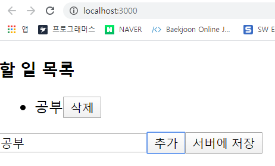
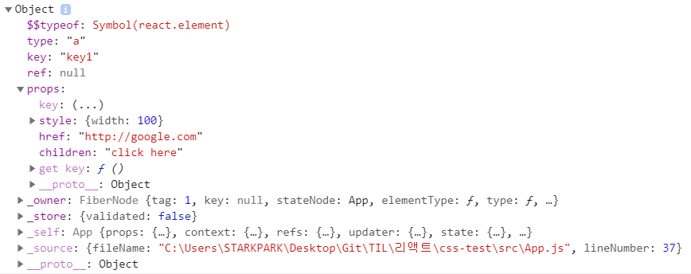
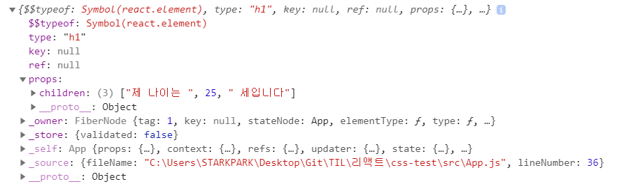
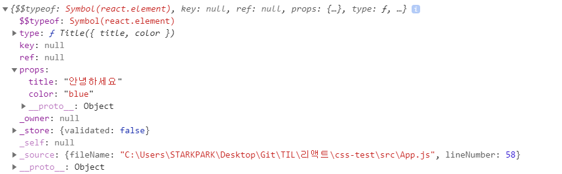
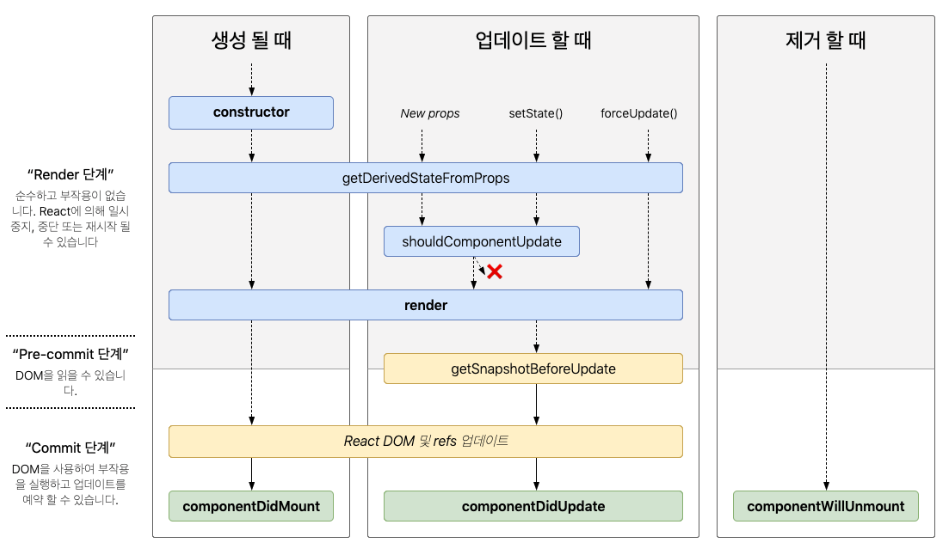

## 3.1 상탯값과 속성값으로 관리하는 UI 데이터 

**UI 데이터**는 컴포넌트 내부에서 관리되는 **상탯값**과 부모 컴포넌트에서 내려 주는 **속성값**으로 구성된다. 

리덕스와 같이 전역 데이터를 관리해주는 라이브러리도 결국에는 컴포넌트의 상탯값과 속성값을 이용해서 구현

 리액트는 화면을 그리는 모든 코드는 컴포넌트의 렌더함수로 작성하도록 했고, UI 데이터가 변경되면 리액트가 렌더함수를 이용해서 화면을 자동으로 갱신해준다.

### 3.1.1 리액트를 사용한 코드의 특징 

- 리액트로 작성한 코드

  ```html
  import React, { Component } from 'react';
  
  class App extends Component {
    state = { desc : '', currentId:1, todoList : [] }; 
    onAdd = () =>{ 
      const {desc, currentId, todoList } = this.state; 
      const todo = { id : currentId, desc }; 
      this.setState({
        currentId : currentId + 1, 
        todoList : [...todoList, todo]
      })
    }
  
    onDelete = (e) => { 
      const {todoList} = this.state; 
      const id = Number(e.target.dataset.id); 
      const newTodoList = todoList.filter( todo => todo.id !== id ); 
      this.setState({
        todoList : newTodoList
      })
    }
  
    onSaveToServer = () => { 
      // todoList 전송 
    }
  
    onChangeDesc = (e) =>{ 
      const desc = e.target.value; 
      this.setState({ desc }); 
    }
  
    render() {
      const {desc, todoList } = this.state; 
  
      return (
        <div>
          <h3>할 일 목록</h3>    
          <ul> 
            {todoList.map(todo => (
              <li key = {todo.id}>
                <span>{todo.desc}</span>
                <button data-id={todo.id} onClick={this.onDelete}> 삭제 </button>
              </li>
            ))}
          </ul>
          <input type="text" value={desc} onChange={this.onChangeDesc} />
          <button onClick={this.onAdd}> 추가 </button>
          <button onClick={this.onSaveToServer}> 서버에 저장 </button>
        </div>
      );
    }
  }
  export default App;
  ```

  

  리액트는 상탯값이 수정되면 render 메서드를 실행해서 화면을 갱신할 수 있다. 

  리액트의 렌더 함수가 선언형으로 작성되기 때문에 리액트는 돔 환경뿐만 아니라 모바일 네이티브의 UI 도 표현할 수 있다. 

  

### 3.1.2 컴포넌트의 속성값과 상탯값 

#### 속성값과 상탯값으로 관리하는 UI 데이터 

**컴포넌트의 상탯값** : 해당 컴포넌트가 관리하는 데이터 

**컴포넌트의 속성값** : 부모 컴포넌트로부터 전달받는 데이터 

리액트에서 UI 데이터는 반드시 상탯값과 속성값으로 관리해야한다. 

- 컴포넌트의 상탯값을 사용하는 코드 

  ```jsx
  class MyComponent extends React.Component {
      state = { color: 'red' };
  	onClick = () => {
          this.setState({ color: 'blue' }); // this.color = 'blue'  이렇게 쓰면 x 
      };
  	render() {
          return (
              <button style={{ backgroundColor: this.state.color }} onClick={this.onClick}>
                  좋아요
              </button>
          );
      }
  }
  ```

  `setState` 메서드를 사용해야 리액트가 UI 데이터의 상탯값이 변경됨을 인지하고, 해당 컴포넌트를 다시 랜더링 한다. 

- 속성값을 사용한 코드 

  ```jsx
  function Title(props){
      return <p>{props.title}</p>
  }
  ```

  Title 컴포넌트는 부모 컴포넌트가 렌더링될 때마다 같이 렌더링되므로 title 속성값의 변경사항이 바로 화면에 반영된다. 

- 부모 컴포넌트에서 속성값을 내려주는 코드 

  ```jsx
  class Todo extends React.Component {
      state = { count: 0 };
  	onClick = () => {
          const { count } = this.state;
          this.setState({ count: count + 1 });
      };
  	render() {
          const { count } = this.state;
          return (
              <div>
                  <Title title={`현재 카운트: ${count}`} />
                  <button onClick={this.onClick}>증가</button>
              </div>
          );
      }
  }
  ```

- 속성값이 변경될 때만 렌더링되길 원한다면 `React.memo` 또는 `React.PureComponent` 를 이용

  ```jsx
  function Title(props){ 
  	return <p>{props.title}</p>
  }
  export default React.memo(Title); 
  
  export default class Title extends React.PureComponent{
      render(){ 
      	return <p>{this.props.title}</p>
      }
  }
  ```

  `memo` 함수의 인자로 함수형 컴포넌트를 입력하면, 컴포넌트의 상탯값이나 속성값이 변경되는 경우에만 렌더링된다. 


- 클래스형 컴포넌트는 리액트 내부에서 인스턴스로 존재한다. 각 인스턴스는 자신만의 메모리 공간을 갖고 있기 때문에, 같은 컴포넌트라고 하더라도 자신만의 상탯값이 존재한다. 

  ```jsx
  // 컴포넌트를 사용한 만큼 인스턴스 생성하기 
  function App(){ 
  	return (
      	<div>
          	<MyComponent /> // 같은 컴포넌트를 여러번 사용할수 있으며, 상태값은 
              <MyComponent /> // 인스턴스마다 별도로 존재 
          </div>
      )
  }
  ```

  

#### setState 메서드 이해하기 

`setState` 는 클래스형 컴포넌트에서 상탯값을 변경할 때 호출하는 메서드. `setState` 메서드로 입력된 객체는 기존 상탯값과 병합된다. 

- 상탯값을 일부만 변경하는 코드 

  ```jsx
  class MyComponent extends React.Component{ 
  	state = { 
          count1 : 0, 
          count2 : 0,
      }
  	onClick = () =>{ 
      	const {count1} = this.state ; 
          this.setState({count1 : count1 + 1}); 
      }
  }
  ```

  `setState` 메서드는 비동기로 상탯값을 변경한다. 

- setState 메서드를 연속해서 호출하는 코드 

  ```jsx
  class MyComponent extends React.Component {
      state = {
          count: 0,
      };
  	onClick = () => {
          this.setState({ count: this.state.count + 1 });
          this.setState({ count: this.state.count + 1 });
      };
  	render() {
          console.log('render called');
          // ...
      }
  }
  ```

  의도는 count 상탯값을 두 번 증가시키는 거지만, 의도대로 동작하지 않고 1만큼만 증가한다. 그 이유는 setState 메서드가 비동기적으로 동작하기 때문. 

  이를 해결하기 위해 setState 메서드의 인수로 함수를 사용 

  ```jsx
  onClcik = () => {
      this.setState ( prevState => ({count : prevState.count + 1}));
      this.setState ( prevState => ({count : prevState.count + 1}));
  }
  ```

  setState 메서드로 입력된 함수는 자신이 호출되기 직전의 상탯값을 매개변수로 받는다. 앞의 코드에서 첫번째 setState 호출이 변경한 상탯값이 두번째 setState 호출의 인수로 사용된다고 이해하면 된다. 따라서 위의 코드는 count 상탯값이 2만큼 증가한다. 

- 상탯값 로직을 분리해서 사용하는 패턴 

  ```jsx
  const actions = {
      init() {
          return { count: 0 };
      },
      increment(state) {
          return { count: state.count + 1 };
      },
      decrement(state) {
          return { count: state.count - 1 };
      },
  };
  
  class MyComponent extends React.Component {
      state = actions.init();
  	onIncrement = () => {
          this.setState(actions.increment);
      };
  	onDecrement = () => {
          this.setState(actions.decrement);
      };
  	// ...
  }
  ```

- 호출 순서가 보장되는 setState 메서드 

  ```jsx
  class MyComponent extends React.Component {
      state = {
          count1: 0,
          count2: 0,
      };
  	onClick = () => {
          const { count1, count2 } = this.state;
          this.setState({ count1: count1 + 1 }); // count1 이 먼저 증가 
          this.setState({ count2: count2 + 1 }); // count2 가 나중에 증가 
      };
  	render() {
          const { count1, count2 } = this.state;
          const result = count1 >= count2;	// 호출 순서대로 상태값이 변경되기에 항상 참 
      }
  }
  ```

- setState 메서드의 두번째 매개변수는 처리가 끝났을 때 호출된다. 

  ```jsx
  onClick = () => {
      this.setState({count:123}, ()=>console.log('count is 123'))
  }
  ```

  콜백함수는 상탯값 변경 후에 호출되기 때문에 변경된 상탯값을 기반으로 다음 작업을 처리할 때 유용하게 사용된다. 


#### 불변 객체로 관리하는 속성값과 상탯값 

속성값은 불변객체이지만 상탯값은 불변객체가 아니다. 하지만 상탯값도 불변 객체로 관리하는게 좋다. 

- 속성값 변경을 시도하는 코드 ( 불변객체를 변경하려하기에 에러 발생 )

  ```jsx
  function Title(props){
      props.title = 'abc'
  }
  ```

- 상탯값을 직접 수정하는 코드 

  ```jsx
  onClick = () =>{ 
  	this.state.comment = 'Hello'; 
      this.forceUpdate(); 
  }
  ```

  


### 3.2 리액트 요소와 가상 돔 

**리액트 요소**는 리액트가 UI를 표현하는 수단 

리액트는 렌더링 성능을 위해 가상 돔을 활용한다. 빠른 렌더링을 하기 위해 리액트는 메모리에 가상 돔을 올려놓고 이전과 이후의 가상 돔을 비교해서 변경된 부분만 실제 돔에 반영하는 전략을 채택했다. 

#### 3.2.1 리액트 요소 이해하기 

JSX 문법으로 작성된 코드는 리액트의 `createElement ` 함수로 변경된다. createElement 함수는 리액트 요소를 반환한다. 

- JSX 코드가 createElement 함수를 사용하는 코드로 변경된 예시 

  ```jsx
  const element = <a href="http://google.com"> click here </a> ; 
  							
  								▼
                                  
  const element = React.createElement(
  	'a', 
      {href :'http://google.com'}, 
      'click here'
  )
  ```

- 리액트 요소의 구조 

  ```jsx
  const element = (
      <a key="key1" style={{ width: 100 }} href="http://google.com">
          click here
      </a>
  );
  console.log(element);
  ```

  

  - `element` 변수는 createElement 함수가 반환한 리액트 요소

  - type 속성이 문자열이면 HTML 태그를 나타내고, 함수이면 우리가 작성한 컴포넌트를 나타낸다. 
  - JSX 코드에서 key 속성값을 입력하면 리액트 요소의 key 속성값으로 들어간다. 
  - JSX 코드에서 ref 속성값을 입력하면 리액트 요소의 ref 속성값으로 들어간다. 
  - key 와 ref 를 제외한 나머지 속성값은 리액트 요소의 props 속성값으로 들어간다. 

  

- JSX 코드에서 태그 사이에 표현식을 넣은 코드 

  ```jsx
  const element = <h1>제 나이는 {20 + 5} 세입니다</h1>;
  console.log(element);
  ```

  

  태그 사이의 값은 표현식을 기준으로 분할돼서 들어간다. 

- JSX 코드에서 컴포넌트가 사용되면 리액트 요소의 type 속성값은 해당 컴포넌트의 함수가 된다. 

  ```jsx
  // 컴포넌트가 리액트 요소로 변경된 예 
  function Title({ title, color }) {
      return <p style={{ color }}>{title}</p>;
  }
  const element = <Title title="안녕하세요" color="blue" />;
  console.log(element);
  ```

  

  JSX 에서 사용된 Title 컴포넌트는 리액트 요소의 type 속성값에 입력된다. 

  리액트는 type 속성값으로 전달된 함수를 호출해서 화면을 그리기 위한 충분한 정보를 얻을 수 있다. 

- 리액트 요소는 불변 객체이다. ( 속성값을 변경할 수 없다. )

  ```jsx
  const element = <a href="http://google.com">click here</a>;
  element.type = 'b';  // 에러 발생 
  ```

- ReactDOM.render 함수를 주기적으로 호출하는 코드 

  ```jsx
  let seconds = 0;
  function update() {
      seconds += 1;
      const element = (
          <div>
              <h1>안녕하세요</h1>
              <h2>지금까지 {seconds}초가 지났습니다.</h2>
          </div>
      );
      ReactDOM.render(element, document.getElementById('root'));
  }
  
  setInterval(update, 1000);
  ```

  1초마다 update 함수를 호출해서 화면을 갱신한다. 

  리액트 요소에서 변경되는 유일한 부분은 seconds 변수로 표현된 숫자부분. 따라서 앞의 코드에 의해 업데이트 되는 과정에서 리액트는 실제 돔의 h1 요소를 건드리지 않는다. 


#### 3.2.2 리액트 요소가 돔 요소로 만들어지는 과정 

- 하나의 화면을 표현하기 위해 여러 개의 리액트 요소가 트리 구조로 구성된다. 
- 리액트에서 데이터 변경에 의한 화면 업데이트는 **렌더단계**와 **커밋단계**를 거친다.
- **렌더단계** : 실제 돔에 반영될 변경 사항을 파악하는 단계 ( 이 때 가상 돔을 이용 ) 
- **커밋단계** : 파악된 변경 사함을 실제 돔에 반영하는 단계
- 가상 돔은 리액트 요소로부터 만들어진다. 리액트는 렌더링을 할 때마다 가상 돔을 만들고 이전의 가상 돔과 비교한다. ( 실제 돔의 변경 사항을 최소화하기 위한 과정 )


- 실제 돔으로 만드는 과정을 보여 줄 예제 코드 

  ```jsx
  import React, { Component } from 'react';
  
  class Todo extends Component {
    state = {
      priority : 'high',
    }
  
    onClick = () =>{ 
      const {priority} = this.state; 
      this.setState({priority : priority === 'high' ? 'low' : 'high'}); 
    }
  
    render() {
      const {title, desc} = this.props; 
      const {priority} = this.state; 
  
      return (
        <div>
          <Title title={title} />
          <p>{desc}</p>    
          <p>{priority === 'high' ? '우선순위 높음' : '우선순위 낮음'}</p>
          <button onClick={this.onClick}> 우선순위 변경 </button>
        </div>
      );
    }
  }
  
  class Title extends React.PureComponent{ 
    render(){
      const { title } = this.props; 
      return <p style ={{ color : 'blue' }}> {title} </p>
    }
  }
  export default Todo;
  ```

  ```jsx
  import React from 'react';
  import ReactDOM from 'react-dom';
  import './index.css';
  import App from './App';
  import * as serviceWorker from './serviceWorker';
  
  ReactDOM.render(<App title="리액트공부하기" desc="실전 리액트를 열심히읽는다" />, document.getElementById('root'));
  
  // If you want your app to work offline and load faster, you can change
  // unregister() to register() below. Note this comes with some pitfalls.
  // Learn more about service workers: https://bit.ly/CRA-PWA
  serviceWorker.unregister();
  ```

                                                                 

  ReactDOM.render 함수로 전달된 리액트 요소 트리의 구조는 아래와 같다. 

- 첫번째로 만들어지는 리액트 요소 

  ```jsx
  const initialElementTree = {
      type : Todo, 
      props : {
          title : '리액트 공부하기', 
          desc : '실전 리액트를 열심히 읽는다'.
      },
  }
  ```

- Todo 컴포넌트의 렌더 함수 호출 결과 

  ```jsx
  const elementTree = {
      type: 'div',
      props: {
          children: [
              {
                  type: Title,
                  props: { title: '리액트 공부하기' },
                  // ...
              },
              {
                  type: 'p',
                  props: { children: '실전 리액트를 열심히 읽는다' },
                  // ...
              },
              {
                  type: 'button',
                  props: {
                      onClick: function() {
                          /* Todo 컴포넌트의 onClick 함수 */
                      },
                      children: '우선순위 변경',
                  },
                  // ...
              },
          ],
      },
      // ...
  };
  ```

  트리의 루트는 `div` 태그로 변경된다. 아직 Title 컴포넌트가 존재하기 때문에 이 트리를 실제 돔으로 만들 수 없다. 

  리액트 요소 트리가 실제 돔으로 만들어지기 위해서는 모든 리액트 요소의 type 속성값이 문자열이어야한다. 이는 type 속성값이 문자열이어야 HTML 태그로 변환할 수 있기 때문이다. 

  그러기 위해서는 모든 컴포넌트의 렌더 함수가 호출되어야 한다. 

- Title 컴포넌트의 렌더 함수 호출 결과 

  ```jsx
  const elementTree = {
      type: 'div',
      props: {
          children: [
              {
                  type: 'p',
                  props: {
                      style: { color: 'blue' },
                      children: '리액트 공부하기',
                  },
                  // ...
              },
              {
                  type: 'p',
                  props: { children: '실전 리액트를 열심히 읽는다' },
                  // ...
              },
              {
                  type: 'p',
                  props: { children: '우선순위 높음' },
                  // ...
              },
              {
                  type: 'button',
                  props: {
                      onClick: function() {
                          /* Todo 컴포넌트의 onClick 함수 */
                      },
                      children: '우선순위 변경',
                  },
                  // ...
              },
          ],
      },
      // ...
  };
  ```

  Title 컴포넌트로 표현됐던 리액트 요소가 p 태그로 변경됐다. 이제 모든 type 속성값이 문자열이므로 실제 돔을 만들 수 있다. 

  위와 같이 실제 돔을 만들수 있는 리액트 요소 트리를 **가상 돔** 이라고 한다.

  최초의 리액트 요소 트리로부터 가상 돔을 만들고 이전 가상 돔과 비교해서 실제 돔에 반영할 내용을 결정하는 단계를 **렌더단계** 라고 부른다. 

  렌더단계는 `ReactDOM.render` 함수와 `setSTate` 메서드에 의해 시작된다. 

- setState 메서드 호출 후 만들어진 리액트 요소 트리 

  ```jsx
  const elementTree = {
      type: 'div',
      props: {
          children: [
              {
                  type: Title,
                  props: { title: '리액트 공부하기' },
                  // ...
              },
              {
                  type: 'p',
                  props: { children: '실전 리액트를 열심히 읽는다' },
                  // ...
              },
              {
                  type: 'p',
                  props: { children: '우선순위 낮음' }, // 2번 
                  // ...
              },
  // 아래 코드는 같음
  ```

  Title 컴포넌트는 PureComponent 로 만들어졌고, 속성값이 변하지 않았기 때문에 이전 결과가 재사용된다. 

  이전의 가상 돔과 비교해보면 2번의 문자열만 변경되었기때문에, 실제 돔에서도 p 태그의 문자열만 수정된다

  지금까지 리액트 요소를 이용해서 렌더단계를 설명했지만, 엄밀히 말하면 리액트 요소는 파이버(fiber) 라는 구조체로 변환된다. 파이버는 리액트 버전 16부터 도입된 구조체 이름으로 리액트 요소와 같이 type, props 속성값을 갖는다. 

  파이버로 동작할 때도 모든 type 속성값이 문자열이 될 때까지 연산한다는 사실에는 변함이 없다. 


### 3.3 생명 주기 메서드 

모든 컴포넌트는 다음과 같이 3 단계를 거친다. 

- 초기화 단계
- 업데이트 단계
- 소멸단계

각 단계에서 몇 개의 메서드들이 정해진 순서대로 호출된다. 각 단계 속에서 호출되는 메서드를 생명주기 메서드라고 부른다. 




- **초기화 단계** ( 생성될 때 )  : 최초에 컴포넌트 객체가 생성될 때 한번 수행된다. 

- 초기화 단계에서 호출되는 생명주기 메서드의 호출 순서는 다음과 같다

  - `constructor()`
  - `static getDerivedStateFromProps()`
  - `render()`
  - `componentDidMount()`

- **업데이트단계** : 초기화 단계와 소멸 단계 사이에서 반복해서 수행된다.  컴포넌트의 속성값 또는 상탯값이 변경되면 업데이트 단계가 수행된다. 

- 업데이트 단계에서 실행되는 생명주기 메서드의 호출 순서는 다음과 같다. 

  - `static getDerivedStateFromProps() `
  - `shouldComponentUpdate() `
  - `render()`
  - `getSnapshotBeforeUpdate()` 
  - `componentDidUpdate()`

- **소멸단계** 에서는 다음의 생명주기 메서드가 호출된다. 

  - `componentWillUnmount()`

- 앞의 세단계와 별개로 렌더링 시 예외가 발생하면 다음 메서드가 호출된다. 

  - `static getDerivedStateFromError()`
  - `componentDidCatch()`

  

생명주기 메서드 정리 사이트 : http://projects.wojtekmaj.pl/react-lifecycle-methods-diagram/


#### 3.3.1 constructor 메서드 

constructor 메서드의 구조 : `constructor(props)` 

- props 매개변수는 컴포넌트의 기본 속성값이 적용된 상태로 호출된다. 

- constructor 메서드 내부에서 반드시 super 함수를 호출해야한다. 

- constructor 메서드의 기본 구조 

  ```jsx
  class MyComponent extends React.Component{
      constructor(props){ 
      	super(props); 
      }
  }
  ```

  super 함수를 호출해야 React.Component 클래스의 constructor 메서드가 호출된다. 

  리액트 개발 모드에서는 super 함수를 호출하지 않는 경우 예외를 발생시킨다. 

- constructor 메서드 작성이 필요한 대표적인 예 -> 초기 속성값으로부터 상태값을 만드는 경우 

  ```jsx
  class MyComponent extends React.Component{
      constructor(props){
          super(props); 
          this.state = { 
          	currentMovie : props.age < 10 ? '뽀로로' : '어벤져스',
          }
      }
  }
  ```

  이렇게 상탯값을 직접 할당하는 것은 constructor 메서드에서만 허용된다. 

  다른 생명주기 메서드에서 상탯값을 변경할 때는 setState 메서드를 사용해야한다. 

- 클래스 필드를 사용하면 constructor 메서드 없이 같은 기능을 구현할 수 있다. 

  ```jsx
  class MyComponent extends React.Component{ 
  	state = {
          currentMovie : this.props.age < 10 ' 뽀로로' : '어벤져스', 
      }
  }
  ```

  참고로 `create-react-app` 에서도 클래스 필드는 지원한다. 

  

  위의 코드는 currentMovie 상태값이 초기에만 age 속성값에 의존적이라고 가정한 코드지만, 만약 currentMovie 상태값이 항상 age 속성값에 의존적이라면 다른 방법을 사용해야한다. 한 가지 방법은 별도의 함수를 만들어서 필요할 때마다 함수를 호출하는 것 

  ```jsx
  // 속성값에 항상 의존적인 상탯값을 함수로 대체한 코드 
  class MyComponent extends React.Component { 
  	getCurrentMovie(){ 
      	const {age} = this.props; 
          return age < 10 ? '뽀로로' : '어벤져스';
      }
  }
  ```


#### constructor 메서드에서는 setState 메서드를 호출하지 말자 

setState 메서드 호출은 컴포넌트가 마운트된 이후에만 유효하기 때문에 다음과 같이 constructor 메서드 내부에서 호출되는 setState 메서드는 무시된다. 

- constructor 메서드에서 setState 메서드를 호출하는 잘못된 예시

  ```jsx
  class MyComponent extends React.Component{ 
  	constructor(props){
          super(props);
          this.state = {
              count : 0,
          }
          this.setState({count:10}); // 무시도니다. 
      }
      render(){
          const {count} = this.state; 
          return <div> {count} </div> ; // 초기값 0이 출력된다. 
      }
  }
  ```

  위와 마찬가지로 constructor 메서드에서 비동기로 데이터를 가져온 후 setState 메서드를 호출하는 것도 문제가 될 수 있다. 

- constructor 메서드에서 API 를 호출하는 잘못된 예시 

  ```jsx
  class MyComponent extends React.Component {
      state = {
          products: [],
      };
  	constructor(props) {
          super(props);
          callApi('/products').then(data => {
              // ...
              this.setState({ products: data }); // 1번
          });
      }
  }
  ```

  비동기로 받아온 데이터를 setState 메서드를 이용해서 상탯값으로 저장하는데, 만약 마운트되기 전에 데이터가 도착하면 1번 줄의 setState 호출은 무시된다. 따라서 데이터를 가져오기 위해 호출하는 API 는 이후에 설명할 `componentDidMount` 메서드 내부에서 호출하는게 적절하다. 

  

#### 3.3.2 getDerivedStateFromProps 메서드 

- `getDerivedStateFromProps` 메서드는 **속성값을 이용해서 새로운 상탯값을 만들때 사용**된다. 이 메서드는 render 메서드가 호출되기 직전에 호출된다. 

- getDerivedStateFromProps 메서드의 구조  :  `static getDerivedStateFromProps(props, state)`

- 정적 메서드이기때문에 함수 내부에서 this 객체에 접근할 수 없다. 오로지 속성값과 상탯값을 기반으로 새로운 상탯값을 만든다.

- getDerivedStateFromProps  메서드는 시간에 따라 변하는 속성값으로부터 상탯값을 계산하기 위해 추가됐다.

- 매개변수에 현재 속성값은 있어도 이전 속성값은 없다. 따라서 다음과 같이 상탯값에 이전 속성값을 저장해야한다. 

  ```jsx
  // getDerivedStateFromProps 메서드에서 이전 속성값 이용하기 
  class MyComponent extends React.Component {
      state = {
          // ...
          prevSpeed: this.props.speed,	// 이전 속성값을 저장하기 위한 용도 
      };
  	static getDerivedStateFromProps(props, state) {
          if (props.speed !== state.prevSpeed) {	// 속성값이 변경된 경우에 필요한 처리
              // ...								
              return {
                  // ...
                  prevSpeed: props.speed,		// 변경된 속성값을 상탯값으로 저장 
              };
          }
          return null;		// 상탯값을 변경할 필요가 없다면 null을 반환 
      }
  }
  ```

  이전 속성값을 넣을 경우 최초에 호출될 때는 이전 속성값이 없기때문에 항상 null 을 검사하는 코드가 필요.

  앞으로 모든 생명주기 메서드의 매개변수에서 이전 속성값을 제거할 예정이다. 이전 속성값이 필요없어지면 더 이상 메모리에 담고 있지 않아도 되기때문에 메모리를 절약할 수 있다. 

- 다음 3가지는 `getDerivedStateFromProps ` 메서드를 **잘못 사용**하는 대표적인 경우 

  - **속성값 변화에 따른 API 를 호출해야하는 경우** 

    getDerivedStateFromProps 메서드는 정적 메서드이기 때문에 this 객체에 접근할 수 없다. 보통 API 호출은 this 객체가 필요한 경우가 많기떄문에 getDerivedStateFromProps 메서드로 해결되지 않는다. 그런 경우 componentDidUpdate 메서드에서 처리할 수 있다. 

    ```jsx
    // componentDidUpdate 메서드에서 API 를 호출하는 코드 
    class MyComponent extends React.Component{ 
    	componentDidUpdate(prevProps){
            const { productId } = this.props; 
            if(prevProps.productId !== productId){ 
            	this.requestData(productId);
            }
        }
    }
    ```

    requestData를 호출하려면 this 객체가 필요하므로 getDerivedStateFromProps 메서드에서는 호출할 수 없다. 

  - **속성값을 입력으로 하는 메모이제이션** 

    ```jsx
    // getDerivedStateFromProps 메서드를 이용한 메모이제이션 
    class MyComponent extends React.Component {
        static getDerivedStateFromProps(props, state) {
            const { products } = props;
            if (products !== state.prevProducts) {
                return {
                    filteredProducts: products.filter(product => product.price < 1000),
                    prevProducts: products,
                };
            }
            return null;
        }
        render() {
            const { filteredProducts } = this.state;
            return <div>{filteredProducts.map(/* ... */)}</div>;
        }
    }
    ```

    상품리스트가 변경된 경우 filterProducts 값을 새로 계산. 

    getDerivedStateFromProps 메서드를 이용한 메모이제이션은 최소 두 개의 상태값이 필요하다. 상탯값이 많아지면 컴포넌트 코드가 복잡해지므로 되도록 상탯값의 개수를 최소화하는게 좋다. 

    --> render 메서드에서 직접 메모이제이션을 하는것이 좋다. 

    ```jsx
    // 로다시 패키지를 이용한 메모이제이션의 예 
    import memoize from 'lodash/memoize';
    
    class MyComponent extends React.Component {
        getFilteredProducts = memoize(function(products) {
            return products.filter(product => product.price < 1000);
        });
    	render() {
            const { products } = this.props;
            const filteredProducts = this.getFilteredProducts(products);
            return <div>{filteredProducts.map(/* ... */)}</div>;
        }
    }
    ```

    메모이제이션을 위해 로다시 패키지의 `memoize` 함수를 이용

    getFilteredProducts 메서드는 products 매개변수가 변경되는 경우에만 계산하고, 변경되지 않으면 이전의 결과를 반환 

    render 메서드가 호출될 때마다 getFilteredProducts 메서드를 호출한다. 

    결과적으로 메모이제이션을 위해 상탯값을 추가할 필요가 없어졌다. 

  - **속성값 변경시 상탯값 초기화** 

    getDerivedStateFromProps 메서드에서 속성값 변경 시 상탯값을 초기화하는 코드는 지양해라 

    ```jsx
    // 속성값 변경 시 상탯값을 초기화하는 코드 
    class PriceInput extends React.Component {
        static getDerivedStateFromProps(props, state) {
            if (props.price !== state.prevPrice) {
                return {
                    price: props.price,
                    prevPrice: props.price,
                };
            }
            return null;
        }
        onChange = event => {
            const price = Number(event.target.value);
            if (!Number.isNaN(price)) {
                this.setState({ price });
            }
        };
    	render() {
            const { price } = this.state;
            return <input onChange={this.onChange} value={price} />;
        }
    }
    ```

    price 속성값이 변경되면 price 상태값을 새로운 값으로 초기화한다. 

    price 상태값은 사용자 입력에 의해 변경될 수 있다.

    상품 정보를 수정하는 페이지를 개발한다고 가정할 때, priceInput 의 부모 컴포넌트는 상품 정보를 가진 ProductEdit 컴포넌트라고 한다. 만약 상품이 변경되면 PriceInput 컴포넌트의 price 상태값도 초기화되어야 한다. 하지만 앞의 코드는 두 상품의 가격이 같다면 price 상태값은 초기화되지 않는다.

    이 문제를 해결하는 **첫번째 방법은 PriceInput 컴포넌트에 key 속성값을 부여** 

    ```jsx
    // key 속성값을 이용한 코드 
    class ProductEdit extends React.Component {
        // ...
        render() {
            const { product } = this.props;
            return <PriceInput key={product.id} price={product.price} />;
        }
    }
    
    class PriceInput extends React.Component {
        state = {
            price: this.props.price,
        };
    	onChange = event => {
            const price = Number(event.target.value);
            if (!Number.isNaN(price)) {
                this.setState({ price });
            }
        };
    	render() {
            const { price } = this.state;
            return <input onChange={this.onChange} value={price} />;
        }
    }
    ```

    컴포넌트에 key 속성값을 부여하고 key 값을 변경하면 이전의 컴포넌트 인스턴스는 사라지고 새로운 인스턴스가 생성된다. 

    PriceInput 컴포넌트에서는 초기 가격만 상태값에 넣으면 되므로, getDerivedStateFromProps 메서드는 필요 없게 된다.

    **두번째 방법은 상탯값을 부모 컴포넌트에서 관리하는 것** 

    ```jsx
    class ProductEdit extends React.Component {
        state = {
            currentPrice: this.props.product.price,
        };
    	onChangePrice = event => {
            const currentPrice = Number(event.target.value);
            if (!Number.isNaN(currentPrice)) {
                this.setState({ currentPrice });
            }
        };
    	render() {
            const { currentPrice } = this.state;
            return <PriceInput onChange={this.onChangePrice} price={currentPrice} />;
        }
    }
    
    function PriceInput({ price, onChange }) {
        return <input onChange={onChange} value={price} />;
    }
    ```

    이전에 PriceInput 컴포넌트가 갖고 있던 상태값을 부모 컴포넌트가 관리한다.

    상태값을 변경하는 이벤트 처리 메서드도 부모 컴포넌트에서 정의한다. priceInput 컴포넌트에서 상탯값과 이벤트 처리 메서드를 구현할 필요가 없기에 함수형 컴포넌트로 정의할 수 있다. 


- getDerivedStateFromProps 메서드가 필요한 경우 

  getDerivedStateFromProps  메서드가 유의미한 경우는 다음과 같이 이전 속성값과 이후 속성값 모두에 의존적인 상탯값이 필요한 경우 

  ```jsx
  // 상탯값이 전후 속성값에 의존적인 경우 
  class MyComponent extends React.Component {
      state = {
          // ...
          prevSpeed: this.props.speed,
          isMovingFaster: false,
      };
  	static getDerivedStateFromProps(props, state) {
          if (props.speed !== state.prevSpeed) {
              return {
                  isMovingFaster: state.prevSpeed < props.speed,
                  prevSpeed: props.speed,
              };
          }
          return null;
      }
  }
  
  ```

  isMovingFaster 상태값은 이전 속성값과 이후 속성값으로 계산된다. 따라서 전후 속성값에 의존적이므로 getDerivedStateFromProps 메서드를 사용하는 것이 적절하다. 


#### 3.3.3 render 메서드 


