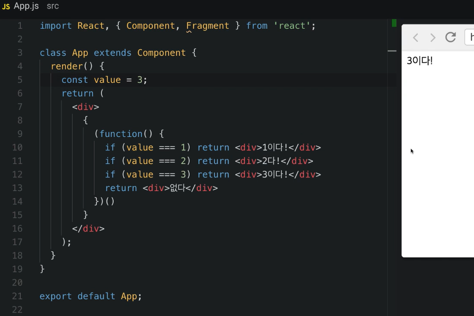

### HTML 이랑 비슷하지만 지켜야할 규칙

1. **꼭 닫혀야 하는 태그** 

   태그는 꼭 닫혀있어야한다. `
` 태그를 열었으면 `
` 를 통하여 태그를 꼭 닫아야한다. 

input 태그가 닫혀있지 않아서 발생하는 에러.  input 태그는 `<input ...  /> ` 이렇게 닫을 수 있다.

2. 감싸져 있는 엘리먼트 

   두 개 이상의 엘리먼트는 무조건 하나의 엘리먼트로 감싸져있어야한다. 

`Fragment` 라는 것을 이용하면, 추가적인 `
` 필요없이 감쌀 수 있다. 

### JSX 안에 자바스크립트 값 사용하기 

`{ } ` 를 이용하면 된다. 

### var - const - let 

- `let` 과 `const` 는 스코프가 블럭 단위 .

  ​	`let` 은 유동적인 값을 표현할 때 사용. 

  ​	`consts` 는 한 번 선언 후 고정적인 값을 표현할 때 사용 

- `var` 의 스코프는 함수 단위. 

  ​	`var` 은 ES6 에서는 더이상 사용하지 않는다. 

### 조건부 렌더링 

- **삼항연산자를 사용.** 

- **&& 연산자를 사용.** 

- 즉시 실행 함수를 사용. 

- 화살표 함수를 사용.

화살표함수 참고 링크 : [https://developer.mozilla.org/ko/docs/Web/JavaScript/Reference/Functions/%EC%95%A0%EB%A1%9C%EC%9A%B0_%ED%8E%91%EC%85%98](https://developer.mozilla.org/ko/docs/Web/JavaScript/Reference/Functions/애로우_펑션)

### JSX에서 CSS 사용하기

style 을 사용할 때에는 객체의 형태로 넣어줘야한다. `-` 대신에 CamelExpression 으로 표현한다.  

### JSX 에서 Class 사용하기 

`className` 으로 사용. 

### JSX 에서 주석 사용하기

`{/* */}` , ` // ` 을 사용 .

velopert 블로그 참고 문서 : https://react-anyone.vlpt.us/03.html