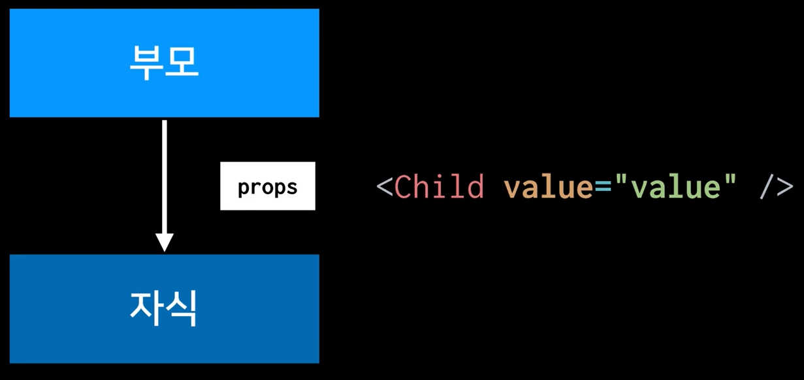
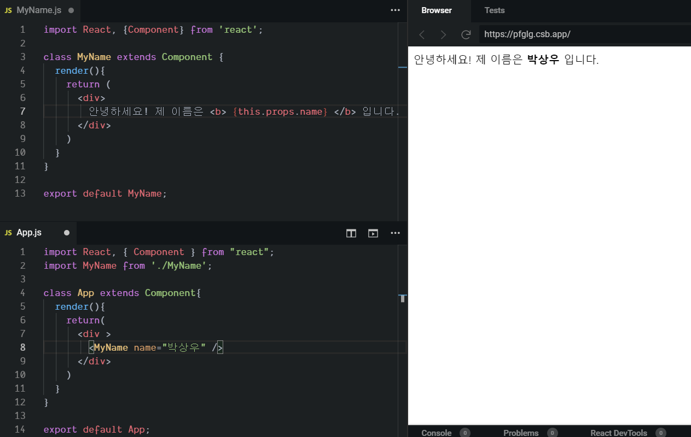
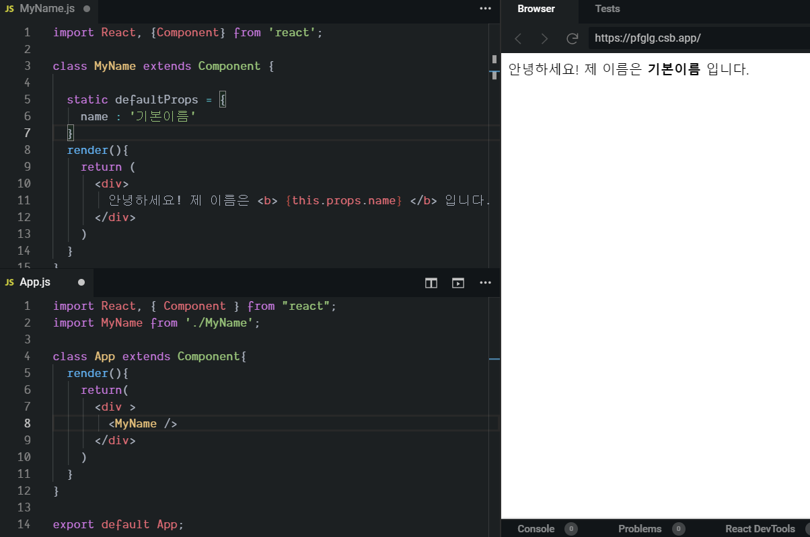
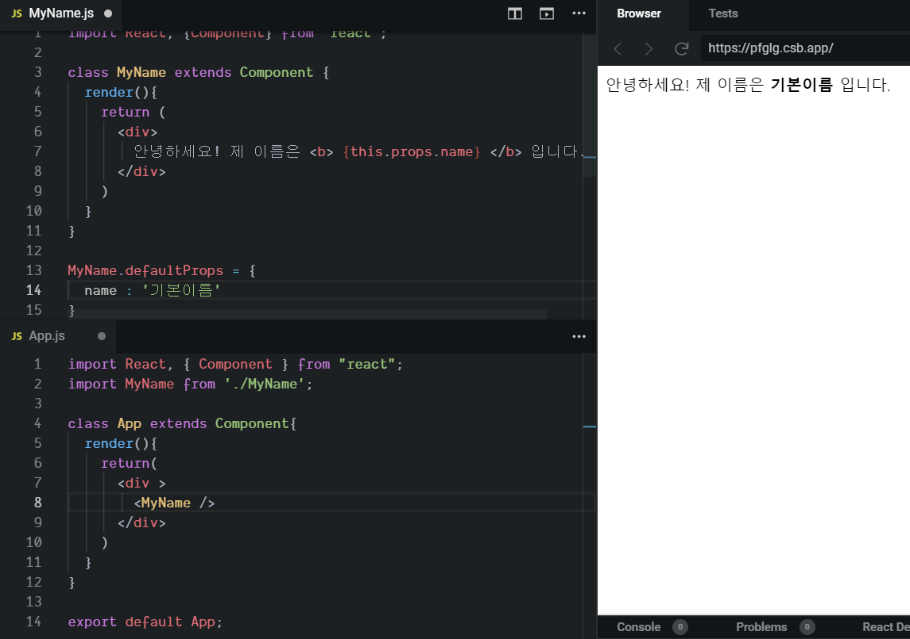
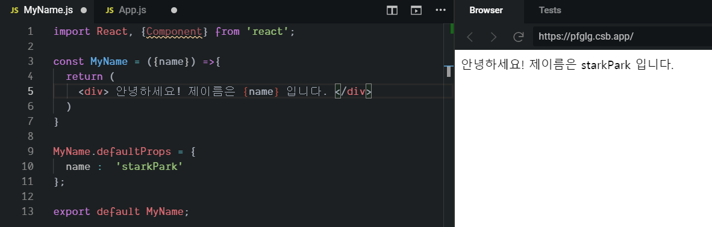
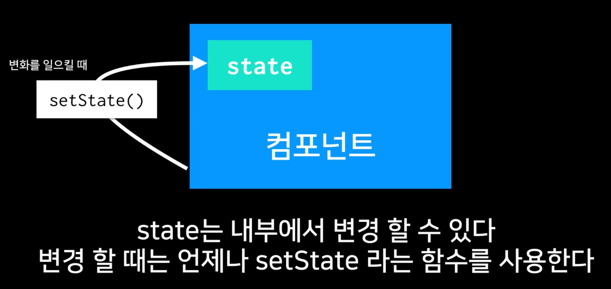
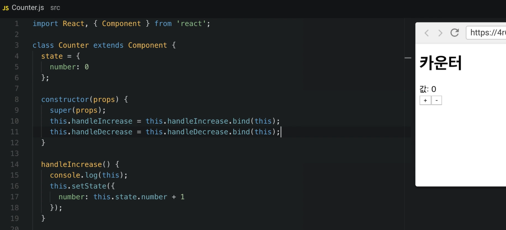

# Props 와 State

리액트에서 데이터를 다루기 위한 개념 : props  , state 

**Props** : 부모 컴포넌트가 자식 컴포넌트한테 값을 전달할 때 사용. 

default props 사용. 

- 첫번째 방법 ( 주로 사용 )

- 두번째 방법

### 함수형 컴포넌트 

함수형 컴포넌트가 클래스형 컴포넌트에 비해 미세하게 마운트 속도가 빠르다. 

### State

**state** : 자기 자신이 들고 있는 값. 변경이 가능한 값이다. 

변화를 주기 위해서는 `setState` 를 이용한다.   값이 바뀔때마다 컴포넌트가 rerendering 된다. 

만약 변경할때의 함수를 화살표함수가 아닌 것으로 사용했을 때는 아래와 같이 생성자에서 this 를 묶어줘야한다. 

