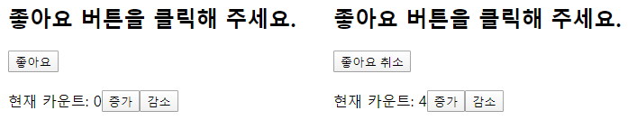
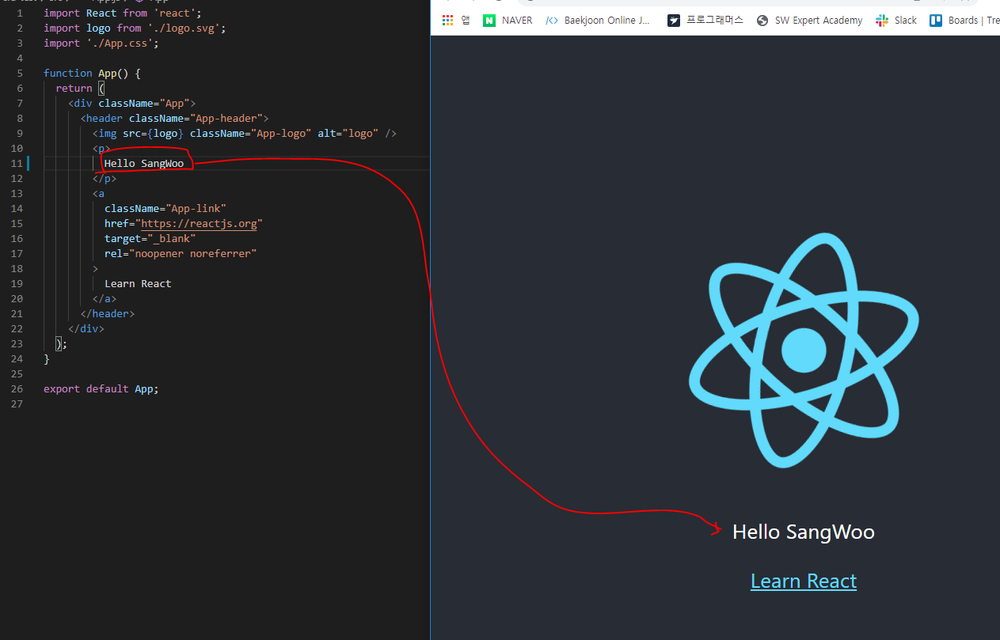

# React


- **리액트란 ??**

  페이스북에서 개발하고 관리하는 UI 라이브러리. 

- 리액트가 나온 이유 


- 페이지 전체가 바뀌는 것이 아닌 데이터만 변화하기 때문에, 변한 데이터 부분만 바뀌어야한다. 이 때 좀더 효율적이고 
-  UI 에 특화되어있다. ( 사용자가 데이터를 입력하고, 입력된 데이터를 보는 것에 특화 )
- UI 를 제외한 나머지는 개발자가 다 개발해야한다. ( 개발 공수가 많아진다. -> 처음 리액트를 시작하는 사람들에게는 진입 장벽이 높다. )


create-react-app  : 리액트의 진입 장벽을 낮추기 위해서 제공. 


- 작업 디렉터리 생성. 

1. 명령 프롬프츠 (cmd.exe) 실행 

2. 작업 디렉터리 생성 및 이동 - `mkdir` 명령어 이용 \

   ```bash
   C:\>mkdir react
   
   C:\>cd react
   ```

3. Visual Studio Code 실행 

4. C:\react 디렉터리 작업 공간 열기. 

5. create-react-app 패키지 설치

   ```bash
   C:\react>npm install -g create-react-app
   C:\Users\HPE\AppData\Roaming\npm\create-react-app -> C:\Users\HPE\AppData\Roaming\npm\node_modules\create-react-app\index.js
   + create-react-app@3.3.1
   added 99 packages from 47 contributors in 15.236s
   ```

6. create-react-app으로 리액트 프로젝트 생성 

   ```bash
   C:\react>create-react-app hello-react  //react 기반의 javascript 어플리케이션 프로젝트 생성 
   Creating a new React app in C:\react\hello-react.
   
   			................
   			
   Success! Created hello-react at C:\react\hello-react
   Inside that directory, you can run several commands:
   
     npm start								// 개발 모드로 프로그램을 실행하는 명령어
       Starts the development server.
   	
     npm run build						// 배포환경에서 사용할 파일을 만들어 주는 명령어
       Bundles the app into static files for production.
   
     npm test							// 테스트 코드를 실행하는 명령어
       Starts the test runner.
   
     npm run eject				// 숨겨져있던 create-react-app의 내부 설정 파일을 밖으로 노출
       Removes this tool and copies build dependencies, configuration files
       and scripts into the app directory. If you do this, you can’t go back!
   
   We suggest that you begin by typing:
   
     cd hello-react
     npm start
   
   Happy hacking!
   
   ```

7. 디렉터리 이동 후 실행 

   ```bash
   C:\react>cd hello-react
   C:\react>npm start
   ```


bootstrap : 뭔가를 시작하려 할 때 기본이 되는 요소를 잡아주는 작업. 

`App.js` 파일을 수정하면 react-app 을 간단하게 만들 수 있다.  -> jsx 문법을 기반으로 만들어진 코드. 


UI 란 어떤 화면의 상태. 값이 바뀌었을 때 랜더링 되어서 화면에 보여지는 것. ( 값(상태)은 사용자가 액션을 가했을 때나, Ajax 통신을 통해 데이터를 가져왔을 때 바뀐다. )


DOM ( Document object Model )


가상 돔 ( Virtual DOM )

​	: 문서를 통으로 업데이트 하는 것이 아닌, 문서의 변경된 부분만 업데이트. 

---

### React 개발 환경 직접 구축 

#### p3_ 외부 패키지를 사용하지 않고 리액트 웹 페이지 제작


0. 작업 디렉터리 생성 

   ```bash
   C:\react\hello-world
   ```

1. 리액트 라이브러리 다운로드. 

   https://unpkg.com/react@16.12.0/umd/react.development.js

   https://unpkg.com/react@16.12.0/umd/react.production.min.js

   https://unpkg.com/react-dom@16.12.0/umd/react-dom.development.js

   https://unpkg.com/react-dom@16.12.0/umd/react-dom.production.min.js

   위의 링크들을 `다른 이름으로 저장` -> `C:\react\hello-world` 밑에 저장 

   

   `development` : 개발 환경에서 사용하는 파일 -> 에러 메시지 확인이 가능 ( 문제를 쉽게 찾을 수 있는 기능 )

   `production` : 실행(배포) 환경에서 사용하는 파일 -> 최적화가 되어있다. ( 똑같은 내용이지만 조금 불필요한 내용을 빼고 압축되어 있다 )

   `react` : 플랫폼 구분 없이 공통으로 사용되는 파일. ( 리액트 코어 )

   `react-dom` : 웹 환경에서 사용되는 파일. 

2. `C:\react\hello-world\sample1.html` , `C:\react\hello-world\sample1.js`파일 생성 

3. 아래 화면과 같은 출력을 제공하는 `sample1.html` 파일 작성 

   

  3-1. react 를 사용하지않고 처리 ( jQuery 기반으로 구현 )

```html
<!-- P5 코드1-1 -->
<html>
    <body>
        <h2>프로젝트가 마음에 들면 좋아요 버튼을 클릭해 주세요</h2>
        <div id="react-root">
            <button>좋아요</button> <!-- #1 -->
        </div>

        <!-- jQuery 기반으로 구현 -->
        <script src="https://ajax.googleapis.com/ajax/libs/jquery/3.4.1/jquery.min.js"></script>
        <script>
            $(function() {
                //  liked 변수의 값이 false 이면 좋아요 취소
                //                   true 이면 좋아요 
                //  버튼을 클릭하면 liked 변수의 값은 토글
                let liked = false; /* #2 */
                $('button').click(function() {
                    liked = !liked;
                    if (liked) $(this).text('좋아요');
                    else $(this).text('좋아요 취소');
                });
                    
                $('button').trigger('click'); /* #3 */
            });  
        </script>
    </body>
</html>

```

⇒ 상태값(#1)과 사용자 화면(#2)의 불일치가 발생

⇒ 이를 보완하기 위해 #3와 같은 코드가 추가되어야 함


컴포넌트 : class 형태로 정의되어 있는 형태 


  3-2. react 기반으로 구현 

  ```html
<html>
    <body>
        <h2>프로젝트가 마음에 들면 좋아요 버튼을 클릭해 주세요</h2>
        <div id="react-root"></div>

        <script src="react.development.js"></script>
        <script src="react-dom.development.js"></script>
        <script>
            //  P6 코드1-2
            class LikeButton extends React.Component {
                constructor(props) {
                    super(props);
                    this.state = { liked: false };
                }
                render() {
                    const text = this.state.liked ? '좋아요 취소' : '좋아요';
                    return React.createElement(
                        'button',
                        /*
                        { onClick: () => this.setState({ liked: true }) },
                        */
                        { onClick: () => { 
                            console.log(this.state.liked); 
                            this.setState({ liked: !this.state.liked }); 
                        } },
                        text,
                    );
                }
            }
            const domContainer = document.querySelector('#react-root');
            ReactDOM.render(React.createElement(LikeButton), domContainer);
        </script>
    </body>
</html>
  ```

일반적으로 생성자에는 초기화 모듈이 들어간다. 

constructor - > 생성자 

super : 내가 extend 한 상위 객체 ( React.Component ) 를 초기화 시켜주는 것. 


property : 부모로부터 전달받은 값 .

state : 자기 자신이 가지고 있는 값. 


render () : 사용자 화면에 보여주는 내용들. 


- createElement 함수 : 리액트에서 태그를 만들어주는 것. 

  - 첫번째 매개변수 : 문자열이나 리액트 컴포넌트다. 
  - 두번째 매개변수 : 컴포넌트가 사용하는 데이터
  - 세번째 매개변수 : 해당 컴포넌트가 감싸고 있는 내부의 컴포넌트를 가리킨다. 

  ```html
  <div>
      <p>hello</p>
      <p>world</p>
  </div>
  --------------- 위의 코드를 createElement 함수를 이용하여 작성 ---------------
  createElement(
  	'div',
  	null,
  	createElement('p',null,'hello'),
  	createElement('p',null,'world'),
  )
  ```


4. `http-server` 를 실행해서 확인. 

   - ```bash
     C:\react>npx http-server 
     
     // 만약 위의 경우가 되지 않을 경우 캐쉬에 저장되어있어서 정확하게 반영이 안될 경우도 있기 때문에
     C:\react>npx http-server -c-1 
     // -c-1 내가 주는 파일을 캐싱하지마라. 그러나 js파일은 캐쉬 메모리 제어가 불가능할 수도 있다. 
     ```

   - 브라우저로 접속해서 확인 -> http://localhost:8080/hello-world/sample1.html

   - 만약 브라우저에서 새롭게 반영한 내용이 안보일경우 캐시 해제 ( 위에 서버를 띄울 때 해제해도 되지만 아래와 같이 Network 설정에서 해제할 수도 있다. )


상태와 화면을 하나로 묶어서 상태가 바뀌면 화면이 자동으로 랜더링 되도록 하는 기능을 리액트가 제공한다. 


5. **여러개의 DOM 요소를 랜더링.**

   ​											

   ​													


   5-1. jQuery 를 이용한 구현 ( # 3-1 코드를 응용)

   ```html
<html>
    <body>
        <h2>프로젝트가 마음에 들면 좋아요 버튼을 클릭해 주세요</h2>
        <div id="react-root">
            <button id="btn1">좋아요</button> <br>
            <button id="btn2">좋아요</button> <br>
            <button id="btn3">좋아요</button> 
        </div>

        <!-- jQuery 기반으로 구현 -->
        <script src="https://ajax.googleapis.com/ajax/libs/jquery/3.4.1/jquery.min.js"></script>
        <script>
            $(function() {
                //  liked 변수의 값이 false 이면 좋아요 취소
                //                   true 이면 좋아요 
                //  버튼을 클릭하면 liked 변수의 값은 토글
                let liked1 = false;
                let liked2 = false;
                let liked3 = false;
                $('button#btn1').click(function() {
                    liked1 = !liked1;
                    if (liked1) $(this).text('좋아요');
                    else $(this).text('좋아요 취소');
                });
                $('button#btn2').click(function() {
                    liked2 = !liked2;
                    if (liked2) $(this).text('좋아요');
                    else $(this).text('좋아요 취소');
                });
                $('button#btn3').click(function() {
                    liked3 = !liked3;
                    if (liked3) $(this).text('좋아요');
                    else $(this).text('좋아요 취소');
                });
                    
                $('button#btn1').trigger('click');
                $('button#btn2').trigger('click');
                $('button#btn3').trigger('click');
            });  
        </script>
    </body>
</html>
   ```

구현은 되지만 동일한 코드를 여러번 반복해야하는 문제가 있다. 


​     5-2. react 를 이용하여 구현 (# 3-2 코드를 응용)

```html
<html>
    <body>
        <h2>프로젝트가 마음에 들면 좋아요 버튼을 클릭해 주세요</h2>
        <div id="react-root1"></div>
        <div id="react-root2"></div>
        <div id="react-root3"></div>

        <script src="react.development.js"></script>
        <script src="react-dom.development.js"></script>
        <script>
            //  P6 코드1-2
            class LikeButton extends React.Component {
                constructor(props) {
                    super(props);
                    this.state = { liked: false };
                }
                render() {
                    const text = this.state.liked ? '좋아요 취소' : '좋아요';
                    return React.createElement(
                        'button',
                        { onClick: () => { 
                            console.log(this.state.liked); 
                            this.setState({ liked: !this.state.liked }); 
                        } },
                        text,
                    );
                }
            }
            ReactDOM.render(React.createElement(LikeButton), document.querySelector('#react-root1'));
            ReactDOM.render(React.createElement(LikeButton), document.querySelector('#react-root2'));
            ReactDOM.render(React.createElement(LikeButton), document.querySelector('#react-root3'));
        </script>
    </body>
</html>
```

개별적인 LikeButton 인스턴스를 집어넣어주기만 하면 데이터나 함수를 개별적으로 동작시키는 것이 가능. 


- 기존의 코딩하는 방식과 리액트를 기반으로 했을 때의 코딩 방식의 차이점을 인식해라. 

---

#### 바벨

- 자바스크립트 코드를 변환해주는 컴파일러. 

- 높은 버전(ES6)이나 다른 형태의 자바 스크립트 ( TypeScript ) 등의 현재 많이 쓰는 환경에서 돌아가도록 형태를 바꿔준다. 이 과정에서 불필요한 요소(주석문,공백...)를 제거하여 압축. 
- 바벨을 이용하면 React 에서 사용하는 JSX 문법을 사용할 수 있다. 
- p13 - 프리셋 개념 참고. 


##### 실습 - 증가, 감소 버튼으로 count 상태값을 변경하는 코드를 작성. 



1-1.  **React.createElement 메소드를 이용해서 구현** 

→ 문서의 구조 및 엘리먼트의 포함 관계 등을 이해하기 어려움 →

 문서의 구조와 엘리먼트의 포함 관계를 쉽게 표현하고 파악할 수 있는 표현식이 필요 ⇒ JSX 

⇒ JSX로 작성한 코드를 바벨을 이용해서 React.createElement 메소드 형식으로 트랜스 컴파일

```html
<html>
    <body>
        <h2>프로젝트가 마음에 들면 좋아요 버튼을 클릭해 주세요</h2>
        <div id="react-root"></div>

        <script src="react.development.js"></script>
        <script src="react-dom.development.js"></script>
        <script>
            class LikeButton extends React.Component{
                constructor(props){
                    super(props);
                    this.state = {liked : false} ; 
                }

                render() {
                    const text = this.state.liked ? '좋아요 취소' : '좋아요' ; 
                    return React.createElement(
                        'button', 
                        { onClick : () => this.setState({liked: !this.state.liked}) },
                        text,  
                    );
                }
            }
            
            // p9 코드1-6 참조
            class Container extends React.Component{
                constructor(props){
                    super(props); 
                    this.state = {count:0};
                }

                render(){
                    return React.createElement(
                        'div',
                        null, 
                        React.createElement(LikeButton), 
                        React.createElement(
                            'div',
                            {style:{marginTop:20} }, 
                            React.createElement('span',null,'현재 카운트 : '),
                            React.createElement('span', null, this.state.count),
                            React.createElement(
                                'button',
                                { onClick : () => this.setState({count:this.state.count+1})}, 
                                '증가',
                            ),
                            React.createElement(
                                'button',
                                { onClick : () => this.setState({count:this.state.count-1})}, 
                                '감소',
                            ),
                        )
                    );
                }
            }
            
            ReactDOM.render(React.createElement(Container),document.querySelector("#react-root"));
        </script>
    </body>
</html>
```


1-2. **JSX 버전으로 변경**

```html
<!-- C:\react\hello-world\sample4.html -->
<html>
    <body>
        <h2>프로젝트가 마음에 들면 좋아요 버튼을 클릭해 주세요</h2>
        <div id="react-root"></div>

        <script src="react.development.js"></script>
        <script src="react-dom.development.js"></script>
        <script src="sample4.js"></script>
    </body>
</html>
```


```javascript
// C:\react\hello-world\src\sample4.js ( 수정 전 : 코드 일부를 이전 )
class LikeButton extends React.Component {
    constructor(props) {
        super(props);
        this.state = { liked: false };
    }
    render() {
        const text = this.state.liked ? '좋아요 취소' : '좋아요';
        return React.createElement(
            'button', 
            { onClick: () => this.setState({ liked: !this.state.liked }) },
            text,
        );
    }
}
// P9 코드1-6 참조
class Container extends React.Component {
    constructor(props) {
        super(props);
        this.state = { count: 0 };
    }
    render() {
        return React.createElement(
            'div',
            null, 
            React.createElement(LikeButton), 
            React.createElement(
                'div',
                { style: { marginTop: 20 } }, 
                React.createElement('span', null, '현재 카운트: '),
                React.createElement('span', null, this.state.count), 
                React.createElement(
                    'button', 
                    { onClick: () => this.setState({ count: this.state.count + 1 })},
                    '증가',
                ),
                React.createElement(
                    'button', 
                    { onClick: () => this.setState({ count: this.state.count -1 })},
                    '감소',
                ),
            ),
        );
    }
}

ReactDOM.render(
    React.createElement(Container), 
    document.querySelector('#react-root')
);
```

​																						▼

```javascript
// C:\react\hello-world\src\sample4.js ( 수정 후 : JSX 구문으로 수정 .)
class LikeButton extends React.Component {
    constructor(props) {
        super(props);
        this.state = { liked: false };
    }
    render() {
        const text = this.state.liked ? '좋아요 취소' : '좋아요';
        return React.createElement(
            'button', 
            { onClick: () => this.setState({ liked: !this.state.liked }) },
            text,
        );
    }
}
// P9 코드1-6 참조
class Container extends React.Component {
    constructor(props) {
        super(props);
        this.state = { count: 0 };
    }
    render() {
        return (
            <div>
                <LikeButton />
                <div style = {{marginTop:20}}>
                    <span> 현재 카운트 : </span>
                    <span>{this.state.count}</span>
                    <button onClick = {() => this.setState({count:this.state.count+1 })}> 증가 </button>
                    <button onClick = {() => this.setState({count:this.state.count-1 })}> 감소 </button>
                </div>
            </div>
        );
    }
}

ReactDOM.render(
    React.createElement(Container), 
    document.querySelector('#react-root')
);
```

 수정 이후는 태그를 그대로 이용해서 문서의 구조나 형태, 의미를 잘 파악할 수 있다. 


2. **바벨 패키지를 설치하고 자바스크립트 변환 (컴파일)**

``` bash
C:\react\hello-world> npm install @babel/core @babel/cli @babel/preset-react

npm WARN rollback Rolling back readable-stream@2.3.6 failed (this is probably harmless): 
				.............................
added 12 packages from 11 contributors, updated 2 packages and audited 920867 packages in 24.556s

46 packages are looking for funding
  run `npm fund` for details

found 0 vulnerabilities
```

cli : 명령어 창에서 바벨 명령어를 쓸 수 있도록 도와주는 것. 

preset : 개별 형태에 맞도록 만들어 놓은 모듈 


```bash
C:\react\hello-world>npx babel --watch ./src --out-dir ./ --presets @babel/preset-react
```

`npx babel` :  바벨이라는 노드 모듈을 실행하는 것. 

`--watch` : 바벨이 동작하는데 현재 디렉터리 아래있는 src 디렉터리의 .js 파일의 변화가 생길 때 컴파일 해라. 

`--out-dir` : 컴파일 결과는 현재 디렉터리로 바꿔라. 

`--presets` : 해석하는 과정에서 @babel/preset-react 을 이용해라. 


왼쪽의 코드가 우측의 코드로 변환이 된다. 


#### 웹팩 

- 내가 사용할 리소스들 ( 자바스크립트, CSS , 이미지 등)을 묶어주는 역할 ( 효율적으로 리소스들을 전달하기 위해서 . 	)

- 다른 파일에서 기능을 가져오거나 내 파일에서 내보내는 것 - 모듈 .

- 다른 파일의 기능을 사용하는 경우 `import` 사용. 

```javascript
// file1.js 	(내보내는 쪽)
export default function func1(){ ... }
export function func2() { ... }
export const variable1 = 123 ;
export let variable2 = 'hello';
```

```javascript 
// file2.js 	(가져오는 쪽)
// default 로 지정한 것은 중괄호로 묶지 않아도 자동으로 사용할 수 있다. 
import myFunc1, {func2, variable1, variable2 } from './file1.js'; 
```

```javascript
// file3.js 	(가져오는 쪽)
// 다른 파일에서 가져온 것을 다른 이름으로 사용하기 위해서는 아래와 같이 사용. 
import { func2 as myFunc2 } from '.file1.js';
```


1. **작업 디렉터리 생성 .**

   ```bash
   C:\react> mkdir webpack-test
   C:\react>cd webpack-test
   
   // 모듈 기반의 프로젝트를 만들 때 템플릿을 만들어 주는 것. 
   C:\react\webpack-test>npm init -y	
   
   Wrote to C:\react\webpack-test\package.json:
   {
     "name": "webpack-test",
     "version": "1.0.0",
     "description": "",
     "main": "index.js",
     "scripts": {
       "test": "echo \"Error: no test specified\" && exit 1"
     },
     "keywords": [],
     "author": "",
     "license": "ISC"
   }
   
   C:\react\webpack-test>mkdir src
   ```

   

`C:\react\webpack-test\` 밑에 `index.html`   그 밑의 `src` 밑에  `index.js` , `Button.js `  파일 생성하기 

2. **외부 패키지를 설치**

   ```bash
   C:\react\webpack-test> npm install webpack webpack-cli react react-dom
   ```

   `webpack` :  webpack 코어 

   `webpack-cli` : 커맨드 창에서 webpack 을 쓸 수 있도록 도와주는 도구 

   `react -dom , react` : react 와 react-dom 코드를 가져오는 것. 

3. **코드 작성** 

   3-1.  `C:\react\webpack-test\index.html`

   ```html
   <html>
       <body>
           <h2>좋아요 버튼을 클릭해 주세요</h2>
           <div id="react-root"></div>
           <!-- dist/main.js : 웹팩으로 자바스크립트 파일을 결합하면 생성 -->
           <script src="dist/main.js"></script>
       </body>
   </html>
   ```

   3-2. `C:\react\webpack-test\src\index.js`

   ```javascript
   import React from 'react';
   import ReactDOM from 'react-dom';
   import Button from './Button.js';
   
   //  함수형 컴포넌트
   function Container() {
       return React.createElement(
           'div',
           null,
           React.createElement('p', null, '버튼을 클릭하세요'), 
           React.createElement(Button, { label: '좋아요' }),
           React.createElement(Button, { label: '싫어요' }),
       );
   }
   
   ReactDOM.render(
       React.createElement(Container), 
       document.querySelector('#react-root')
   );
   
   ```

   `함수형 컴포넌트` - 상태값을 관리할 필요가 없다. 화면 출력에 중점을 둘 경우 주로 이용. 생성자가 없다. 
   `클래스형 컴포넌트` - 값의 변화를 관리용도.  

   3-3. `C:\react\webpack-test\src\Button.js`

   ```javascript
   import React from 'react';
   
   function Button(props) {
       return React.createElement('button', null, props.label);
   }
   
   export default Button;
   ```

4.  **웹팩을 이용해서 두개의 자바스크립트 파일을 하나로 결합** 

   ```bash
   C:\react\webpack-test> npx webpack
   
   Hash: 2245299a43b53db1d010
   Version: webpack 4.41.5
   Time: 2679ms
   Built at: 2020-02-04 16:03:00
     Asset     Size  Chunks             Chunk Names
   main.js  128 KiB       0  [emitted]  main
   Entrypoint main = main.js
   [7] ./src/index.js + 1 modules 754 bytes {0} [built]
       | ./src/index.js 718 bytes [built]
       | ./src/Button.js 26 bytes [built]
       + 7 hidden modules
   
   WARNING in ./src/index.js 12:26-32
   "export 'default' (imported as 'Button') was not found in './Button.js'
   
   WARNING in ./src/index.js 13:26-32
   "export 'default' (imported as 'Button') was not found in './Button.js'
   
   WARNING in configuration
   The 'mode' option has not been set, webpack will fallback to 'production' for this value. Set 'mode' option to 'development' or 'production' to enable defaults for each environment.
   You can also set it to 'none' to disable any default behavior. Learn more: https://webpack.js.org/configuration/mode/
   ```

   위의 명령어를 실행 후 `dist\main.js` 파일이 생겼음을 확인할 수 있다. src 에 있는 2개의 파일이 하나로 묶여서 `main.js` 로 만들어졌다. 

   

5. 웹 브라우저를 이용하여 확인. 

   http://localhost:8080/webpack-test/index.html

   

---

#### p18 _ create-react-app 으로 시작하기

- create-react-app 을 이용하면 환경적인 요소들을 전혀 신경 안써도 쉽게 개발할 수 있다. 

- 리액트로 웹 어플리케이션을 만들기 위한 환경을 제공 
- 바벨과 웹팩도 포함
- 테스트 용이, HMR ( Hot-Module-Replacement ), ES6+ 문법, CSS 후처리 등을 제공 


1. **개발 환경 설정** 

   ```bash
   C:\react> npx create-react-app cra-test
   C:\react> cd cra-test
   ```

2. **개발 서버 실행** 

   ```bash
   C:\react\cra-test> npm start
   ```

   → 브라우저가 자동으로 http://localhost:3000/ 접속 

3. **빌드**

   ```bash
   C:\react\cra-test> npm run build
   ```

   \

   빌드 이후에는 위와 같은 디렉터리와 파일들이 생기는 것을 확인할 수 있다. 

   

   - 자바스크립트 파일에서 import 키워드를 이용해서 가져온 CSS 파일 --> `build/static/css/main.{해시값}.chunk.css` 파일에 저장된다. 
     - CSS 파일에 변경이 생기면 해쉬 값이 달라진다. 

   - 자바스크립트 파일에서 import 키워드를 이용해서 가져온 폰트, 이미지 등의 리소스 파일 --> `build/static/media` 폴더에 저장 { 10k 이하의 작은 파일은 data url 형식으로 자바 스크립트 파일에 저장 }

   

App.js 파일을 열어서 해당 부분을 수정하면 아래와 같이 결과가 바로 반영된다. 



- 소스만 건드려도 바로 개발 서버에 반영되어 결과를 볼 수 있는 것 -> HMR 


**실습 )** 


구글 이미지 검색 -> 큰 이미지, 작은 이미지 각각 `C:\react\cra-test\src` 로 다운로드 

```bash
C:\react\cra-test> npm start 
```

```javascript
import React from 'react';
import logo from './logo.svg';
import './App.css';
import a from './a.png';			// 띄우고자 하는 이미지를 src 에 저장하고 import 
import b from './b.png';			// 띄우고자 하는 이미지를 src 에 저장하고 import 


function App() {
  return (
    <div className="App">
      <header className="App-header">
        
        
        <p>
          " 눈치 챙겨 ! "
        </p>
        <a
          className="App-link"
          href="https://reactjs.org"
          target="_blank"
          rel="noopener noreferrer"
        >
          Learn React
        </a>
      </header>
    </div>
  );
}

export default App;
```


`F12` 개발자 모드에서 Network 환경에서 새로고침하면 이미지 파일에 대한 정보를 확인할 수 있다. 

만약 이미지 파일이 10k 보다 작을 경우에는 DataUrl 형태임을 확인할 수 있고, 

이미지 파일이 10k 보다 클 경우 png 파일임을 확인할 수 있다. 


---

리액트, 뷰, angular 

리액트 네이티브 

​	: 리액트의 접근 방법을 모바일로 확장한 Facebook 의 오픈소스 프로젝트 . 

​	: 자바스크립트를 사용하여 ios 또는 android 의 네이티브 엔진에게 메세지를 보내는 것. 

jsx 문법 . 

Web Root ( = Web Document Root )


캐시 : 성능 향상을 위해 어떤 데이터를 일정 시간동안 가지고 있는 것. 


porps = 속성 → 부모 컴포넌트가 전달하는 값. 

state = 상태  → 해당 컴포넌트 ( 자기 )가 가지고 있는 것. 


- **해쉬 ( Hash )**

1. 임의 크기의 입력  →  고정 크기의 출력
2. 유일성 보장 ( 입력이 다르면 출력이 다르다 )    a!=b  → H(a) != H(b)   ▶ **무결성 보장** ( 해당하는 내용은 권한을 가지고 있는 사용자가 인가된 절차에 의해 바꾼것을 보장한다. )
3. 단방향성 = 일방향성 ▶인증 정보 저장 및 처리 

4. 빠른 연산을 제공해야한다 ( 크기가 정해져있기 때문에, 긴것도 빠르게, 짧은 것도 빠르게 나와야 유용하게 사용할 수 있다. )
5. 충돌을 회피해야 좋다. 


- 시스템이 사용자를 판단하는 방법. 

1. **사용자 식별** ( 자기만의 고유한 정보를 주어야한다. )
2. **인증** ( 식별정보가 사용자의 정보가 맞는지 아닌지 확인하는 것 )
   - Type1 - 지식 기반 ( 그 사람만 알고있는 지식을 기반으로 확인 ) _ PW 
   - Type2 - 소유 기반 ( 그 사람만 가지고 있는 것을 기반으로 확인 ) _ 공인인증서, OTP 카드, 민증 ...
   - Type3 - 특징 기반 ( 나의 생체적인 특징을 기반으로 확인 ) _ 홍채, 지문, 정맥, 서명 ...

3. **인가** ( 권한이 있는지 없는지를 확인하는 것 )


- **양방향 암호화 시스템**  

