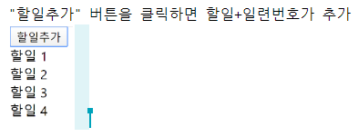
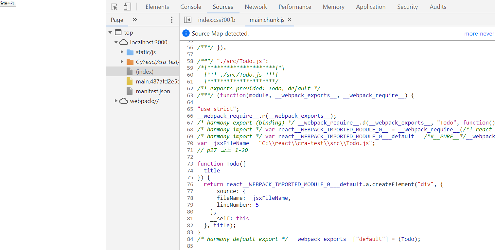
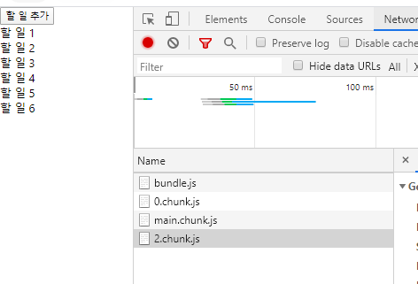
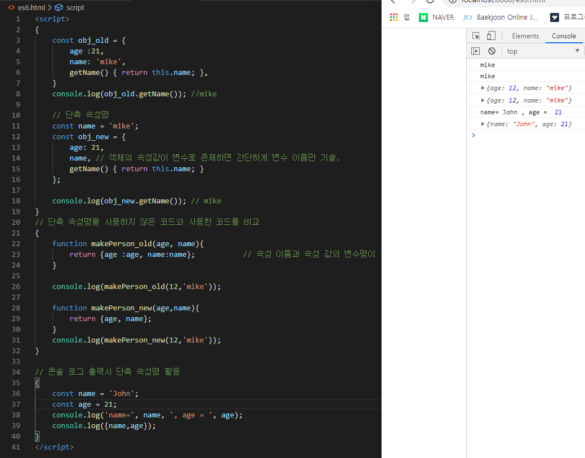
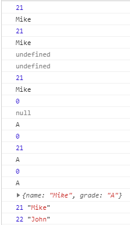

#### p27_ 코드 분할하기 ( code splitting )


- 코드분할을 이용하면 사용자에게 필요한 양의 코드만 내려줄 수 있다. 


- **실습 )** 

  

0. **작업 파일 생성하기.** 

   ```bash
   // 2개의 js 파일을 생성. 
   C:\react\cra-test\src\Todo.js
   C:\react\cra-test\src\TodoList.js
   ```

1. **# 코드 분할 전 - `js ` 파일 작성**

   ```javascript
   // p27 코드 1-20 - Todo.js
   import React from 'react';
   
   export function Todo({title}){		// 다른 모듈에서 해당 함수를 사용하기 위해 export 사용. 
       return <div>{title}</div>
   }
   // ( == export default Todo; )
   ```

   `title` 은 property  →  다른 모듈에서 전달되는 값. 

   ```jsx
   // P27 코드1-21 - TodoList.js
   import React, { Component } from 'react';
   import Todo from './Todo.js';
   
   class TodoList extends Component {
       //  상태 변수 = 해당 컴포넌트 내에서 사용(유지)되는 값
       state = { 
           todos: [], 
       };
   
       doClick = () => {
           const { todos } = this.state;
           const position = todos.length + 1;
           const newTodo = <Todo key={position} title={`할일 ${position}`} />
           this.setState({ todos: [...todos, newTodo] });
       };
   
       render() {
           const { todos } = this.state;
           return (
               <div>
                   <button onClick={this.doClick}>할일추가</button>
                   {todos}
               </div>
           );
       }
   }
   
   export default TodoList;
   ```

   원래의 HTML 은 대소문자를 구분하지 않는다. 그러나 JSX 문법은 대소문자를 구분한다. 
   
   ```javascript
   // App.js 
   import React from 'react';
   import TodoList from './TodoList';
   
   function App() {
     return (
       <div className="App">
         <TodoList />
       </div>
     );
   }
   
   export default App;
   ```
   
   `App.js` 파일은 `index.js` 파일에서 import 해서 사용한다. 
   
   

2. ```bash
   C:\react\cra-test>npm start
   
   > cra-test@0.1.0 start C:\react\cra-test
   > react-scripts start
   .........
   ```

   이후 `F12` 에서 `Network` 의 `js` 파일 목록 중 `main.chunk.js` 파일 내부 코드 확인. 

   

   `http://localhost:3000/static/js/main.chunk.js` 파일에 `Todo.js` 파일의 내용이 들어가있다. ( 버튼을 누르기 전까지는 `Todo.js` 파일이 필요없는데 미리 가져올 경우, 만약 파일의 용량이 크다면 쓸데없는 부하가 발생하여 로딩하는데 시간이 오래걸린다. 이를 해결하기 위해 **동적 import** 를 사용. )

1. **# 코드 분할을 이용 - `js ` 파일 작성**

   ```jsx
   // TodoList.js 파일 
   import React, {Component } from 'react';    
   
   class TodoList extends Component{
       state = {   // 상태변수 = 해당 컴포넌트 내에서 사용(유지)되는 값. 
           todos : [],
       };
       onClick = () => { 
           import('./Todo.js').then(({Todo}) => {
               const { todos } = this.state; 
               const position = todos.length + 1; 
               const newTodo = <Todo key={position} title={`할 일 ${position}`} />;
               this.setState({todos: [...todos, newTodo] });
           });
       };
   
       render(){
           const {todos} = this.state; 
           return (
               <div>
                   <button onClick={this.onClick}>할 일 추가</button>
                   {todos}
               </div>
           );
       }
   }
   
   export default TodoList;
   ```

   `import React, {Component} from 'react';` : 리액트와 컴포넌트 모듈 사용 - React 는 default로 선언되어 있기 때문에 중괄호 안에 안넣어줘도 된다. 

   2 번과 동일한 방법으로 `main.chunk.js` 파일을 확인할 경우 `Todo.js` 코드가 없음을 확인할 수 있다. 

   그리고 "할일추가" 버튼을 클릭하면 `2.chunk.js `파일 ( Todo.js 파일의 본문 내용을 포함)이 내려옴 

   `2.chunk.js` 파일은 최초 한번만 다운로드 . 그 이후에는 캐싱을 이용하여 성능향상. 

   

---

#### p58_ 단축 속성명 (Shorthand property names)

```bash
C:\react\es6.html 생성
C:\react>npx http-server
http://localhost:8080/es6.html 주소로 결과 확인
```

```html
<!-- es6.html 파일 -->
<script>
{
    const obj_old = {
        age :21, 
        name: 'mike', 
        getName() { return this.name; },
    }
    console.log(obj_old.getName()); //mike
    
    // 단축 속성명
    const name = 'mike'; 
    const obj_new = {
        age: 21, 
        name, // 객체의 속성값이 변수로 존재하면 간단하게 변수 이름만 기술.
        getName() { return this.name; }
    };

    console.log(obj_new.getName()); // mike 
}
// 단축 속성명을 사용하지 않은 코드와 사용한 코드를 비교 
{
    function makePerson_old(age, name){
        return {age :age, name:name};           // 속성 이름과 속성 값의 변수명이 같다. 
    }

    console.log(makePerson_old(12,'mike'));

    function makePerson_new(age,name){
        return {age, name};
    }
    console.log(makePerson_new(12,'mike'));
}

// 콘솔 로그 출력시 단축 속성명 활용 
{
    const name = 'John';
    const age = 21; 
    console.log('name=', name, ', age = ', age);
    console.log({name,age});
}
</script>
```




**단축 속성명** : 속성의 이름만 가지고 변수의 값과 바인드를 시켜준다. 


#### p59_ 계산된 속성명 ( computed property names )

​	: 객체의 속성명을 동적으로 결정하기 위한 문법 

​	: 컴포넌트의 상탯값을 변경할 때 유용하게 쓸 수 있다. 

```html
<script>
{
    function makeObject_unsed(key, value) {
        const obj = {};
        obj[key] = value;
        return obj;
    }
    console.log(makeObject_unsed("name", "John"));

    //  계산된 속성명 = 객체의 속성명을 동적으로 결정
    function makeObject_used(key, value) {
        return { [key] : value };
    }
    console.log(makeObject_used("name", "John"));    

    let i = 0;
    let obj = {
        ["val" + i++ ] : i, 
        ["val" + i++ ] : i, 
        ["val" + i++ ] : i, 
    };
    console.log(obj.val0, obj.val1, obj.val2);  // 1, 2, 3

    let param = 'size';
    let config = {
        [param]: 12, 
        ["mobile" + param.charAt(0).toUpperCase() + param.slice(1)]: 4
    };
    /*
        { size: 12, mobileSize: 4 }
    */
    console.log(config);    // { size: 12, mobileSize: 4 }
}
</script>
```


#### p60_ 전개 연산자 (spread operator)

```html
<script>
//  전개 연산자를 이용해서 함수의 매개변수를 입력
{
    console.log(Math.max(1, 3, 7, 9));      // 9

    const numbers = [ 1, 3, 7, 9 ];
    console.log(Math.max(...numbers));
}

//  전개 연산자를 이용해서 배열과 객체를 복사
{
    let arr1 = [ 1, 2, 3 ];
    let arr2 = [ ...arr1 ];
    let arr3 = arr1;

    console.log(arr1);      // 동일한 결과
    console.log(arr2);
    console.log(arr3);
    
    arr1[0] = 10;
    console.log(arr1);      // [10, 2, 3]
    console.log(arr2);      // [ 1, 2, 3]
    console.log(arr3);      // [10, 2, 3]

    let obj1 = { age: 23, name: "Mike" };
    let obj2 = { ...obj1 };
    let obj3 = obj1;
    
    console.log(obj1);
    console.log(obj2);
    console.log(obj3);
    
    obj1["age"] = 30;
    console.log(obj1);      // {age: 30, name: "Mike"}
    console.log(obj2);      // {age: 23, name: "Mike"}
    console.log(obj3);      // {age: 30, name: "Mike"}
}

//  배열에서 전개 연산자를 사용하면 배열 요소의 순서가 유지
{
    console.log([1, ...[2, 3], 4]);             // [1, 2, 3, 4]
    
    console.log(new Date(2020, 0, 12));
    console.log(new Date(...[2020, 0, 12]));    // Sun Jan 12 2020 00:00:00 GMT+0900 (한국 표준시)

    let today = [ 2020, 0, 12 ];
    console.log(new Date(today[0], today[1], today[2]));
    console.log(new Date(...today));
}

//  전개 연산자를 이용한 두 객체 병합
{
    const obj1 = { age: 21, name: "Mike" };
    const obj2 = { hobby: 'soccer' };
    const obj3 = { ...obj1, ...obj2 };
    console.log(obj3);  //  {age: 21, name: "Mike", hobby: "soccer"}
}

//  객체 리터럴에서 중복된 속성명 사용이 가능
{
    const obj1 = { x: 1, x: 2, y: 'a' };    // {x: 2, y: "a"}
    console.log(obj1);

    obj1["x"] = 3;
    obj1["z"] = 4;
    console.log(obj1);  // {x: 3, y: "a", z: 4}

    const obj2 = { ...obj1, y: 'b' };
    console.log(obj2);  // {x: 3, y: "b", z: 4}
}
</script>
```


#### p61_ 배열 비 구조화(array destructuring)

: 배열의 여러 속성값을 변수로 쉽게 할당할 수 있는 문법. 

```html
<script>
// 배열 비 구조화
{
    const arr = [1,2] ; 
    const [a,b] = arr; 
    console.log(a);     // 1
    console.log(b);     // 2
}

// 배열 비구조화를 이용한 변수 값 할당 
{
    let a, b ;
    console.log(a,b); // undefined, undefined


    //a=0;
    //b=1;
    [a,b] = [0,1]; 
    console.log(a,b);   // 0, 1
}

// 배열 비 구조를 이용한 기본값 설정 
{
    const arr = [1]; 

    const [a=10, b] = arr; // 인덱스 순서대로 삽입됨을 확인 
    console.log(a); // 1
    console.log(b); // undefined

    const [ c=10 , d=20] = arr; 
    console.log(c);     //1
    console.log(d);     //20
}

// 배열 비 구조화를 이용한 값 교환 
{
    let a = 10; 
    let b = 20; 
    console.log(a,b);   //10, 20
    // a,b 의 값을 교환 
    /*let temp = a; 
    a = b; 
    b = temp; 
    console.log(a,b);   //20, 10  */

    [a,b] = [b,a]; 
    console.log(a,b);   //20,10
}

// 쉼표를 이용해서 일부 속성값을 건너뛸 수 있음 
{
    const arr = [1,2,3,4]; 
    const [a, , b] = arr;
    console.log(a);    //1
    console.log(b);    //3 
    console.log(c);    //
}

//  나머지 값을 별도의 배열로 만들기
{
    const arr = [ 1, 2, 3 ];

    const [ first, ...rest ] = arr;
    console.log(first);     // 1
    console.log(rest);      // [ 2, 3 ]

    const [ a, b, c, ...rest2 ] = arr;
    console.log(rest2);     // []
}

</script>>
```


#### p63_ 객체 비구조화 ( object destructuring )

​	: 객체의 여러 속성값을 변수로 쉽게 할당할 수 있는 문법이다. 

- 배열은 인덱스를 기반으로 움직이지만, 객체는 이름을 기반으로 움직인다. 

- 객체의 속성 이름과 변수 이름이 동일해야한다. 

- 객체의 속성명과 변수의 이름이 동일하지 않으면 임의로 가져갈 수 없다. 

- 별칭을 사용하면 객체의 속성명과 변수의 이름이 달라도 사용할 수 있다. 

  ```html
  <script>
  // 객체 비구조화에서는 속성 이름이 중요 
  {
      const obj1 = {age:21, name:"Mike"}; 
      const obj2 = {age:22, name:"John"};
  
      const {age, name} = obj1;       // 객체의 속성이름과 변수이름이 동일해야한다. 
      console.log(age);   // 21
      console.log(name);  // Mike
  }
  {
      const obj1 = {age:21, name:"Mike"};
  
      const {name, age} = obj1;    // 객체는 이름을 단위로 움직인다. 
      console.log(age);   // 21
      console.log(name);  // Mike
  }
  {
      const obj1 = {age:21, name:"Mike"};
  
      const {a,b} = obj1;    // 객체의 속성과 변수의 이름이 다른 경우. 
      console.log(a);   // undefined
      console.log(b);  // undefined
  }
  
  // 객체 비구조화에서 별칭 사용 
  {
      const obj1 = {age:21, name:"Mike"};
  
      const {age:a, name:b} = obj1;    
      console.log(a);   // 21
      console.log(b);  // Mike
  }
  
  // 객체 비구조화에서 기본값 설정 
  {
      const obj = {age:undefined, name :null, grade:'A'}; 
      const { age = 0, name= 'noname' , grade = 'F' } = obj; 
      console.log(age);       // 0     -> undefined 일 경우 기본값이 그대로 유지. 
      console.log(name);      // null  -> null 일 경우 null 로 대체 
      console.log(grade);     // A     -> 객체의 값으로 대체
  }
  
  // 기본값과 별칭을 동시에 사용 
  {   
      const obj = {age: undefined, name : "Mike"}; 
      const {age : newAge = 0 , name }  = obj ; 
      console.log(newAge);        // 0
   //   console.log(age);           // Error -> 별칭을 통해 가져오면 맵핑을 하기 위한 키로서 활용될 뿐 변수로서 사용할 수 없다. 
  }
  
  // 함수를 이용한 기본값 
  {
      function getDefaultAge(){ 
          return 0; 
      }
  
      const obj1 = {age:21, grade:'A'};
      const {age = getDefaultAge(), grade } = obj1; 
      console.log(age);       // 21 
      console.log(grade);     // A
  
      const obj2 = {age2:undefined, grade2:'A'};
      const {age2 = getDefaultAge(), grade2 } = obj2; 
      console.log(age2);       // 0 
      console.log(grade2);     // A
  }
  
  // 객체 비구조화에서 나머지 속성들을 별도의 객체로 생성 
  {
      const obj = {age:21, name:"Mike", grade:'A'};
      const {age, ...rest} = obj; 
      console.log(rest);  //  {name:"Mike", grade:'A'}
  
      const {name, ... rest2}= obj;
      console.log(rest2); //{age:21, grade:'A'}
  
      const {age, grade, ... rest3}= obj;
      console.log(rest3); //{name:"Mike"}
  }
  
  // for문에서 객체 비구조화를 활용
  {
      const people = [
          {age :21, name:"Mike"}, 
          {age : 22, name:"John"},
      ];
  
      /*
      for(i of people){
          console.log(i.age, i.name); 
          console.log(i["age"], i["name"]);
      }
      */
      for({age,name} of people){
          console.log(age,name); 
      }
  }
  
  </script>
  ```

  


#### p65_ 비구조화 심화학습

```jsx + html
<script>
// 중첩된 객체의 비구조화
{ 
    const obj = {name:"Mike", mother:{name:"Sara"}}; 
    const { name, mother: {name:motherName}, } = obj; 
    console.log(name);          // Mike 
    console.log(motherName);    // Sara
}
{ 
    const obj = {name:"Mike", mother:{name:"Sara"}};
    const { name, mother } = obj; 
    console.log(name);          // Mike 
    console.log(mother["name"]);    // Sara
}
{ 
    const obj = {name:"Mike", mother:{motherName:"Sara"}};
    const { name, mother:{ motherName } } = obj; 
    console.log(name);          // Mike 
    console.log(motherName);    // Sara
}

// 비 구조화에서 기본값은 변수 단위가 아니라 패턴 단위로 적용 
{
    // 우측 배열이 비어있기 때문에 객체 기본값을 이용 
    const [ {prop:x1} = {prop:123} ] = [ ]; 
    console.log(x1) ;       // 123
} 
{
    // 우측 배열이 비어있지않기 때문에 객체 기본값을 이용하지 않음. 
    const [ {prop:x1} = {prop:123} ] = [ {} ]; 
    console.log(x1) ;       // undefined
} 

// 객체 비구조화에서 계산된 속성명을 사용 
// 객체 비구조화에서 계산된 속성명을 사용할 때는 반드시 별칭을 입력해야 함. 
{
    const index = 1; 
    // const {key1} = {key1: 123};
    const { [`key${index}`] :valueOfTheIndex } = {key1: 123}; 
    console.log(valueOfTheIndex);   // 123 
}

// 별칭을 이용해서 다른 객체와 배열의 속성값 할당. 
{
    const obj = {}; 
    const arr = []; 
    const res = {foo:obj.prop, bar:arr[0]} = {foo:123, bar:true};
    console.log(obj);   // { prop: 123 }
    console.log(arr);   // [ true ]
}
</script>
```


#### p67_ 매개변수 기본값

```html
<script>
// 매개변수 기본값 설정 
{
    function printLog(a=1){
        console.log(a);
        console.log({ a });         // < -- 단축 속성명 
    }
    printLog();     //  1           <-- 매개변수의 기본값이 사용 
                    // { a:1 }
    printLog(2);    //  2
                    // { a:2 }
}

// 매개변수 기본값으로 함수를 호출 
{
    function getDefault(){ 
        return 1 ; 
    }
    function printLog(a = getDefault()){    // 기본값으로 함수를 넘길 수 있다. 
        console.log({a});
    }
    printLog();     // { a: 1 }
    printLog(2);    // { a: 2 }
}

// 매개변수 기본값을 이용해서 필수입력 여부를 표현
{
    function required(){ 
        throw new Error('필수입력입니다.'); 
    }
    function printLog(a = required()){    // 기본값으로 함수를 넘길 수 있다. 
        console.log({a});
    }
    printLog(2);    // { a: 2 }
    printLog();    // 'Uncaught Error : 필수입력입니다. '
}
</script>
```


#### p68_ 나머지 매개변수 (rest parameter)

​	: 입력된 인수 중에서 정의된 매개변수 개수만큼을 제외한 나머지를 배열로 만들어준다. 

​	: 나머지 매개변수는 매개변수 개수가 가변적일 때 유용하다. 

```HTML
<script>
// 나머지 매개변수를 사용하는 코드 
{
    function printLog(a, ...rest){
        console.log({a,rest});
    }
    printLog(1,2);      // {a:1, rest:[2]}
    printLog(1,2,3);    // {a:1, rest:[2,3]}
    printLog(1,2,3,4);  // {a:1, rest:[2,3,4]}
}

// arguments 키워드를 이용해서 구현 
{
    function printLog(){
        let a = Array.from(arguments).slice(0,1);
        let rest = Array.from(arguments).slice(1);
        console.log({a,rest});
    }
    printLog(1,2);      // {a:1, rest:[2]}
    printLog(1,2,3);    // {a:1, rest:[2,3]}
    printLog(1,2,3,4);  // {a:1, rest:[2,3,4]}
}
</script>
```


#### p69_ 명명된 매개변수 

​	: 객체 비구조화를 이용해서 구현할 수 있다. 

​	: 명명된 매개변수를 사용하면 함수 호출 시 매개변수의 이름과 값을 동시에 적을 수 있으므로 가독성이 높다. 

```html
<script>
// 명명된 매개변수의 사용 여부에 따라서 가독성이 달라짐 
{
    const numbers = [10,20,30,40]; 

    const result1 = getValues(numbers, 5, 25);
    const result2 = getValues({numbers, greaterThan:5, lessThan:25});    // -> 가독성이 향상된다. 
}

// 명명된 매개변수를 사용하면 사용하지 않는 매개변수를 생략하는 것도 가능 
{
    const result1 = getValues(number, undefined, 25); 
    const result2 = getValues({number, greaterThan:5}); 
    const result3 = getValues({number, lessThan:25});
}
</script>>
// 위의 코드는 실행이 안된다. 실행을 하기 위해서는 getValues 함수를 정의해야한다. 
```


#### p70_ 화살표 함수 (arrow function)

```html

<script>
    {
        // 함수 표현식을 이용한 함수 정의 (익명 함수) 
        const add1 = function (a,b){ return a+b; };

        // 화살표 함수
        const add2 = (a,b) => { return a+b; };

        // 화살표 함수에서 중괄호로 감싸지않으면 화살표 오른쪽의 계산 결과를 반환
        const add3 = (a,b) => a+b; 

        console.log(add1(1,2));     // 동일한 결과를 반환 
        console.log(add2(1,2));
        console.log(add3(1,2));


        // 매개변수가 하나이면 매개변수를 감싸고 있는 소괄호도 생략이 가능 
        const add5 = a => a+5; 
        console.log(add5(10));  //15

        // 객체를 반환하는 경우 소괄호로 감싸야 함. 
        const addAndReturnObject = (a,b) => ({ result: a+b });
        console.log(addAndReturnObject(10,20));     // {result : 30}
        console.log(addAndReturnObject(10,20).result);     // 30
    }
    
    // 화살표 함수의 코드가 여러 줄인 경우. 
    // 전체를 중괄호로 묶고, 반환값에는 return 키워드를 사용한다. 
    {
        const add = (a,b) => {
            if(a <=0 || b<= 0){
                throw new Error("양수만 입력하세요")
            }
            return a+b; 
        }

        console.log(add(10,20));        // 30
    } 
    
    // 화살표 함수에서 나머지 매개변수를 사용 
    // 화살표 함수는 일반 함수와 달리 this 와 arguments 가 바인딩되지 않음 -> this. 와 argument 를 사용할 수 없다.
    // => p71 일반함수에서 this 는 호출 시점에 사용된 객체로 바인딩
    {
        const obj = {
            value1 : 1, 
            value2 : 1, 
            increase: function(){
                //console.log(this); 
                if(this.value2 !== undefined)
                    this.value2++;
                else 
                    this.value2 = 10;
            },
            add: () => { 
                if(this.value2 !== undefined)
                    this.value2++ ; 
                else 
                    this.value2 = 10; 
            }
        }
        console.log('------------------------');

        console.log(obj.value2);            // 1
        console.log(globalThis.value2);     // undefined

        obj.increase();
        console.log(obj.value2);            // 2
        console.log(globalThis.value2);     // undefined

        const increase = obj.increase;
        increase();             // 사용하는 객체가 명시되어있지 않기 때문에 this 는 전역변수로 바인딩. 따라서 globalThis.value2 가 10으로 초기화된다. 
        console.log(obj.value2);            // 1
        console.log(globalThis.value2);     // 10
        
        obj.add();
        console.log(obj.value2);            // 1
        console.log(globalThis.value2);     // 10

        const add = obj.add; 
        add(); 
        console.log(obj.value2);            // 1
        console.log(globalThis.value2);     // 11

        obj.add(); 
        add(); 
        console.log(obj.value2);            // 1
        console.log(globalThis.value2);     // 13

        // add 라는 함수는 this 바인딩이 되지 않는다. (화살표 함수이기 때문) -> 화살표 함수의 this 는 글로벌로 대체. 
    }

</script>
```

- 화살표 함수는 일반 함수와 달리 this 와 arguments 가 바인딩 되지 않음 

- p71. 일반함수에서 this는 호출 시점에 사용된 객체로 바인딩 

- 객체에 정의된 일반함수를 다른 변수에 할당해서 호출하면 버그가 발생할 수 있다. ( 다른 변수에서 일반함수를 부를 경우 객체를 참조하는 부분이 없기 때문에 전역변수로 참조된다. )

- 전역 객체 ( 브라우저환경에서는 window 객체, Node 에서는 global 객체) 


- **생성자 함수 내부에서 정의된 화살표 함수의 this 는 생성된 객체를 참조.** 

```html
<script>
{
    function Something(){ 
        this.value = 1; 
        this.increase = () => this.value++; // 생성자 역할을 하는 함수의 this 는 생성된 객체를 참조.
    }

    const obj = new Something();        // new 로 인해 만들어지는 시점의 obj
    obj.increase(); 
    console.log(obj.value);        // 2 

    const increase = obj.increase; 
    increase(); 
    console.log(obj.value);         // 3

    const obj2 = new Something(); 
    console.log(obj2.value);        // 1
    obj2.increase(); 
    console.log(obj2.value);        // 2 
}
// 객체의 구조를 반환하는데 new 라는 키워드와 만나서 객체를 생성하는데 사용하는 함수 -> 생성자 함수. 
</script> 
```


- **setInterval 함수 사용 시 this 바인딩 문제** 

  ```html
  <script>
  {
      function Something1(){
          this.value = 1; 
          
          setInterval(function increase() {   //setInterval 함수의 인수로 들어간 increase 함수는 전역환경에서 실행되기 때문에 this 는 window 객체를 참조한다. 
              if(this.value !== undefined)    
                  this.value++; 
              else
                  this.value = 1; 
  
              console.log(this.value); 
          }, 
          1000
          );
      }
  
      const obj1 = new Something1();
  }
  </script>
  ```

  ​																					▼

  해결방법 1 _ 

  ```html
  <script>
  {
      function Something2(){
          this.value = 1; 
          let that = this;
  
          setInterval(function increase() {   //setInterval 함수의 인수로 들어간 increase 함수는 전역환경에서 실행되기 때문에 this 는 window 객체를 참조한다. 
              that.value++;
              console.log(that.value); 
          }, 
          1000
          );
      }
  
      const obj1 = new Something2();
  }
  </script>
  ```

  

  해결방법 2 _

  ```html
  <script>
  {
      function Something3(){
          this.value = 1; 
  
          setInterval(
              () => {
                  this.value++; 
                  console.log(this.value);
          }, 
          1000
          );
      }
  
      const obj1 = new Something3();
  }
  </script>
  ```

  

---

#### 프로미스 ( promise )

​	: 비동기 상태를 값으로 다룰 수 있는 객체 

​	: 프로미스 사용시 비동기 프로그래밍을 할 때 동기프로그래밍 방식으로 코드를 작성할 수 있다. 

​	: 프로미스 이전에는 콜백 패턴을 많이 사용 


- 프로미스 상태 
  - 대기중 (pending) : 결과를 기다리는 상태 
  - 이행됨 (fulfilled) : 수행이 정상적으로 끝났고 결과값을 갖고있는 상태
  - 거부됨 (rejected) : 수행이 비정상적으로 끝난 상태 
  - 이행됨, 거부됨 상태를 처리됨(settled) 상태라고 함. 


프로미스는 처리됨(settled) 상태가 되면 더 이상 다른 상태로 변경되지 않으며, 대기중 상태에서만 이행됨, 거부됨 상태로 변경될 수 있음. 

```html
<script>
    // 프로미스를 생성하는 방법 
    // new 키워드를 사용해서 프로미스를 생성 
    // 이렇게 생성된 프로미스는 대기중 상태가 됨. 
    // 생성자에 입력된 함수는 resolve와 reject라는 콜백 함수를 매개변수로 가지며, 
    // 비동기로 작업 수행 후 성공했을 때 resolve 를 호출하고, 실패했을 때 reject 를 호출 
    const p1 = new Promise((resolve,reject) => {
        
        // ...
        // resolve(data)
        // or 
        // reject('error message')
    });

    // new 키워드를 사용하지 않고, Promise.reject를 호출하면 거부됨 상태의 프로미스가 생성 
    const p2 = Promise.reject('error message');

    // Promise.resolve를 호출해도 프로미스가 생성 
    // 입력값이 프로미스이면 그 객체가 그대로 반환되고, 
    // 프로미스가 아니라면 이행됨 상태의 프로미스가 반환
    const p3 = Promise.resolve(param);
</script>
```

```html
<script>
    // Promise.resolve 반환값
    // Promise.resolve 입력값이 프로미스가 아니면 이행된 상태의 프로미스가 반환
    const p1 = Promise.resolve(123); 
    console.log(p1);    // Promise {<resolved>:123}

    const p2 = new Promise(resolve => setTimeout(() => resolve(10),1));
    console.log(Promise.resolve(p2) === p2);    // true  
    console.log(p2);                            // Promise {<pending>}
</script>>
```

```html
<script>
    // p77 프로미스 이용하기 : then 
    // 프로미스가 처리됨 상태가 되면 then 메서드의 인수로 전달된 함수가 호출
    const p1 = Promise.resolve(123).then(data => console.log("#1", data)); // (3)#1 123
    console.log(p1 !== 123);        // (1)true
    console.log(p1);                // (2)Promise {<pending>}
    p1.then(data => console.log("#1-1", data)); //(4) #1-1 undefined
</script>
```


---

- Camel Expression 

- 서버사이드렌더링방식

  ​	서버 측에서 HTML & View 을 생성하여 응답하는 방법. 

- SPA 구동방식 

  ​	처음에 하나의 빈 페이지만 서버측에서 제공하고, View 에 대해서는 Client에서 자바스크립트를 통해 렌더링 하는 방식. 이 방식을 클라이언트사이트 렌더링 방식이라고 한다 ( 클라이언트 측에서 View 를 생성하는 방법 )

