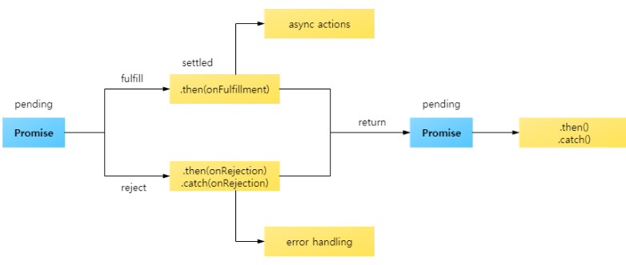
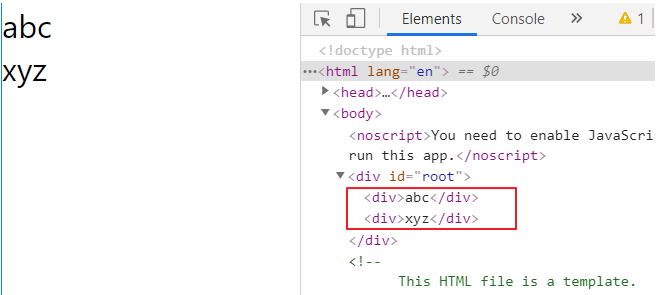

# React

### 프로미스 

- 비동기 상태를 값으로 다룰 수 있는 객체 
- 프로미스 이전에는 콜백 패턴을 많이 사용 ( 그러나 구조가 복잡해질수록 콜백 지옥에 빠지는 경우 발생 ) 
- 프로미스 상태 
  - 대기중 (pending) : 결과를 기다리는 상태 
  - 이행됨 (fulfilled) : 수행이 정상적으로 끝났고 결과값을 갖고 있는 상태 
  - 거부됨 (rejected) : 수행이 비정상적으로 끝난 상태 
  - 이행됨, 거부됨 상태를 처리됨(settled) 상태라고 함. 
  - 프로미스는 처리됨 상태가 되면 더이상 다른 상태로 변경되지 않으며, 대기상태에서만 이행되고, 거부됨 상태로 변경될 수 있다. 



`setTimeout()` : 대표적인 비동기함수. 지정된 시간 이후에 지정된 기능을 수행하는 함수. 


프로미스를 처음 생성하면 `Pending` 상태 - `fulfilled` 나 `rejected` 가 될 떄까지 대기. 

```html
<script>
    const p1 = Promise.resolve(123); 
    console.log(p1===123);      // false
    console.log(p1);            // Promise {<resolved> : 123}

    // new Promise(resolve, reject); 
    const p2 = new Promise(
        resolve => { setTimeout(() => resolve('1초 경과'), 1000) },
        reject => { return "error"}
    );
    console.log(p2 === Promise.resolve(p2));    // true  Promise.resolve(프로미스) 인 형태에서는 반환 값이 프로미스. 
    console.log(p2);            // Promise {<pending>}
    p2.then(data => {   
        console.log(p2);
        console.log(data);
    }); 
</script>>
```

​													결과값  :    


-   어떤 리젝트 상태의 프로미스가 던져지면 리젝트 함수가 있는 곳 까지 간다. then 함수는 인자가 2개 ( 성공을 처리하는 것, 실패를 처리하는 것, )

```html
<script>
    Promise.reject("error message")
    .then(() => console.log("#1"))          // 실패를 처리하는 인자가 없다. (통과)
    .then(() => console.log("#2"))          // 실패를 처리하는 인자가 없다. (통과)
    .then(() => console.log("#3-1"), (data) => console.log("#3-2", data))
    .then((data) => console.log("#4-1", data), () => console.log("#4-2"))   // data 의 값은 undefined . 그 이유는 전달되는 데이터가 없기 때문. 
</script>
```


- 

```html
<script>
    Promise.reject("error message")
    .then(() => console.log("#1"))          
    .then(() => console.log("#2"))          
    .then(
        () => console.log("#3-1"), 
        (data) => {
            console.log("#3-2", data);      // reject 가 처리되면 reject 가 resolve 상태로 바뀐다. 만약 다음 resolve 상태에 전달할 값이 있다면 return 해줘야한다. 
            return "hello";
        }
    )
    .then((data) => console.log("#4-1", data), () => console.log("#4-2"))   // data 의 값은 undefined . 그 이유는 전달되는 데이터가 없기 때문. 
</script>
```


- 

```html
<script>
    Promise.resolve(100)
        .then((data) => {
            console.log("#1",data);
            data += 100; 
            return data; 
        })
        .then((data) => {
            console.log("#2",data);
            data += 100; 
            return data; 
        })
        .then((data) => {
            console.log("#3",data);
            return Promise.reject("error");
        })
        .then(null, (data) => console.log("#4", data));
</script>
```


- 일반적으로`catch` 에서 잡는 것은 error 이기 때문에 변수 이름을 error 로 통상적으로 쓴다. (data 나 x 등 다른 이름이어도 상관 없다. )
- 예외 처리를 catch 구문을 이용해야 하는 이유
  - 가독성이 좋다 
  - resolve 함수 내에서 발생하는 예외를 처리 
    - 1번째 방법 : 추가적인 `.then` 을 이용하여 처리 
    - 2번째 방법 : `catch` 구문을 이용하여 처리 


- 

```html
<script>
    Promise.reject(10)
        .then(data =>{		// reject 상태이기 때문에 resolve 부분은 통과. 
            console.log("then1", data);
            return 20; 
        })
        .catch(data => {
            console.log("catch",data);  // catch, 10 
            return 30 ; 
        })
        .then(data => {
            console.log("then2",data);  // then2, 30 
        });
</script>
```


- **P80 _ finally 메소드는 새로운 프로미스를 생성하지 않는다.**
  - `then` 과 `catch` 다음에는 새로운 프로미스가 만들어진다. 
  - `finally` 는 새로운 프로미스를 생성하지 않고, 체인의 가장 마지막에 사용되며 이전에 반환한 프로미스를 그대로 반한다. 

```html
<script>
    function sendLogToServer(msg){
        console.log("sendLogToServer", msg);
    }

    function requestData(){
        let url = "http://localhost:8080/es6.html";
        return fetch(url)   //fetch 함수도 프로미스를 반환하기떄문에 then, catch, finally 를 해준다. 
            .then(resolve => {
                console.log("#1", resolve); 
                return resolve; 
            })
            .catch(error => {
                console.log("#2", error);
                return error; 
            })
            .finally(() =>{	
                console.log("#3");
                sendLogToServer("requestData Finished");
            	//return data;  // finally 사용시 필요 x 
            });
    }

    requestData().then(resolve => console.log(resolve)); 
</script>
```

   - finally 대신 .then 을 사용하여 값을 확인하면 반환 값 undefined 을 확인할 수 있다. 


- 

```html
<script>
    // 의존 관계가 있는 업무는 순차적으로 비동기 처리 
    // requestData1() 업무가 끝나야 requestData2() 업무를 처리할 수 있는 경우 
    // ex ) 데이터를 가져와야 데이터를 파싱할 수 있다.
    function requestData1(){
        return Promise.resolve("requestData1 called");
    }

    function requestData2(){
        return Promise.reject("requestData2 called");
    }

    requestData1()
        .then(data => { 
            console.log("#1", data); 
            return requestData2(); 
        })
        .then(data => {
            console.log("#2", data); 
        })
        .catch(error => {
            console.log("ERROR", error)
        });

</script>
```


- 

```html
<script>
   // 의존 관계가 없는 업무는 병렬로 처리. 
    function requestData1(){
        return Promise.resolve("requestData1 called");
    }

    function requestData2(){
        return Promise.reject("requestData2 called");
    }

    requestData1().then(data => console.log("#1", data), error =>console.log("#2", error));
    requestData2().then(data => console.log("#3", data), error =>console.log("#4", error));

</script>
```


- 

```html
<script>
    function requestData1(){
        return Promise.resolve("requestData1 called");
    }

    function requestData2(){
        return Promise.reject("requestData2 called");
    }

    requestData1().then(data => console.log("#1", data), error =>console.log("#2", error));
    requestData2().then(data => console.log("#3", data), error =>console.log("#4", error));

    Promise.all([requestData1(), requestData2()]) // 두개가 모두 resolve 상태여야 resolve 실행 
        .then(([data1, data2]) => {
            console.log(data1, data2 );
        })
        .then(
            () => console.log("모든 프로미스가 처리된 상태"),
            () => console.log("프로미스 중 하나 이상이 거부된 상태")
        )
</script>
```


job 을 만드는데 서로 업무간에 연관이 없는 경우. 개별 호출에 대한 상태 처리를 일일이 처리해야함

`Promise.all` 을 사용하는 경우 날라온 결과에 대해 처리를 하는데, 모든 job 들이 성공시 `resolve`, 하나라도 실패한게 있다면 `reject` 를 실행한다. 


### 리액트를 다루는 기술 

https://velopert.com/3613


1.  create-react-app을 이용해서 프로젝트 생성 

   ```bash
   C:\react> create-react-app hello-react2
   C:\react> cd hello-react2
   C:\react\hello-react2> npm start
   
   httpL//localhost:3000   <= 브라우저를 통해서 확인 
   ```

2.  `App.js` 의 **함수 형태**로 선언된 컴포넌트를 **클래스 형태**로 선언 ( `render` 함수를 포함 )

   ```html
   class App extends React.Component {
     render() {
       return (
         <div className="App">
           <header className="App-header">
             
             <p>
               Edit <code>src/App.js</code> and save to reload.
             </p>
             <a
               className="App-link"
               href="https://reactjs.org"
               target="_blank"
               rel="noopener noreferrer"
             >
               Learn React
             </a>
           </header>
         </div>
       );
     }
   }
   ```

   **함수 형태** : 사용자에게 보여줄 UI 화면만 보여주는 경우 . 

   **클래스 형태** : 화면도 보여주면서 화면에 출력해주는 값을 유지하면서 값에 따라 화면의 출력이 달라질 경우. 


- HTML 에서는 닫는 태그가 존재하지 않는(필수가 아닌) 태그들이 존재. 

`<input type="text">` , `<input type="text" />` , `<br>` ... 


- JSX 문법에서는 반드시 닫는 태그를 사용해야한다. 

`<input type="text" />`  , `<input type="text"></input>` , `<br />` , `<br></br>` ... 


- JSX 에서는 반드시 하나의 태그(엘리멘트)로 감싸져 있어야 한다. 

  [ 잘못된 예시 ]

  ```html
  <div> ... </div>
  <div> ... </div>
  
  <!-- 위와 같이 <div> 가 병렬로 존재하면 안된다. -->
  ```

  [ 올바른 예시 ]

  ```html
  <!-- 1번의 경우 하나의 <div> 로 묶어줘야 한다. -->
  <div>
          <div>
            abc
          </div>
          <div>
            xyz
          </div>
        </div>
  
  
  <!-- 2번의 경우 태그 이름 없이 괄호만 사용해서 묶어준다-->
   <>
          <div>
            abc
          </div>
          <div>
            xyz
          </div>
   </>
  <!-- 3번의 경우 <Fragment></Fragment> 를 사용해서 엘리먼트를 묵을 수 있다 --> 
   <Fragement>
          <div>
            abc
          </div>
          <div>
            xyz
          </div>
   </Fragment>
  ```

- 1번의 경우와 같이 <div> 를 묶어주는 용도로 사용할 경우 -> 불필요한 DOM 객체가 사용(생성)

  

그러나 2번이나 3번처럼 엘리멘트를 묶을 경우,  불필요한 DOM 요소가 생성되지 않음을 확인할 수 있다. 




- **JSX 안에서 자바스크립트 값을 사용** 

  ```jsx
  class App extends React.Component {
    render() {
      const name = 'react';
      return (
        <div>Hello {name}!</div>
      );
    }
  }
  ```


- 


만약 style 을 `<div style={}> ` 안에 기술하기 위해서는 **괄호 2개** 사용 ! ( 1개를 사용하면 오류 , 중괄호 1개는 JSX 문법에서 자바스크립트를 쓰기위한 구문을 의미. 중괄호 2개는 객체를 넘겨주는 것 ) 


- `App.css` 에서 기술한 클래스를 사용하기 위해서는 `className = '클래스 이름'` 과 같은 방식으로 사용해야한다.

  


- 주석 

  ```jsx
  class App extends React.Component {
    render() {
      let styles = {
        backgroundColor: 'black', 
        padding: '16px',
        color: 'white', 
        fontSize: '12px'
      };
      return (
        <>
          { /* 이것은 주석입니다. */ }
          { // 이것도 주석입니다. 
          }
          <div /* 이것도 주석입니다. */ 
            // 이것도 주석입니다. 
            style={styles}       
          >
            // 이것은 주석이 아닙니다.
            안녕하세요.
            /* 이것은 주석이 아닙니다. */
          </div>
        </>
      );
    }
  }
  
  ```

  

- 컴포넌트 생성 

```jsx
// MyName.js 

/*
import React from 'react'; 
class MyName extends React.Component{
    ...
}
*/

import React, {Component} from 'react'; 
class MyName extends Component{
    render(){
        return (
            <div>
                안녕하세요. 
                나는 {this.props.whoami } 입니다. 
            </div>
        );
    }
}

export default MyName; 
```

```jsx
import React from 'react';
import logo from './logo.svg';
import './App.css';

import MyName from './MyName';

class App extends React.Component {
  render() {
    return (
      <>
        <MyName whoami="홍길동"/>
        <MyName whoami="감자탕"/>
        <MyName whoami="리액트"/>
      </>
    );
  }
}
export default App;
```

`props` : 자신을 호출하는 쪽. ( 호출할 때 속성 ( `이름 = "값"` 을 넣어줄 수 있다. ) ) , 자식 컴포넌트가 부모 컴포넌트로부터 받은 값. 

​																결과 : 


- 부모로부터 어떤 값을 받아서 처리해야하는데 깜빡 잊고 넣지 않을 경우 발생하는 오류를 방지하기 위해서 default 값을 설정한다. 

  


#### 함수형 컴포넌트 

상태변수 : 해당 컴포넌트에서 가지고 있는 값. 

lifecycle : 생명주기. 컴포넌트가 만들어지고 소멸될때까지의 여러가지 상태 를 가질 수 있다. 


#### State 

 :   화면 출력에 관여하는 컴포넌트가 가지고 있는 고유한 값 ( 해당 컴포넌트 내에서 유지되는 값 )

 :   상태 변수의 값을 변경할 때는 직접 변경하면 값은 바뀔지라도 화면에 갱신(업데이트) 되지 않는다. 

```bash
// Counter.js 파일 생성. 
C:\react\hello-react2\src\Counter.js 
```


```jsx
// Counter.js 파일 
import React from 'react'; 

class Counter extends React.Component{
	// 1. Counter 클래스의 필드 문법을 이용해서 state 를 정의 
    // 클래스가 가지고 있는 변수를 '필드' 라고 부르며 함수를 '메소드' 라고 부른다. 
    state = {   
        number : 0
    };
    
    /* 2. 생성자에서 state 를 정의
    constructor (props){
        super(props); 
        this.state = {
            number :0
        };
    }*/

    onIncrease = () =>{
        this.setState({number : this.state.number + 1})
    }
    onDecrease = () =>{
        this.setState({number : this.state.number - 1})
    }
    render(){ 
        return (
            <div>
                <h1>카운터</h1>
                <h2> 값 : {this.state.number}</h2>
                <button onClick={this.onIncrease}>+</button>
                <button onClick={this.onDecrease}>-</button>
            </div>
        ); 
    }
    
}

export default Counter ; 
```

```jsx
// 객체의 값을 변경할 경우에는 아래와 같이 변경한다. 
this.setState({number : this.state.number - 1})
```

```jsx
this.state.number = this.state.number + 1 ;     
// 다음과 같이 작성하면 상태변수는 바뀌지만 화면에는 반영이 되지 않는다 -> setState 메소드를 쓰지 않고 상태변수를 변경하게 된다면 값은 바뀔지언정, 랜더링은 다시 일어나지 않는다. 
```

-  컴포넌트에서 발생한 이벤트를 처리할 메소드를 정의 

    	 이름의 형식 ( onXXXXX, handleXXXX ... )

- 상태변수 처리 방법 

  ```jsx
  // 방법0
  this.setState({ number: this.state.number + 1 });
  
  // 방법1 상태변수의 값을 지역변수에 할당해서 처리
  let number = this.state.number;
  number += 1;
  this.setState({ number: number });
  
  // 방법2 객체 비구조화를 이용해서 상태변수의 값을 지역변수에 할당
  let { number } = this.state;
  number += 1;
  this.setState({ number: number });
  
  // 방법3 단축속성명을 이용해서 상태변수의 값을 변경
  let { number } = this.state;
  number += 1;
  this.setState({ number });
  ```


#### p106_ UI 라이브러리를 사용하지 않는 코드 

```bash
// todo.html 파일을 생성 
C:\react\hello-react2 > npx http-server 
http://localhost:8080/todo.html  실행 확인 
```

```html
// todo.html 파일 
<html>
    <body>
        <div class="todo">
            <h3>할 일 목록</h3>
            <ul class="list"></ul>
            <input class="desc" type="text" />
            <button onclick="onAdd()">추가</button>
            <button onclick="onSaveToServer()">서버에 저장</button>
        </div>
        <script>
            let currentId = 1;
            const todoList = [];
            function onAdd() {
                const inputEl = document.querySelector('.todo .desc');
                const todo = { id: currentId, desc: inputEl.value };
                todoList.push(todo);
                currentId ++;
                const elemList = document.querySelector('.todo .list');
                const liEl = makeTodoElement(todo);
                elemList.appendChild(liEl);
            }
            function makeTodoElement(todo) {
                const liEl = document.createElement('li');
                const spanEl = document.createElement('span');
                const buttonEl = document.createElement('button');
                spanEl.innerHTML = todo.desc;
                buttonEl.innerHTML = '삭제';
                buttonEl.dataset.id = todo.id;
                buttonEl.onclick = onDelete;
                liEl.appendChild(spanEl);
                liEl.appendChild(buttonEl);
                return liEl;
            }
            function onDelete(e) {
                const id = Number(e.target.dataset.id);
                const index = todoList.findIndex(item => item.id === id);
                if (index >= 0) {
                    todoList.splice(index, 1);
                    const elemList = document.querySelector('.todo .list');
                    const liEl = e.target.parentNode;
                    elemList.removeChild(liEl);
                }
            }
            function onSaveToServer() {
                //  todoList 전송
            }
        </script>
    </body>
</html>

```

​																							▼

```jsx
// p107 위의 코드를 리액트로 작성. 

import React from 'react';

class MyComponent extends React.Component{
    
    state = {
        desc:'',
        currentId:1,
        todoList: [],
    };
    onAdd = () => {
        const {desc, currentId, todoList} = this.state;
        const todo = { id:currentId, desc};
        this.setState( {
            currentId : currentId + 1, 
            todoList: [...todoList, todo],
            desc : ''            
        });
    };
    onChangeDesc= e => {
        //this.setState({desc : e.target.value   /*입력한 값을 받아서 변경 */ });
        let desc = e.target.value; 
        this.setState({desc});
    }; 
    onDelete = e =>{
        const {todoList} = this.state;
        const id = Number(e.target.dataset.id); 
        const newTodoList = todoList.filter(todo => todo.id !== id);
        this.setState({
            todoList: newTodoList
        });
    };
    onSaveToServer = () =>{
        console.log(this.state.todoList);
    };

    render(){
        const { desc, todoList } = this.state; 
        return(
                <div>
                    <h3>할 일 목록</h3>
                    <ul>
                        {
                            todoList.map(todo=> (
                                <li key={todo.id}>
                                    <span> {todo.desc}</span>
                                    <button data-id={todo.id} onClick={this.onDelete}>삭제</button>   
                                </li>
                            )   )
                            
                        }
                    </ul>
                    <input type="text" value={desc} onChange={this.onChangeDesc} />
                    <button onClick = {this.onAdd}>추가</button>
                    <button onClick = {this.onSaveToServer}>서버에 저장</button>
                </div>
        );
    }
}


export default MyComponent; 
```


- 화살표함수에서 반환하는 것이 객체 타입일 때는 소괄호로 묶어줘야한다. 

```jsx
<ul>
	{
        todoLlist.map(todo => (
        	<li>
            	<span> { todo.desc} </span>
                <button> 삭제 /button>
            </li>
        ) 	)
    }
</ul>
            
// 만약 위의 경우를 중괄호를 이용하여 하고 싶다면 아래와 같이 return 을 이용하여 사용. 
<ul>
	{
        todoLlist.map(todo => {
        	return (
                <li>
            		<span> { todo.desc} </span>
                	<button> 삭제 /button>
            	</li>
            );
        })
    }
</ul>
```

data-id 라고 주면 dataset.id 로 뽑아야한다.


- 배열에서 filter 라는 메소드는 뒤에 명시하는 조건을 만족하는 것들로 다시 배열을 만들때 사용. 


- `map` : 배열을 하나씩 가져와서 뒤에 정해놓은 함수의 조건을 가지고 다른 배열을 만든다 .

  https://developer.mozilla.org/ko/docs/Web/JavaScript/Reference/Global_Objects/Array/map

  ```javascript
  const arr1 = [1,4,9, 16] ; 
  const map1 = arr1.map(x => x*2); 
  console.log(map1); 	// [2,8,18,32]
  ```


#### 컴포넌트의 상태값을 사용하는 코드 

- **LAB1 - 좋아요 버튼을 클릭하면 배경색이 붉은색이면 파란색으로 , 파란색이면 붉은색으로 변경**

  ```jsx
  import React from 'react';
  
  // 좋아요 버튼을 클릭하면 배경색이 붉은색이면 파란색으로 , 파란색이면 붉은색으로 변경 
  class App extends React.Component {
    state = {
      color : 'red' 
    };
  
    onClick = () => {
      let {color} = this.state; 
      color = color === 'red' ? 'blue' : 'red';
      this.setState({color});
    };
    
    render() {
      return (
        <button style={{backgroundColor: this.state.color}} onClick={this.onClick} >좋아요</button>
      );
    }
  }
  export default App;
  ```

- **LAB2 - 좋아요** 버튼을 클릭하면 배경색을 붉은색으로, 버튼 라벨을 "싫어요" 로 변경** 
              싫어요 버튼을 클릭하면 배경색을 파란색으로, 버튼 라벨을 "좋아요" 로 변경** 

  ```jsx
  import React from 'react';
  
  class App extends React.Component {
    state = {
      color : 'red', 
      text : '좋아요' 
    };
  
    onClick = () => {
      let {color, text} = this.state; 
      if(text === '좋아요'){
        this.setState({text : '싫어요', color : 'blue'});
      }else {
        this.setState({text : '좋아요', color : 'red'});
      }
    };
    
    render() {
      return (
        <button style={{backgroundColor: this.state.color}} onClick={this.onClick} >{this.state.text}</button>
      );
    }
  }
  export default App;
  ```


#### p110 부모 컴포넌트에서 속성값을 내려주는 코드 

- 증가 버튼을 클릭하면 "현재 카운트는 00000 입니다. " 를 출력 

  ```jsx
  // App.js 파일 
  import React from 'react';
  import Todo from './Todo';
  
  class App extends React.Component {
    render() {
      return <Todo />
    }
  }
  ```

  ```jsx
  // todo.js 파일 
  import React, {Fragment} from 'react' ; 
  import Title from './Title';
  
  class Todo extends React.Component{
      state = { 
         count : 0 
      };
      onClick = () => {
         
          this.setState({ count: this.state.count + 1});
      };
  
      render(){
          return (
              <Fragment>
                  <Title title = {`현재 카운트는 ${this.state.count} 입니다.`}/>
                  <button onClick={this.onClick}> 증가 </button>
              </Fragment>
          ) ;
  
      }
  }
  
  export default Todo;
  ```

  


---

- 참고사이트 

  https://developer.mozilla.org/ko/docs/Web/JavaScript/Reference/Global_Objects/Array/map