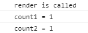
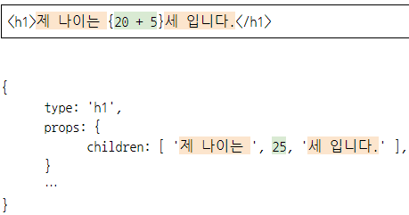
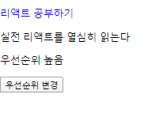
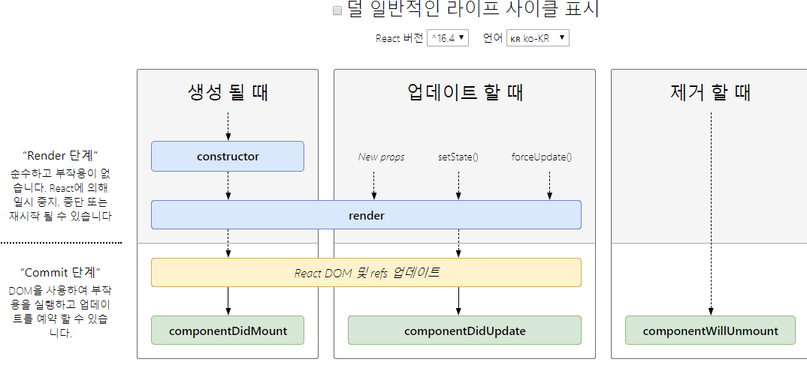
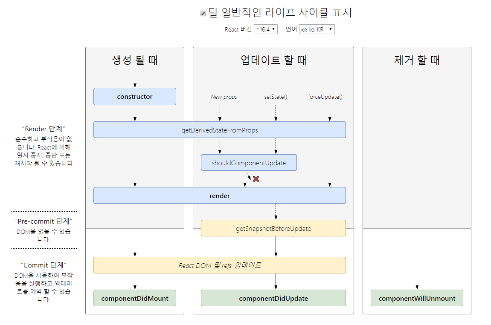
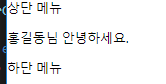
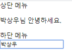
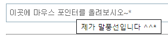

# React 


-  **p111_ 자식 컴포넌트는 부모 컴포넌트가 랜더링 될 때 함께 랜더링 된다.** 

  ""증가 2" 버튼을 눌렀을 때 자식 컴포넌트도 함께 랜더링 된다. --> 불필요한 랜더링이 발생 ( 이것들이 시스템의 서비스의 영향을 미칠 수 있다. ) 

  **불필요한 랜더링을 방지하기 위해서는 React.memo , React.PureComponent 를 사용하면 된다.** 

```jsx
// todo.js 
import React, {Fragment} from 'react' ; 
import Title from './Title';

class Todo extends React.Component{
    state = {count:0, count1 : 0};

    onClick = () =>{
        this.setState({count: this.state.count+1});
    };

    onClick2 = () =>{ 
        this.setState({count1 : this.state.count1+1});
    };

    render(){
        return(
            <div>
                <Title title = {`현재 카운트 : ${this.state.count}`}></Title>
                <p>{this.state.count1}</p>
                <button onClick={this.onClick}>증가</button>
                <button onClick={this.onClick2}>증가2</button>
            </div>
        );
    }
}

export default Todo;
```

```jsx
// Title.js
import React from 'react';

function Title(props){ 
    
    console.log(props); 
    return <p>{props.title}</p>
}

export default Title;
```

```jsx
// App.js 
import React from 'react';
import Todo from './todo';

class App extends React.Component {
  render() {
    return <Todo />
  }
}

export default App; 
```


▶ **함수형 컴포넌트인 경우**,  `Title.js ` 의 export 부분에서 `React.memo(Title)` 로 변경한 이후에 다시 실행하면 props 값이 변경되는 경우에만 호출되는 것을 확인할 수 있다. ( 불필요한 랜더링을 줄일 수 있다. ) 

```jsx
// Title.js 
import React from 'react';

function Title(props){ 
    
    console.log(props); 
    return <p>{props.title}</p>
}

export default React.memo(Title);
```

▶클래스형 컴포넌트인 경우, React.PureComponent 를 이용하면 자식 컴포넌트의 불필요한 랜더링을 줄일 수 있다. 

```jsx
// Title.js 
import React from 'react';

class Title extends React.PureComponent{
    constructor(props){
        super(props);
    }
    render(){
        console.log(this.props);  
        return (
            <p>{this.props.title}</p>
        );
    }
}
export default Title; 
```


#### p112 setState 

- 클래스형 컴포넌트에서 상태값을 변경할 때 호출하는 메소드 

- setState 메소드로 입력된 객체는 기존 상태값에 병함(merge) 됨. 

- setState 는 성능을 위해서 실행결과들을 모아서 반영한다. ( setState 함수는 비동기로 동작한다. )

  ```jsx
  // 아래와 같이 3개를 연달아 쓴다고 하여도 클릭 이벤트 발생 시 count1 이 한 번에 3이 증가하는 것이 아니라 실행결과들을 모아서 수행하기 때문에 count1 값이 1 만 증가한다. 
  onClick = () => { 
      this.setState({ count1 : this.state.count1+1});
      this.setState({ count1 : this.state.count1+1});
      this.setState({ count1 : this.state.count1+1});
  };
  ```


#### p113 setState 메소드를 연속해서 호출하면 발생하는 문제점 

- 리액트는 효율적인 랜더링을 위해서 여러 개의 setState 메서드를 배치로 처리 -> state 변수와 화면(UI) 간 불일치가 발생할 수 있음. 

  - **방법_1 ) 호출 직전의 상태값을 매개변수로 받아서 처리** 

  ```jsx
  // App.js
  onClick = () => {
      this.setState({count1: this.state.count1 + 1});
      this.setState({count1: this.state.count1 + 1});
      this.setState({count1: this.state.count1 + 1});
      
      this.setState(prevState =>({count2: prevState.count2 + 1}));
      this.setState(prevState =>({count2: prevState.count2 + 1}));
      this.setState(prevState =>({count2: prevState.count2 + 1}));
  }
  ```

  - **방법_2 ) 상태값 로직을 분리해서 사용** 

  ```jsx
  // App.js
  
  // 함수를 외부에 선언 
  const actions = {
    init() {
      return { count: 0 };
    },
    increment(state) { // 함수 호출 시 이전 상태 값이 들어간다. 
      return { count: state.count + 1 };
    }, 
    decrement(state) {
      return { count: state.count - 1 };
    },
  };
  
  class App extends React.Component {
    state = actions.init();
    onIncrement = () => {
      this.setState(actions.increment);
    };
    onDecrement = () => {
      this.setState(actions.decrement);
    };
    render() {
      return (
        <div>
          <p>{this.state.count}</p>
          <button onClick={this.onIncrement}>증가</button>
          <button onClick={this.onDecrement}>감소</button>
        </div>
      );
    }
  }
  export default App;
  ```


#### p114 setState 메소드는 비동기로 처리되지만 호출 순서는 보장된다. 

```jsx
import React from 'react';
import Todo from './todo';

class App extends React.Component {
 state = {count1 :0 , count2 : 0};

 onClick = () => { 
    this.setState({count1:this.state.count1 + 1}); 
    this.setState({count2:this.state.count2+ 1});
 };

  render() {
    const {count1, count2} = this.state; 
    const result = count1 >= count2; 

    return (
      <div>
        <p>{count1} >= {count2}</p>
        <p>{String(result)}</p>
        <button onClick={this.onClick}>증가</button>
      </div>
    );
  }
}
export default App;
```

비동기로 처리되지만 호출 순서가 보장되어 `count1` 이 무조건 먼저 증가하므로 아래 `result `는 무조건 `true `값을 반환하는 것을 확인할 수 있다. 


#### p115 setState 메소드의 두번째 매개변수는 처리가 끝났을 때 호출되는 콜백함수 .

https://ko.reactjs.org/docs/react-component.html#setstate

두번째 매개변수는 setState 의 실행이 완료되고 **컴포넌트가 다시 랜덩링된 뒤에 실행될 함수**에 대한 콜백. ( componentDidUpdate( ) 의 사용을 권장 ) 

```jsx
// App.js
import React from 'react';
import Todo from './todo';

class App extends React.Component {
 state = {count1 :0 , count2 : 0};

 onClick = () => { 
  this.setState({count1:this.state.count1 + 1}, () => console.log(`count1 = ${this.state.count1}`)); 
  this.setState({count2:this.state.count2+ 1}, () => console.log(`count2 = ${this.state.count2}`));
};

  render() {
    console.log(`render is called`);
    const {count1, count2} = this.state; 
    const result = count1 >= count2; 

    return (
      <div>
        <p>{count1} >= {count2}</p>
        <p>{String(result)}</p>
        <button onClick={this.onClick}>증가</button>
      </div>
    );
  }
}

export default App;

```




순서를 확인하면 render 가 먼저 실행되고, 콜백함수가 실행됨을 확인할 수 있다. 


#### p117 createElement 함수가 반환하는 리액트 요소의 구조 

```jsx
console.log(element); 
const consoleLogResult = { 
	type : 'a', // (1)
    key : 'key1' , // (2)
    ref : null, 	// (3)
    props : {	// (4)
        href : 'http://google.com', 
        style : {
            width: 100, 
        }, 
        children : 'click here',
    },
    // .... 
};
```

(1) :`type` 속성 값이 문자열이면 HTML 태그, 함수이면 우리가 작성한 컴포넌트를 의미 . 

(2) : JSX 코드에서 key 속성값을 입력하면 리액트 요소의 key 속성값으로 들어간다. ( `key` 는 element 의 특정값에 빠르게 접근하기 위해 사용 )

(3) : 직접적인 화면의 DOM 요소에 접근해 사용하기 위해서 `ref` 를 사용. 

(4) : key 와 ref 를 제외한 나머지 속성값은 리액트 요소의 props 속성값으로 들어간다. 


**코드 3-18 ) JSX 코드에서 태그 사이에 표현식이 들어가면, 표현식을 기준으로 분활되어서 들어간다**



```jsx
// 책에 있는 코드 처럼 출력하는 App.js 코드 
import React from 'react';

class App extends React.Component {
  render() {
    const code3_16 = <a href="http://www.google.com">click here</a>;
    console.log(code3_16);
    const code3_17 = <a key="key1" style={{width:100}} href="http://google.com">click here</a>;
    console.log(code3_17);
    const code3_18 = <h1>제 나이는 {20+5} 세입니다.</h1>;
    console.log(code3_18);
    return(<div></div>);
  }
}
export default App;
```


- 리액트에서 데이터 변경에 의한 화면 업데이트는 렌더단계 ( render phase ) ,  커밋단계 ( commit phase ) 를 거친다. 
  - **렌더단계**는 실제 돔에 반영할 **변경 사항을 파악**하는 단계 ( 이 떄 가상 돔을 사용 )
  - **커밋단계**는 파악된 변경사항을 **실제 돔에 반영**하는 단계 


#### p119 리액트 요소가 돔 요소로 만들어지는 과정

```jsx
//App.js
import React from 'react';
import Todo from './Todo';

class App extends React.Component {
  render() {
    const element = <Todo title="리액트 공부하기" desc="실전 리액트를 열심히 읽는다"></Todo>;
    console.log(element);
    return (element);
  }
}
export default App;
```

```jsx
// Todo.js
import React, { Fragment } from 'react';
import Title from './Title';

class Todo extends React.Component {
    state = { priority: 'high' };

    onClick = () => {
        let { priority } = this.state;
        priority = priority === 'high' ? 'low' : 'high';
        this.setState({ priority });
    };
    render() {
        const { title, desc } = this.props;
        const { priority } = this.state;
        const element = (
            <div>
                <Title title={title} />
                <p>{desc}</p>
                <p>{priority === 'high' ? '우선순위 높음' : '우선순위 낮음'}</p>
                <button onClick={this.onClick}>우선순위 변경</button>
            </div>
        );
        console.log(element);
        return element;
    };
}
export default Todo;
```

```jsx
// Title.js
import React from 'react';

class Title extends React.PureComponent {
    constructor(props) {
        super(props);
    }
    render() {
        const { title } = this.props;
        const element = <p style={{color:'blue'}}>{title}</p>;
        console.log(element);
        return element;
    }
}
export default Title;
```




#### p124 생명주기 메소드 

http://projects.wojtekmaj.pl/react-lifecycle-methods-diagram/







#### p148 콘텍스트 API 

​	:	 상위 컴포넌트에서 하위에 있는 모든 컴포넌트로 데이터를 직접 전달 가능.  

```jsx
<App>
	<div>
		<div>상단 메뉴</div>
		<Profile />
		<div>하단 메뉴</div>
	</div>
</App>

<Profile>
	<div>
		<Greeting />
	</div>
</Profile>

<Greeting>
	<p>OOO님 안녕하세요.</p>
</Greeting>

```


App 에서 가지고 있는 어떤 값을 Greeting 에 있는 값으로 전달하기 위해서는 어떤식으로 해야할 까 . 


현재는 3개정도만 전달하지만 데이터의 크기가 커질 경우 연쇄적으로 전달해야하는 코드는 매우 번잡하다. 

```jsx
//App.js - 전달에 전달 ( 연쇄적으로 전달 - 비효율적인 코드 )
import React from 'react';
import Todo from './todo';

class App extends React.Component {
  render() {
    return (
      <div>
        <div>상단 메뉴</div>
        <Profile username="홍길동"/>
        <div>하단 메뉴</div>
      </div>
    );
  }
}

function Profile({username}){
  return (
    <div>
      <Greeting username = {username}/>
    </div>
  ); 
}

function Greeting({username}){
  return (
    <p>{`${username}님 안녕하세요.`}</p>
  ); 
}

export default App;
```

​																							▼

```jsx
import React from 'react';
import Todo from './todo';

// unknown 은 UserContext 의 기본값. -> 기본값은 콘텍스트 값이 정의되지 않을 경우 사용 .
const UserContext = React.createContext('unknown');		// 콘텍스트 객체 생성 
// React.createContext(defaultValue) => {Provider, Consumer}

class App extends React.Component {
  render() {
    return (
      <div>
        <UserContext.Provider value = "홍길동">
          <div>상단 메뉴</div>
          <Profile />
          <div>하단 메뉴</div>
        </UserContext.Provider>
      </div>
    );
  }
}

function Profile(){
  return (
    <div>
        <Greeting />
    </div>
  ); 
}

function Greeting(){
  return (
    <UserContext.Consumer>
    { username => <p>{`${username}님 안녕하세요.`}</p> }
    </UserContext.Consumer>
  ); 
}

export default App;
```



```jsx
// App.js  - 텍스트를 입력하면 그대로 반영되어 적용 
import React from 'react';
import Todo from './todo';

const UserContext = React.createContext('unknown');

class App extends React.Component {
  state = {username:''};
  onChange = e => {
    const username = e.target.value; 
    this.setState({username});
  };

  render() {
    const {username} = this.state;
    return (
      <div>
        <UserContext.Provider value = {username}>
          <div>상단 메뉴</div>
          <Profile />
          <div>하단 메뉴</div>
        </UserContext.Provider>
        <input type="text" value = {username} onChange= {this.onChange} />
      </div>
    );
  }
}

function Profile(){
  return (
    <div>
        <Greeting />
    </div>
  ); 
}

function Greeting(){
  return (
    <UserContext.Consumer>{
      username => <p>{`${username}님 안녕하세요.`}</p>
    }</UserContext.Consumer>
  ); 
}

export default App;
```





---

- React.Component 와 React.PureComponent 는 shouldComponentUpdate 라이프 사이클 메소드를 다루는 방식을 제외하곤 동일. ( PureComponent 는 shouldComponentUpdate 라이프 사이클이 적용된 버전. )

- 함수형 컴포넌트도 결국엔 클래스 기반 컴포넌트로 래핑(wrapping) 된다. 

- **리액트의 라이프사이클이란 ?** 

   라이프사이클이란 컴포넌트가 생성되고 사용되고 소멸될 때까지 일련의 과정을 의미한다. 이러한 생명주기 안에서는 특정 시점에 자동으로 호출되는 메서드가 있는데 이를 **라이프 사이클 이벤트**라고 한다. 


- `<a>` 태그 : 문서를 링크시키기 위해 사용하는 태그.  

  ​				   ( 문자 뿐만 아니라 이미지`<div>` 등도 링크를 걸 수 있다.)

  - **href 속성**  ( hypertext reference )

    : 연결할 주소를 지정하는 속성. ( `""` 를 빠트리지 않도록 주의 )

  - **title 속성**

    : 해당 태그 위에 마우스 포인터가 올라갔을 때 나타나는 말풍선. 

    

  - **target 속성** 

    : 링크를 클릭할 떄 창을 어떻게 열지를 결정. 

    - `_self`  :  연결 문서를 클릭한 창에서 연다 ( 기본값 )
    - `_blank` : 연결 문서를 새 창에서 연다 
    - `_parent` : 부모(상위 레벨) 창에서 연다 ( 부모가 없으면 _self 처럼 표시 )
    - `_top` : 가장 상위 창에서 연다 ( 즉 프레임을 무시하며 전체 브라우저 창에서. ) ( 부모가 없으면 _self 처럼 표시 )
    - `frame name` : 지정된 프레임 안에서 연다 .


https://www.w3schools.com/react/default.asp