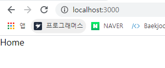
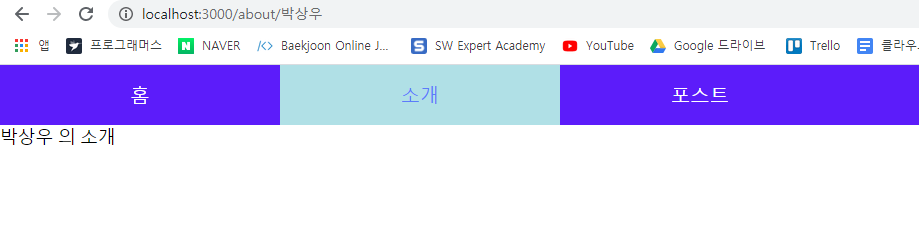

# React-Router 실습 


**라우팅** : 다른 주소에 따라 다른 뷰를 보여주는 것  ( 리액트는 이 기능이 내장 x )


서버사이드 랜더링을 구현할 경우 서버 전용 라우터를 써야한다. 


**라우터 컴포넌트 내부에 있는 컴포넌트는 오직 하나여야한다.** 


`Link` 컴포넌트의 역할은 새로운 페이지를 불러오지 않고, 

`react-router-dom` : 브라우저에서 사용되는 리액트 라우터 


## 실습 순서


1. `create-react-app` 으로 프로젝트 생성 

   ```bash
   $ create-react-ap react-router-test
   ```

2. 해당 프로젝트에서 React-Router 설치 

   ```bash 
   $ yarn add react-router-dom 
   ```

3. 라우터를 이용하여 바꿀 컴포넌트들을 저장하기 위해 routes 라는 디렉터리를 생성하고, 컴포넌트들을 생성한다. 위의 실습 화면을 보면 6개의 탭에 관한 컴포넌트 필요 ( 홈, 소개, 포스트, 마마이페이지, 로그인, 검색 )

4. `App.js` 파일에서 Router 를 이용하여 경로에 따라 다른 뷰가 보이도록 설정. 

   ```jsx
   import React from 'react';
   import { BrowserRouter as Router, Route, Switch} from 'react-router-dom'; 
   
   import Home from './routes/Home';
   import About from './routes/About'; 
   import Posts from './routes/Posts';
   import MyPage from './routes/MyPage';
   import Login from './routes/Login';
   import Search from './routes/Search';
   import NoMatch from './routes/NoMatch';
   
   import Header from './components/Header';
   
   const App = () => {
       return (
           <Router>
               <div>
                   <Route exact path="/" component={Home}/>
                   <Route path="/about" component={About}/> 
                   <Route path="/posts" component={Posts}/> 
                   <Route path="/login" component={Login}/> 
                   <Route path="/me" component={MyPage}/> 
                   <Route path="/search" component={Search}/> 
               </div>
           </Router>
       );
   };
   
   export default App;
   ```

   - `exact` : path 의 경로와 정확히 일치해야만 해당 컴포넌트가 보인다. 

   - `<Router></Router> `  내부에는 단 하나의 컴포넌트만 존재해야한다. 

     

   **결과 )** 아래와 같이 경로에 따라 다른 컴포넌트가 보임을 확인할 수 있다. 

   

   

   

   

5. 위의 라우터 기능을 보다 돋보이게 하기 위해서 헤더를 클릭하면 해당 컴포넌트로 이동하도록 `Header.js` 파일을 수정한다. 이 때 사용하는 기능은 `Link` 라는 기능을 이용하여 경로를 바꿔준다. 

   ```jsx
   import React from 'react';
   import {Link} from 'react-router-dom' ; 
   import './Header.css'; 
   
   const Header = () => {
       return (
           <div className = "header">
               <Link exact to ="/" className="item" >홈</Link>
               <Link to ="/about" className="item"  >소개</Link>
               <Link to ="/posts" className="item"  >포스트</Link>
               <Link to ="/me" className="item"  >마이페이지</Link>
               <Link to ="/login" className="item"  >로그인</Link>
               <Link to ="/search" className="item" >검색</Link>
           </div>
       );
   };
   
   export default Header;
   ```

    ```css
   .header{
       background : #5c0cfa;
       display : table; 
       table-layout : fixed; 
       width : 100% ;
   }
   
   .item{ 
       text-align : center; 
       padding-top : 1rem; 
       padding-bottom : 1rem;
       display : table-cell; 
       color : white; 
       text-decoration : none; 
       font-size : 1.1rem ; 
   }
   
   .item:hover{ 				// 마우스 올라갔을 때 색 변화 
       background : #748ffc; 
   }
   .item:active{
       background : white; 
       color : #5c7cfa;
   }
    ```

   

   **결과 )** 

   

   

   위의 디자인을 좀더 이쁘게 하기 위해 `Link` 대신 `NavLink` 를 쓰면 다음과 같이 변한다. 그리고 현재는 클릭한 이후에 값의 상태를 유지하지 않지만 css 파일에서 아래 부분도 추가를 해주면 활성화 상태에 대한 디자인도 추가된다. 

   ```js
   import React from 'react';
   import {NavLink} from 'react-router-dom' ; 
   import './Header.css'; 
   
   
   const Header = () => {
       return (
           <div className = "header">
               <NavLink exact to ="/" className="item" activeClassName="active">홈</NavLink>
               <NavLink to ="/about" className="item"  activeClassName="active">소개</NavLink>
               <NavLink to ="/posts" className="item"  activeClassName="active">포스트</NavLink>
               <NavLink to ="/me" className="item"  activeClassName="active">마이페이지</NavLink>
               <NavLink to ="/login" className="item"  activeClassName="active">로그인</NavLink>
               <NavLink to ="/search" className="item"  activeClassName="active">검색</NavLink>
           </div>
       );
   };
   
   export default Header;
   ```

   ```css 
   .item:active, .item.active {
       background : powderblue	; 
       color : #5c7cfa;
   }
   ```

   

   마우스를 클릭한 이후에도 활성화 상태부분은 다른색으로 나타남을 확인할 수 있다. 

   

6.  라우터 스위치를 이용하여 원하는 페이지를 찾지 못하였을 경우 보여지는 404 페이지 창 만들어서 띄우기. 

   `routes` 디렉터리 밑에 `NoMatch.js` 라는 파일 생성. 이후 아래와 같이 작성 

   ```js
   import React from 'react';
   
   const NoMatch = () => {
       return (
           <div>
               
           	페이지를 못찾았어요 !!! 
               404 빼애애액 !!!!
           </div>
       );
   };
   
   export default NoMatch;
   ```


​	 그리고 위의 컴포넌트를 반영하기 위해서 `App.js` 파일에서 추가. 이 때 Router 의 Switch 기능을 사용 . ( Switch 의 기능은 if-else 구문과 유사 .)

```js
import React from 'react';
import { BrowserRouter as Router, Route, Switch} from 'react-router-dom'; 

import Home from './routes/Home';
import About from './routes/About'; 
import Posts from './routes/Posts';
import MyPage from './routes/MyPage';
import Login from './routes/Login';
import Search from './routes/Search';
import NoMatch from './routes/NoMatch';
import Header from './components/Header';

const App = () => {
    return (
        <Router>
            <div>
                <Header />
                <div>
                    <Switch>
                        <Route exact path="/" component={Home}/>
                        <Route path="/about" component={About}/> 
                        <Route path="/posts" component={Posts}/> 
                        <Route path="/login" component={Login}/> 
                        <Route path="/me" component={MyPage}/> 
                        <Route path="/search" component={Search}/> 
                        <Route component = {NoMatch}/>
                    </Switch>
                </div>
            </div>
        </Router>
    );
};

export default App;
```

- `import` 구문에 Switch 추가
- Switch 구문은 경로가 일치할 경우 해당 컴포넌트를 보여주고 그렇지 않을경우 마지막`default` 값을 보여준다.


**결과 )** 

잘못된 경로가 입력될 경우 


7. **추가 기능 구현** 

   7-1) 라우터를 이용하여 인자를 넘길 때 `path = "경로 / :넘길 인자 값 ` 이용 . 

   ```js
   // App.js 파일에서 About 컴포넌트에 사용자 이름 넘길 때 
   
   <Route path="/about/:username" component={About}/> 
       
   // Header.js 파일에서 경로를 변경할 때 인자 값을 같이 넘긴다. 
   <NavLink to ="/about/박상우" className="item"  activeClassName="active">소개</NavLink>
   
   // /routes/About.js 파일 
   import React from 'react';
   
   const About = ({match}) => {
       return (
           <div>
               {match.params.username} 의 소개
           </div>
       );
   };
   
   export default About;
   ```

   **결과 )** 

   

   7-2) 검색창에서 keyword 로 검색한 값 넘겼을 때 컴포넌트에서 확인하기 . 

   ```js
   // Search.js 
   import React from 'react';
   
   const Search = ({location}) => {
       return (
           <div>
               {new URLSearchParams(location.search).get('keyword')} 검색
           </div>
       );
   };
   
   export default Search;
   ```

   **결과 )** 

   

   

   7-3) 로그인 상태에 따라 마이페이지 접근 가능 불가능 설정 

   ```js
   // MyPage.js 파일 
   import React from 'react';
   import { Redirect } from 'react-router-dom' ; 
   
   const logged = false; 
   
   const MyPage = () => {
       return (
           <div>
               {
                   !logged && <Redirect to="/login"/>
               }
               마이페이지
           </div>
       );
   };
   
   export default MyPage;
   ```

   

   7-4) 버튼 클릭시 다른 컴포넌트로 이동 ( 홈 컴포넌트에 있는 버튼 클릭시 포스트 페이지로 이동 )

   ```js
   import React from 'react';
   
   const Home = ({history}) => {
       return (
           <div>
             Home  
             <button onClick ={() => {history.push('./posts')}}>
                 버어튼
             </button>
           </div>
       );
   };
   
   export default Home;
   ```

   

   

