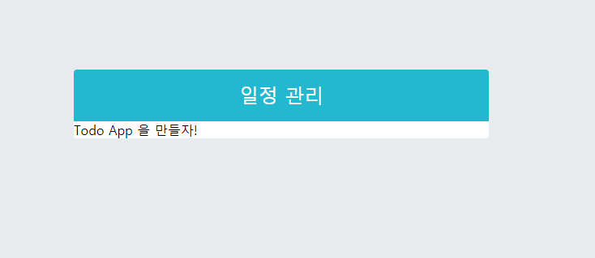

# 일정 관리 웹 애플리케이션 만들기 

## 10.1 프로젝트 준비하기 


### 10.1.1 프로젝트 생성 및 필요한 라이브러리 설치 

- Sass 를 사용하기 위해 `node-sass` 설치 

- 나중에 조건부 스타일링을 좀 더 편하게 하기 위해 `classnames` 설치 

- 리액트에서 다양하고 예쁜 아이콘을 사용하기 위해 `react-icons` 라이브러리 사용. 

  아이콘 리스트와 사용법은 https://react-icons.netlify.com/ 에서 확인할 수 있다. 

  이 라이브러리의 장점은 SVG 형태로 이루어진 아이콘을 리액트 컴포넌트처럼 매우 쉽게 사용할 수 있다. 

  아이콘의 크기가 색상은 props 혹은 CSS 스타일로 변경하여 사용할 수 있다. 

  ```bash
  > yarn add node-sass classnames react-icons
  ```


### 10.1.2 Prettier 설정 

- 프로젝트의 최상위 디렉터리에 `.prettierrc` 파일을 다음과 같이 생성 

  ```json
  {
  	"singleQuote" : true, 
  	"semi" : true, 
  	"useTabs" : true, 
  	"tabWidth" : 2, 
  	"trailingComma" : "all", 
  	"printWidth" : 80
  }
  ```


### 10.1.3 index.css 수정 

- 프로젝트의 글로벌 스타일 파일이 들어있는 index.css 를 조금 수정 

  ```css
  body {
    margin: 0;
    padding : 0; 
    background : #e9ecef; 
  }
  ```


#### 10.1.4 App 컴포넌트 초기화 

```jsx
// App.js 
import React from 'react';

const App = () => {
	return <div>Todo App을 만들자!</div>;
};
export default App;
```


## 10.2 UI 구성하기 

- **TodoTemplate** : 화면을 가운데에 정렬시켜주며, 일정관리를 보여준다.  children 으로 내부 JSX 를 props 로 받아와서 렌더링 해준다. 
- **TodoInsert** : 새로운 항목을 입력하고 추가할 수 있는 컴포넌트. state를 통해 인풋의 상태를 관리. 
- **TodoListItem** : 각 할 일 항목에 대한 정보를 보여주는 컴포넌트.  todo 객체를 props 로 받아와서 상태에 따라 다른 스타일의 UI 를 보여준다. 
- **TodoList** : todos 배열을 props 로 받아온 후 , 이를 배열 내장 함수 map 을 사용해서 여러개의 TodoListItem 컴포넌트로 변환하여 보여준다. 


### 10.2.1 TodoTemplate 만들기 

```jsx
// TodoTemplate.js 
import React from 'react';
import './TodoTemplate.css';

const TodoTemplate = ({ children }) => {
	return (
		<div className="TodoTemplate">
			<div className="app-title">일정 관리</div>
			<div className="content">{children}</div>
		</div>
	);
};

export default TodoTemplate;
```

```jsx
// App.js
import React from 'react';
import TodoTemplate from './components/TodoTemplate';

const App = () => {
	return <TodoTemplate> Todo App 을 만들자! </TodoTemplate>;
};

export default App;
```


- 닫혀 있는 파일에도 자동 완성이 제대로 작동하려면 프로젝트 최상위 디렉터리에 `jsconfig.json` 파일을 만들어주어야한다. 

  아래와 같이 자동완성 박스가 나타나면 Enter 를 눌러 코드를 완성 

  

  ```json
  {
      "compilerOptions": {
          "target": "es6"
      }
  }
  ```


- scss 파일 작성 

  ```scss
  .TodoTemplate {
  	width: 512px;
  	//width 가 주어진 상태에서 좌우 중앙 정렬
  	margin-left: auto;
  	margin-right: auto;
  	margin-top: 6rem;
  	border-radius: 4px;
  	overflow: hidden;
  
  	.app-title {
  		background: #22b8cf;
  		color: white;
  		height: 4rem;
  		font-size: 1.5rem;
  		display: flex;
  		align-items: center;
  		justify-content: center;
  	}
  
  	.content {
  		background: white;
  	}
  }
  ```





- 레이아웃 시 flex 라는 display 속성을 자주 쓰는데, flex 에 대해 자세히 알고싶다면 Flexbox Froggy(http://flexboxfroggy.com/#ko) 사이트에서 공부해라 .


### 10.2.2 TodoInsert 만들기 

```jsx
// TodoInsert.js 

import React from 'react';
import {MdAdd} from 'react-icons/md'; 
import './TodoInsert.scss'; 

const TodoInsert = () => {

    return (
        <form className = "TodoInsert">
            <input placeholder = "할 일을 입력하세요 " />
            <button type="submit">
                <MdAdd />
            </button>
        </form>
    );
};

export default TodoInsert;
```

```jsx
// App.js
import React from 'react';
import TodoTemplate from './components/TodoTemplate';
import TodoInsert from './components/TodoInsert';

const App = () => {
	return (
		<TodoTemplate>
			<TodoInsert />
		</TodoTemplate>
	);
};

export default App;
```


- 컴포넌트 스타일링 

  ```scss
  // TodoInsert.scss
  .TodoInsert {
  	display: flex;
  	background: #495057;
  
  	input {
  		// 기본 스타일 초기화
  		background: none;
  		outline: none;
  		border: none;
  		padding: 0.5rem;
  		font-size: 1.125rem;
  		line-height: 1.5;
  		color: white;
  		&::placeholder {
  			color: #dee2e6;
  		}
  		// 버튼을 제외한 영역을 모두 차지
  		flex: 1;
  	}
  
  	button {
  		// 기본 스타일 초기화
  		background: none;
  		outline: none;
  		border: none;
  		background: #868e96;
  		color: white;
  		padding-left: 1rem;
  		padding-right: 1rem;
  		font-size: 1.5rem;
  		display: flex;
  		align-items: center;
  		cursor: pointer;
  		transition: 0.1s backround ease-in;
  		&:hover { // 마우스가 아이콘에 올라갔을 때 색 변화 
  			background: #adb5bd;
  		}
  	}
  }
  ```

  


### 10.2.3 TodoListItem 과 TodoList 만들기 

```jsx
// TodoListItem.js 
import React from 'react';
import {
	MdCheckBoxOutlineBlank,
	MdCheckBox,
	MdRemoveCircleOutline,
} from 'react-icons/md';
import './TodoListItem.scss';

const TodoListItem = () => {
	return (
		<div className="TodoListItem">
			<div className="checkbox">
				<MdCheckBoxOutlineBlank />
				<div className="text">할 일</div>
			</div>
			<div className="remove">
				<MdRemoveCircleOutline />
			</div>
		</div>
	);
};

export default TodoListItem;
```

```jsx
// TodoList.js 
import React from 'react';
import './TodoList.scss';
import TodoListItem from './TodoListItem';

const TodoList = () => {
	return (
		<div className="TodoList">
			<TodoListItem />
			<TodoListItem />
			<TodoListItem />
		</div>
	);
};

export default TodoList;
```

```jsx
// App.js 
import React from 'react';
import TodoTemplate from './components/TodoTemplate';
import TodoInsert from './components/TodoInsert';
import TodoList from './components/TodoList';

const App = () => {
	return (
		<TodoTemplate>
			<TodoInsert />
			<TodoList />
		</TodoTemplate>
	);
};

export default App;
```


- 컴포넌트 스타일링 

  ```scss
  .TodoListItem {
  	padding: 1rem;
  	display: flex;
  	align-items: center; // 세로 중앙 정렬
  	&:nth-child(even) {
  		background: #f8f9fa;
  	}
  
  	.checkbox {
  		cursor: pointer;
  		flex: 1; // 차지할 수 있는 영역 모두 차지
  		display: flex;
  		align-items: center; // 세로 중앙 정렬
  		svg {
  			// 아이콘
  			font-size: 1.5rem;
  		}
  		.text {
  			margin-left: 0.5rem;
  			flex: 1; // 차지할 수 있는 영역 모두 차지
  		}
  		&.checked {
  			// 체크되었을 때 보여줄 스타일
  			svg {
  				color: #22b8cf;
  			}
  			.text {
  				color: #adb5bd;
  				text-decoration: line-through;
  			}
  		}
  	}
  
  	.remove {
  		display: flex;
  		align-items: center;
  		font-size: 1.5rem;
  		color: #ff6b6b;
  		cursor: pointer;
  		&:hover {
  			color: #ff8787;
  		}
  	}
  	// 엘리먼트 사이사이에 테두리를 넣어 줌
  	& + & {
  		border-top: 1px solid #dee2e6;
  	}
  }
  ```

  


## 10.3 기능 구현하기 


### 10.3.1 App 에서 todos 상태 사용하기 

```jsx
// App.js 
import React, {useState} from 'react';
import TodoTemplate from './components/TodoTemplate';
import TodoInsert from './components/TodoInsert';
import TodoList from './components/TodoList';

const App = () => {
	const [todos, setTodos] = useState([{
		id:1, 
		text:'리액트의 기초 알아보기', 
		checked:true,
	},
	{
		id:2, 
		text:'컴포넌트 스타일링 해보기', 
		checked:true,
	},
	{
		id:3, 
		text:'일정 관리 앱 만들어보기', 
		checked:false,
	}]);

	return (
		<TodoTemplate>
			<TodoInsert />
			<TodoList todos={todos}/>
		</TodoTemplate>
	);
};

export default App;
```

```jsx
// TodoList.js 
import React from 'react';
import './TodoList.scss';
import TodoListItem from './TodoListItem';

const TodoList = ({ todos }) => {
	return (
		<div className="TodoList">
			{todos.map(todo => (
				<TodoListItem todo={todo} key={todo.id} />
			))}
		</div>
	);
};

export default TodoList;
```

```jsx
// TodoListItem.js 
import React from 'react';
import {
	MdCheckBoxOutlineBlank,
	MdCheckBox,
	MdRemoveCircleOutline,
} from 'react-icons/md';
import './TodoListItem.scss';
import cn from 'classnames';

const TodoListItem = ({ todo }) => {
	const { text, checked } = todo;

	return (
		<div className="TodoListItem">
			<div className={cn('checkbox', { checked })}>
				{checked ? <MdCheckBox /> : <MdCheckBoxOutlineBlank />}
				<div className="text">{text}</div>
			</div>
			<div className="remove">
				<MdRemoveCircleOutline />
			</div>
		</div>
	);
};

export default TodoListItem;
```


### 10.3.2 항목 추가 기능 구현하기 


#### 10.3.2.1 TodoInsert value 상태 관리하기 

- TodoInsert 컴포넌트에서 인풋에 입력하는 값을 관리할 수 있도록 useState 를 사용하여 value 라는 상태를 정의. 

  ```jsx
  // TodoInsert.js 
  import React, { useState, useCallback } from 'react';
  import { MdAdd } from 'react-icons/md';
  import './TodoInsert.scss';
  
  const TodoInsert = () => {
  	const [value, setValue] = useState('');
  
  	const onChange = useCallback(e => {
  		setValue(e.target.value);
  	}, []);
  
  	return (
  		<form className="TodoInsert">
  			<input
  				placeholder="할 일을 입력하세요 "
  				value={value}
  				onChange={onChange}
  			/>
  			<button type="submit">
  				<MdAdd />
  			</button>
  		</form>
  	);
  };
  
  export default TodoInsert;
  ```

  

#### 10.3.2.2 리액트 개발자 도구 

- 리액트 개발자 도구는 브라우저에 나타난 리액트 컴포넌트를 심층 분석할 수 있도록 리액트 개발 팀이 만들었으며, 크롬 웹 스토어에서 React Developer Tools 를 검색하여 설치할 수 있다. 

  


#### 10.3.2.3 todos 배열에 새 객체 추가하기 

- onInsert 함수는 새로운 객체를 만들때마다 id 값에 1씩 더해줘야한다.  여기서 id 값은 useRef 를 사용하여 관리하겠다. ( useRef 를 이용하는 이유는 렌더링되는 정보가 아니기 때문. )

- 또한 onInsert 함수는 컴포넌트의 성능을 아낄 수 있도록 useCallback 으로 감싸준다. props 를 전달해야할 함수를 만들 때는 useCallback 을 사용하여 함수를 감싸는 것을 습관화해라. 

  ```jsx
  // App.js 
  import React, { useState, useRef, useCallback } from 'react';
  import TodoTemplate from './components/TodoTemplate';
  import TodoInsert from './components/TodoInsert';
  import TodoList from './components/TodoList';
  
  const App = () => {
  	const [todos, setTodos] = useState([
  		{
  			id: 1,
  			text: '리액트의 기초 알아보기',
  			checked: true,
  		},
  		{
  			id: 2,
  			text: '컴포넌트 스타일링 해보기',
  			checked: true,
  		},
  		{
  			id: 3,
  			text: '일정 관리 앱 만들어보기',
  			checked: false,
  		},
  	]);
  
  	// 고윳값으로 사용될 id 
  	// ref 를 사용하여 변수 담기 
  	const nextId = useRef(4); 
  
  	const onInsert = useCallback(
  		text => {
  			const todo = {
  				id : nextId.current, 
  				text, 
  				checked : false,
  			};
  			setTodos(todos.concat(todo));
  			nextId.current +=1; // nextId 1씩 더하기  
  		},
  		[todos],
  	)
  
  	return (
  		<TodoTemplate>
  			<TodoInsert onInsert={onInsert}/>
  			<TodoList todos={todos} />
  		</TodoTemplate>
  	);
  };
  
  export default App;
  ```


#### 10.3.2.4 TodoInsert 에서 onSubmit 이벤트 설정하기

```jsx
// TodoInsert.js 

import React, { useState, useCallback } from 'react';
import { MdAdd } from 'react-icons/md';
import './TodoInsert.scss';

const TodoInsert = ({ onInsert }) => {
	const [value, setValue] = useState('');

	const onChange = useCallback(e => {
		setValue(e.target.value);
	}, []);

	const onSubmit = useCallback(
		e => {
			onInsert(value);
			setValue(''); // value 값 초기화

			//submit 이벤트는 브라우저에서 새로고침을 발생시킨다.
			// 이를 방지하기 위해 아래 함수를 호출
			e.preventDefault();
		},
		[onInsert, value],
	);

	return (
		<form className="TodoInsert" onSubmit={onSubmit}>
			<input
				placeholder="할 일을 입력하세요 "
				value={value}
				onChange={onChange}
			/>
			<button type="submit">
				<MdAdd />
			</button>
		</form>
	);
};

export default TodoInsert;
```


- 물론 onSubmit 대신에 버튼의 onClick 이벤트로도 충분히 처리할 수 있다. 

  ```jsx
  const onClick = useCallback( ()=>{
      onInsert(value); 
      setValue(''); // value 값 초기화 
  }, [onInsert, value]);
  ```

- onClick 대신에 form 과 onSubmit 을 사용한 이유는 onSubmit 이벤트의 경우 `Enter` 을 눌렀을 경우에도 발생한다. 


### 10.3.3 지우기 기능 구현하기 

- 리액트 컴포넌트에서 배열의 불변성을 지키면서 배열 원소를 제거해야할 경우 배열 내장 함수인 filter 를 사용하면 간편하다. 


#### 10.3.3.1 배열 내장 함수 filter 

- filter 함수는 기존의 배열은 그대로 둔 상태에서 특정 조건을 만족하는 원소들만 따로 추출하여 새로운 배열을 만드는 함수이다. 


#### 10.3.3.2 todos 배열에서 id 로 항목 지우기 

- App 컴포넌트에서 id 를 파라미터로 받아와서 같은 id 를 가진 항목을 todos 배열에서 지우는 함수 

  ```jsx
  // App.js
  import React, { useState, useRef, useCallback } from 'react';
  import TodoTemplate from './components/TodoTemplate';
  import TodoInsert from './components/TodoInsert';
  import TodoList from './components/TodoList';
  
  const App = () => {
  	
      ....
  
  	const onRemove = useCallback(
  		id => {
  			setTodos(todos.filter(todo => todo.id !== id));
  		},
  		[todos],
  	);
  
  	return (
  		<TodoTemplate>
  			<TodoInsert onInsert={onInsert} />
  			<TodoList todos={todos} onRemove={onRemove} />
  		</TodoTemplate>
  	);
  };
  
  export default App;
  ```


#### 10.3.3.3 TodoListItem 에서 삭제 함수 호출하기 

```jsx
// TodoList.js 

import React from 'react';
import './TodoList.scss';
import TodoListItem from './TodoListItem';

const TodoList = ({ todos, onRemove }) => {
	return (
		<div className="TodoList">
			{todos.map(todo => (
				<TodoListItem todo={todo} key={todo.id} onRemove={onRemove} />
			))}
		</div>
	);
};

export default TodoList;
```

```jsx
// TodoListItem.js 
import React from 'react';
import {
	MdCheckBoxOutlineBlank,
	MdCheckBox,
	MdRemoveCircleOutline,
} from 'react-icons/md';
import './TodoListItem.scss';
import cn from 'classnames';

const TodoListItem = ({ todo, onRemove }) => {
	const { id, text, checked } = todo;

	return (
		<div className="TodoListItem">
			<div className={cn('checkbox', { checked })}>
				{checked ? <MdCheckBox /> : <MdCheckBoxOutlineBlank />}
				<div className="text">{text}</div>
			</div>
			<div className="remove" onClick={() => onRemove(id)}>
				<MdRemoveCircleOutline />
			</div>
		</div>
	);
};

export default TodoListItem;
```


### 10.3.4 수정 기능 


#### 10.3.4.1 onToggle 구현하기 

```jsx
// App.js 
	import React, { useState, useRef, useCallback } from 'react';
import TodoTemplate from './components/TodoTemplate';
import TodoInsert from './components/TodoInsert';
import TodoList from './components/TodoList';

const App = () => {
	...
	const onToggle = useCallback(
		id => {
			setTodos(
				todos.map(todo =>
					todo.id === id ? { ...todo, checked: !todo.checked } : todo,
				),
			);
		},
		[todos],
	);

	return (
		<TodoTemplate>
			<TodoInsert onInsert={onInsert} />
			<TodoList todos={todos} onRemove={onRemove} onToggle={onToggle} />
		</TodoTemplate>
	);
};

export default App;
```


#### 10.3.4.2 TodoListItem 에서 토글 함수 호출하기 

```jsx
// TodoList.js 
import React from 'react';
import './TodoList.scss';
import TodoListItem from './TodoListItem';

const TodoList = ({ todos, onRemove, onToggle }) => {
	return (
		<div className="TodoList">
			{todos.map(todo => (
				<TodoListItem
					todo={todo}
					key={todo.id}
					onRemove={onRemove}
					onToggle={onToggle}
				/>
			))}
		</div>
	);
};

export default TodoList;
```

```jsx
//TodoListItem.js 
import React from 'react';
import {
	MdCheckBoxOutlineBlank,
	MdCheckBox,
	MdRemoveCircleOutline,
} from 'react-icons/md';
import './TodoListItem.scss';
import cn from 'classnames';

const TodoListItem = ({ todo, onRemove, onToggle }) => {
	const { id, text, checked } = todo;

	return (
		<div className="TodoListItem">
			<div className={cn('checkbox', { checked })} onClick={() => onToggle(id)}>
				{checked ? <MdCheckBox /> : <MdCheckBoxOutlineBlank />}
				<div className="text">{text}</div>
			</div>
			<div className="remove" onClick={() => onRemove(id)}>
				<MdRemoveCircleOutline />
			</div>
		</div>
	);
};

export default TodoListItem;
```

