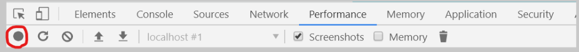

# 컴포넌트 성능 최적화 


## 11.1 많은 데이터 렌더링하기 

- 랙을 경험할 수 있도록 많은 데이터를 렌더링 

  ```jsx
  // App.js 
  function createBulkTodos() {
  	const array = [];
  	for (let i = 1; i <= 2500; i++) {
  		array.push({
  			id: i,
  			text: `할 일 ${i}`,
  			checked: false,
  		});
  	}
  	return array;
  }
  
  const App = () => {
  	const [todos, setTodos] = useState(createBulkTodos);
  	...   
  }
  ```

  - 함수를 만들어서 데이터 2500 개를 자동으로 생성. 

  - 여기서 주의할 점은 useState 의 기본값에 함수를 넣어주었다는 것. 

    만약 useState(createBulkTodos()) 라고 작성하면 리렌더링될 때마다 createBulkTodos 함수가 호출되지만, useState(createBulkTodos)처럼 파라미터를 함수 형태로 넣어주면 컴포넌트가 처음 렌더링될 때만 createBulkTodos 함수가 실행된다. 


​												항목 중 체크할 경우 이전보다 느려진것을 느낄 수 있다. 


## 11.2 크롬 개발자 도구를 통한 성능 모니터링 

- 성능을 분석할 때 정확히 몇초가 걸리는지 확인하기 위해, 크롬 개발자 도구의 Performance 탭을 사용하여 측정한다. 

- 

  위의 버튼을 누르고 항목을 체크해본뒤에 화면의 변화가 나타나면 Stop 을 누른다. 그러면 다음과 같이 성능 분석 결과가 나타난다. 

  

  성능 분석 결과에 나타난 Timings 를 열어보면 각 시간대에 컴포넌트의 어떤 작업이 처리되었는지 확인할 수 있다. 

  

  App [update] 박스에 커서를 올리면 작업이 처리되는데 걸리는 시간이 3.03 초임을 확인할 수 있다. ( 이 때의 처리 시간은 컴퓨터 환경에 따라 다를 수 있다. )


## 11.3 느려지는 원인 분석 

- 컴포넌트는 아래와 같은 상황에서 리렌더링이 발생한다. 
  - 자신이 전달받은 props 가 변경될 때 
  - 자신의 state가 바뀔 때 
  - 부모 컴포넌트가 리렌더링될 때 
  - forceUpdate 함수가 실행될 때 


- 현 상황은 '할일 1 ' 항목을 체크하면 App 컴포넌트의 state 변경 -> App 컴포넌트 리렌더링 -> 부모컴포넌트가 리렌더링 되었으니 TodoList 컴포넌트 리렌더링 -> 그 안의 무수한 컴포넌트들 리렌더링 

- 리렌더링이 불필요할 때는 리렌더링을 방지해줘서, 성능을 최적화해야한다. 


## 11.4 React.memo 를 사용하여 컴포넌트 성능 최적화 

- 컴포넌트의 리렌더링을 방지할 때는 shouldComponentUpdate 라는 라이프 사이클을 사용하면 된다. ( 클래스형 컴포넌트일 경우 )

- 함수형 컴포넌트일경우는 `React.memo` 함수를 사용한다. 컴포넌트의 props 가 바뀌지 않았따면 리렌더링하지 않도록 설정하여 함수형 컴포넌트의 리렌더링 성능을 최적화할 수 있다. 

- React.memo 사용법은 컴포넌트를 만들고나서 감싸주기만 하면 된다. 

  ```jsx
  // TodoListItem.js 
  
  export default React.memo(TodoListITem); 
  ```

  이제 TodoListItem 컴포넌트는 todo, onRemove, onToggle 이 바뀌지 않으면 리렌더링을 하지 않습니다.


## 11.5 onToggle, onRemove 함수가 바뀌지 않게 하기 

- 현재 프로젝트는 todos 배열이 업데이트되면 onRemove 와 onToggle 함수도 새롭게 바뀌기 때문에 React.memo 만으로 컴포넌트 최적화가 끝나지 않는다. 

  onRemove 와 onToggle 함수는 배열 상태를 업데이트 하는 과정에서 최신 상태의 todos 를 참조하기 때문에 todos 배열이 바뀔 때마다 함수가 새로 만들어진다. 

- 이렇게 함수가 계속 만들어지는 상황을 방지하는 방법은 2가지 

  - useState 의 함수형 업데이트 기능을 사용 
  - useReducer 를 사용 


### 11.5.1 useState의 함수형 업데이트 

- 기존의 setTodos 함수를 사용할 때는 새로운 상태를 파라미터로 넣어주었다. 

  setTodos 를 사용할 때 상태 업데이트를 어떻게 할지 정의해주는 업데이트 함수를 넣을 수도 있는데, 이를 **함수형 업데이트**라고 한다. 

  ```jsx
  const [number, setNumber] = useState(0); 
  
  // prevNumbers 는 현재 number 값을 가리킨다
  const onIncrease = useCallback( 
      () => setNumber(prevNumber => prevNumber +1), 
      [],
  );
  ```

  위와 같이 어떻게 업데이트할지 정의해주는 업데이트 함수를 넣을 경우 useCallback 의 두번째 파라미터로 넣는 배열에 number 을 넣지 않아도 된다. 

- ```jsx
  // App.js
  const onInsert = useCallback(text => {
      const todo = {
          id: nextId.current,
          text,
          checked: false,
      };
      setTodos(todos => todos.concat(todo));
      nextId.current += 1; // nextId 1씩 더하기
  }, []);
  
  const onRemove = useCallback(id => {
      setTodos(todos => todos.filter(todo => todo.id !== id));
  }, []);
  
  const onToggle = useCallback(id => {
      setTodos(todos =>
               todos.map(todo =>
                         todo.id === id ? { ...todo, checked: !todo.checked } : todo,
                        ),
              );
  }, []);
  ```

  setTodos 를 사용할 때 그 안에 todos => 만 앞에 넣어주면 된다. 

  


- 개발 환경에서의 성능 

  현재 yarn start 를 통해 개발 서버를 구동하고 있는데, 개발 서버를 통해 보이는 리액트 애플리케이션은 실제 프로덕션에서 구동될 때보다 처리 속도가 느리다. 

- 프로덕션 모드로 구동해보고싶다면 프로젝트 디렉터리에서 다음 명령어를 입력한다. 

  ```bash
  $ yarn build
  $ yarn global add serve
  $ serve -s build 
  ```


### 11.5.2 useReducer 사용하기 

```jsx
// App.js 
import React, { useReducer, useRef, useCallback } from 'react';
import TodoTemplate from './components/TodoTemplate';
import TodoInsert from './components/TodoInsert';
import TodoList from './components/TodoList';

function createBulkTodos() {
	const array = [];
	for (let i = 1; i <= 2500; i++) {
		array.push({
			id: i,
			text: `할 일 ${i}`,
			checked: false,
		});
	}
	return array;
}

function todoReducer(todos, action) {
	switch (action.type) {
		case 'INSERT': // 새로 추가
			// {type : 'INSERT', todo : {id:1, text:'todo', checked:false}}
			return todos.concat(action.todo);
		case 'REMOVE': // 제거
			// {type:'REMOVE', id:1}
			return todos.filter(todo => todo.id !== action.id);
		case 'TOGGLE': // 토글
			return todos.map(todo =>
				todo.id === action.id ? { ...todo, checked: !todo.checked } : todo,
			);
		default:
			return todos;
	}
}

const App = () => {
	const [todos, dispatch] = useReducer(todoReducer, undefined, createBulkTodos);

	// 고윳값으로 사용될 id
	// ref 를 사용하여 변수 담기
	const nextId = useRef(2501);

	const onInsert = useCallback(text => {
		const todo = {
			id: nextId.current,
			text,
			checked: false,
		};
		dispatch({ type: 'INSERT', todo });
		nextId.current += 1; // nextId 1씩 더하기
	}, []);

	const onRemove = useCallback(id => {
		dispatch({ type: 'REMOVE', id });
	}, []);

	const onToggle = useCallback(id => {
		dispatch({ type: 'TOGGLE', id });
	}, []);

	return (
		<TodoTemplate>
			<TodoInsert onInsert={onInsert} />
			<TodoList todos={todos} onRemove={onRemove} onToggle={onToggle} />
		</TodoTemplate>
	);
};

export default App;
```

- useReducer 를 사용할 때는 원래 두번째 파라미터에 초기상태를 넣어주어야한다. 지금은 두번째 파라미터에 undefined 를 넣고, 세번째 파라미터에 초기 상태를 만들어주는 함수인 createBulkTodos 를 넣었는데, 이렇게 할 경우 컴포넌트가 맨 처음 렌더링될 때만 createBulkTodos 함수가 호출된다. 
- useReducer 를 사용하는 방법은 기존 코드를 많이 고쳐야하지만, 상태를 업데이트하는 로직을 모아서 컴포넌트 바깥에 둘 수 있따는 장점이 있다. 


## 11.6 불변성의 중요성 

- 기존의 값을 직접 수정하지 않으면서 새로운 값을 만들어내는 것을 '불변성을 지킨다' 라고 한다. 

  ```jsx
  // 예시 코드 
  const array = [1,2,3,4,5] ; 
  
  const nextArrayBad = array; // 배열을 복사하는 것이 아닌 똑같은 배열을 가리킨다. 
  nextArrayBad[0] = 100; 
  console.log(array === nextArrayBad ); // 완전히 같은 배열이기 때문에 true 
  
  const nextArrayGood = [...array] ; // 배열 내부의 값을 모두 복사 
  nextArrayGood[0] = 100; 
  console.log(array === nextArrayGood); // 다른 배열이기 떄문에 false 
  
  const object = {
      foo : 'bar', 
      value : 1 
  }; 
  
  const nextObjectBad = object; // 객체가 복사되지않고, 똑같은 객체를 가리킨다. 
  nextObjectBad.value = nextobjectBad.value + 1; 
  console.log(object === nextObjectBad); // 같은 객체이기 때문에 true
  
  const nextObjectGood = {
      ...object, // 기존에 있던 내용을 모두 복사해서 넣습니다. 
      value : object.value +1 // 새로운 값을 덮어 쓴다. 
  }; 
  console.log(object === nextObjectGood); // 다른 객체이기 때문에 false 
  ```

  불변성이 지켜지지 않으면 객체 내부의 값이 새로워져도 바뀐것을 감지하지 못한다. 


- 전개 연산자(...문법) 을 사용하여 객체나 배열 내부의 값을 복사할 때는 얕은 복사를 한다. 즉 내부의 값이 완전히 새로 복사되는 것이 아니라 가장 바깥쪽에 있는 값만 복사된다. 따라서 내부의 값이 객체 혹은 배열이라면 내부의 값 또한 따로 복사해줘야한다. 

  ```jsx
  // 예시 코드 
  const todos = [ {id:1, checked : true}, {id:2, checked : true}]; 
  const nextTodos = [...todos]; 
  
  nextTodos[0].checked = false; 
  console.log(todos[0] === nextTodos[0]); // 아직까지는 똑같은 객체를 가리키고 있기에 true
  
  nextTodos[0] = {
      ...nextTodos[0], 
      checked : false
  }
  console.log(todos[0] === nextTodos[0]); // 새로운 객체를 할당해주었기에 false 
  ```

- 만약 객체 안에 있는 객체라면 불변성을 지키면서 새 값을 할당해야하므로 아래와 같이 해야한다.

  ```jsx
  // 예시 코드 
  const nextComplexObject = { 
  	...complexObject, 
      objectInside : {
          ... complexObject.objectInside, 
          enabled : false 
      }
  }; 
  console.log(complexObject === nextComplexObject); // false 
  console.log(complexObject.objectInside === nextComplexObject.objectInside) ; // false
  ```

- 배열 혹은 객체의 구조가 정말 복잡해진다면 위와 같이 불변성을 유지하기가 까다롭다. 따라서 이럴 경우에는 `immer` 라이브러리의 도움을 받으면 편하다. 


## 11.7 TodoList 컴포넌트 최적화하기 

- 리스트에 관련된 컴포넌트를 최적화할때는 리스트 내부에서 사용하는 컴포넌트도 최적화해야하고, 리스트로 사용되는 컴포넌트 자체도 최적화해주는 것이 좋다. 

  ```jsx
  // TodoList.js 
  
  export default React.memo(TodoList);
  ```

  위의 코드는 프로젝트 성능에 전혀 영향을 주지 않는다. 왜냐하면 TodoList 컴포넌트의 부모 컴포넌트인 App 컴포넌트가 리렌더링되는 유일한 이유가 todos 배열이 업데이트될때이기 때문.  -> 즉, TodoList 컴포넌트는 불필요한 리렌더링이 발생하지 않는다. 

  하지만 App 컴포넌트에 다른 state 가 추가되어 해당 값들이 업데이트될 때는 TodoList 컴포넌트가 불필요한 리렌더링을 할 수도 있다. 그래서 React.memo 를 사용해 미리 최적화. 


## 11.8 react-virtualized 를 사용한 렌더링 최적화 

- 현재 일정 관리 애플리케이션의 초기 데이터가 2500개이지만, 실제 화면에 나오는 항목은 아홉개뿐이다. 나머지는 스크롤을 해야 볼 수 있다. 

  처음 렌더링 시 2500개 중 2491개는 보이지 않음에도 불구하고 렌더링이 이루어져 비효율적이다. 

- `react-virtualized` 를 사용하면 리스트 컴포넌트에서 스크롤되기 전에 보이지 않는 컴포넌트는 렌더링하지 않고 크기만 차지하게 할 수 있다. 


### 11.8.1 최적화 준비 

```bash
$ yarn add react-virtualized 
```

최적화를 수행하려면 사전에  **" 각 항목의 실제 크기를 px 단위로 알아내는 작업"** 을 해야한다. 

이 값은 우리가 작성한 CSS 를 확인해서 직접 계산해도 되지만, 크롬 개발자 도구의 좌측 상단에 있는 아이콘을 눌러서 크기를 알고 싶은 항목에 커서를 대보면 된다. 


각 항목의 크기 가로 495.2px  세로 56px .  두번째 항목부터 테두리가 포함되어있기 때문에 첫번째 항목은 56px. 

크기를 알아낼 때 두번째 항목을 확인해야 한다. 


### 11.8.2 TodoList 수정 

```jsx
// TodoList.js 
import React, { useCallback } from 'react';
import { List } from 'react-virtualized';
import './TodoList.scss';
import TodoListItem from './TodoListItem';

const TodoList = ({ todos, onRemove, onToggle }) => {
	const rowRenderer = useCallback(
		({ index, key, style }) => {
			const todo = todos[index];
			return (
				<TodoListItem
					todo={todo}
					key={key}
					onRemove={onRemove}
					onToggle={onToggle}
					style={style}
				/>
			);
		},
		[onRemove, onToggle, todos],
	);

	return (
		<List
			className="TodoList"
			width={512} // 전체 크기
			height={513} // 전체 높이
			rowCount={todos.length} // 항목 개수
			rowHeight={57} // 항목 높이
			rowRenderer={rowRenderer} // 항목을 렌더링할 때 쓰는 함수
			list={todos} // 배열
			style={{ outline: 'none' }} // List에 기본 적용되는 outline 스타일 제거
		/>
	);
};

export default React.memo(TodoList);
```

rowRenderer 함수는 react-virtualized 의 List 컴포넌트에서 각 TodoItem 을 렌더링할 때 사용하며, 이함수를 List 컴포넌트의 props 로 설정해주어야한다. 이 함수는 파라미터에 index, key, style 값을 객체 타입으로 받아와서 사용한다. 


List컴포넌트를 사용할 때는 해당 리스트의 전체 크기와 각 항목의 높이, 각 항목을 렌더링할 때 사용해야하는 함수, 그리고 배열을 props 로 넣어줘야한다. 그러면 이 컴포넌트가 전달받은 props 를 사용하여 자동으로 최적화해준다. 

### 11.8.3 TodoListItem 수정 

- TodoList 를 저장하고 나면 스타일이 깨져서 나타나는데 이는 TodoListItem 컴포넌트를 아래와 같이 수정하면 해결된다. 

  ```jsx
  import React from 'react';
  import {
  	MdCheckBoxOutlineBlank,
  	MdCheckBox,
  	MdRemoveCircleOutline,
  } from 'react-icons/md';
  import './TodoListItem.scss';
  import cn from 'classnames';
  
  const TodoListItem = ({ todo, onRemove, onToggle, style }) => {
  	const { id, text, checked } = todo;
  
  	return (
  		<div className="TodoListItem-virtualized" style={style}>
  			<div className="TodoListItem">
  				<div
  					className={cn('checkbox', { checked })}
  					onClick={() => onToggle(id)}
  				>
  					{checked ? <MdCheckBox /> : <MdCheckBoxOutlineBlank />}
  					<div className="text">{text}</div>
  				</div>
  				<div className="remove" onClick={() => onRemove(id)}>
  					<MdRemoveCircleOutline />
  				</div>
  			</div>
  		</div>
  	);
  };
  
  export default React.memo(
  	TodoListItem,
  	(prevProps, nextProps) => prevProps.todo === nextProps.todo,
  );
  ```

  render 함수에서 기존에 보여주던 내용을 div로 한번 깜싸고, 해당 div 에는 TodoListITem-virtualized 라는 className을 설정하고, props 로 받아온 style 을 적용시켜 주었다. 


 	여기서 TodoListItem-virtualized 라는 클래스를 만든 것은 컴포넌트 사이사이에 테두리를 제대로 쳐주고, 홀수 	번째/ 짝수번째 항목에 다른 배경 색상을 설정하기 위함이다.  


 	그 다음에는 TodoListItem 의 스타일 파일에서 최하단에 있떤 &+& 를 사용하여 테두리를 설정했던 코드와 &:nth-child(eve) 을 사용하여 다른 배경 색상을 주는 코드를 지우고 아래 코드를 최상단에 삽입. 

```scss
// TodoListItem.scss

.TodoListItem-virtualized {
	& + & {
		border-top: 1px solid #dee2e6;
	}

	&:nth-child(even) {
		background: #f8f9fa;
	}
}
```

