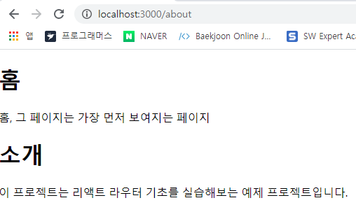

# 리액트 라우터로 SPA 개발하기 


## 13.1 SPA 란 ? 

- SPA ( Single Page Application ) - 한개의 페이지로 이루어진 애플리케이션 

- 애플리케이션 내에서 화면 전환이 일어날 때마다 html 을 계속 서버에 새로 요청하면 사용자의 인터페이스에서 사용하고 있는 상태를 유지하는 것도 번거롭고, 바뀌지 않는 부분까지 새 로 불러와서 보여줘야하기 때문에 불필요한 로딩이 있어 비효율적이다. 

  **→** 리액트 같은 라이브러리 혹은 프레임워크를 사용하여 뷰 렌더링을 사용자의 브라우저가 담당하도록 하고 우선 애플리케이션을 브라우저에 불러와서 실행시킨 후 사용자와의 인터랙션이 발생하면 필요한 부분만 자바스크립트를 이용하여 업데이트 해준다.   

  만약 새로운 데이터가 필요하다면 서버 API 를 호출하여 필요한 데이터만 새로 불러와 애플리케이션에서 사용할 수 있다. 

- SPA 의 경우 서버에서 사용자에게 제공하는 페이지는 한 종류이지만, 해당 페이지에서 로딩된 자바스크립트와 현재 사용자 브라우저의 주소 상태에 따라 다양한 화면을 보여줄 수 있다. 

- **라우팅** : 다른 주소에 다른 화면을 보여주는 것 

- 리액트 라우팅 라이브러리는 리액트 라우터(`react-router` ), 리치 라우터(`reach-router`), `Next.js` 등 여러가지가 있다. 


### 13.1.1 SPA 의 단점 

- 앱의 규모가 커지면 자바스크립트 파일이 너무 커진다 ( 이는 나중에 배울 코드스플리팅을 사용하면 라우트별로 파일들을 나누어서 트래픽과 로딩 속도를 개선할 수 있다. )
- 리액트 라우터처럼 브라우저에서 자바스크립트를 사용하여 라우팅을 관리하는 것은 자바스크립트를 실행하지 않는 일반 크롤러에서는 페이지의 정보를 제대로 수집해가지 못한다는 잠재적인 단점이 있다. 


## 13.2 프로젝트 준비 및 기본적인 사용법 


### 13.2.1 프로젝트 생성 및 라이브러리 설치 

프로젝트 생성 및 리액트 라이브러리 설치 

```bash
$ yarn create react-app router-tutorial 
$ cd router-tutorial
$ yarn add react-router-dom
```


### 13.2.2 프로젝트에 라우터 적용 

- 프로젝트에 리액트 라우터를 적용할 때는 src/index.js 파일에서 react-router-dom 에 내장되어 있는 BrowserRouter 컴포넌트를 사용하여 감싸면 된다. 

  이 컴포넌트는 웹 애플리케이션에 HTML5 의 History API 를 사용하여 페이지를 새로고침하지 않고도 주소를 변경하고, 현재 주소에 관련된 정보를 props 로 쉽게 조회하거나 사용할 수 있도록 해준다. 

  ```jsx
  // src/index.js 
  import React from "react";
  import ReactDOM from "react-dom";
  import { BrowserRouter } from "react-router-dom";
  import "./index.css";
  import App from "./App";
  import * as serviceWorker from "./serviceWorker";
  
  ReactDOM.render(
    <BrowserRouter>
      <App />
    </BrowserRouter>,
    document.getElementById("root")
  );
  
  // If you want your app to work offline and load faster, you can change
  // unregister() to register() below. Note this comes with some pitfalls.
  // Learn more about service workers: https://bit.ly/CRA-PWA
  serviceWorker.unregister();
  ```


### 13.2.3 페이지 만들기 

```jsx
// Home.js 
import React from "react";

const Home = () => {
  return (
    <div>
      <h1>홈</h1>
      <p>홈, 그 페이지는 가장 먼저 보여지는 페이지</p>
    </div>
  );
};

export default Home;
```

```jsx
// About.js 
import React from 'react';

const About = () => {
    return (
        <div>
           <h1>소개</h1> 
           <p>이 프로젝트는 리액트 라우터 기초를 실습해보는 예제 프로젝트입니다.</p>
        </div>
    );
};

export default About;
```


### 13.2.4 Route 컴포넌트로 특정 주소에 컴포넌트 연결 

- Route 컴포넌트를 사용하여 사용자의 현재 경로에 따라 다른 컴포넌트를 보여주겠다. 

  ```jsx
  // 사용 방식 
  <Route path="주소규칙" component={보여 줄 컴포넌트} />
  ```

- ```jsx
  // App.js 
  import React from "react";
  import { Route } from "react-router-dom";
  import About from "./About";
  import Home from "./Home";
  
  const App = () => {
    return (
      <div>
        <Route path="/" component={Home} />
        <Route path="/about" component={About} />
      </div>
    );
  };
  
  export default App;
  ```

  

  

/about 경로로 들어가면 예상과 다르게 두 컴포넌트가 모두 나타난다. 이는 /about 경로가  

/ 규칙에도 일치하기 때문에 발생한 현상이다.  

이를 수정하기위해서는 Home 을 위한 Route 컴포넌트 사용시 `exact` 라는 props 를 true 로 설정하면 된다. 

```jsx
<Route path="/" component={Home} exact={true} />
```


### 13.2.5 Link 컴포넌트를 사용하여 다른 주소로 이동하기 

- Link 컴포넌트는 클릭하면 다른 주소로 이동시켜주는 컴포넌트 

- 일반 웹 애플리케이션에서는 `a태그` 를 사용하여 페이지를 전환하지만, 리액트 라우터 사용시에 이 태그를 직접 사용하면 안된다. 그 이유는 이 태그는 페이지를 전환하는 과정에서 페이지를 새로 불러오기 때문에 애플리케이션이 들고 있던 상태들을 모두 날려버리기 때문이다. 

- Link 컴포넌트를 사용하면 페이지를 새로 불러오지 않고 애플리케이션은 그대로 유지한 상태에서 HTML5 History API 를 사용하여 페이지의 주소만 변경해준다.

- Link 컴포넌트 자체는 a 태그로 이루어져 있지만, 페이지 전환을 방지하는 기능이 내장되어있다. 

  ```jsx
  // 예시
  <Link to="주소">내용</Link>
  ```

- ```jsx
  // App.js
  import React from "react";
  import { Route, Link } from "react-router-dom";
  import About from "./About";
  import Home from "./Home";
  
  const App = () => {
    return (
      <div>
        <ul>
          <li>
            <Link to="/">홈</Link>
          </li>
          <li>
            <Link to="/about">소개</Link>
          </li>
        </ul>
        <hr />
        <Route path="/" component={Home} exact={true} />
        <Route path="/about" component={About} />
      </div>
    );
  };
  
  export default App;
  ```

  


## 13.3 Route 하나에 여러 개의 path 설정하기 

- Route 하나에 여러 개의 path 를 지정하는 것은 최신 버전의 리액트 라우터 v5부터 적용된 기능이다. 

- 이전 버전에서는 아래와 같이 했다. 

  ```jsx
  // App.js
  import React from "react";
  import { Route, Link } from "react-router-dom";
  import About from "./About";
  import Home from "./Home";
  
  const App = () => {
    return (
      <div>
        <Route path="/" component={Home} exact={true} />
        <Route path="/about" component={About} />
        <Route path="/info" component={About} />          
      </div>
    );
  };
  
  export default App;
  ```

  

- 이제는 Route 를 두번 사용하는 대신 path props 를 배열로 설정하면 여러 경로에서 같은 컴포넌트를 보여줄 수 있다. 

  ```jsx
  // App.js
  import React from "react";
  import { Route, Link } from "react-router-dom";
  import About from "./About";
  import Home from "./Home";
  
  const App = () => {
    return (
      <div>
        <Route path="/" component={Home} exact={true} />
        <Route path={['/about','/info']} component={About} />          
      </div>
    );
  };
  
  export default App;
  ```

  


## 13.4 URL 파라미터와 쿼리

- 페이지 주소를 정의할 때 가끔은 유동적인 값을 전달해야 할 때도 있다. 이는 파라미터와 쿼리로 나눌 수 있다. 

  - 파라미터 예시 : /profiles/velopert
  - 쿼리 예시 : /about?datails=true

- 유동적인 값을 사용해야 하는 상황에서 파라미터를 써야할지 쿼리를 써야할지 정할 때, 무조건 따라야 하는 규칙은 없다. 다만 일반적으로 

  **파라미터**는 특정 아이디 혹은 이름을 사용하여 조회할 때 사용하고, 

  **쿼리**는 우리가 어떤 키워드를 검색하거나 페이지에 필요한 옵션을 전달할 때 사용한다. 


### 13.4.1 URL 파라미터 

- URL 파라미터를 사용할 때는 라우트로 사용되는 컴포넌트에서 받아오는 match 라는 객체 안의 params 값을 참조한다. 
- match 객체 안에는 현재 컴포넌트가 어떤 경로 규칙에 의해 보이는지에 대한 정보가 들어있다. 

- path 규칙에 `/profiles/:username` 이라고 넣어주면, match.params.username 값을 통해 현재 username 값을 조회할 수 있다. 

  ```jsx
  // Profile.js
  import React from "react";
  
  const data = {
    velopert: {
      name: "김민준",
      description: "리액트를 좋아하는 개발자"
    },
    gildong: {
      name: "홍길동",
      description: "고전 소설 홍길동전의 주인공"
    }
  };
  
  const Profile = ({ match }) => {
    const { username } = match.params;
    const profile = data[username];
    if (!profile) {
      return <div> 존재하지 않는 사용자입니다. </div>;
    }
  
    return (
      <div>
        <h3>
          {username}({profile.name})
        </h3>
        <p>{profile.description}</p>
      </div>
    );
  };
  
  export default Profile;
  ```

  ```jsx
  // App.js 
  import React from "react";
  
  const data = {
    velopert: {
      name: "김민준",
      description: "리액트를 좋아하는 개발자"
    },
    gildong: {
      name: "홍길동",
      description: "고전 소설 홍길동전의 주인공"
    }
  };
  
  const Profile = ({ match }) => {
    const { username } = match.params;
    const profile = data[username];
    if (!profile) {
      return <div> 존재하지 않는 사용자입니다. </div>;
    }
  
    return (
      <div>
        <h3>
          {username}({profile.name})
        </h3>
        <p>{profile.description}</p>
      </div>
    );
  };
  
  export default Profile;
  
  ```

  


### 13.4.2 URL 쿼리 

- 쿼리는 location 객체에 들어있는 Search 값에서 조회할 수 있다. 

- location 객체는 라우트로 사용된 컴포넌트에게 props 로 전달되며, 웹 대플리케이션의 현재 주소에 대한 정보를 지니고 있다. 

  ```jsx
  // location 의 형태 
  {
      "pathname" : "/about", 
      "search": "?detail=true",
      "hash":""
  }
  ```

  위 location 객체는 httpL//localhost:3000/about?detail=true 주소로 들어갔을 때의 값 

- URL 쿼리를 읽을 때는 위 객체가 지닌 값 중에서 search 값을 확인해야 한다. ( 이 값은 문자열 형태 )

- URL 쿼리는 ?detail=true&another=1 과 같이 문자열에 여러가지 값을 설정해 줄 수 있다. 

- search 값에서 특정 값을 읽어 오기 위해서는 이 문자열을 객체 형태로 변환해 주어야한다. 

- 쿼리 문자열을 객체로 변환할 때는 `qs` 라이브러리를 사용한다. 

  ```bash
  $ yarn add qs 
  ```

- ```jsx
  // About.js 
  import React from "react";
  import qs from 'qs'; 
  
  const About = ({location}) => {
      const query = qs.parse(location.search, {
          ignoreQueryPrefix : true // 이 설정을 통해 문자열 맨앞의 ? 를 생략한다. 
      }); 
      const showDetail = query.detail === 'true'; // 쿼리의 파싱 결과 값은 문자열이다. 
  
    return (
      <div>
        <h1>소개</h1>
        <p>이 프로젝트는 리액트 라우터 기초를 실습해보는 예제 프로젝트입니다.</p>
        {showDetail && <p>detail값을 true로 설정하셨군요!</p>}
      </div>
    );
  };
  
  export default About;
  ```

  - 쿼리를 사용할 때는 쿼리 문자열을 객체로 파싱하는 과정에서 결과 값은 언제나 문자열이라는 점에 주의.
  - 따라서 숫자를 받아와야하면 pareInt 함수를 통해 꼭 숫자로 변환해주고,  논리 자료형을 사용하는 경우에는 정확히 'true' 문자열이랑 일치하는지 비교해줘야한다. 

  

  

## 13.5 서브라우트 

- **서브라우트**란 라우트 내부에 또 라우트를 정의하는 것. 
- 그냥 라우트로 사용되고 있는 컴포넌트 내부에 Route 컴포넌트를 또 사용하면 된다. 

```jsx
// Profiles.js 
import React from "react";

import Profile from "./Profile";

const Profiles = () => {
  return (
    <div>
      <h3> 사용자 목록 : </h3>
      <ul>
        <li>
          <Link to="/profiles/velopert">velopert 프로필</Link>
        </li>
        <li>
          <Link to="/profiles/gildong">gildong 프로필</Link>
        </li>
      </ul>

      <Route
        path="/profiles"
        exact
        render={() => <div> 사용자를 선택해 주세요. </div>}
      />
      <Route path="/profiles/:username" component={Profile} />
    </div>
  );
};

export default Profiles;
```

- 컴포넌트 자체를 전달하는 것이 아니라, 보여주고 싶은 JSX 를 넣어줄 수 있다. 
- JSX 에서 props 를 설정할 때 값을 생략하면 자동으로 true 로 설정된다. ( exact  와 exact = {true} 는 같다. )

```jsx
// App.js 
import React from "react";
import { Route, Link } from "react-router-dom";
import About from "./About";
import Home from "./Home";
import Profiles from "./Profiles";

const App = () => {
  return (
    <div>
      <ul>
        <li>
          <Link to="/">홈</Link>
        </li>
        <li>
          <Link to="/about">소개</Link>
        </li>
        <li>
          <Link to="/profiles">프로필</Link>
        </li>
      </ul>
      <hr />
      <Route path="/" component={Home} exact={true} />
      <Route path={["/about", "/info"]} component={About} />
      <Route path="/profiles" component={Profiles} />
    </div>
  );
};

export default App;
```


## 13.6 리액트 라우터 부가 기능 

### 13.6.1 history 

- history 객체는 라우트로 사용된 컴포넌트에 match, location 과 함께 전달되는 props 중 하나로, 이 객체를 통해 컴포넌트 내에 구현하는 메서드에서 라우터 API 를 호출할 수 있다. 

- EX) 특정 버튼을 눌렀을 때 뒤로 가거나, 로그인후 화면을 전환하거나 다른페이지로 이탈하는 것을 방지해야할 때 history 를 활용한다. 

  ```jsx
  // HistorySample.js 
  import React, { Component } from "react";
  
  class HistorySample extends Component {
    // 뒤로 가기
    handleGoBack = () => {
      this.props.history.goBack();
    };
  
    // 홈으로 이동
    handleGoHome = () => {
      this.props.history.push("/");
    };
  
    componentDidMount() {
      // 이것을 설정하고 나면 페이지에 변화가 생기려고 할 때마다 정말 나갈 것인지를 질문함
      this.unblock = this.props.history.block("정말 떠나실 건가요 ? ");
    }
  
    componentWillUnmount() {
      // 컴포넌트가 언마운트되면 질문을 멈춤
      if (this.unblock) {
        this.unblock();
      }
    }
  
    render() {
      return (
        <div>
          <button onClick={this.handleGoBack}>뒤로</button>
          <button onClick={this.handleGoHome}>홈으로</button>
        </div>
      );
    }
  }
  
  export default HistorySample;
  ```

  ```jsx
  // App.js
  import React from "react";
  import { Route, Link } from "react-router-dom";
  import About from "./About";
  import Home from "./Home";
  import Profiles from "./Profiles";
  import HistorySample from "./HistorySample";
  
  const App = () => {
    return (
      <div>
        <ul>
          <li>
            <Link to="/">홈</Link>
          </li>
          <li>
            <Link to="/about">소개</Link>
          </li>
          <li>
            <Link to="/profiles">프로필</Link>
          </li>
          <li>
            <Link to="/history">History 예제</Link>
          </li>
        </ul>
        <hr />
        <Route path="/" component={Home} exact={true} />
        <Route path={["/about", "/info"]} component={About} />
        <Route path="/profiles" component={Profiles} />
        <Route path="/history" component={HistorySample} />
      </div>
    );
  };
  
  export default App;
  ```

  


### 13.6.2 withRouter 

- withRouter 함수는 HoC ( Higher-order Component ) 입니다. 

- 라우트로 사용된 컴포넌트가 아니어도 match, location, history 객체를 접근할 수 있게 해준다. 

  ```jsx
  import React from "react";
  import { withRouter } from "react-router-dom";
  
  const WithRouterSample = ({ location, match, history }) => {
    return (
      <div>
        <h4>location</h4>
        <textarea
          value={JSON.stringify(location, null, 2)}
          rows={7}
          readOnly={true}
        />
        <h4>match</h4>
        <textarea
          value={JSON.stringify(match, null, 2)}
          rows={7}
          readOnly={true}
        />
        <button onClick={() => history.push("/")}>홈으로</button>
      </div>
    );
  };
  
  export default withRouter(WithRouterSample);
  ```

  이 코드처럼 withRouter를 사용할 때는 컴포넌트를 내보내줄 때 함수로 감싸줍니다. 

  JSON.stringify 의 두번째 파라미터와 세번째 파라미터를 null, 2 로 설정해주면 JSON에 들여쓰기가 적용된 상태로 문자열이 만들어진다. 

  ```jsx
  // Profiles.js 
  import React from "react";
  import { Link, Route } from "react-router-dom";
  import Profile from "./Profile";
  import WithRouterSample from "./WithRouterSample";
  
  const Profiles = () => {
    return (
      <div>
        <h3> 사용자 목록 : </h3>
        <ul>
          <li>
            <Link to="/profiles/velopert">velopert 프로필</Link>
          </li>
          <li>
            <Link to="/profiles/gildong">gildong 프로필</Link>
          </li>
        </ul>
  
        <Route
          path="/profiles"
          exact
          render={() => <div> 사용자를 선택해 주세요. </div>}
        />
        <Route path="/profiles/:username" component={Profile} />
        <WithRouterSample />
      </div>
    );
  };
  
  export default Profiles;
  ```

  

그런데 여기서 match 의 params 가 비어있다.  withRouter를 사용하면 현재 자신을 보여주고 있는 라우트 컴포넌트(현재 Profiles)를 기준으로 match 가 전달된다. Profiles 를 위한 라우트를 설정할 때는 path="/profiles" 라고만 입력했으므로 username 파라미터를 읽어오지 못하는 상태. 


- WithRouterSample 컴포넌트를 Profiles 에서 지우고, Profile 컴포넌트에 넣으면 match 쪽에 URL 파라미터가 제대로 보일 것이다.

  ```jsx
  // Profile.js 
  import React from "react";
  import { withRouter } from "react-router-dom";
  import WithRouterSample from "./WithRouterSample";
  
  const data = {
    velopert: {
      name: "김민준",
      description: "리액트를 좋아하는 개발자"
    },
    gildong: {
      name: "홍길동",
      description: "고전 소설 홍길동전의 주인공"
    }
  };
  
  const Profile = ({ match }) => {
    const { username } = match.params;
    const profile = data[username];
    if (!profile) {
      return <div> 존재하지 않는 사용자입니다. </div>;
    }
  
    return (
      <div>
        <h3>
          {username}({profile.name})
        </h3>
        <p>{profile.description}</p>
        <WithRouterSample />
      </div>
    );
  };
  
  export default withRouter(Profile);
  ```

  


### 13.6.3 Switch 

- Switch 컴포넌트는 여러 Route 를 감싸서 그중 일치하는 단 하나의 라우트만을 렌더링 시켜준다. 

- Switch 를 사용하면 모든 규칙과 일치하지 않을 때 보여줄 NotFound 페이지도 구현할 수 있다. 

  ```jsx
  // App.js 
  import React from "react";
  import { Route, Link, Switch } from "react-router-dom";
  import About from "./About";
  import Home from "./Home";
  import Profiles from "./Profiles";
  import HistorySample from "./HistorySample";
  
  const App = () => {
    return (
      <div>
        <ul>
          <li>
            <Link to="/">홈</Link>
          </li>
          <li>
            <Link to="/about">소개</Link>
          </li>
          <li>
            <Link to="/profiles">프로필</Link>
          </li>
          <li>
            <Link to="/history">History 예제</Link>
          </li>
        </ul>
        <hr />
        <Switch>
          <Route path="/" component={Home} exact={true} />
          <Route path={["/about", "/info"]} component={About} />
          <Route path="/profiles" component={Profiles} />
          <Route path="/history" component={HistorySample} />
          <Route
            // path  를 따로 정의하지 않으면 모든 상황에 렌더링 된다.
            render={({ location }) => (
              <div>
                <h2>이 페이지는 존재하지 않습니다:</h2>
                <p>{location.pathname}</p>
              </div>
            )}
          />
        </Switch>
      </div>
    );
  };
  
  export default App;
  ```

  

### 13.6.3 NavLink 

- NavLink 는 현재 경로와 Link 에서 사용하는 경로가 일치하는 경우 특정 스타일 혹은 CSS 클래스를 적용할 수 있는 컴포넌트 

- NavLink 에서 링크가 활성화되었을 때의 스타일을 적용할 때는 activeStyle 값을, CSS 클래스를 적용할 때는 activeClassName 값을 props 로 넣어주면 된다. 

  ```jsx
  // Profiles.js 
  import React from "react";
  import { NavLink, Route } from "react-router-dom";
  import Profile from "./Profile";
  
  const Profiles = () => {
    const activeStyle = {
      background: "black",
      color: "white"
    };
  
    return (
      <div>
        <h3> 사용자 목록 : </h3>
        <ul>
          <li>
            <NavLink activeStyle={activeStyle} to="/profiles/velopert">
              velopert 프로필
            </NavLink>
          </li>
          <li>
            <NavLink activeStyle={activeStyle} to="/profiles/gildong">
              gildong 프로필
            </NavLink>
          </li>
        </ul>
  
        <Route
          path="/profiles"
          exact
          render={() => <div> 사용자를 선택해 주세요. </div>}
        />
        <Route path="/profiles/:username" component={Profile} />
      </div>
    );
  };
  
  export default Profiles;
  ```

  

