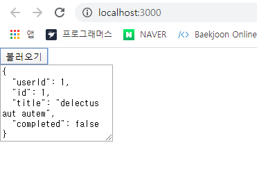
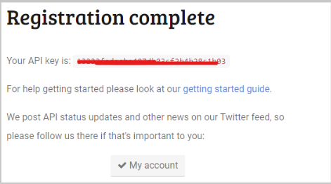
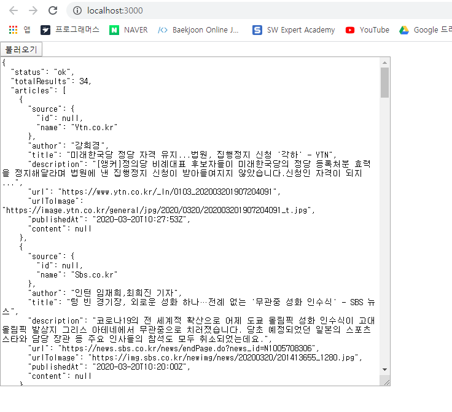
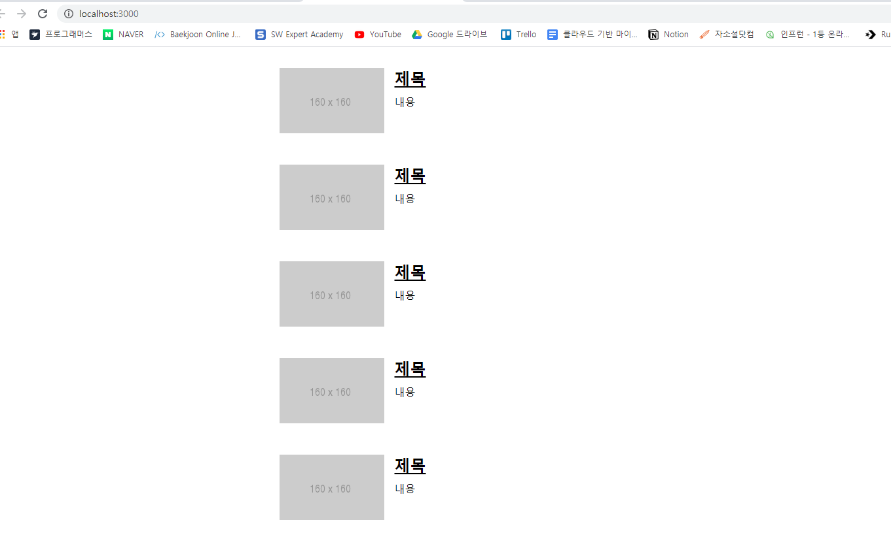
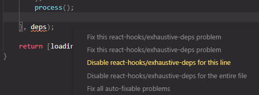
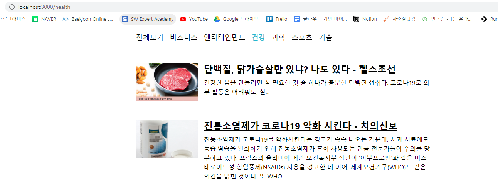

# 외부 API를 연동하여 뉴스 뷰어 만들기 

- https://newsapi.org/ 에서 제공하는 API 를 사용하여 데이터를 받아오고, 프로젝트 스타일링 진행 

  

## 14.1 비동기 작업의 이해 

- 서버의 API 를 사용해야 할 때는 네트워크 송수신 과정에서 시간이 걸리기 때문에 작업이 즉시 처리되는 것이 아니라 응답을 받을 때까지 기다렸다가 전달받은 응답 데이터를 처리한다. 

- 비동기적으로 처리한다면 웹 애플리케이션이 멈추지 않기때문에 동시에 여러가지 요청을 처리할 수도 있고, 기다리는 과정에서 다른 함수도 호출할 수 있다. 

- 서버 API 를 호출할 때 이외도 작업을 비동기적으로 처리할 때가 있는데 setTimeout 함수를 사용하여 특정 작업을 예약할 때. 

  ```jsx
  // 예시 
  function printMe(){
      console.log('Hello World!'); 
  }
  setTimeout(printMe, 3000); 
  console.log('대기 중 ....'); 
  ```

- 자바스크립트에서 비동기 작업을 할 때 가장 흔히 사용하는 방법은 콜백 함수를 사용하는 것. 


### 14.1.1 콜백함수 

- 파라미터 값이 주어지면 1초 뒤에 10을 더해서 반환하는 함수가 있다 가정하고, 해당함수가 처리된 직후 어떠한 작업을 하고싶다면 다음과 같은 콜백함수를 활용해 작업한다.

  ```jsx
  function increase(number, callback){
      setTimeout(() =>{
          const result = number + 10; 
        if(callback){
            callback(result);
        }
      }, 1000)
  }
  
  increase(0, result =>{
      console.log(result); 
  })
  ```

  1 초에 걸쳐서 10, 20, 30, 40 과 같은 형태로 여러 번 순차적으로 처리하고 싶다면 콜백함수를 중첩하여 구현.

  ```jsx
  function increase(number, vallback){
      setTimeout( ()=>{
          const result = number + 10; 
          if( callback){
              callback(result); 
          }
      }, 1000); 
  }
  
  console.log('작업 시작'); 
  increase(0, result=>{
      console.log(result); 
      increase(result, result =>{
          cosole.log(result); 
          increase(result, result =>{
              console.log(result); 
              increase(result, result =>{ 
              	console.log(result); 
                  console.log('작업 완료'); 
              });
          });
      });
  });
  ```

  ```
  실행결과 
  
  작업 시작 
  10
  20
  30
  40
  작업 완료
  ```

  콜백 안에 콜백이 계속 들어가 가독성이 매우 나쁜 형태의 코드를 **'콜백지옥'** 이라고 부른다. 


### 14.1.2 Promise 

- Promise 는 콜백 지옥 같은 코드가 형성되지 않게 하는 방안으로 ES6 에 도입된 기능 

  ```jsx
  function increase(number){
      const promise = new Promise((resolve, reject) =>{
          // resolve는 성공, reject 는 실패 
          setTimeout( () => {
              const result = number + 10; 
              if(result > 50) {
                  // 50보다 높으면 에러 발생시키기 
                  const e = new Error('NumberTooBig'); 
                  return reject(e); 
              }
              resolve(result); // number 값에 +10 후 성공 처리 
          }, 1000);
      }); 
      return promise; 
  }
  
  increase(0)
   .then(number=>{
      // Promise에서 resolve된 값은 .then 을 통해 받아올 수 있다. 
      console.log(number); 
      return increase(number); // Promise 를 리턴하면 
  })
   .then(number =>{
      // 또 .then 으로 처리 가능 
      console.log(number); 
      return increase(number); 
  })
   .then(number =>{
      console.log(number); 
      return increase(number); 
  })
   .then(number =>{
      console.log(number); 
      return increase(number); 
  })
   .then(number =>{
      console.log(number); 
      return increase(number); 
  })
  .catch(e=>{
      // 도중에 에러가 발생한다면 .catch 를 통해 알 수 있다. 
      console.log(e); 
  })
  ```

  - 여러 작업을 연달아 처리한다고 해서 함수를 여러번 감싸는 것이 아니라 `.then` 을 사용하여 그 다음 작업을 설정하기 때문에 콜백 지옥이 형성되지 않는다. 


### 14.1.3 async / await 

- async/await 는 Promise 를 더욱 쉽게 사용할 수 있도록 해주는 ES2017(ES8) ansqjqdlek. 
- 이 문법을 사용하려면 함수의 앞부분에 `async` 키워드를 추가하고, 해당 함수 내부에서 Promise 의 앞부분에 `await` 키워드를 사용한다. 
- 이렇게 하면 Promise 가 끝날때까지 기다리고 결과값을 특정 변수에 담을 수 있다.

```jsx
function increase(number){
    const promise = new Promise( (resolve, reject) => {
        setTimeout( () => {
            const result = number+10; 
            if(result >50){ // 50보다 높으면 에러 발생시키기 
                const e = new Error('NumberTooBig'); 
                return reject(e); 
            }
            resolve(result); // number 값에 +10 후 성공 처리 
        }, 1000)
    })
    return promise; 
}

async function runTasks() {
    try{ // try_catch 구문을 사용하여 에러를 처리한다. 
        let result = await increase(0); 
        console.log(result); 
        result = await increase(result); 
        console.log(result); 
        result = await increase(result); 
        console.log(result); 
        result = await increase(result); 
        console.log(result); 
        result = await increase(result); 
        console.log(result); 
        result = await increase(result); 
        console.log(result);      
    } catch(e) {
        console.log(e); 
    }
}
```


## 14.2 axios 로 API 호출해서 데이터 받아오기 

- axios 는 현재 가장 많이 사용되고 있는 자바스크립트 HTTP 클라이언트. 
- 이 라이브러리의 특징은 HTTP 요청을 Promise 기반으로 처리한다는 점 . 

```bash
$ yarn create react-app news-viewer
$ cd news-viewer 
$ yarn add axios 
```


- Prettier 로 코드 스타일을 자동으로 정리하고 싶다면 프로젝트 최상위 디렉터리에 `.prettierrc` 파일 생성하여 아래 코드 입력 

  ```jsx
  {
    "singleQuote": true,
    "semi": true,
    "useTabs": false,
    "tabWidth": 2,
    "trailingComma": "all",
    "printWidth": 80
  }
  ```

- VS Code 에서 파일 자동 불러오기 기능을 잘 활용하고 싶다면 최상위 디렉터리에 `jsconfig.json` 파일 생성

  ```json
  {
    "compilerOptions": {
      "target": "es6"
    }
  }
  ```

- ```jsx
  // App.js 
  
  import React, { useState } from 'react';
  import axios from 'axios';
  
  const App = () => {
    const [data, setData] = useState(null);
    const onClick = () => {
      axios.get('https://jsonplaceholder.typicode.com/todos/1').then(response => {
        setImmediate(response.data);
      });
    };
  
    return (
      <div>
        <div>
          <button onClick={onClick}>불러오기</button>
        </div>
        {data && (
          <textarea
            rows={7}
            value={JSON.stringify(data, null, 2)}
            readOnly={true}
          />
        )}
      </div>
    );
  };
  
  export default App;
  ```

  - 위 코드는 불러오기 버튼을 누르면 JSONPlaceholder(https://jsonplaceholder.typicode.com/  에서 제공하는 가짜 API 를 호출하고 이에 대한 응답을 컴포넌트 상태에 넣어서 보여주는 예제. 
  - onClick 함수에서는 `axios.get` 함수를 사용했다. 이 함수는 파라미터로 전달된 주소에 GET 요청을 해준다 . 그리고 이에 대한 결과는 `.then` 을 통해 비동기적으로 확인할 수 있다. 

  

  - async 를 적용한 코드 

  ```jsx
  // App.js
  import React, { useState } from 'react';
  import axios from 'axios';
  
  const App = () => {
    const [data, setData] = useState(null);
    const onClick = async () => {
      try {
        const response = await axios.get(
          'https://jsonplaceholder.typicode.com/todos/1',
        );
        setData(response.data);
      } catch (e) {
        console.log(e);
      }
    };
  	
      ...
  }
  ```

  - 화살표 함수에 `async/await` 를 적용할 때는 `async () => {}` 와 같은 형식으로 적용한다. 


## 14.3 newsapi API 키 발급받기 

- API 키는 https://newsapi.org/register    에 가입하면 발급 받을 수 있다. 
  

  13223fedeebe407db03cf2b4b28c1b03

- 발급 받은 API 키는 추후 API 를 요청할 떄 API 주소의 쿼리 파라미터로 넣어서 사용하면 된다. 

- https://newsapi.org/s/south-korea-news-api 링크에 들어가면 한국 뉴스를 가져오는 API 에 대한 설명서가 있다. 

- 사용할 API 주소는 2가지 형태 

  - 전체 뉴스 불러오기 

    ```
    GET https://newsapi.org/v2/top-headlines?country=kr&apiKey=...
    ```

  - 특정 카테고리 뉴스 불러오기 

    ```
    GET https://newsapi.org/v2/top-teadlines?country=kr&category=business&apiKey=...
    ```

    여기서 카테고리는 business, entertainment, health, science, sport, technology 중에 골라서 사용할 수 있다. 

    카테고리를 생략하면 모든 카테고리의 뉴스를 불러온다. 

    apiKey 부분에는 앞에서 발급받은 API 키를 입력하면 된다. 

- 기존에 JSONPlaceholder 가짜 API 를 전체 뉴스를 불러오는 API 로 대체 

  ```jsx
  // App.js  코드 수정 
  
  const response = await axios.get(
          'https://newsapi.org/v2/top-headlines?country=kr&apiKey=13223fedeebe407db03cf2b4b28c1b03',
        );
  ```

  

  

## 14.4 뉴스 뷰어 UI 만들기 

- styled-components 를 사용하여 뉴스 정보를 보여 줄 컴포넌트를 생성 

  ```bash
  // styled-components 설치
  $ yarn add styled-components
  ```

- src 디렉터리 안에 components 디렉터리를 생성한 뒤 NewsItem.js 와 NewsList.js 파일을 생성 

  ( NewsItem 은 각 뉴스 정보를 보여주는 컴포넌트 

  NewsList 는 API 를 요청하고 뉴스 데이터가 들어있는 배열을 컴포넌트 배열로 변환하여 렌더링 해주는 컴포넌트 ) 


### 14.4.1 NewsItem 만들기 

- 뉴스 데이터에 어떤 필드 존재하는지 확인 

  ```json
  {
      "source": {
          "id": null,
          "name": "Ytn.co.kr"
        },
        "author": "강희경",
        "title": "미래한국당 정당 자격 유지...법원, 집행정지 신청 '각하' - YTN",
        "description": "[앵커]정의당 비례대표 후보자들이 미래한국당의 정당 등록처분 효력을 정지해달라며 법원에 낸 집행정지 신청이 받아들여지지 않았습니다.신청인 자격이 되지 ...",
        "url": "https://www.ytn.co.kr/_ln/0103_202003201907204091",
        "urlToImage": "https://image.ytn.co.kr/general/jpg/2020/0320/202003201907204091_t.jpg",
        "publishedAt": "2020-03-20T10:27:53Z",
        "content": null
      }
  }
  ```

  - title : 제목 
  - description : 내용 
  - url : 링크 
  - urlToImage : 뉴스이미지 

- ```jsx
  // components/NewsItem.js 
  import React from 'react';
  import styled from 'styled-components';
  
  const NewsItemBlock = styled.div`
    display: flex;
  
    .thumbnail {
      margin-right: 1rem;
      img {
        display: block;
        width: 160px;
        height: 100px;
        object-fit: cover;
      }
    }
  
    .contents {
      h2 {
        margin: 0;
        a {
          color: black;
        }
      }
      p {
        margin: 0;
        line-height: 1.5;
        margin-top: 0.5rem;
        white-space: normal;
      }
    }
  
    & + & {
      margin-top: 3rem;
    }
  `;
  
  const NewsItem = ({ article }) => {
    const { title, description, url, urlToImage } = article;
    return (
      <NewsItemBlock>
        {urlToImage && (
          <div className="thumbnail">
            <a href={url} target="_blank" rel="noopener noref errer">
              
            </a>
          </div>
        )}
        <div className="contents">
          <h2>
            <a href={url} target="_blank" rel="noopener noref errer">
              {title}
            </a>
          </h2>
          <p>{description}</p>
        </div>
      </NewsItemBlock>
    );
  };
  ```


### 14.4.2 NewsList 만들기 

- 이 컴포넌트에서 API 를 요청 

  ```jsx
  // components/NewsList.js 
  import React from 'react';
  import styled from 'styled-components';
  import NewsItem from './NewsItem';
  
  const NewsListBlock = styled.div`
    box-sizing: border-box;
    padding-bottom: 3rem;
    width: 768px;
    margin: 0 auto;
    margin-top: 2rem;
    @media screen and (max-width: 768px) {
      width: 100%;
      padding-left: 1rem;
      padding=right: 1rem;
    }
  `;
  
  const sampleArticle = {
    title: '제목',
    description: '내용',
    url: 'https://google.com',
    urlToImage: 'https://via.placeholder.com/160',
  };
  
  const NewsList = () => {
    return (
      <NewsListBlock>
        <NewsItem article={sampleArticle} />
        <NewsItem article={sampleArticle} />
        <NewsItem article={sampleArticle} />
        <NewsItem article={sampleArticle} />
        <NewsItem article={sampleArticle} />
        <NewsItem article={sampleArticle} />
        <NewsItem article={sampleArticle} />
      </NewsListBlock>
    );
  };
  
  export default NewsList;
  ```

  ```jsx
  // NewsItem.js 
  import React from 'react';
  import styled from 'styled-components';
  
  const NewsItemBlock = styled.div`
    display: flex;
  
    .thumbnail {
      margin-right: 1rem;
      img {
        display: block;
        width: 160px;
        height: 100px;
        object-fit: cover;
      }
    }
  
    .contents {
      h2 {
        margin: 0;
        a {
          color: black;
        }
      }
      p {
        margin: 0;
        line-height: 1.5;
        margin-top: 0.5rem;
        white-space: normal;
      }
    }
  
    & + & {
      margin-top: 3rem;
    }
  `;
  
  const NewsItem = ({ article }) => {
    const { title, description, url, urlToImage } = article;
  
    return (
      <NewsItemBlock>
        {urlToImage && (
          <div className="thumbnail">
            <a href={url} target="_blank" rel="noopener noref errer">
              
            </a>
          </div>
        )}
        <div className="contents">
          <h2>
            <a href={url} target="_blank" rel="noopener noref errer">
              {title}
            </a>
          </h2>
          <p>{description}</p>
        </div>
      </NewsItemBlock>
    );
  };
  
  export default NewsItem;
  ```

  


## 14.5 데이터 연동하기 

- 컴포넌트가 화면에 보이는 시점에 API 를 요청. 이 때 useEffect 를 사용하여 컴포넌트가 처음 렌더링 되는 시점에 API 를 요청하면 된다. 

- 여기서 주의할점은 useEffect 에 등록하는 함수에 async 를 붙이면 안된다는 것.  왜냐하면 useEffect 에서 반환해야 하는 값은 뒷정리 함수이기 때문. 

- 따라서 useEffect 내부에서 async/await 를 사용하고 싶다면, 함수 내부에 async 키워드가 붙은 또 다른 함수를 만들어서 사용해줘야 한다. 

- 추가로 loading 이라는 상태도 관리하여 API 요청이 대기중인지 판별할 것이다. ( 요청이 대기중일때는 loading 값이 true 가 되고, 요청이 끝나면 loading 값이 false 가 되어야 한다. )

  ```jsx
  // components/NewsList.js 
  import React, { useState, useEffect } from 'react';
  import styled from 'styled-components';
  import NewsItem from './NewsItem';
  import axios from 'axios';
  
  const NewsListBlock = styled.div`
    box-sizing: border-box;
    padding-bottom: 3rem;
    width: 768px;
    margin: 0 auto;
    margin-top: 2rem;
    @media screen and (max-width: 768px) {
      width: 100%;
      padding-left: 1rem;
      padding=right: 1rem;
    }
  `;
  
  const NewsList = () => {
    const [articles, setArticle] = useState(null);
    const [loading, setLoading] = useState(false);
  
    useEffect(() => {
      // async 를 사용하는 함수 따로 선언
      const fetchData = async () => {
        setLoading(true);
        try {
          const response = await axios.get(
            'https://newsapi.org/v2/top-headlines?country=kr&apiKey=13223fedeebe407db03cf2b4b28c1b03',
          );
          setArticle(response.data.articles);
        } catch (e) {
          console.log(e);
        }
        setLoading(false);
      };
      fetchData();
    }, []);
  
    // 대기 중일때
    if (loading) {
      return <NewsListBlock>대기 중 ...</NewsListBlock>;
    }
    // 아직 articles 값이 설정되지 않았을 때
    if (!articles) {
      return null;
    }
    // articles 값이 유효할 때
    return (
      <NewsListBlock>
        {articles.map(article => (
          <NewsItem key={article.url} article={article} />
        ))}
      </NewsListBlock>
    );
  };
  
  export default NewsList;
  ```

  


## 14.6 카테고리 기능 구현하기 

- 뉴스 카테고리는 총 6개 
  - business
  - entertainment
  - health
  - science
  - sports
  - technology


### 14.6.1 카테고리 선택 UI 만들기 

```jsx
// /components/Categories.js
import React from 'react';
import styled from 'styled-components';

const categories = [
  {
    name: 'all',
    text: '전체보기',
  },
  {
    name: 'business',
    text: '비즈니스',
  },
  {
    name: 'entertainment',
    text: '엔터테인먼트',
  },
  {
    name: 'health',
    text: '건강',
  },
  {
    name: 'science',
    text: '과학',
  },
  {
    name: 'sports',
    text: '스포츠',
  },
  {
    name: 'technology',
    text: '기술',
  },
];

const CategoriesBlock = styled.div`
  display: flex;
  padding: 1rem;
  width: 768px;
  margin: 0 auto;
  @media screen and (max-width: 768px) {
    width: 100%;
    overflow-x: auto;
  }
`;

const Category = styled.div`
  font-size: 1.125rem;
  cursor: pointer;
  white-space: pre;
  text-decoration: none;
  color: inherit;
  padding-bottom: 0.25rem;

  &:hover {
    color: #495057;
  }

  & + & {
    margin-left: 1rem;
  }
`;

const Categories = () => {
  return (
    <CategoriesBlock>
      {categories.map(c => (
        <Category key={c.name}>{c.text}</Category>
      ))}
    </CategoriesBlock>
  );
};

export default Categories;
```

```jsx
// App.js
import React, { useState } from 'react';
import axios from 'axios';
import NewsList from './components/NewsList';
import Categories from './components/Categories';

const App = () => {
  return (
    <>
      <Categories />
      <NewsList />
    </>
  );
};

export default App;
```


- 이제 App 에서 카테고리의 상태를 useState 로 관리 

  추가로 category 값을 업데이트하는 onSelect 함수도 생성. 

  category 와 onSelect 함수를 Categories 컴포넌트에게 props 로 전달. 

  ```jsx
  // App.js
  import React, { useState, useCallback } from 'react';
  import axios from 'axios';
  import NewsList from './components/NewsList';
  import Categories from './components/Categories';
  
  const App = () => {
    const [category , setCategory] = useState('all'); 
    const onSelect = useCallback( category => setCategory(category), []); 
  
  
    return (
      <>
        <Categories category={category} onSelect={onSelect}/>
        <NewsList category={category}/>
      </>
    );
  };
  
  export default App;
  ```

- 다음으로 Categories 에서는 props 로 전달받은 onSelect 를 각 Category 컴포넌트의 onClick 로 설정하고, 현재 선택된 카테고리 값에 따라 다른 스타일 적용

  ```jsx
  // components/Categories.js 
  import React from 'react';
  import styled, { css } from 'styled-components';
  
  const categories = [
    {
      name: 'all',
      text: '전체보기',
    },
    {
      name: 'business',
      text: '비즈니스',
    },
    {
      name: 'entertainment',
      text: '엔터테인먼트',
    },
    {
      name: 'health',
      text: '건강',
    },
    {
      name: 'science',
      text: '과학',
    },
    {
      name: 'sports',
      text: '스포츠',
    },
    {
      name: 'technology',
      text: '기술',
    },
  ];
  
  const CategoriesBlock = styled.div`
    display: flex;
    padding: 1rem;
    width: 768px;
    margin: 0 auto;
    @media screen and (max-width: 768px) {
      width: 100%;
      overflow-x: auto;
    }
  `;
  
  const Category = styled.div`
    font-size: 1.125rem;
    cursor: pointer;
    white-space: pre;
    text-decoration: none;
    color: inherit;
    padding-bottom: 0.25rem;
  
    &:hover {
      color: #495057;
    }
  
    ${props =>
      props.active &&
      css`
        font-weight: 600;
        border-bottom: 2px solid #22b8cf;
        color: #22b8cf;
        &:hover {
          color: #3bc9db;
        }
      `}
    & + & {
      margin-left: 1rem;
    }
  `;
  
  const Categories = ({ onSelect, category }) => {
    return (
      <CategoriesBlock>
        {categories.map(c => (
          <Category
            key={c.name}
            active={category === c.name}
            onClick={() => onSelect(c.name)}
          >
            {c.text}
          </Category>
        ))}
      </CategoriesBlock>
    );
  };
  
  export default Categories;
  ```

  

### 14.6.2 API 를 호출할 때 카테고리 지정하기 

- NewsList 컴포넌트에서 현재 props 로 받아 온 category 에 따라 카테고리를 지정하여 API를 요청하도록 구현

  ```jsx
  // components/NewsList.js
  
  const NewsList = ({ category }) => {
    const [articles, setArticle] = useState(null);
    const [loading, setLoading] = useState(false);
  
    useEffect(() => {
      // async 를 사용하는 함수 따로 선언
      const fetchData = async () => {
        setLoading(true);
        try {
          const query = category === 'all' ? '' : `&category=${category}`;
  
          const response = await axios.get(
            `https://newsapi.org/v2/top-headlines?country=kr${query}&apiKey=13223fedeebe407db03cf2b4b28c1b03`,
          );  
          setArticle(response.data.articles);
        } catch (e) {
          console.log(e);
        }
        setLoading(false);
      };
      fetchData();
    }, [category]);
  
  ```

  - kr 뒷부분에 query 추가 . `` 백틱임에 주의 
  - category 값이 바뀔 때마다 뉴스를 새로 불러와야하기 때문에 useEffect 의 의존배열 (두번째 파라미터로 설정하는 배열) 에 category 를 넣어줘야한다. 


## 14.7 리액트 라우터 적용하기 

- 상태값을 리액트 라우터의 URL 파라미터를 사용하여 관리 


### 14.7.1 리액트 라우터의 설치 및 적용 

```bash
$ yarn add react-router-dom
```

```jsx
// index.js 
import React from 'react';
import ReactDOM from 'react-dom';
import { BrowserRouter } from 'react-router-dom';
import './index.css';
import App from './App';
import * as serviceWorker from './serviceWorker';

ReactDOM.render(
  <BrowserRouter>
    <App />
  </BrowserRouter>,
  document.getElementById('root'),
);

// If you want your app to work offline and load faster, you can change
// unregister() to register() below. Note this comes with some pitfalls.
// Learn more about service workers: https://bit.ly/CRA-PWA
serviceWorker.unregister();
```


### 14.7.2 NewsPage 생성 

- src 디렉터리에 pages 디렉터리 생성 후 NewsPage.js 파일 생성 

  ```jsx
  // NewsPage.js 
  import React from 'react';
  import Categories from '../components/Categories';
  import NewsList from '../components/NewsList';
  
  const NewsPage = ({ match }) => {
    // 카테고리가 선택되지 않았으면 기본값 all 사용
    const category = match.params.category || 'all';
  
    return (
      <>
        <Categories />
        <NewsList category={category} />
      </>
    );
  };
  
  export default NewsPage;
  ```

  현재 선택된 category 값을 URL 파라미터를 통해 사용할 것이므로 Categories 컴포넌트에서 현재 선택된 카테고리 값을 알려줄 필요도 없고, onSelect 함수를 따로 전달해 줄 필요도 없다. 

  ```jsx
  // App.js 
  import React from 'react';
  import NewsPage from './pages/NewsPage';
  import { Route } from 'react-router-dom';
  
  const App = () => {
    return <Route path="/:category?" component={NewsPage} />;
  };
  
  export default App;
  ```

  위 코드에서 사용된 path에 /:category? 와 같은 형태로 맨 뒤에 물음표 문자가 들어가있는데 이는 category 값이 선택적이라는 의미. ( 있을수도 있고, 없을수도 있따는 뜻 )

  category URL 파라미터가 없다면 전체 카테고리를 선택한 것으로 간주 


### 14.7.3 Categories 에서 NavLink 사용하기 

- 일반 HTML 요소가 아닌 특정 컴포넌트에 styled-components 를 사용할 때는 `styled(컴포넌트이름)`` ` 과 같은 형식을 사용한다. 

  ```jsx
  // components/Categories.js
  import React from 'react';
  import styled, { css } from 'styled-components';
  import { NavLink } from 'react-router-dom';
  
  // 나머지는 동일 
  
  const Category = styled(NavLink)`  // 이부분 변경 
    font-size: 1.125rem;
    cursor: pointer;
    white-space: pre;
    text-decoration: none;
    color: inherit;
    padding-bottom: 0.25rem;
  
    &:hover {
      color: #495057;
    }
   
    &.active {    					// 이부분 변경 
      font-weight: 600;
      border-bottom: 2px solid #22b8cf;
      color: #22b8cf;
      &:hover {
        color: #3bc9db;
      }
    }
  
    & + & {
      margin-left: 1rem;
    }
  `;
  
  const Categories = ({ onSelect, category }) => {
    return (
      <CategoriesBlock>
        {categories.map(c => (
          <Category						// 이부분 변경 
            key={c.name}
            activeClassName="active"
            exact={c.name === 'all'}
            to={c.name === 'all' ? '/' : `/${c.name}`}
          >
            {c.text}
          </Category>
        ))}
      </CategoriesBlock>
    );
  };
  
  export default Categories;
  ```

  


## 14.8 usePromise 커스텀 Hook 만들기 

- 컴포넌트에서 API 호출처럼 Promise 를 사용해야 하는 경우 더욱 간결하게 코드를 작성할 수 있도록 해주는 커스텀 Hook 을 만들어서 우리 프로젝트에 적용 

- src 디렉터리에 lib 디렉터리를 만들고 그 안에 usePromise.js 작성 

  ```jsx
  // lib/usePromise.js 
  import { useState, useEffect } from 'react' ;
  
  export default function usePromise(promiseCreator, deps){
      // 대기 중/완료/실패에 대한 상태관리 
      const [loading, setLoading] = useState(false); 
      const [resolved, setResolved] = useState(null); 
      const [error, setError] = useState(null) ;
  
      useEffect( () => {
          const process = async () => {
              setLoading(true); 
              try{
                  const resolved = await promiseCreator(); 
                  setResolved(resolved); 
              }catch(e){
                  setError(e); 
              }
              setLoading(false); 
          }; 
          process(); 
          
      }, deps); 
  
      return [loading, resolved, error] ; 
  }
  ```

  - 프로젝트의 다양한 곳에서 사용될 수 있는 유틸 함수들은 보통 이렇게 src 디렉터리에 lib 디렉터리를 만든 후 그 안에 작성한다 .

  - 위의 usePromise Hook 은 Promise 의 대기 중, 완료 결과, 실패 결과에 대한 상태를 관리하며, usePromise 의 의존 배열 deps 를 파라미터로 받아온다. 

    파라미터로 받아 온 deps 배열은 usePromise 내부에서 사용한 useEffect 의 의존 배열로 설정된다. 이 배열을 설정하는 부분에서 ESLint 경고가 나타난다. 

    이 경고를 무시하려면 특정 줄에서만 ESLint 규칙을 무시하도록 작성해주어야한다.

    deps 위에 커서를 올리면 **빠른 수정 ...** 이라는 문구가 나타나고 이를 클릭하면 자동 규칙을 비활성화해주는 주석이 생긴다. 

     

- ```jsx
  // components/NewsList.js 
  import React from 'react';
  import styled from 'styled-components';
  import NewsItem from './NewsItem';
  import axios from 'axios';
  import usePromise from '../lib/usePromise';
  
  const NewsListBlock = styled.div`
    box-sizing: border-box;
    padding-bottom: 3rem;
    width: 768px;
    margin: 0 auto;
    margin-top: 2rem;
    @media screen and (max-width: 768px) {
      width: 100%;
      padding-left: 1rem;
      padding=right: 1rem;
    }
  `;
  
  const NewsList = ({ category }) => {
    const [loading, response, error] = usePromise(() => {
      const query = category === 'all' ? '' : `&category=${category}`;
      return axios.get(
        `https://newsapi.org/v2/top-headlines?country=kr${query}&apiKey=13223fedeebe407db03cf2b4b28c1b03`,
      );
    }, [category]);
  
    // 대기 중일때
    if (loading) {
      return <NewsListBlock>대기 중 ...</NewsListBlock>;
    }
    // 아직 response 값이 설정되지 않았을 때
    if (!response) {
      return null;
    }
    // 에러가 발생했을 때
    if (error) {
      return <NewsListBlock>에러 발생!</NewsListBlock>;
    }
    //response 값이 유효할 때
    const { articles } = response.data;
  
    return (
      <NewsListBlock>
        {articles.map(article => (
          <NewsItem key={article.url} article={article} />
        ))}
      </NewsListBlock>
    );
  };
  
  export default NewsList;
  ```

  