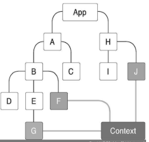
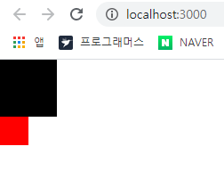
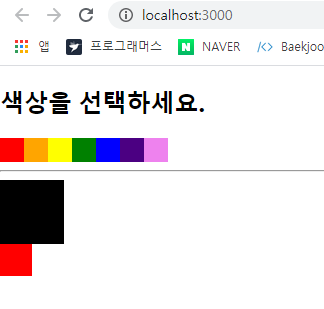
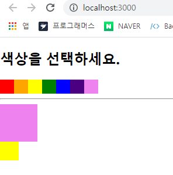

# Context API 

-  Context  API 는 리액트 프로젝트에서 전역적으로 사용할 데이터가 있을 때 유용한 기능. 

- 리덕스, 리액트 라우터, tyled-components 등의 라이브러리는 context API 기반으로 구현되어 있다. 

  

## 15.1 Context API 를 사용한 전역 상태 관리 흐름 이해하기 

- 프로젝트 내에서 환경 설정, 사용자 정보와 같은 적연적으로 필요한 상태를 관리할 때 리액트 애플리케이션은 컴포넌트 간에 데이터를 props 로 전달하기 때문에 컴포넌트 여기저기서 필요한 데이터가 있을 때는 주로 최상위 컴포넌트 App 의 state 에 넣어 관리한다. 

  위의 방법은 많은 컴포넌트를 거쳐야할 때 다루어야 하는 데이터가 훨씬 많아질 수 있기에, 유지 보수성이 낮아질 가능성이 있다. 

- Context API 를 사용하면 Context 를 만들어 단 한 번에 원하는 값을 받아와서 사용할 수 있다. 

  


## 15.2 Context API 사용법 익히기 

```bash
$ yarn create react-app context-tutorial 
```


### 15.2.1 새 Context 만들기 

- src 디렉터리에 contexts 디렉터리를 만든 뒤 그 안에 color.js 라는 파일을 만든다. 

- Context 를 만들 때 반드시 contexts 디렉터리에 만들 필요는 없지만, 다른 파일과 구분하기 위해 따로 디렉터리를 만들었다. 

  ```jsx
  // context/color.js 
  
  import { createContext } from "react";
  
  const ColorContext = createContext({ color: "black" });
  
  export default ColorContext;
  ```

  - 새 Context 를 만들 때는 createContext 함수를 사용한다. 

  - 파라미터에는 해당 Context 의 기본 상태를 지정한다. 


### 15.2.2 Consumer 사용하기 

- ColorBox 라는 컴포넌트를 만들어서 ColorContext 안에 들어있는 색상을 보여줄 때, 색상을 props 로 받아오는 것이 아니라 ColorContext 안에 들어있는 Consumer 라는 컴포넌트를 통해 색상을 조회한다. 

- src 디렉터리에 components 디렉터리를 만들고 그 안에 ColorBox.js 파일 생성 

  ```jsx
  // components/ColorBox.js
  import React from " react";
  import ColorContext from "../contexts/color";
  
  const ColorBox = () => {
    return (
      <ColorContext.Consumer>
        {value => (
          <div
            style={{
              width: "64px",
              height: "64px",
              background: value.color
            }}
          />
        )}
      </ColorContext.Consumer>
    );
  };
  
  export default ColorBox;
  ```

  - Consumer 사이에 중괄호를 열어서 그 안에 함수를 넣어주었다. 이러한 패턴을 **Function as a child** 혹은 **Render Props** 라고 한다.  컴포넌트의 children 이 있어야 할 자리에 일반 JSX 혹은 문자열이 아닌 함수를 전달하는 것. 

    ```jsx
    // Render Props 예제 
    import React from 'react'; 
    
    const RenderPropSample = ({children}) => {
        return <div>결과 : {children(5)} </div>
    }
    export default RenderPropSample; 
    
    // 위와 같은 컴포넌트가 있다면 추후 사용시 다음과 같이 사용할 수 있다. 
    <RenderPropSample>{value =>2*value}</RenderPropSample>
    
    // 결과 : 10 을 렌더링 
    ```

- ```jsx
  // App.js
  import React from "react";
  import ColorBox from "./components/ColorBox";
  
  const App = () => {
    return <ColorBox />;
  };
  
  export default App;
  ```

  

### 15.2.3 Provider

- Provider 를 사용하면 Context 의 value 를 변경할 수 있다. 

  ```jsx
  // App.js 
  import React from "react";
  import ColorBox from "./components/ColorBox";
  import ColorContext from "./contexts/color";
  
  const App = () => {
    return (
      <ColorContext.Provider value={{ color: "red" }}>
        <div>
          <ColorBox />
        </div>
      </ColorContext.Provider>
    );
  };
  
  export default App;
  ```

  

  - 기존에 createContext 함수에서 사용할 때 파라미터로 Context 의 기본값을 넣어주었지만, 이는 Provider 를 사용하지 않았을 때만 사용한다. 
  - 만약 Provider 를 사용했는데 Context 의 기본값을 명시하지 않으면 기본값을 사용하지 않기 때문에 오류가 발생한다. 
  - **Provider 를 사용할 때는 value 값을 꼭 명시해야한다.** 


## 15.3 동적 Context 사용하기 

### 15.3.1 Context 파일 수정하기 

- Context 의 value 에는 무조건 상태 값만 있어야 하는 것이 아니라 함수도 전달할 수 있다. 

- ```jsx
  // context/color.js 
  import React, { useState, createContext } from "react";
  
  const ColorContext = createContext({
      state : {color : 'black' , subcolor : 'red'}, 
      actions : {
          setColor : () =>{}, 
          setSubcolor : () => {}
      }
  });
  
  const ColorProvider = ({children}) =>{
      const [color, setColor] = useState('black');
      const [subcolor , setSubcolor] = useState('red'); 
  
      const value = {
          state : {color , subcolor}, 
          actions:{setColor, setSubcolor}
      }; 
  
      return (
          <ColorContext.Provider value={value}>{children}</ColorContext.Provider>
      )
  }
  
  // const ColorConsumer = ColorContext.Consumer 와 같은 의미 
  const { Consumer:ColorConsumer } = ColorContext; 
  
  // ColorProvider 와 ColorConsumer 내보내기 
  export {ColorProvider, ColorConsumer};
  
  export default ColorContext;
  ```

  - ColorProvider 컴포넌트를 새로 작성. 그리고 컴포넌트에서 ColorContext.Provider 를 렌더링.

    Provider 의 value 에는 상태는 state로, 업데이트 함수는 actions로 묶어서 전달하고 있다. 

    Context 에서 값을 동적으로 사용할 때 반드시 묶을 필요는 없지만 , 이렇게 state 와 actions 객체를 따로따로 분리해주면 나중에 다른 컴포넌트에서 Context 값을 사용할 때 편하다. 

  - 추가로 createContext 를 사용할 때 기본값으로 사용할 객체도 수정했다. 

    createContext 의 기본값은 실제 Provider 의 value 에 넣는 객체의 형태와 일치시켜주는 것이 좋다. 

    그렇게 하면 Context 코드를 볼 때 내부 값이 어떻게 구성되어있는지 파악하기도 쉽고, 실수로 Provider 를 사용하지 않았을 때 리액트 애플리케이션에서 에러가 발생하지 않는다. 


### 15.3.2 새로워진 Context 를 프로젝트에 반영하기 

```jsx
// App.js 에서 ColorContext.Proveider 를 ColorProvider 로 대체 
import React from "react";
import ColorBox from "./components/ColorBox";
import { ColorProvider } from "./contexts/color";

const App = () => {
  return (
    <ColorProvider>
      <div>
        <ColorBox />
      </div>
    </ColorProvider>
  );
};

export default App;
```

```jsx
// components/ColorBox.js 
import React from "react";
import { ColorConsumer } from "../contexts/color";

const ColorBox = () => {
  return (
    <ColorConsumer>
      {value => (
        <>
          <div
            style={{
              width: "64px",
              height: "64px",
              background: value.state.color
            }}
          />
          <div
            style={{
              width: "32px",
              height: "32px",
              background: value.state.subcolor
            }}
          />
        </>
      )}
    </ColorConsumer>
  );
};

export default ColorBox;
```

```jsx
// ColorBox.js 위의 코드를 비구조화 할당 문법을 사용하여 정리 
import React from "react";
import { ColorConsumer } from "../contexts/color";

const ColorBox = () => {
  return (
    <ColorConsumer>
      {({ state }) => (
        <>
          <div
            style={{
              width: "64px",
              height: "64px",
              background: state.color
            }}
          />
          <div
            style={{
              width: "32px",
              height: "32px",
              background: state.subcolor
            }}
          />
        </>
      )}
    </ColorConsumer>
  );
};

export default ColorBox;
```





### 15.3.3 색상 선택 컴포넌트 만들기 

- 이번에는 Context 의 actions 에 넣어 준 함수를 호출하는 컴포넌트를 생성 

- components 디렉터리에 SelectColors.js 파일을 생성  ( 지금은 Consumer 를 사용하지 않고 UI 만 준비 )

  ```jsx
  // components/SelectColors.js 
  import React from 'react'; 
  
  const colors = ['red', 'orange', 'yellow', 'green', 'blue', 'indigo', 'violet']; 
  
  const SelectColors = () => {
      return (
          <div>
              <h2>색상을 선택하세요. </h2>
              <div style ={{display: 'flex'}} >
                  {colors.map(color => (
                      <div 
                      key = {color}
                      style={{
                          background : color, 
                          width : '24px', 
                          height : '24px', 
                          cursor : 'pointer'
                      }}
                      />
                  ))}
              </div>
              <hr />
          </div>
      )
  }
  
  export default SelectColors; 
  ```

- ```jsx
  // App.js 
  import React from "react";
  import ColorBox from "./components/ColorBox";
  import { ColorProvider } from "./contexts/color";
  import SelectColors from "./components/SelectColors";
  
  const App = () => {
    return (
      <ColorProvider>
        <div>
          <SelectColors />
          <ColorBox />
        </div>
      </ColorProvider>
    );
  };
  
  export default App;
  ```

  

- 이제 해당 SelectColors에서 마우스 왼쪽 버튼을 클릭하면 큰 정사각형의 색상을 변경.

  마우스 오른쪽 버튼을 클릭하면 작은 정사각형의 색상을 변경하도록 구현 

  ```jsx
  // components/SelectColors.js 
  import React from "react";
  import { ColorConsumer } from "../contexts/color";
  
  const colors = ["red", "orange", "yellow", "green", "blue", "indigo", "violet"];
  
  const SelectColors = () => {
    return (
      <div>
        <h2>색상을 선택하세요. </h2>
        <ColorConsumer>
          {({ actions }) => (
            <div style={{ display: "flex" }}>
              {colors.map(color => (
                <div
                  key={color}
                  style={{
                    background: color,
                    width: "24px",
                    height: "24px",
                    cursor: "pointer"
                  }}
                  onClick={() => actions.setColor(color)}
                  onContextMenu={e => {
                    e.preventDefault(); // 마우스 오른쪽 버튼 클릭 시 메뉴가 뜨는것을 무시함
                    actions.setSubcolor(color);
                  }}
                />
              ))}
            </div>
          )}
        </ColorConsumer>
        <hr />
      </div>
    );
  };
  
  export default SelectColors;
  ```

  - 마우스 오른쪽 버튼 클릭 이벤트는 `onContextMenu` 사용. 

  


## 15.4 Consumer 대신 Hook 또는 static contextType 사용하기 


### 15.4.1 useContext Hook 사용하기 

- 리액트에 내장되어 있는 Hooks 중에서 useContext 라는 Hook 을 사용하면, 함수형 컴포넌트에서 Context 를 아주 편하게 사용할 수 있다. 

  ```jsx
  // components/ColorBox.js 
  import React, { useContext } from "react";
  import ColorContext from "../contexts/color";
  
  const ColorBox = () => {
    const { state } = useContext(ColorContext);
  
    return (
      <>
        <div
          style={{
            width: "64px",
            height: "64px",
            background: state.color
          }}
        />
        <div
          style={{
            width: "32px",
            height: "32px",
            background: state.subcolor
          }}
        />
      </>
    );
  };
  
  export default ColorBox;
  ```

  - children 에 함수를 전달하는 Render Props 패턴이 불편하다면, useContext Hook을 사용하여 훨씬 편하게 Context 값을 조회할 수 있다. 
  - 그러나 Hook은 함수형 컴포넌트에서만 사용할 수 있다. 


### 15.4.2 static contextType 사용하기 

- 클래스형 컴포넌트에서 Context 를 좀 더 쉽게 사용하고 싶다면 static contextType 을 정의하는 벙법이 있다. 

- SelectColors 컴포넌트를 클래스형으로 변환, 이후 Consumer 부분 제거 

  ```jsx
  // components/SelectColors.js
  import React, { Component } from "react";
  
  const colors = ["red", "orange", "yellow", "green", "blue", "indigo", "violet"];
  
  class SelectColors extends Component {
    render() {
      return (
        <div>
          <h2>색상을 선택하세요.</h2>
          <div style={{ display: "flex" }}>
            {colors.map(color => (
              <div
                key={color}
                style={{
                  background: color,
                  width: "24px",
                  height: "24px",
                  cursor: "pointer"
                }}
              />
            ))}
          </div>
          <hr />
        </div>
      );
    }
  }
  export default SelectColors;
  ```

  그리고 클래스 상단에 static contextType 값 지정 

  ```jsx
  // components/SelectColors.js
  import React, { Component } from "react";
  import ColorContext from "../contexts/color";
  
  const colors = ["red", "orange", "yellow", "green", "blue", "indigo", "violet"];
  
  class SelectColors extends Component {
    static contextType = ColorContext;
  
    render() {
      return (
        <div>
          <h2>색상을 선택하세요.</h2>
          <div style={{ display: "flex" }}>
            {colors.map(color => (
              <div
                key={color}
                style={{
                  background: color,
                  width: "24px",
                  height: "24px",
                  cursor: "pointer"
                }}
              />
            ))}
          </div>
          <hr />
        </div>
      );
    }
  }
  export default SelectColors;
  ```

  이렇게 하면 this.context 를 조회했을 때 Context 의 value 를 가리키게 된다. 

  만약 setColor 를 호출하고 싶다면 this.context.actions.setColor 를 호출하면 된다. 

  ```jsx
  import React, { Component } from "react";
  import ColorContext from "../contexts/color";
  
  const colors = ["red", "orange", "yellow", "green", "blue", "indigo", "violet"];
  
  class SelectColors extends Component {
    static contextType = ColorContext;
  
    handleSetColor = color => {
      this.context.actions.setColor(color);
    };
  
    handleSetSubcolor = subcolor => {
      this.context.actions.setSubcolor(subcolor);
    };
  
    render() {
      return (
        <div>
          <h2>색상을 선택하세요.</h2>
          <div style={{ display: "flex" }}>
            {colors.map(color => (
              <div
                key={color}
                style={{
                  background: color,
                  width: "24px",
                  height: "24px",
                  cursor: "pointer"
                }}
                onClick={() => this.handleSetColor(color)}
                onContextMenu={e => {
                  e.preventDefault();
                  this.handleSetSubcolor(color);
                }}
              />
            ))}
          </div>
          <hr />
        </div>
      );
    }
  }
  export default SelectColors;
  ```

  - static contextType 을 정의하면 클래스 메서드에서도 Context에 넣어 둔 함수를 호출할 수 있다는 장점이 있다. 
  - 단점은 한 클래스에서 하나의 Context 밖에 사용하지 못한다. 


## 15.5 정리 

- 전역적으로 여기저기 사용되는 상태가 있고 컴포넌트의 개수가 많다면 Context API 를 사용하는 것을 권장한다. 