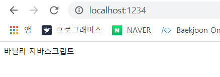
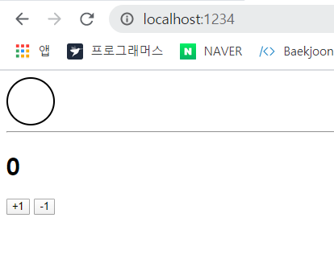
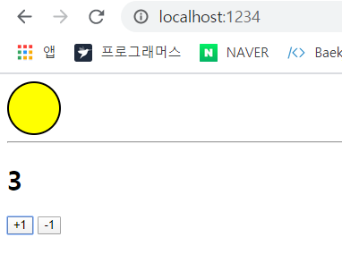

# 16장 _ 리덕스 라이브러리 이해하기 

- 리덕스는 가장 많이 사용하는 **리액트 상태 관리 라이브러리**.
- 리덕스를 사용하면 컴포넌트의 상태 업데이트 관련 로직을 다른 파일로 분리시켜서 더욱 효율적으로 관리할 수 있다. 
- 컴포넌트끼리 똑같은 상태를 공유해야할 때도 여러 컴포넌트를 거치지 않고 손쉽게 상태값을 전달하거나 업데이트 할 수 있다. 
- 전역 상태를 관리할 때 굉장히 효과적 이다. 단순히 전역 상태 관리만 한다면 Context API 를 사용하는 것만으로 충분하지만, 리덕스를 사용하면 상태를 더욱 체계적으로 관리할 수 있고, 코드의 유지 보수성도 높여주고 작업 효율도 극대화해준다. 


## 16.1 개념 미리 정리하기 

### 16.1.1 액션 

- 상태가 어떠한 변화가 필요하면 액션 이란 것이 발생한다. 이는 하나의 객체로 표현된다. 

  ```jsx
  {
      type : 'TOGGLE_VALUE'
  }
  ```

  - 액션 객체는 **type 필드**를 반드시 가져야한다. 이 값이 액션의 이름이라 생각하면 된다. 
  - 이 외의 값들은 나중에 상태 업데이트를 할 때 참고해야 할 값이며, 작성자 마음대로 넣을 수 있다. 

  ```jsx
  // 예시 
  {
      type : 'ADD_TODO', 
      data : {
          id : 1, 
          text : '리덕스 배우기'
      }
  }
  
  {
      type : 'CHANGE_INPUT', 
      text : '안녕하세요'
  }
  ```


### 16.1.2 액션 생성 함수 

- 액션 생성 함수는 액션 객체를 만들어주는 함수. 

  ```jsx
  function addTodo(data){
      return {
          type : 'ADD_TODO', 
         	data
      }
  }
  
  // 화살표 함수로도 만들 수 있따. 
  const changeInput = text => ({
      type : 'CHANGE_INPUT', 
      text
  })
  ```


### 16.1.3 리듀서 

- 리듀서는 변화를 일으키는 함수. 

- 액션을 만들어서 발생시키면, 리듀서가 현재 상태와 전달받은 액션 객체를 파라미터로 받아 오고, 이 두 값을 참고하여 새로운 상태를 만들어서 반환해준다. 

  ```jsx
  const initialState = { 
  	counter : 1 
  }; 
  function reducer(state = initialState, action){
      switch(action.type){
          case INCREMENT:
              return {
                  counter : state.counter + 1
              };
          default : 
              return state; 
      }
  }
  ```


### 16.1.4 스토어 

- 프로젝트에 리덕스를 적용하기 위해 스토어를 만든다. 
- 한 개의 프로젝트는 단 하나의 스토어만 가질 수 있다. 
- 스토어 안에는 현재 애플리케이션 상태와 리듀서가 들어가있으며, 그 외에도 몇가지 중요한 내장함수를 지닌다.


### 16.1.5 디스패치 

- 디스패치는 스토어의 내장 함수 중 하나로, '액션을 발생시키는 것' 이라고 이해하면 된다. 
- 이 함수는 `dispatch(action)` 과 같은 형태로 액션 객체를 파라미터로 넣어서 호출한다.  이 함수가 호출되면 스토어는 리듀서 함수를 실행시켜서 새로운 상태를 만들어 준다. 


### 16.1.6 구독 

- 구독은 스토어의 내장 함수 중 하나로, subscribe 함수 안에 리스너 함수를 파라미터로 넣어서 호출해 주면, 리스너 함수가 액션이 디스패치되어 상태가 업데이트될 때마다 호출된다. 

  ```jsx
  const listener = () => { 
  	console.log('상태가 업데이트됨'); 
  }
  const unsubcribe = store.subscribe(listener); 
  
  unsubscribe(); // 추후 구독을 비활성화할 때 함수를 호출 
  ```

  


## 16.2 리액트 없이 쓰는 리덕스 

- 리덕스는 리액트에 종속되는 라이브러리가 아니다. 리액트에서 사용하려고 만들어졌지만 실제로 다른 UI 라이브러리/ 프레임워크와 함께 사용할 수 있다. ( ex_ angular-redux, ember redux, Vue ... )
- 리덕스는 바닐라 자바스크립트와 함께 사용할 수도 있다. ( 바닐라 자바스크립트는 라이브러리나 프레임워크 없이 사용하는 순수 자바스크립트 자체를 의미 )
- 이번에는 바닐라 자바스크립트 환경에서 리덕스를 사용하여 릳거스의 핵심 기능과 작동 원리를 이해해보겠다. 


### 16.2.1 Parcel 로 프로젝트 만들기 

- 프로젝트를 구성하기 위해 Parcel 이라는 도구 사용. 이 도구를 사용하면 아주 쉽고 빠르게 웹 애플리케이션 프로젝트를 구성할 수 있다. 

  ```bash
  $ yarn global add parcel-bundler
  # yarn global 이 잘 설치되지않는다면, npm install -g parce-bundler 
  ```

- 프로젝트 디렉터리를 생성한 후 `package.json` 파일 생성 

  ```bash
  $ mkdir vanilla-redux 
  $ cd vanilla-redux
  # package.json 파일을 생성 
  $ yarn init -y
  ```

  ```html
  index.html
  
  <html>
      <body>
          <div>
              바닐라 자바스크립트
          </div>
          <script src="./index.js"></script>
      </body>
  </html>
  ```

  ```jsx
  // index.js 
  console.log('hello parcel'); 
  ```

- 아래 명령어를 실행하면 개발용 서버가 실행된다. 

  ```bash
  $ parcel index.html 
  
  Server running at http://localhost:1234 
  √  Built in 1.17s.
  ```

  - 개발 서버의 주소는 http://localhost:1234/ 이며, 파일을 저장할 때마다 자동으로 새로고침된다. 

  

- yarn 을 사용하여 리덕스 모듈 설치 

  ```bash
  $ yarn add redux 
  ```


### 16.2.2 간단한 UI 구성하기 

```css
.toggle{
    border : 2px solid black; 
    width : 64px; 
    height : 64px; 
    border-radius : 32px; 
    box-sizing : border-box; 
}

.toggle.active {
    background : yellow; 
}
```

```html
// index.html 
<html>
    <head>
        <link rel="stylesheet" type="text/css" href="index.css" />
    </head>
    <body>
        <div class="toggle" ></div>
        <hr />
        <h1>0</h1>
        <button id="increase">+1</button>
        <button id="decrease">-1</button>
        <script src = "./index.js"></script>
    </body>
</html>
```



### 16.2.3 DOM 레퍼런스 만들기 

- UI를 관리할 때 별도의 라이브러리를 사용하지 않기 때문에 DOM을 직접 수정해줘야한다. 

- 자바스크립트 파일 상단에 수정할 DOM 노드를 가리키는 값을 미리 선언한다.  기존 코드는 지운다. 

  ```jsx
  //index.js 
  const divToggle = document.querySelector('.toggle'); 
  const counter = document.querySelector('h1'); 
  const btnIncrease = document.querySelector('#increase'); 
  const btnDecrease = document.querySelector('#decrease'); 
  ```


### 16.2.4 액션 타입과 액션 생성 함수 정의 

- 프로젝트의 상태에 변화를 일으키는 것을 액션이라고 한다. 

- 액션 이름은 문자열 형태로, 주로 대문자로 작성하며 액션 이름은 고유해야한다. 이름이 중복되면 의도하지 않은 결과가 발생할 수 있기 때문. 

  ```jsx
  // index.js 
  const divToggle = document.querySelector('.toggle'); 
  const counter = document.querySelector('h1'); 
  const btnIncrease = document.querySelector('#increase'); 
  const btnDecrease = document.querySelector('#decrease'); 
  
  const TOGGLE_SWITCH = 'TOGGLE_SWITCH'; 
  const INCREASE = 'INCREASE'; 
  const DECREASE = 'DECREASE'; 
  ```

- 액션 이름을 사용하여 액션 객체를 만드는 액션 생성 함수를 작성. 

  액션 객체는 type 값을 반드시 갖고 있어야 하고, 그 외에 추후 상태를 업데이트할 때 참고하고 싶은 값은 우리 음대로 넣을 수 있다. 

  ```jsx
  // index.js 
  const toggleSwitch = () => ({
      type : TOGGLE_SWITCH
  })
  
  const increase = difference =>({
      type:INCREASE, difference
  })
  
  const decrease = () => ({
      type : DECREASE
  })
  ```


### 16.2.5 초깃값 설정 

- 초깃값의 형태는 자유다. ( 숫자일수도, 문자열일수도, 객체일 수도 있다. )

  ```jsx
  // index.js 
  const initialState = {
      toggle : false, 
      counter : 0
  }
  ```


### 16.2.6 리듀서 함수 정의 

- 리듀서는 변화를 일으키는 함수. 함수의 파라미터로는 state 와 action 값을 받아온다. 

  ```jsx
  // index.js 
  // state 가 undefined 일 때는 initialState를 기본값으로 사용 
  function reducer (state = initialState , action){ 
      // action.type 에 따라 다른 작업을 처리 
      switch(action.type){
          case TOGGLE_SWITCH : 
          return {
              ...state, // 불변성 유지 
              toggle:!state.toggle
          }; 
          case INCREASE : 
          return {
              ...state, 
              counter : state.counter + action.difference 
          }; 
          case DECREASE : 
          return {
              ...state, 
              counter : state.counter -1
          }; 
          default : 
          return state; 
      }
  }
  ```

  - 리듀서 함수가 맨 처음 호출될 때는 state 값이 undefined 이다. 해당 값이 undefined로 주어졋을 때는 initialState를 기본값으로 설정하기 위해 함수의 파라미터 쪽에 기본 값이 설정되어있다. 
  - 리듀서에서는 상태의 불변성을 유지하면서 데이터에 변화를 일으켜 줘야한다. 이 작업을 할 때는 spread 연산자(...) 를 사용하면 편하지만, 객체의 구조가 복잡해질경우 코드의 가독성도 나쁘고 번거롭기 때문에 리덕스의 상태는 최대한 깊지 않은 구조로 진행하는 것이 좋다. 
  - 객체의 구조가 복잡해지거나 배열도 함께 다루는 경우 immer 라이브러리를 사용하면 좀 더 쉽게 리듀서를 작성할 수 있다. 


### 16.2.7 스토어 만들기

- 스토어를 만들 때는 createStore 함수를 사용한다. 이 함수를 사용하려면 코드 상단에 import 구문을 넣어 리덕스에서 해당 함수를 불어와야 하과, 함수의 파라미터에는 리듀서 함수를 넣어주어야한다. 

  ```jsx
  // index.js 
  import {createStore} from 'redux'; 
  
  (...)
   
   const store = createStore(reducer); 
  ```


### 16.2.8 render 함수 만들기 

- 이 함수는 상태가 업데이트 될 때마다 호출되며, 리액트의 render 함수와는 다르게 이미 html 을 사용하여 만들어진 UI의 속성을 상태에 따라 변경해준다. 

  ```jsx
  // index.js 
  (...)
   const render = () => { 
      const state = store.getState(); // 현재 상태를 불러온다 
  
      // 토글 처리 
      if(state.toggle){
          divToggle.classList.add('active'); 
      }else {
          divToggle.classList.remove('active'); 
      }
  
      // 카운터 처리 
      counter.innerText = state.counter; 
  }
  
  render(); 
  ```


### 16.2.9 구도하기 

- 스토어의 상태가 바뀔 때마다 방금 만든 render 함수가 호출되도록 설정. 

- 위의 작업은 스토어의 내장함수 subscribe를 사용하여 수행할 수 있다. 

- subscribe 함수의 파라미터로는 함수형태의 값을 전달해주고, 전달된 함수는 추후 액션이 발생하여 상태가 업데이트될때마다 호출된다. 

  ```jsx
  // 예시코드 
  const listener = () => {
      console.log('상태가 업데이트된다.' ); 
  }
  const unsubscribe = store.subscribe(listener); 
  
  unsubscribe(); // 추후 구독을 비활성화할 때 함수를 호출 
  ```

- 이번 프로젝트에서는 subscribe 함수를 직접 사용하지만, 추후 리액트 프로젝트에서는 리덕스를 사용할 때 이 함수를 직접 사용하지 않는다. 컴포넌트에서 리덕스 상태를 조회하는 과정에서 `react-redux` 라이브러리가 이 작업을 대신 해준다. 

  ```jsx
  // index.js 
  (...)
   
  const render = () => { 
      const state = store.getState(); // 현재 상태를 불러온다 
  
      // 토글 처리 
      if(state.toggle){
          divToggle.classList.add('active'); 
      }else {
          divToggle.classList.remove('active'); 
      }
  
      // 카운터 처리 
      counter.innerText = state.counter; 
  }
  
  render(); 
  store.subscribe(render); 
  ```

  

### 16.2.10 액션 발생시키기 

- 액션을 발생시키는 것을 디스패치 라고 한다. 
- 디스패치를 할 때는 스토어의 내장함수 `dispatch` 를 사용한다. 파라미터로는 액션 객체를 넣어주면 된다. 

- 다음과 같이 각 DOM 요소에 클릭 이벤트를 설정하고, 이벤트 함수내부에서 dispatch 함수를 사용하여 액션을 스토어에 전달한다. 

  ```jsx
  // index.js 
  (...)
   
  divToggle.onclick = () => {
      store.dispatch(toggleSwitch()); 
  }; 
  
  btnIncrease.onclick = () => {
      store.dispatch(increase(1)); 
  }
  
  btnDecrease.onclick = () => {
      store.dispatch(decrease()); 
  }
  ```

  

  

## 16.3 리덕스의 3가지 규칙 

### 16.3.1 단일 스토어 

- 하나의 애플리케이션 안에는 하나의 스토어가 들어있다. 
- 여러개의 스토어를 사용하는 것이 완전 불가능하지는 않지만, 특정 업데이트가 너무 빈번하게 일어나거나 애플리케이션의 특정 부분을 완전히 분리시킬 때 여러개의 스토어를 만들 수 있지만, 상태 관리가 복잡해질 수 있으므로 권장하지 않는다. 


### 16.3.2 읽기 전용 상태 

- 리덕스 상태는 익기 전용이다. 
- 상태를 업데이트 할 때 기존의 객체는 건드리지 않고 새로운 객체를 생성해주어야 한다. 
- 리덕스에서 불변성을 유지해야하는 이유는 내부적으로 데이터가 변경되는 것을 감지하고 얕은 비교 검사를 하기 때문이다. 


### 16.3.3 리듀서는 순수한 함수 

- 변화를 일으키는 리듀서 함수는 순수한 함수여야 한다. 
  -  리듀서 함수는 이전상태와 액션 객체를 파라미터로 받는다. 
  - 파라미터 외의 값에는 의존하면 안된다. 
  - 이전 상태는 절대로 건드리지 않고, 변화를 준 새로운 상태 객체를 만들어서 반환한다. 
  - 똑같은 파라미터로 호출된 리듀서 함수는 언제나 똑같은 결과값을 반환해야한다. 


- 예를 들어, 리듀서 함수 내부에서 랜던값을 만들거나 Date 함수를 사용하면 파라미터가 같아도 다른 결과를 만들어낼 수 있기 때문에 사용하면 안된다. 

  이러한 작업은 리듀서 함수 바깥에서 처리해줘야한다. 


