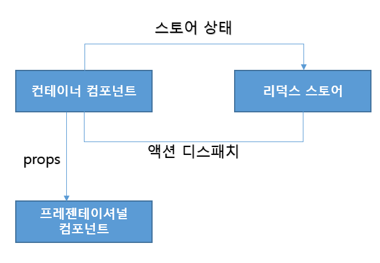
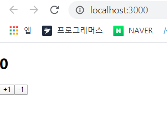
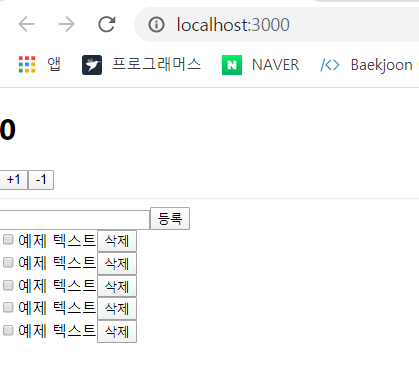
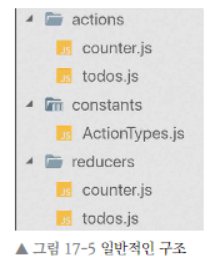
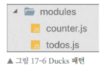
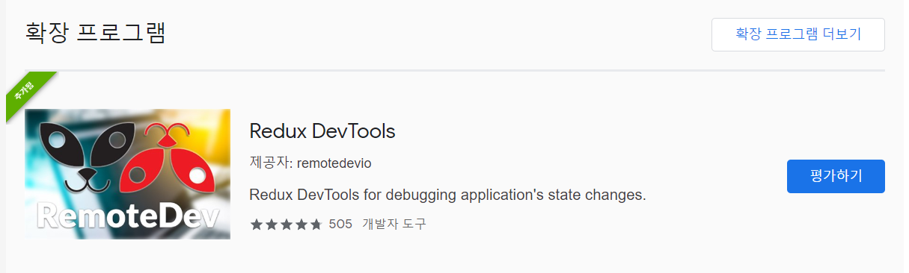
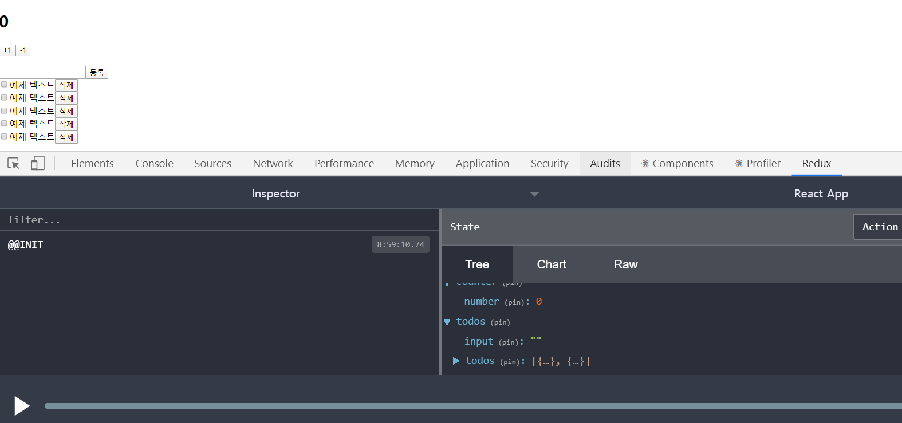
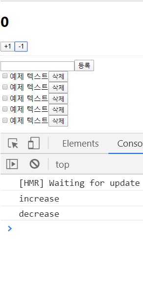
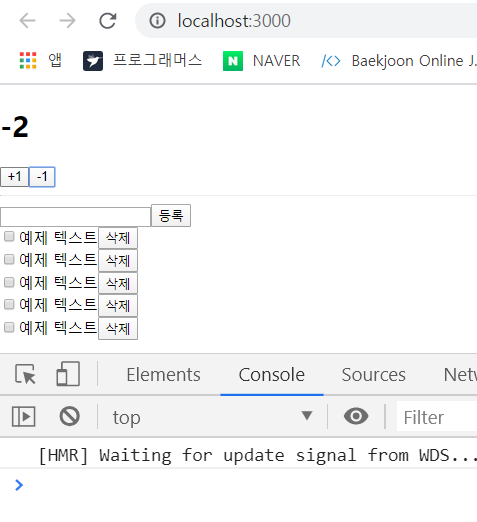
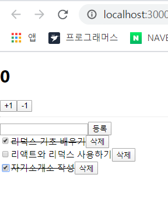

# 17장 _ 리덕스를 사용하여 리액트 애플리케이션 상태 관리하기 

- 리액트 애플리케이션에서 리덕스를 사용하면, 상태 업데이트에 관한 로직을 모듈로 따로 분리하여 컴포넌트 파일과 별개로 관리할 수 있으므로 코드를 유지 보수하는데 도움이 된다. 
- 여러 컴포넌트에서 동일한 상태를 공유해야 할 때 매우 유용하며, 실제 업데이트가 필요한 컴포넌트만 리렌더링되도록 쉽게 최적화해 줄 수도 있다. 


## 17.1 작업 환경 설정

- 리액트 프로젝트 생성 및 리덕스와 react-redux 라이브러리 설치 

  ```bash 
  $ yarn create react-app react-redux-tutorial
  $ cd react-redux-tutorial 
  $ yarn add redux react-redux
  ```

- `Prettier` 를 적용하고 싶다면 디렉터리에 `.prettierrc` 파일 작성 

  ```json
  {
      "singleQuote" : true, 
      "semi" : true, 
      "useTabs" : false, 
      "tabWidth" : 2 , 
      "trailingComma" : "all", 
      "printWidth" : 80
  }
  ```

  

## 17.2 UI 준비하기

- 리액트 프로젝트에서 리덕스를 사용할 때 가장 많이 사용하는 패턴은 프레젠테이셔널 컴포넌트와 컨테이너 컴포넌트를 분리하는 것. 
- **프레젠테이셔널 컴포넌트** : 주로 상태관리가 이루어지지 않고, 그저 props 를 받아와서 화면에 UI 를 보여주기만 하는 컴포넌트.
- **컨테이너 컴포넌트** : 리덕스와 연동되어 있는 컴포넌트로, 리덕스로부터 상태를 받아오기도 하고 리덕스 스토어에 액션을 디스패치하기도 한다. 

- 위의 패턴은 리덕스를 사용하는데 필수는 아니지만, 사용 시 코드의 재사용성도 높아지고 관심사의 분리가 이루어져 UI 작성할 때 좀 더 집중할 수 있다. 




### 17.2.1 카운터 컴포넌트 만들기 

- 숫자를 더하고 뺄 수 있는 카운터 컴포넌트 

  components 디렉터리 생성 후 그 안에 Counter 컴포넌트 작성 

  ```jsx
  // Counter.js
  import React from 'react';
  
  const Counter = ({number, onIncrease, onDecrease}) => {
      return (
          <div>
              <h1>{number}</h1>
              <div>
                  <button onClick={onIncrease}>+1</button>
                  <button onClick={onDecrease}>-1</button>
              </div>
          </div>
      );
  };
  
  export default Counter;
  ```

  ```jsx
  // App.js
  import React from 'react';
  import Counter from './components/Counter'; 
  
  const App = () => {
    return (
      <div>
        <Counter number={0} />      
      </div>
    );
  };
  
  export default App;
  ```

  

### 17.2.1 할 일 목록 컴포넌트 만들기

- 해야 할 일을 추가하고 체크하고, 삭제할 수 있는 할 일 목록 컴포넌트를 만들어보자 

  components 디렉터리에 Todos 컴포넌트 추가 

  ```jsx
  // Todos.js 
  import React from 'react';
  
  const TodoItem = ({todo, onToggle, onRemove}) =>{
      return (
          <div>
              <input type="checkbox" />
              <span>예제 텍스트</span>
              <button>삭제</button>
          </div>
      )
  };
  
  const Todos = ({
      input, // 인풋에 입력되는 텍스트 
      todos, // 할 일 목록이 들어있는 객체
      onChangeInput,
      onInsert, 
      onToggle, 
      onRemove
  }) => {
      const onSubmit = e =>{
          e.preventDefault();
      }
  
      return (    
          <div>
              <form onSubmit={onSubmit}>
                  <input />
                  <button type="submit">등록</button>
              </form>     
              <div>
                  <TodoItem />
                  <TodoItem />
                  <TodoItem />
                  <TodoItem />
                  <TodoItem />
              </div>
          </div> 
      );
  };
  
  export default Todos;
  ```

  ```jsx
  // App.js 
  import React from 'react';
  import Counter from './components/Counter'; 
  import Todos from './components/Todos';
  
  const App = () => {
    return (
      <div>
        <Counter number={0} />      
        <hr />
        <Todos />
      </div>
    );
  };
  
  export default App;
  ```

  


## 17.3 리덕스 관련 코드 작성하기 

- 리덕스를 사용할 때는 액션 타입, 액션 생성함수, 리듀서 코드를 작성해야하는데, 이 코드들을 각각 다른 파일에 작성하는 방법도 있고 기능별로 묶어서 파일 하나에 작성하는 방법도 있다. 

- 가장 일반적인 구조로 actions. constants, reducers - 3개의 디렉터리를 만들고 그 안에 기능별로 파일을 하나씩 만든다. 

  코드를 종류에 따라 다른 파일에 작성하여 정리할 수 있어 편리하지만, 새로운 액션을 만들 때마다 3 종류의 파일을 모두 수정해야하기 때문에 불편하다. 

  이 방식은 리덕스 공식 문서에서도 사용되는 가장 기본적이지만, 사람에 따라서는 불편할 수도 있는 구조. 

  

- 액션타입, 액션 생성함수,, 리듀서 함수를 기능별로 파일 하나에 몰아서 다 작성하는 방식. 

  앞서 설명한 일반적인 구조로 리덕스를 사용하다가 불편함을 느낀 개발자들이 자주 사용. 

   																	

### 17.3.1 counter 모듈 작성하기 

- Ducks 패턴을 사용하여 액션 타입, 액션 생성함수, 리듀서를 작성한 코드를 **모듈**  이라 한다.


#### 17.3.1.1 액션 타입 정의하기 

- modules 디렉터리를 생성하고 그 안에 counter.js 파일을 다음과 같이 작성하시오 

  ```jsx
  // modules/counter.js 
  const INCREASE = 'counter/INCREASE'; 
  const DECREASE = 'counter/DECREASE'; 
  ```

  - 가장 먼저 해야 할 작업 : 액션 타입 정의 
  - 액션 타입은 대문자로 정의하고, 문자열 내용은 `모듈이름/액션이름` 형태로 작성 
  - 문자열 안에 모듈 이름을 넣음으로써 , 나중에 프로젝트가 커졌을 때 액션의 이름이 충돌되지 않게 해준다.


#### 17.3.1.2 액션 생성 함수 만들기 

```jsx
// modules/counter.js
const INCREASE = 'counter/INCREASE'; 
const DECREASE = 'counter/DECREASE'; 

export const increase = () => ({type : INCREASE}); 
export const decrease = () => ({type : DECREASE}); 
```

- 주의해야할 점 : 앞부분에 `export` 키워드가 들어간다.


#### 17.3.1.3 초기 상태 및 리듀서 함수 만들기 

```jsx
// modules/counter.js 
const INCREASE = 'counter/INCREASE'; 
const DECREASE = 'counter/DECREASE'; 

export const increase = () => ({type : INCREASE}); 
export const decrease = () => ({type : DECREASE}); 

const initialState = {
    number : 0
}; 

function counter(state = initialState, action){
    switch(action.type){
        case INCREASE:
            return {
                number : state.number + 1
            }; 
        case DECREASE : 
            return {
                number : state.number -1 
            }; 
        default :
            return state ; 
    }
}

export default counter; 
```

- 모듈의 초기 상태에는 number 값을 설정해 줫으며, 리듀서 함수에는 현재 상태를 참조하여 새로운 객체를 생성해서 반환하는 코드를 작성했다. 

- export 와 exportdefault 의 차이는 export 는 여러개를 내보낼 수 있지만, export default 는 단 1개만 내보낼 수 있다.

  또한 불러오는 방식도 다르다. 

  ```jsx
  import counter from './counter'; 
  import {increase, decrease} from './counter'; 
  // 한꺼번에 불러오고 싶을 때 
  import counter, {increase, decrease} from './counter'; 
  ```


### 17.3.2 todos 모듈 만들기 

- modules 디렉터리에 todos.js 파일 생성

#### 17.3.2.1 액션 타입 정의하기 

```jsx
const CHANGE_INPUT = 'todos/CHANGE_INPUT'; // 인풋 값을 변경함 
const INSERT = 'todos/INSERT';  // 새로운 todo 를 등록함 
const TOGGLE = 'todos/TOGGLE'; // todo를 체크/ 체크 해제
const REMOVE = 'todos/REMOVE'; // todo를 제거함 
```


#### 17.3.2.2 액션 생성 함수 만들기 

```jsx
// modules/todos.js
const CHANGE_INPUT = 'todos/CHANGE_INPUT'; // 인풋 값을 변경함 
const INSERT = 'todos/INSERT';  // 새로운 todo 를 등록함 
const TOGGLE = 'todos/TOGGLE'; // todo를 체크/ 체크 해제
const REMOVE = 'todos/REMOVE'; // todo를 제거함 

export const changeInput = input => ({
    type : CHANGE_INPUT,
    input
}); 

let id = 3; // insert 가 호출될때마다 1씩 더해진다. 
export const insert = text =>({
    type : INSERT, 
    todo : {
        id : id++, 
        text, 
        done : false
    }
});

export const toggle = id = >({
    type : TOGGLE, 
    id
});

export const remove = id =>({
    type : REMOVE, 
    id 
});
```


#### 17.3.2.3 초기 상태 및 리듀서 함수 만들기 

- 객체에 한 개 이상의 값이 들어가므로 불변성을 유지하기 위해 spread 연산자(...) 를 활용하여 작성. 

  ```jsx
  // modules//todos.js
  const CHANGE_INPUT = 'todos/CHANGE_INPUT'; // 인풋 값을 변경함 
  const INSERT = 'todos/INSERT';  // 새로운 todo 를 등록함 
  const TOGGLE = 'todos/TOGGLE'; // todo를 체크/ 체크 해제
  const REMOVE = 'todos/REMOVE'; // todo를 제거함 
  
  export const changeInput = input => ({
      type : CHANGE_INPUT,
      input
  }); 
  
  let id = 3; // insert 가 호출될때마다 1씩 더해진다. 
  export const insert = text =>({
      type : INSERT, 
      todo : {
          id : id++, 
          text, 
          done : false
      }
  });
  
  export const toggle = id = >({
      type : TOGGLE, 
      id
  });
  
  export const remove = id =>({
      type : REMOVE, 
      id 
  });
  
  const initialState = { 
      input : '', 
      todos : [
          {
              id : 1, 
              text : '리덕스 기초 배우기', 
              done : true
          },
          {
              id : 2, 
              text : '리액트와 리덕스 사용하기', 
              done : false 
          }
      ]
  }; 
  
  function todos(state = initialState, action){
      switch(action.type){
          case CHANGE_INPUT : 
          return {
              ...state, 
              input : action.input
          }; 
          case INSERT : 
          return { 
              ...state, 
              todos : state.todos.concat(actions.todo)
          }; 
          case TOGGLE : 
          return {
              ...state ,
              todos : state.todos.map(todo => 
                  todo.id === actions.id ? {...todo, done : !todo.done} : todo)
          }; 
          case REMOVE : 
          return { 
              ...state, 
              todos: state.todos.filter(todo => todo.id !== actions.id)
          }; 
          default : 
          return state; 
      }
  }
  
  export default todos; 
  ```


### 17.3.3 루트 리듀서 만들기 

- 이번 프로젝트에서 여러개의 리듀서를 만들었지만, 나중에 createStore 함수를 사용하여 스토어를 만들 때는 리듀서를 하나만 사용해야한다. 그렇기 때문에 기존에 만들었던 리듀서를 하나로 합쳐줘야한다. 

- 이 작업은 리덕스에서 제공하는 `combineReucers` 라는 유틸 함수를 사용하면 쉽게 처리할 수 있다. 

  ```jsx
  // modules/index.js 
  import {combineReducers} from 'redux'; 
  import counter from './counter'; 
  import todos from './todos'; 
  
  const rootReducer = combineReducers({
      counter, 
      todos, 
  }); 
  
  export default rootReducer; 
  ```

  - 파일 이름을 이렇게 index.js 로 설정해주면 아래와 같이 나중에 불러올 때 디렉터리 이름까지만 입력하여 불러올 수 있다. 

    ```jsx
    import rootReducer from './modules'; 
    ```

    


## 17.4 리액트 애플리케이션에 리덕스 적용하기 

- 스토어를 만들고 리액트 애플리케이션에 리덕스를 적용하는 작업은 src 디렉터리의 index.js 에서 이루어진다. 


### 17.4.1 스토어 만들기 

```jsx
// src/index.js 

import React from 'react';
import ReactDOM from 'react-dom';
import {createStore} from 'redux'; 
import './index.css';
import App from './App';
import * as serviceWorker from './serviceWorker';
import rootReducer from './modules'; 

const store = createStore(rootReducer); 

ReactDOM.render(<App />, document.getElementById('root')
);

// If you want your app to work offline and load faster, you can change
// unregister() to register() below. Note this comes with some pitfalls.
// Learn more about service workers: https://bit.ly/CRA-PWA
serviceWorker.unregister();
```


### 17.4.2  Provider 컴포넌트를 사용하여 프로젝트에 리덕스 적용하기 

- 리액트 컴포넌트에서 스토어를 사용할 수 있도록 App 컴포넌트를 react-redux 에서 제공하는 Provider 컴포넌트로 감싸준다.

- 이 컴포넌트를 사용할 때는 store를 props 로 전달해주어야한다. 

  ```jsx
  // src/index.js
  import React from 'react';
  import ReactDOM from 'react-dom';
  import {createStore} from 'redux'; 
  import './index.css';
  import App from './App';
  import * as serviceWorker from './serviceWorker';
  import rootReducer from './modules'; 
  import {Provider} from 'react-redux'; 
  
  const store = createStore(rootReducer); 
  
  ReactDOM.render(<Provider store={store}><App /></Provider>, document.getElementById('root')
  );
  
  // If you want your app to work offline and load faster, you can change
  // unregister() to register() below. Note this comes with some pitfalls.
  // Learn more about service workers: https://bit.ly/CRA-PWA
  serviceWorker.unregister();
  ```


### 17.4.3 Redux DevTools 의 설치 및 적용 

- Redux DevTools 는 리덕스 개발자 도구이며, 크롬 확장 프로그램으로 설치하여 사용할 수 있다. 

- 크롬 웹 스토어에서 Redux DevTools 를 검색하여 설치해준다. 

  

- 사용 예시 

  ```jsx
  const store = createStore(
  	rootReducer, /* preloadedState , */
  	window._ _REDUX_DEVTOOLS_EXTENSION_ _ && window._ _REDUX_DEVTOOLS_EXTENSION_ _()
  );
  ```

- 패키지를 설치하여 적용하면 코드가 훨씬 깔끔해진다. 

- 패키지 설치 

  ```bash
  $ yarn add redux-devtools-extension
  ```

- ```jsx
  // src/index.js
  import React from 'react';
  import ReactDOM from 'react-dom';
  import {createStore} from 'redux'; 
  import './index.css';
  import App from './App';
  import * as serviceWorker from './serviceWorker';
  import rootReducer from './modules'; 
  import {Provider} from 'react-redux';
  import { composeWithDevTools} from 'redux-devtools-extension';  
  
  const store = createStore(rootReducer, composeWithDevTools()); 
  
  ReactDOM.render(<Provider store={store}><App /></Provider>, document.getElementById('root')
  );
  
  // If you want your app to work offline and load faster, you can change
  // unregister() to register() below. Note this comes with some pitfalls.
  // Learn more about service workers: https://bit.ly/CRA-PWA
  serviceWorker.unregister();
  ```

  


## 17.5 컨테이너 컴포넌트 만들기 

- 컴포넌트에서 리덕스 스토어에 접근하여 원하는 상태를 받아오고, 또 액션도 디스패치 해줄 차례 
- 리액트 스토어와 연동된 컴포넌트를 컨테이너 컴포넌트 라고 부른다. 


### 17.5.1 CounterContainer 만들기 

- src 디렉터리에 containers 디렉터리를 생성하고, 그 안에 CounterContainer 컴포넌트를 만든다

  ```jsx
  // containers/CounterContainer.js 
  import React from 'react'; 
  import Counter from '../components/Counter'; 
  
  const CounterContainer = () => {
      return <Counter />; 
  }
  
  export default CounterContainer; 
  ```

  - 위 컴포넌트를 리덕스와 연동하려면 react-redux 에서 제공하는 connect 함수를 사용해야 한다. 

    ```jsx
    // 사용법
    connect(mapStateToProps, mapDispatchToProps)(연동할 컴포넌트)
    ```

    `mapStateToProps` 는 리덕스 스토어 안의 상태를 컴포넌트의 props 로 넘겨주기 위해 설정하는 함수. 

    `mapDispatchToProps` 는 액션 생성 함수를 컴포넌트의 props 로 넘겨주기 위해 사용하는 함수. 

  - 이렇게 connect 함수를 호출하고 나면 또 다른 함수를 반환한다. 반환된 함수에 컴포넌트를 파라미터로 넣어주면 리덕스와 연동된 컴포넌트가 만들어진다. 

    ```jsx
    // 위 코드를 더 쉽게 풀면 아래와 같은 형태 
    const makeContainer = connect(mapStateToProps, mapDispatchToProps)
    makeContainer(타깃 컴포넌트)
    ```

- ```jsx
  // containers/CounterContainer.js 
  import React from 'react'; 
  import {connect} from 'react-redux'; 
  import Counter from '../components/Counter'; 
  
  const CounterContainer = ({number, increase, decrease}) => {
      return (
          <Counter number={number} onIncrease={increase} onDecrease={decrease} />
      ); 
  }
  
  const mapStateToProps = state => ({
      number : state.counter.number,
  })
  const mapDispatchToProps = dispatch =>({
      // 임시 함수 
      increase : () => {
          console.log('increase'); 
      }, 
      decrease : () =>{
          console.log('decrease'); 
      }
  }); 
  
  
  export default connect(mapStateToProps, mapDispatchToProps,)(CounterContainer); 
  ```

  - `mapStateToProps` 와 `mapDispatchProps` 에서 반환하는 객체 내부의 값들은 컴포넌트의 props로 전달된다. 
  - `mapStateToProps` 는 state 를 파라미터로 받아오며, 이 값은 현재 스토어가 지니고 있는 상태를 가리킨다. 
  - `mapDispatchToProps` 의 경우 store의 내장함수 dispatch 를 파라미터로 받아온다. 현재 mapDispatchToProps 에서는 진행 절차를 설명하기 위해 임시로 console.log 를 사용하고 있다. 

- ```jsx
  // App 에서 Counter 을 CounterContainer 로 교체 
  // App.js 
  import React from 'react'; 
  import Todos from './components/Todos';
  import CounterContainer from './containers/CounterContainer'; 
  
  const App = () => {
    return (
      <div>
        <CounterContainer />    
        <hr />
        <Todos />
      </div>
    );
  };
  
  export default App;
  ```

  

- 이번에는 console.log 대신 액션 생성 함수를 불러와서 액션 객체를 만들고 디스패치 

  ```jsx
  // containers/CounterContainer.js
  import React from 'react'; 
  import {connect} from 'react-redux'; 
  import Counter from '../components/Counter'; 
  import {increase, decrease} from '../modules/counter'; 
  
  const CounterContainer = ({number, increase, decrease}) => {
      return (
          <Counter number={number} onIncrease={increase} onDecrease={decrease} />
      ); 
  }
  
  const mapStateToProps = state => ({
      number : state.counter.number,
  })
  const mapDispatchToProps = dispatch =>({
      // 임시 함수 
      increase : () => {
          dispatch(increase());  
      }, 
      decrease : () =>{
          dispatch(decrease());  
      }
  }); 
  
  
  export default connect(mapStateToProps, mapDispatchToProps,)(CounterContainer); 
  ```

  

- connect 함수를 사용할 때는 일반적으로 위 코드와 같이 mapStateToProps 와 mapDispatchToProps 를 미리 선언해 놓고 사용한다. 

- 하지만 connect 함수 내부에 익명함수 형태로 선언해도 문제가 되지 않는다. 

  ```jsx
  // containers/CounterContainer.js
  import React from 'react'; 
  import {connect} from 'react-redux'; 
  import Counter from '../components/Counter'; 
  import {increase, decrease} from '../modules/counter'; 
  
  const CounterContainer = ({number, increase, decrease}) => {
      return (
          <Counter number={number} onIncrease={increase} onDecrease={decrease} />
      ); 
  }
  
  export default connect(state =>({
      number : state.counter.number,
  }), dispatch => ({
      increase : () => dispatch(increase()), 
      decrease : () => dispatch(decrease()),
  }))(CounterContainer);
  ```

  

- 컴포넌트에서 액션을 디스패치하기 위해 각 액션 생성 함수를 호출하고 dispatch로 감싸는 작업이 번거로울 수 있다. 특히 액션 생성 함수의 개수가 많아진다면 더욱 그렇다. 

- 이와 같은 경우 리덕스에서 제공하는 `bindActionCreators` 유틸 함수를 사용하면 간단하다. 

  ```jsx
  // containers/CounterContainer.js
  import React from 'react'; 
  import {bindActionCreators} from 'redux'; 
  import {connect} from 'react-redux'; 
  import Counter from '../components/Counter'; 
  import {increase, decrease} from '../modules/counter'; 
  
  const CounterContainer = ({number, increase, decrease}) => {
      return (
          <Counter number={number} onIncrease={increase} onDecrease={decrease} />
      ); 
  }
  
  export default connect(state =>({
      number : state.counter.number,
  }), dispatch => bindActionCreators({
      increase,
      decrease,
  }, dispatch, ),
  )(CounterContainer);
  ```


- 위의 방법보다 조금 더 편한 방법은 mapDispatchToProps 에 해당하는 파라미터를 함수 형태가 아닌 액션 생성 함수로 이루어진 객체 형태로 넣어주는 것이다. 

  ```jsx
  // containers/CounterContainer.js 
  
  import React from 'react'; 
  import {connect} from 'react-redux'; 
  import Counter from '../components/Counter'; 
  import {increase, decrease} from '../modules/counter'; 
  
  const CounterContainer = ({number, increase, decrease}) => {
      return (
          <Counter number={number} onIncrease={increase} onDecrease={decrease} />
      ); 
  }
  
  export default connect(state =>({
      number : state.counter.number,
  }), 
  {
      increase, 
      decrease,
  },
  )(CounterContainer);
  ```

  - 두번째 파라미터를 아예 객체 형태로 넣어주면 connect 함수가 내부적으로 bindActionsCreators 작업을 대신 해준다. 


### 17.5.2 TodosContainer 만들기 

- CounterContainer 를 만들 때 배웠떤 connect 함수를 사용하고 mapDispatchToProps를 짧고 간단하게 쓰는방법을 적용해서 코드 작성

  ```jsx
  // containers/TodosContainer.js
  import React from 'react';
  import {connect} from 'react-redux'; 
  import {changeInput, insert, toggle, remove} from '../modules/todos'; 
  import Todos from '../components/Todos'; 
  
  const TodosContainer = ({
      input,
      todos,
      changeInput,
      insert,
      toggle,
      remove,
  }) => {
      return (
          <Todos
          input ={input}
          todos={todos}
          onChangeInput={changeInput}
          onInsert={insert}
          onToggle={toggle}
          onRemove={remove}
          />
      );
  };
  
  export default connect(
      //비구조화 할당을 통해 todos를 분리하여 
      // state.todos.input 대신 todos.input 을 사용 
      ({todos}) =>({
          input : todos.input, 
          todos: todos.todos, 
      }), 
      {
          changeInput, 
          insert,
          toggle,
          remove,
      },
  )(TodosContainer);
  ```

  ```jsx
  // App.js 
  import React from 'react'; 
  import TodosContainer from './containers/TodosContainer';
  import CounterContainer from './containers/CounterContainer'; 
  
  const App = () => {
    return (
      <div>
        <CounterContainer />    
        <hr />
        <TodosContainer />
      </div>
    );
  };
  
  export default App;
  ```

  ```jsx
  // components/Todos.js 
  import React from 'react';
  
  const TodoItem = ({todo, onToggle, onRemove}) =>{
      return (
          <div>
              <input type="checkbox"
              onClick={() => onToggle(todo.id)}
              checked={todo.done}
              readOnly = {true}
              />
              <span style = {{textDecoration : todo.done ? 'line-through' : 'none'}}>{todo.text}</span>
              <button onClick={() => onRemove(todo.id)}>삭제</button>
          </div>
      )
  };
  
  const Todos = ({
      input, // 인풋에 입력되는 텍스트 
      todos, // 할 일 목록이 들어있는 객체
      onChangeInput,
      onInsert, 
      onToggle, 
      onRemove
  }) => {
      const onSubmit = e =>{
          e.preventDefault();
          onInsert(input); 
          onChangeInput(''); // 등록 후 인풋 초기화 
      }
      const onChange = e => onChangeInput(e.target.value); 
  
      return (    
          <div>
              <form onSubmit={onSubmit}>
                  <input value={input} onChange={onChange} />
                  <button type="submit">등록</button>
              </form>     
              <div>
                  {todos.map(todo =>( 
                      <TodoItem
                      todo = {todo}
                      key={todo.id}
                      onToggle={onToggle}
                      onRemove={onRemove} />
                  ))}
              </div>
          </div> 
      );
  };
  
  export default Todos;
  ```

  

  

  

## 17.6 리덕스 더 편하게 사용하기 


## 17.7 Hooks 를 사용하여 컨테이너 컴포넌트 만들기 


## 17.8 정리 


