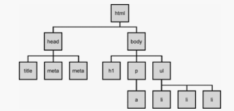

# r1장 _ 리액트 시작

## 1.1 왜 리액트인가?

### 1.1.1 리액트 이해 

**리액트**는 자바스크립트 라이브러리로, 사용자 인터페이스를 만드는데 사용. 

구조는 **오직 View 만 신경**쓰는 라이브러리 이다. 


컴포넌트 : 리액트 프로젝트에서 특정 부분이 어떻게 생길지 정하는 선언체

컴포넌트는 재사용이 가능한 API로 수많은 기능들을 내장하고 있으며, 컴포넌트 하나에서 해당 컴포넌트의 생김새와 작동 방식을 정의한다. 


**랜더링** : 사용자 화면에 뷰를 보여주는 것 


#### 1.1.1.1 초기 렌더링

 `render() { ... } `  : 컴포넌트가 어떻게 생겼는지 정의하는 역할. 이 함수는 html 형식의 문자열을 반환하지 않고 뷰가 어떻게 생겼고 어떻게 작동하는지에 대한 정보를 지닌 객체를 반환한다. 

컴포넌트 내부에는 또 다른 컴포넌트들이 들어갈 수 있으며, `render` 함수를 실행하면 그 내부에 있는 컴포넌트들도 재귀적으로 렌더링을 한다. 

최상위 컴포넌트의 렌더링 작업이 끝나면 지니고 있는 정보들을 사용하여 HTML 마크업을 만들고 이를 우리가 정하는 실제 페이지의 DOM 요소 안에 주입한다. 


#### 1.1.1.2 조화과정 

리액트에서 뷰를 업데이트할 때는 "조화 과정을 거친다" .


## 1.2 리액트의 특징

### 1.2.1 Virtual DOM 

#### 1.2.1.1 DOM 이란 ? 

- **DOM** : Document Object Model 의 약어로, 객체로 문서 구조를 표현하는 방법으로 XML 이나 HTML 로 작성한다. 

- DOM 은 트리형태라서 특정 노드를 찾거나 수정하거나 제거하거나 원하는 곳에 삽입 가능. 

  

- 리액트는 Virtual DOM 방식을 사용하여 DOM 업데이트를 추상화함으로써 DOM 처리 횟수를 최소화하고 효율적으로 진행한다. 


#### 1.2.1.2 Virtual DOM 

- Virtual DOM 을 사용하면 실제 DOM 에 접근하여 조작하는 대신, 이를 추상화한 자바스크립트 객체를 구성하여 사용한다. 
- 리액트에서 데이터가 변하여 웹 브라우저에 실제 DOM 을 업데이트할 때의 3가지 절차
  1. 데이터를 업데이트하면 전체 UI 를 Virutal DOM 에 리렌더링한다. 
  2. 이전 VIrtual DOM 에 있는 내용과 현재 내용을 비교한다. 
  3. 바뀐 부분만 실제 DOM 에 적용한다.
- 리액트는 다른 웹 프레임워크나 라이브러리와 혼용할 수도 있다. 


## 1.3 작업 환경 설정 

### 1.3.1 Node.js 와 npm 

- 리액트 프로젝트를 만들 때는 Node.js 를 반드시 먼저 설치해야한다. 

  Node.js 는 크롬V8 자바스크립트 엔진으로 빌드한 자바스크립트 런타임이다. 이것으로 웹 브라우저 환경이 아닌 곳에서도 자바스크립트를 사용하여 연산할 수 있다. 

- Node.js 를 설치하면 Node.js 패키지 매니저 도구인 npm 이 설치된다. npm 으로 수많은 개발자가 만든 패키지를 설치하고 설치한 패키지의 버전을 관리할 수 있다. 


#### 1.3.1.2 설치 : Windows 

Node.js 공식 홈페이지 : https://nodejs.org/ko/download/ 

```bash
$ node -v 
v12.14.1
```


### 1.3.2 yarn 

- yarn 은 npm 과 동일하게 패키지를 관리해주는 도구/

#### 1.3.2.2 설치 : Windows 

yarn 내려받기 페이지 : https://yarnpkg.com/en/docs/install#windows-stable 

```bash
$ yarn --version
1.22.0
```


### 1.3.3 에디터 설치 

#### 1.3.3.1 VS Code 확장 프로그램 설치 

- `ESLint` : 자바스크립트 문법 및 코드 스타일을 검사해주는 도구 
- `Reactjs Code Snippets` : 리액트 컴포넌트 및 라이프 사이클 함수를 작성할 때 단축 단어를 사용하여 간편하게 코드를 자동으로 생성할 수 있는 코드 스니펫 모음 
- `Prettier-Code formatter` : 코드 스타일을 자동으로 정리해주는 도구 


### 1.3.4  Git 설치

Git 공식 내려받기 페이지 : https://git-scim.com/download/


### 1.3.5 create-react-app 으로 프로젝트 생성하기 

`create-react-app` : 리액트 프로젝트를 생성할 때 필요한 웹팩, 바벨의 설치 및 설정 과정을 생략하고 바로 간편하게 프로젝트 작업 환경을 구축해주는 도구. 

```bash
$ yarn create react-app hello-react 

$ cd hello-react

$ yarn start 
```

