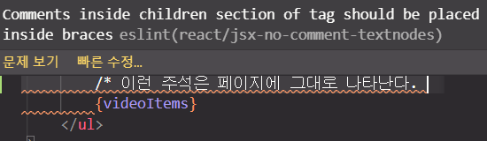
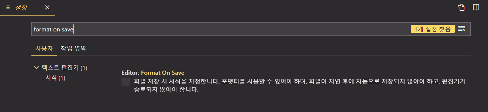

# JSX

## 2.1 코드 이해하기 

```jsx
import React from 'react'; // 리액트를 불러와서 사용할 수 있게 해주는 코드 
```

- 리액트 프로젝트를 만들 때 node_modules 라는 디렉터리에 react 모듈이 설치된다. ( 이 기능은 Node.js 에서 지원하는 기능 . 참고로 Node.js 에서는 import 가 아닌 require 라는 구문으로 패키지를 불러올 수 있다. )

- 위의 기능을 브라우저에서도 사용하기 위해 **번들러** 를 사용한다. 대표적은 번들러로 웹팩, Parcel, browserifyh 도구들이 있다. 

- 웹팩을 사용하면 SVG 파일과 CSS 파일도 불러와서 사용할 수 있다. 이렇게 파일들을 불러오는 것은 웹팩의 로더 라는 기능이 담당한다. 
  - `css-loader` : CSS 파일을 불러올 수 있게 해준다. 
  - `file-loader` : 웹폰트나 미디어 파일 등을 불러올 수 있게 해준다. 
  - `babel-loader` : 자바스크립트 파일들을 불러오면서 최신 자바스크립트 문접으로 작성된 코드를 바벨이라는 도구를 사용하여 ES5 문법으로 변환해준다. 


## 2.2 JSX 란 ? 

**JSX** : 자바스크립트의 확장 문법으로 XML 과 매우 비슷하게 생겼다. 

```jsx
function App(){
    return (
    	<div>
            Hello <b> react</b>
	    </div>
    )
}
```

​																							▼

```javascript
// 위의 코드가 일반 자바스크립트 형태의 코드로 변환 
function App(){ 
	return React.createElement("div", null, "Hello ", React.createElement("b", null, "react")); 
}
```


## 2.3 JSX 장점 

### 2.3.1 보기 쉽고 익숙하다 

### 2.3.2 더욱 높은 활용도 

​	우리가 알고있는 div 나 span 같은 HTML 태그를 사용할 수 있을 뿐만 아니라, 앞으로 만들 컴포넌트도 JSX 안에서 작성할 수 있다. 


## 2.4 JSX 문법 

### 2.3.1 감싸인 요소 

- 컴포넌트에 여러 요소가 있다면 **반드시** 부모 요소 하나로 감싸야한다. 그 이유는 Virtual DOM 에서 컴포넌트 변화를 감지해낼 때 효율적으로 비교할 수 있도록 컴포넌트 내부는 하나의 DOM 트리 구조로 이루어져야한다는 규칙이 있기 때문이다. 

- 리액트 v16 이상부터는 꼭 div 요소를 이용하고 감싸지 않고 Fragment 라는 기능을 이용해 감쌀 수 있다. 

  ```jsx
  function App(){ 
  	return(
      	<Fragment>
          	<h1> 리액트 안녕! </h1>
              <h2> 잘 작동하니? </h2>
          </Fragment>
      )
  }
  ```

  ```jsx
  // Fragment 는 아래와 같이 표현할 수도 있다. 
  function App(){ 
  	return(
      	<>
          	<h1> 리액트 안녕! </h1>
              <h2> 잘 작동하니? </h2>
          </>
      )
  }
  ```

  

### 2.4.2 자바스크립트 표현 

- JSX 안에서는 자바스크립트 표현식을 쓸 수 있다. 자바스크립트 표현식을 작성하려면 JSX 내부에서 코드를 `{}` 로 감싸면 된다. 

  ```jsx
  function App(){ 
      const name = "리액트"; 
  	return(
      	<Fragment>
          	<h1> {name} 안녕! </h1>
              <h2> 잘 작동하니? </h2>
          </Fragment>
      )
  }
  ```


## 2.4.3 If 문 대신 조건부 연산자 

- JSX 내부의 자바스크립트 표현식에서는 if 문을 사용할 수 없다. 그러나 조건에 따른 다른 내용을 렌더링해야 할 때는 JSX 밖에서 if문을 사용하여 사전에 값을 설정하거나, { } 안에 조건부 연산자를 사용하면 된다. 조건부 연산자의 다른 이름은 삼항 연산자이다.

  ```jsx
  function App(){ 
      const name = "리액트"; 
  	return(
      	<Fragment>
          	{name === '리액트' ? (
              	<h1> 리액트입니다. </h1>)
              : (
              	<h2> 리액트가 아닙니다.</h2>
              )}
          </Fragment>
      )
  }
  ```

  


### 2.4.4 AND 연산자(&&)를 사용한 조건부 렌더링 

- 개발하다 보면 특정 조건을 만족할 때 내용을 보여주고, 만족하지 않을때 아예 아무것도 렌더링하지 않아야 하는 상황이 있는데 이 때 `&&` 를 사용한다. 

  ```jsx
  function App(){ 
  	const name = "뤼액트"; 
      return <div> {name === '리액트' ? <h1>리액트입니다.</h1> : null } </div>;
  }
  ```

  위 코드와 같이 `null` 을 렌더링하면 아무것도 보여지지 않는다. 

  ```jsx
  // 위의 코드보다 더 짧은 코드로 똑같이 작업 
  function App(){ 
  	const name = "뤼액트"; 
      return <div> {name === '리액트' && <h1>리액트입니다.</h1>} </div>;
  }
  ```

  

  - **주의점 : falsy 한 값이 0은 예외적으로 화면에 나타난다.** 

  ```jsx
  const number = 0; 
  return number && <div>내용</div>
  ```

  위의 코드일 경우에는 화면에 숫자 0 을 보여준다. 


### 2.4.5 undefined 를 렌더링하지 않기

- 리액트 컴포넌트에서는 함수에서 undefined 만 반환하여 렌더링하는 상황을 만들면 안된다. 따라서 이럴때는 OR ( `||` ) 연산자를 사용하면 해당 값이 undefined 일 때 사용할 값을 지정할 수 있으므로 간단하게 오류를 방지할 수 있다. 

  ```jsx
  // 오류 상황 
  function App(){ 
  	const name = undefined; 
      return name; 
  }
  ```
  ​																						▼
  
  ```jsx
  function App(){ 
  	const name = undefined; 
      return name || '값이 undefined 입니다. '; 
  }
  ```


- 반면 JSX 내부에서 undefined 를 렌더링하는것은 괜찮습니다. 

  ```jsx
  function App(){ 
  	const name = undefined; 
      return <div>{name}</div>; 
  }
  ```

  name 의 값이 undefined 일 때 보여주고 싶은 문구가 있다면 아래와 같이 코드를 작성 

  ```jsx
  function App(){ 
  	const name = undefined; 
      return <div>{name || '리액트'}</div>; 
  }
  ```


### 2.4.6 인라인 스타일링 

- 리액트에서 DOM 요소에 스타일을 적용할 때는 문자열 형태로 넣는 것이 아니라 객체 형태로 넣어주어야한다. 

  스타일 이름 중 background-color 처럼 `-` 문자가 포함되는 이름은 `-` 문자를 없애고 카멜 표기법으로 작성해야한다. 

  ```jsx
  function App(){ 
  	const name = '리액트'; 
      const style = { 
      	backgroundColor : 'black', 
          color : 'aqua', 
          fontSize : '48px', 
          fontWeight : 'bold', 
          padding : 16
      }
      return( <div style={style}> {name} </div> ); 
  }
  ```

- style 값을 미리 선언하지 않고 바로 지정이 가능하다. 

  ```jsx
  function App(){ 
      const name = '리액트'; 
  	return (
      	<div 
              style ={{ 
                  backgroundColor : 'black', 
                  color : 'aqua', 
                  fontSize : '48px', 
                  fontWeight : 'bold', 
                  padding : 16
              }}
  		> 
              {name}
          </div>
      ); 
  }
  ```


### 2.4.7 class 대신 className 

```css
// App.css 
.react{ 
    backgroundColor : 'black', 
        color : 'aqua', 
        fontSize : '48px', 
        fontWeight : 'bold', 
        padding : 16
}
```

```jsx
function App(){
    const name = '리액트'; 
    return <div className = "react"> {name} </div>
}
```


### 2.4.8 꼭 닫아야하는 태그 

- 태그 사이에 별도의 내용이 들어가지 않는 경우에는 다음과 같이 작성할 수 있다. 이러한 태그를 self-closing 태그라고 부른다. ( 선언과 동시에 닫는 태그 ) 

  ```jsx
  <input />
  ```


### 2.4.9 주석 

- JSX 내부에서 주석을 작성할 때는 `{/* ... */}` 와 같은 형식으로 작성한다. 
- 시작태그를 여러 줄로 작성할 때는 그 내부에서 `//` 과 같은 형태의 주석도 작성할 수 있다. 


## 2.5 ESLint 와 Prettier 적용하기 


### 2.5.1 ESLint

- **ESLint** : 문법 검사 도구 

  ESLing 는 코드를 작성할 때 실수를 하면 에러 혹은 경고메시지를 VSCode 에서 바로 확인할 수 있다. 




### 2.5.2 Prettier 

- JSX 를 작성할 때는 코드의 가독성을 위해 들여쓰기를 사용한다. 

  Prettier 를 사용하여 자동 코드 정리를 하면 코드가 제대로 정렬되고, 세미콜린이 빠진 곳에는 세미콜론이 자동으로 추가되고, 기존에 사용하던 작은 따옴표는 모두 큰 따옴표로 바뀐다. 

- 사용법은 `F1` 을 누르고 `format` 라고 입력한 이후 `Enter` 를 누른다. 

- Prettier의 장점은 이러한 스타일을 쉽게 커스터마이징할 수 있다. 현재 열려있는 프로젝트의 루트 디렉터리 (src, public 디렉터리들이 위치한 곳 ) 에서 `.prettierrc` 라는 파일을 생성한 후 다음 내용을 입력한다. 

  ```css
  {
  	"singleQuote" : true, 
  	"semi" : true, 
  	"useTabs" : false, 
  	"tabWidth" : 2
  }
  ```

  위의 파일에서는 들여쓰기를 할 때 탭 대신 공백을 2칸 사용하도록 했고, 큰 따옴표대신 작은 따옴표를 쓰게했으며 세미콜론을 언제나 붙이도록 설정했다. 

- Prittier 에서는 이 외에도 다양한 코드 스타일을 사전 설정할 수 있다. 이에 대한 내용은 Prettier Options 페이지 ( https://prettier.io/docs/en/options.html )을 참고해라. 


#### 2.5.2.1 저장할 때 자동으로 코드 정리하기 

1. VS Code 환경설정을 연다 ( `파일 -> 기본 설정 -> 설정 ` )

2. 상단 텍스트 박스에서 `format on save ` 를 검색하여 나타나는 체크박스에 체크해주면 저장할 때마다 코드가 자동을 정리된다. 

   