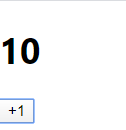
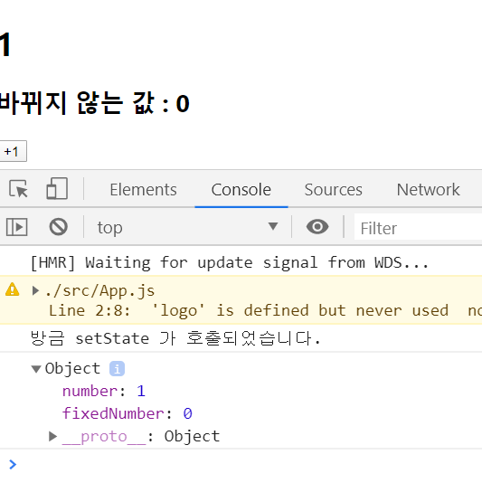

# 컴포넌트 

컴포넌트의 기능은 단순한 템플릿 이상이다. 데이터가 주어졌을 때 이에 맞추어 UI 를 만들어주는 것은 물론이고, 라이프사이클 API 를 이용하여 컴포넌트가 화면에서 나타날 때, 사라질 때, 변화가 일어날 때 주어진 작업들을 처리할 수 있으며 임의 메서드를 만들어 특별한 기능을 붙일 수 있다. 


## 3.1 클래스형 컴포넌트 

- 컴포넌트를 선언하는 방식은 2가지 

  - 함수형 컴포넌트 

    - 함수형 컴포넌트의 **장점** 

      - 클래스형 컴포넌트보다 선언하기가 편하다. 
      - 메모리 자원을 덜 사용한다. 
      - 프로젝트를 완성하여 빌드한 후 배포할 때도 함수형 컴포넌트를 사용하는 것이 결과물의 파일 크기가 더 작다. 
  
    - 함수형 컴포넌트의 **단점** 
  
      - state 와 라이프사이클 API의 사용이 불가능한데, 이 부분은 리액트 v16.8 업데이트 이후 Hooks 라는 기능이 도입되면서 해결되었다. 
  
    
  
  - 클래스형 컴포넌트 

    ```jsx
    class App extends Component{
        render(){
            const name = 'react'; 
            return <div className = "react"> {name} </div>;
        }
    }
    ```
  
    - 클래스형 컴포넌트는 state 기능 및 라이프 사이클 기능을 이용할 수 있으며, 임의 메서드를 정의할 수 있다. 
    - 클래스형 컴포넌트에서는 `render` 함수는 꼭 있어야 하고, 그 안에 보여주어야할 JSX 를 반환해야한다.
  
    


## 3.2 첫 컴포넌트 생성 

### 3.2.1 src 디렉터리에 MyComponent.js 파일 생성 

### 3.2.2 코드 작성 

```jsx
// MyComponent.js 파일 
import React from 'react';

const MyComponents = () => {
    return (
        <div>
            나의 새롭고 멋진 컴포넌트.~
        </div>
    );
};

export default MyComponents;
```

function 키워드 대신 `() => { } ` 화살표 함수를 사용. 


- 화살표 함수는 주로 함수를 파라미터로 전달할 때 유용하다. 

  화살표 함수와 function 은 가리키고 있는 this 값이 다르다 

  ```jsx
  function BlackDog(){ 
  	this.name = '흰둥이'; 
      return {
          name : '검둥이', 
          bark : function(){
              console.log(this.name + ': 멍멍!'); 
          }
      }
  }
  
  const blackDog = new BlackDog(); 
  blackDog.bark(); // 검둥이: 멍멍!
  ```

  ```jsx
  function WhiteDog(){ 
  	this.name = '흰둥이'; 
      return {
          name : '검둥이', 
          bark : () => {
              console.log(this.name + ': 멍멍!'); 
          }
      }
  }
  
  cosnt whiteDog = new WhiteDog(); 
  whiteDog.bark(); // 흰둥이: 멍멍! 
  ```

  일반함수는 자신이 **종속된 객체**를 this 로 가리키며, 화살표 함수는 자신이 **종속된 인스턴스**를 가리킨다. 

### 3.2.3 모듈 내보내기 및 불러오기 

#### 3.2.3.1 모듈 내보내기 (export)

```jsx
export default MyComponent;
```

다른 파일에서 이 파일을 import 할 때, 위에서 선언한 MyComponent 클래스를 불러오도록 설정. 

#### 3.2.3.2 모듈 불러오기 (import)

```jsx
import MyComponent from './MyComponent.js'
```


## 3.3 props 

- props 는 properties 를 줄인 표현으로 컴포넌트 속성을 설정할 때 사용하는 요소이다. 

- props 의 값은 해당 컴포넌트를 불러와 사용하는 부모 컴포넌트에서 설정할 수 있다. 


### 3.3.2 컴포넌트를 사용할 때 props 값 지정하기 

```jsx
// App.js 
const App = () =>{ 
	return <MyComponent name = "React" />; 
}
```


### 3.3.3 props 기본값 설정 : defaultProps 

```jsx
// MyComponent.js 

const MyComponent = props =>{ 
	return <div> 안녕하세요, 제 이름은 {props.name} 입니다. </div>
};

MyComponent.defaultProps = {
    name : '기본 이름'
};
```


### 3.3.4 태그 사이의 내용을 보여주는 children

**children** : 리액트 컴포넌트를 사용할 때 컴포넌트 태그 사이의 내용을 보여주는 props 

```jsx
// App.js 를 아래와 같이 수정 

const App = () =>{ 
	return <MyComponent>리액트</MyComponent>;
}
```

위의 코드에서 MyComponent 태그 사이에 작성한 리액트라는 문자열을 MComponent 내부에서 보여주려면 `props.children` 값을 보여주어야한다. 

```jsx
// MyComponent.js 
const MyComponent = props => {
    return (
    	<div>
        	안녕하세요. 제 이름은 {props.name}입니다. <br />
            children 값은 {props.children} 입니다. 
        </div>
    )
}

MyComponent.defaultProps = {
    name : '기본 이름'
};
```


### 3.3.5 비구조화 할당 문법을 통해 props 내부 값 추출하기 

```jsx
// MyComponent.js 
const MyComponent = props => {
   	const {name, children} = props; 
    return (
    	<div>
        	안녕하세요. 제 이름은 {name}입니다. <br />
            children 값은 {children} 입니다. 
        </div>
    )
}

MyComponent.defaultProps = {
    name : '기본 이름'
};
```

위에서 사용한, 객체에서 값을 추출하는 문법이 **비구조화 할당 문법.** 

```jsx
// MyComponent.js 
const MyComponent =({name, children})=> {
    return (
    	<div>
        	안녕하세요. 제 이름은 {name}입니다. <br />
            children 값은 {children} 입니다. 
        </div>
    )
}

MyComponent.defaultProps = {
    name : '기본 이름'
};
```


### 3.3.6 propTypes 를 통한 props 검증 

컴포넌트의 필수 props 를 지정하거나 props 의 타입을 지정할 때는 propTypes 를 사용한다. 

컴포넌트의 propTypes 를 지정하는 방법은 defaultProp 을 설정하는 것과 비슷하다. 

propTypes 를 사용하려면 코드 상단에 import 구문을 사용하여 불러와야한다. 

```jsx
// MyComponent.js 
import React from 'react' ; 
import PropTypes from 'prop-types'; 

const MyComponent = ({name, children}) =>{
    return (...); 
}

MyComponent.propTypes = {
    name : PropTypes.string
}
```

위와 같이 propTypes 를 설정해주면 name 의 값은 무조건 문자열 형태로 전달해야한다. 


#### 3.3.6.1 isRequired 를 사용하여 필수 propTypes 설정 

propTypes 를 지정하지 않았을 때 경고 메시지를 띄워주는 작업은 propTypes 를 지정할 때 뒤에 `isRequired` 를 붙여주면 된다. 

```jsx
// MyComponent.js 
const MyComponent= ({name, children}) =>{ 
	return (
    	<div>
        	안녕하세요, 제 이름은 {name} 입니다. <br />
            children 값은 {children} 입니다. <br />
            제가 좋아하는 숫자는 {favoriteNumber} 입니다. 
        </div>
    )
}

MyComponent.propTypes = {
    name : PropTypes.string, 
    favoriteNumber : PropTypes.number.isRequired
};
```


#### 3.3.6.2 더 많은 PropTypes 종류 

- PropTypes 는 여러가지 종류를 설정할 수 있다. 

  - array : 배열 
  - arrayOf(다른 PropType) : 특정 PropType 으로 이루어진 배열을 의미. 
  - bool : true 혹은 false 값 
  - func : 함수 
  - ...

  더 많은 정보는 https://github.com/facebook/prop-types 에서 확인할 수 있다. 


### 3.3.7 클래스형 컴포넌트에서 props 사용하기 

- 클래스형 컴포넌트에서 props 를 사용할 때는 render 함수에서 this.props 를 조회하면 된다. 

- defaultProps 와 propTypes 는 똑같은 방식으로 설정할 수 있다. 

  ```jsx
  // MyComponent.js 
  
  class MyComponent extends Component{
      const {name, children} = this.props; // 비 구조화 할당 
      render(){ 
      	return (
          	... // 다른 코드는 동일 
          );
      }
  }
  // 아래 defaultProps 와 PropTypes 코드는 동일 .
  ```

- 클래스형 컴포넌트에서 defaultProps 와 PropTypes 를 설정할 때 class 내부에서 지정하는 방법. 

  ```jsx
  // MyComponent.js
  class MyComponent extends Component {
      static defaultProps = {
          name : '기본 이름'
      }; 
  	static propTypes = {
          name : PropTypes.string, 
          favoriteNumber : PropTypes.number.isRequired
      }; 
  	render(){ 
      	const {name, favoriteNumber, children } = this.props; 
          return ( ... );
      }
  }
  ```


## 3.4 state 

- state 는 컴포넌트 내부엥서 바뀔 수 있는 값을 의미. 
- 리액트에는 두가지 종류의 stte 가 있다. 
  - 클래스형 컴포넌트가 지니고 있는 state. 
  - 함수형 컴포넌트에서 useState 라는 함수를 통해 사용하는 state. 


### 3.4.1 클래스형 컴포넌트의 state 

```jsx
// Counter.js 

import React, { Component } from "react";

class Counter extends Component {
  constructor(props) {
    super(props);
    // state 초기값 설정하기
    this.state = {
      number: 0
    };
  }

  render() {
    const { number } = this.state; // state 를 조회할 때는 this.state 로 조회한다.
    return (
      <div>
        <h1> {number} </h1>
        <button
          onClick={() => {
            this.setState({ number: number + 1 }); // this.setState 를 사용하여 state에 새로운 값을 넣을 수 있다.
          }}
        >
          {" "}
          +1{" "}
        </button>
      </div>
    );
  }
}

export default Counter;

```

- 클래스형 컴포넌트에서 constructor 를 작성할 때는 반드시 `super(props)` 를 호출해주어야한다. 

  위의 함수가 호출되면 현재 클래스형 컴포넌트가 상속하고 있는 리액트의 Component 클래스가 지닌 생성자 함수를 호출해준다. 

- 컴포넌트의 state 는 객체 형식이어야한다. 

- 이벤트로 설정할 함수를 넣어 줄 때는 화살표 함수 문법을 사용하여 넣어주어야한다. 

  

#### 3.4.1.1 state 객체 안에 여러 값이 있을 때 

- state 객체 안에는 여러 값이 있을 수 있다. 

  ```jsx
  // Counter.js 를 아래와 같이 수정 
  import React, { Component } from "react";
  
  class Counter extends Component {
    constructor(props) {
      super(props);
      // state 초기값 설정하기
      this.state = {
        number: 0,
        fixedNumber : 0
      };
    }
  
    render() {
      const { number, fixedNumber } = this.state; // state 를 조회할 때는 this.state 로 조회한다.
      return (
        <div>
          <h1> {number} </h1>
          <h2> 바뀌지 않는 값 : {fixedNumber} </h2>
          <button
            onClick={() => {
              this.setState({ number: number + 1 }); // this.setState 를 사용하여 state에 새로운 값을 넣을 수 있다.
            }}
          >
            {" "}
            +1{" "}
          </button>
        </div>
      );
    }
  }
  
  export default Counter;
  ```

  


#### 3.4.1.2 state 를 constructor 에서 꺼내기 

- state 의 초기값을 지정하기 위해 constructor 메서드를 선언했지만 다른 방식도 가능하다. 

  ```jsx
  // Counter.js 
  import React, {Component} from 'react'; 
  
  class Counter extends Componet{
      state = {
          number :0, 
          fixedNumber : 0
      }
  	render(){ 
      	const {name, fixedNumber } = this.state; 
          return (...); 
      }
  }
  ```


#### 3.4.1.3 this.setState에 객체 대신 함수 인자 전달하기 

- this.setState 를 사용하여 state 값을 업데이트할 때는 상태가 비동기적으로 업데이트 된다. 

  ```jsx
  // Counter.js - button onClick
  onClick = {() => {
      this.setState({number : number+1}); 
      this.setState({number: this.state.number + 1});
  }}
  ```

  위와 같이 작성하면 this.setState 를 두 번 사용하지만 숫자가 1씩 더해진다. 이에 대한 해결책은 this.setState 를 사용할 때 객체 대신에 함수를 인자로 넣어주면 된다. 

  ```jsx
  this.setState((prevState, props)=>{ 
      return{
          // 업데이트 하고 싶은 내용 
      }
  })
  ```

   prevState : 기존 상태                     props : 현재 지니는 props 

  ```jsx
  // Counter.js - button
  <button 
      onClick={()=>{
          this.setState(prevState =>{
              return{
                  number : prevState.number + 1
              }
          })
          // 위 코드와 아래 코드는 동일한 기능 ( 아래 코드는 함수에서 바로 객체를 반환 )
          this.setState(prevState => ({
              number : prevState.number + 1
          }));
      }}> 
      +1 
  </button>
  ```

  화살표 함수에서 값을 바로 반환하고 싶다면 코드 블록 `{ } ` 를 생략하면 된다.

   


#### 3.4.1.4 this.setState 가 끝난 후 특정 작업 실행하기 

- setState 를 사용하여 값을 업데이트하고 난 다음에 특정 작업을 하고 싶을때는 setState의 두번째 파라미터로 콜백함수를 등록하여 작업을 처리할 수 있다. 

  ```jsx
  // Counter.js - button 
  <button 
      onClick = { () => { 
      	this.setState({
              number : number + 1
          },
          () => {
              console.log('방금 setState 가 호출되었습니다.'); 
              console.log(this.state); 
          }
          );
      }}>
  +1
  </button>
  ```

  


### 3.4.2 함수형 컴포넌트에서 useState 사용하기 

#### 3.4.2.1 배열 비구조화 할당 

- 배열 안에 들어 있는 값을 쉽게 추출할 수 있도록 해주는 문법 

  ```jsx
  const array = [1,2] ;
  const one = array[0]; 
  const two = array[1]; 
  ```

  ​																						▼

  ```jsx
  const array = [1,2]; 
  const [one, two] = array; 
  ```


#### 3.4.2.2 useState 사용하기 

```jsx
// Say.js 
import React, { useState } from "react";
const Say = () => {
   const [message, setMessage] = useState("");
   const onClickEnter = () => setMessage('안녕하세요!'); 
   const onClickLeave = () => setMessage('안녕히 가세요!'); 
    
   return (
      <div>
          <button onClick = {onClickEnter}>입장</button>
          <button onClick = {onClickLeave}>퇴장</button>
          <h1> {message} </h1>
      </div>
   );
};
export default Say;
```

- useState 함수의 인자에는 상태의 초깃값을 넣어준다. ( useState 에서는 반드시 객체가 아니어도 상관 없고 값의 형태는 자유이다. )

- 함수를 호출하면 배열이 반환되는데 **배열의 첫번째 원소는 현재 상태, 두번째 원소는 상태를 바꾸어주는 함수**이고, 이를 세터함수라고 부른다. 

  

#### 3.4.2.3 한 컴포넌트에서 useState 여러 번 사용하기 

- useState 는 한 컴포넌트에서 여러 번 사용해도 상관 없다. 

  ```jsx
  // Say.js 
  import React, { useState } from "react";
  
  const Say = () => {
    const [message, setMessage] = useState("");
    const onClickEnter = () => setMessage("안녕하세요!");
    const onClickLeave = () => setMessage("안녕히 가세요!");
  
    const [color, setColor] = useState("black");
    return (
      <div>
        <button onClick={onClickEnter}>입장</button>
        <button onClick={onClickLeave}>퇴장</button>
        <h1 style={{ color }}> {message} </h1>
        <button style={{ color: "red" }} onClick={() => setColor("red")}>
          빨간색
        </button>
        <button style={{ color: "green" }} onClick={() => setColor("green")}>
          초록색
        </button>
        <button style={{ color: "blue" }} onClick={() => setColor("blue")}>
          파란색
        </button>
      </div>
    );
  };
  
  export default Say;
  
  ```

  


## 3.5 state 를 사용할 때 주의사항 

- state 값을 바꾸어야할 때는 setState 혹은 useState 를 통해 전달받은 세터함수를 사용해야한다. 

- 배열이나 객체를 업데이트해야 할 때는 배열이나 객체 사본을 만들고 그 사본에 값을 업데이트한 후, 그 사본의 상태를 setState 혹은 세터함수를 통해 업데이트 한다. 

  ```jsx
  // 객체 다루기 
  const object = {a:1, b:2, c:3}; 
  const nextObject = {...object, b:2}; // 사본을 만들어서 b값만 덮어 쓰기 
  ```

  ```jsx
  // 배열 다루기 
  const array = [
      {id : 1, value : true}, 
      {id : 2, value : true}, 
      {id : 3, value : false}
  ]; 
  let nextArray - array.concat({id:4}); // 새항목 추가 
  nextArray.filter(item => item.id !==2); // id가 2인 항목 제거 
  nextArray.map(item=>(item.id ===1 ? { ...item, value:flase} : item)); // id 가 1인 항목의 value를 false 로 설정 
  ```

  

