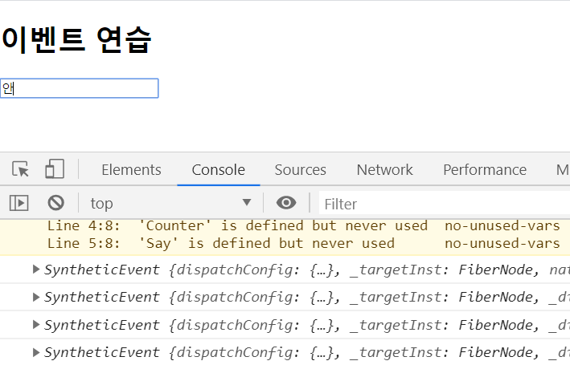
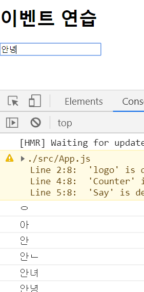
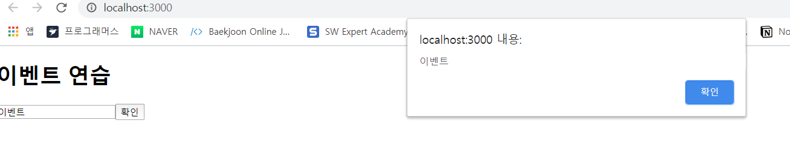
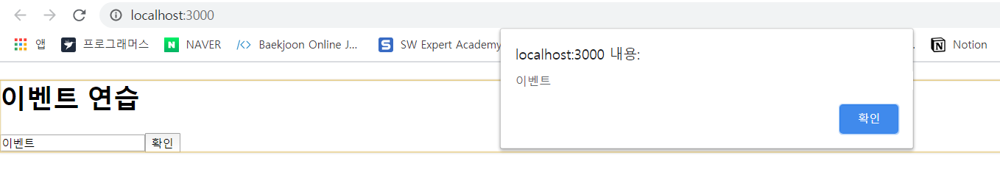
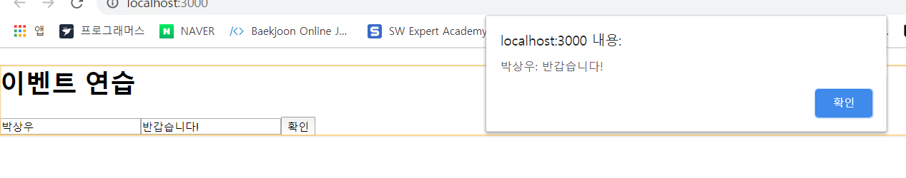
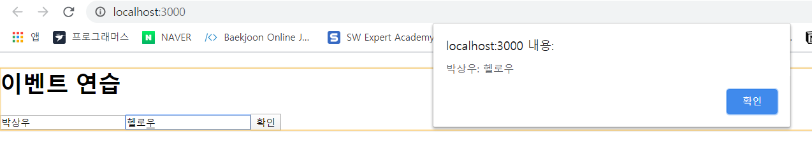

# 4. 이벤트 핸드링 

- 사용자가 웹 브라우저에서 DOM 요소들과 상호작용하는 것을 이벤트 라고 한다. 


## 4.1 리액트의 이벤트 시스템 

### 4.1.1 이벤트를 사용할 때 주의 사항 

1. **이벤트 이름은 카멜 표기법으로 작성한다.** 

2. **이벤트에 실행할 자바스크립트 코드를 전달하는 것이 아니라 함수형태의 값을 전달한다.**

   리액트에서는 함수 형태의 객체를 전달한다. 

3. **DOM 요소에만 이벤트를 설정할 수 있다.** 

   즉, div , button, input, form, span 등의 DOM 요소에는 이벤트를 설정할 수 있지만, 우리가 직접 만든 컴포넌트에는 이벤트를 자체적으로 설정할 수 없다. 

   컴포넌트에 자체적으로 이벤트를 설정할 수 없지만, 전달받은 props 를 컴포넌트 내부의 DOM 이벤트러 설정할 수는 있다. 

   ```jsx
   // 상위 컴포넌트
   <MyComponent onClick={doSomething} />
   
   // 하위 컴포넌트
   <div onClick={this.props.onClick} > 
   	{ /* (...)  */ }
   </div>
   ```


### 4.1.2 이벤트 종류 

- 리액트에서 지원하는 이벤트 종류는 아래와 같다. 
  - Clipboard
  - Coomposition
  - Keyboard
  - Focus 
  - ... 
  - 나머지 이벤트는 리액트 메뉴얼을 참고 ( https://facebook.github.io/react/docs/events.html )


## 4.2 예제로 이벤트 핸들링 익히기 

### 4.2.1 컴포넌트 생성 및 불러오기 

#### 4.1.1.1 컴포넌트 생성 

```jsx
// EventPractice.js 
import React, { Component } from "react";

class EventPractice extends Component {
  render() {
    return (
      <div>
        <h1>이벤트 연습</h1>
      </div>
    );
  }
}

export default EventPractice;

```

```jsx
// App.js
const App = () => { 
	return <EventPractice />; 
}
```


### 4.2.2 onChange 이벤트 핸들링하기 

#### 4.2.2.1 onChange 이벤트 설정 

```jsx
// EventPractice.js 
import React, { Component } from "react";

class EventPractice extends Component {
  render() {
    return (
      <div>
        <h1>이벤트 연습</h1>
        <input
          type="text"
          name="message"
          placeholder="아무거나 입력해보세요"
          onChange={e => {
            console.log(e);
          }}
        />
      </div>
    );
  }
}

export default EventPractice;
```



여기서 콘솔에 기록되는 e 객체는 SyntheticEvent 로 웹 브라우저의 네이티브 이벤트를 감싸는 객체다. 

SyntheticEvent 는 네이티브 이벤트와 달리 이벤트가 끝나고 나면 이벤트가 초기화되므로 정보를 참조할 수 없다. 

만약 비동기적으로 이벤트 객체를 참조할 일이 있다면 `e.persist()` 함수를 호출해야한다. 

```jsx 
console.log(e)  -->  console.log(e.target.value); 
```




#### 4.2.2.2 state 에 input 값 담기 

```jsx
import React, { Component } from "react";

class EventPractice extends Component {
  state = {
    message: ""
  };

  render() {
    return (
      <div>
        <h1>이벤트 연습</h1>
        <input
          type="text"
          name="message"
          placeholder="아무거나 입력해보세요"
          value={this.state.message}
          onChange={e => {
            this.setState({
              message: e.target.value
            });
          }}
        />
      </div>
    );
  }
}

export default EventPractice;
```


#### 4.2.2.3 버튼을 누를 때 comment 값을 공백으로 설정 

- 클릭 이벤트가 발생하면 현재 comment 값을 메시지 박스로 띄운 후 comment 값을 공백으로 설정 

  ```jsx
  // EventPractice.js 
  import React, { Component } from "react";
  
  class EventPractice extends Component {
    state = {
      message: ""
    };
  
    render() {
      return (
        <div>
          <h1>이벤트 연습</h1>
          <input
            type="text"
            name="message"
            placeholder="아무거나 입력해보세요"
            value={this.state.message}
            onChange={e => {
              this.setState({
                message: e.target.value
              });
            }}
          />
          <button
            onClick={() => {
              alert(this.state.message);
              this.setState({
                message: ""
              });
            }}
          >
            확인{" "}
          </button>
        </div>
      );
    }
  }
  
  export default EventPractice;
  ```

  


### 4.2.3 임의 메서드 만들기 

- 이벤트를 처리할 때 렌더링을 하는 동시에 함수를 만들어서 주는 방법이 있고, 미리 함수를 준비하여 전달하는 방법도 있다. 

#### 4.2.3.1 기본 방식 

```jsx
// EventPractice.js 
import React, { Component } from "react";

class EventPractice extends Component {
  state = {
    message: ""
  };

  constructor(props) {
    super(props);
    this.handleChange = this.handleChange.bind(this);
    this.handleClick = this.handleClick.bind(this);
  }

  handleChange(e){
    this.setState({
      message: e.target.value
    });
  };

  handleClick(){
    alert(this.state.message);
    this.setState({
      message: ""
    });
  };

  render() {
    return (
      <div>
        <h1>이벤트 연습</h1>
        <input
          type="text"
          name="message"
          placeholder="아무거나 입력해보세요"
          value={this.state.message}
          onChange={this.handleChange}
        />
        <button onClick={this.handleClick}>확인 </button>
      </div>
    );
  }
}

export default EventPractice;
```



함수가 호출될 때 this 는 호출부에 따라 결정되므로, 클래스의 임의 메서드가 특정 HTML 요소의 이벤트로 등록되는 과정에서 메서드와 this의 관게가 끊어져 버린다. 이 때문에 임의 메서드가 이벤트로 등록되어도 this 를 컴포넌트 자신으로 제대로 가리키기 위해서는 메서드를 this 와 바인딩 하는 작업이 필요하다. 

만약 바인딩하지 않는 경우라면 this가  undefined 를 가리키게 된다. 


#### 4.2.3.2 Property Initializer Syntax 를 사용한 메서드 작성 

- 메서드 바인딩은 생성자 메서드에서 하는 것이 정석 

- 위의 작업을 좀 더 간단하게 하는 방법은 바벨의 `transform-class-properties` 문법을 사용하여 화살표 함수 형태로 메서드를 정의하는 것. 

  ```jsx
  // EventPractice.js 
  import React, { Component } from "react";
  
  class EventPractice extends Component {
    state = {
      message: ""
    };
  
    handleChange = e => {	 // 화살표 함수 이용 ! 
      this.setState({
        message: e.target.value
      });
    };
  
    handleClick = () => {	// 화살표 함수 이용 ! 
      alert(this.state.message);
      this.setState({
        message: ""
      });
    };
  
    render() {
      return (
        <div>
          <h1>이벤트 연습</h1>
          <input
            type="text"
            name="message"
            placeholder="아무거나 입력해보세요"
            value={this.state.message}
            onChange={this.handleChange}
          />
          <button onClick={this.handleClick}>확인 </button>
        </div>
      );
    }
  }
  
  export default EventPractice;
  
  ```


### 4.2.4  input 여러 개 다루기 

- event 객체를 활용.  

  onChange 이벤트 핸들러에서 e.target.name 은 해당 인풋의 name 을 가리킨다. 

  ```jsx
  // EventPractice.js 
  import React, { Component } from "react";
  
  class EventPractice extends Component {
    state = {
      username: "",
      message: ""
    };
  
    handleChange = e => {
      this.setState({
        [e.target.name]: e.target.value
      });
    };
  
    handleClick = () => {
      alert(this.state.username + ": " + this.state.message);
      this.setState({
        username: "",
        message: ""
      });
    };
  
    render() {
      return (
        <div>
          <h1>이벤트 연습</h1>
          <input
            type="text"
            name="username"
            placeholder="사용자명"
            value={this.state.username}
            onChange={this.handleChange}
          />
          <input
            type="text"
            name="message"
            placeholder="아무거나 입력해보세요"
            value={this.state.message}
            onChange={this.handleChange}
          />
          <button onClick={this.handleClick}>확인 </button>
        </div>
      );
    }
  }
  
  export default EventPractice;
  ```

  

  객체 안에서 key 를 `[ ]` 로 감싸면 그 안에 넣은 레퍼런스가 가리키는 실제 값이 key 값으로 사용된다. 

  ```jsx
  const name = 'variantKey'; 
  const object = {
      [name] : 'value'
  }
  ```

  ​																				▼

  ```jsx
  {
      'variantKey' : 'value'
  }
  ```


### 4.2.5 onKeyPress 이벤트 핸들링 

- comment 인풋에서 `Enter` 를 눌렀을 때 handleClick 메서드를 호출하는 코드 

  ```jsx
  // EventPractice.js 
  import React, { Component } from "react";
  
  class EventPractice extends Component {
    state = {
      username: "",
      message: ""
    };
  
    handleChange = e => {
      this.setState({
        [e.target.name]: e.target.value
      });
    };
  
    handleClick = () => {
      alert(this.state.username + ": " + this.state.message);
      this.setState({
        username: "",
        message: ""
      });
    };
  
    handleKeyPress = e => {
      if (e.key === "Enter") {
        this.handleClick();
      }
    };
  
    render() {
      return (
        <div>
          <h1>이벤트 연습</h1>
          <input
            type="text"
            name="username"
            placeholder="사용자명"
            value={this.state.username}
            onChange={this.handleChange}
          />
          <input
            type="text"
            name="message"
            placeholder="아무거나 입력해보세요"
            value={this.state.message}
            onChange={this.handleChange}
            onKeyPress={this.handleKeyPress}
          />
          <button onClick={this.handleClick}>확인 </button>
        </div>
      );
    }
  }
  
  export default EventPractice;
  ```

  


## 4.3 함수형 컴포넌트로 구현해보기 

```jsx
// 위의 코드를 함수형 컴포넌트로 구현 
import React, { useState } from "react";

const EventPractice = () => {
  const [username, setUsername] = useState("");
  const [message, setMessage] = useState("");
  const onChangeUsername = e => setUsername(e.target.value);
  const onChangeMessage = e => setMessage(e.target.value);
  const onClick = () => {
    alert(username + ": " + message);
    setUsername("");
    setMessage("");
  };

  const onKeyPress = e => {
    if (e.key === "Enter") {
      onClick();
    }
  };

  return (
    <div>
      <h1>이벤트 연습</h1>
      <input
        type="text"
        name="username"
        placeholder="사용자명"
        value={username}
        onChange={onChangeUsername}
      />
      <input
        type="text"
        name="message"
        placeholder="아무거나 입력해보세요"
        value={message}
        onChange={onChangeMessage}
        onKeyPress={onKeyPress}
      />
      <button onClick={onClick}>확인 </button>
    </div>
  );
};

export default EventPractice;
```


- useState 를 통해 사용하는 상태에 문자열이 아닌 객체를 넣어본다. 

  ```jsx
  // EventPractice.js 
  import React, { useState } from "react";
  
  const EventPractice = () => {
    const [form, setForm] = useState({
      username: "",
      message: ""
    });
  
    const { username, message } = form;
  
    const onChange = e => {
      const nextForm = {
        ...form, // 기존의 form 내용을 이 자리에 복사한 뒤
        [e.target.name]: e.target.value // 원하는 값을 덮어씌우기
      };
      setForm(nextForm);
    };
  
    const onClick = () => {
      alert(username + ": " + message);
      setForm({
        username: "",
        message: ""
      });
    };
  
    const onKeyPress = e => {
      if (e.key === "Enter") {
        onClick();
      }
    };
  
    return (
      <div>
        <h1>이벤트 연습</h1>
        <input
          type="text"
          name="username"
          placeholder="사용자명"
          value={username}
          onChange={onChange}
        />
        <input
          type="text"
          name="message"
          placeholder="아무거나 입력해보세요"
          value={message}
          onChange={onChange}
          onKeyPress={onKeyPress}
        />
        <button onClick={onClick}>확인 </button>
      </div>
    );
  };
  
  export default EventPractice;
  ```

  e.target.name 값을 활용하려면 위와 같이 useState 를  쓸 때 인풋 값들이 들어있는 form 객체를 사용하면 된다. 