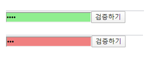
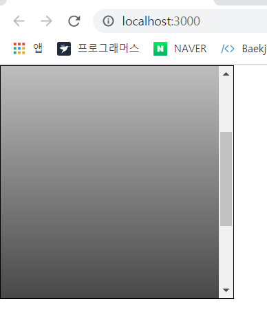
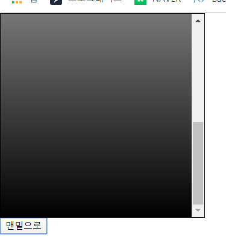

# ref: DOM에 이름 달기 


특정 DOM 요소에 어떤 작업을 해야 할 때 요소에 id 를 달면 CSS 에서 특정 id 에 특정 스타일을 적용하거나 자바스크립트에서 해당 id 를 가진 요소를 찾아서 작업을 할 수 있다. 


리액트 컴포넌트 안에서도 id 를 사용할 수 있지만, JSX 안에서 DOM 에 id 를 달면 해당 DOM을 렌더링할 때 그대로 전달되낟. 하지만 권장하지는 않는다. ( 컴포넌트를 여러 번 사용할 경우에는 중복된 id 를 가지는 경우가 생기기 때문 )


## 5.1 ref 는 어떤 상황에서 사용해야 할까 ? 

- 특정 DOM 에 작업을 해야할 때 ref 를 사용한다

  **DOM 을 꼭 직접적으로 건드려야 할 때** 사용. 

```jsx
// ValidationSample.js 
import React, { Component } from "react";
import "./ValidationSample.css";

class ValidationSample extends Component {
  state = {
    password: "",
    clicked: false,
    validated: false
  };

  handleChange = e => {
    this.setState({
      password: e.target.value
    });
  };

  handleButtonClick = () => {
    this.setState({
      clicked: true,
      validated: this.state.password === "0000"
    });
  };

  render() {
    return (
      <div>
        <input
          type="password"
          value={this.state.password}
          onChange={this.handleChange}
          className={
            this.state.clicked
              ? this.state.validated
                ? "success"
                : "failure"
              : ""
          }
        />
        <button onClick={this.handleButtonClick}> 검증하기 </button>
      </div>
    );
  }
}
export default ValidationSample;
```

```jsx
// ValidationSample.css
.success {
  background-color: lightgreen;
}

.failure {
  background-color: lightcoral;
}
```


### 5.1.2 App 컴포넌트에서 예제 컴포넌트 렌더링 



### 5.1.3 DOM 을 꼭 사용해야 하는 상황 

- state 만으로 해결할 수 없는 기능이 있다. 

  - 특정 input 에 포커스 주기 
  - 스크롤 박스 조작하기 
  - Canvas 요소에 그림 그리기 등 

  위와 같이 DOM 에 직접적으로 접근해야할 때 ref 를 사용한다. 

  

## 5.2 ref 사용 

### 5.2.1 콜백 함수를 통한 ref 설정 

- ref 를 만드는 가장 기본적인 방법은 콜백 함수를 사용하는 것이다. 

  ref 를 달고자 하는 요소에 ref 라는 콜백함수를 props 로 전달해주면 된다. 이 콜백함수는 ref 값을 파라미터로 전달받고, 함수 내부에서 파라미터로 받은 ref 를 컴포넌트의 멤버 변수로 설정해준다. 

  ```jsx
  <input ref={(ref) => {this.input=ref}}
  ```

  이렇게 하면 앞으로 this.input 은 input 요소의 DOM 을 가리킨다. ref 의 이름은 원하는 것으로 자유롭게 지정할 수 있다. 


### 5.2.2 createRef 를 통한 ref 설정 

- ref 를 만드는 또 다른 방법은 리액트에 내장되어 있는 `createRef ` 라는 함수를 사용 

  ```jsx
  class RefSample extends Component{ 
  	input = React.createRef(); 
  	
  	handleFocus = () => {
          this.input.current.focus(); 
      }
      
      render(){
          return(
          	<div>
              	<input ref={this.input} />
              </div>
          )
      }
  }
  ```

  - createRef 를 사용하여 ref 를 만들려면 우선 컴포넌트 내부에서 멤버 변수를 `React.createRef()` 를 담아줘야한다. 
  - 그리고 해당 멤버 변수를 ref 를 달고자 하는 요소에 ref props 로 넣어주면 설정이 완료된다. 
  - 설정한 뒤 나중에 ref 를 설정해 준 DOM 에 접근하려면 this.input.current 를 조회하면 된다. ( 콜백함수를 사용할 때와 다른 점은 뒷부분에 .currnet 를 넣어주어야한다. )


### 5.2.3 적용 

- 위의 코드에서 버튼을 한 번 눌렀을 때, 포커스가 다시 input 쪽으로 자동으로 넘어가도록 코드 작성 

#### 5.2.3.1 input 에 ref 달기 

```jsx
// ValidationSample.js 의 input 요소 
<input 
    ref = { (ref) => this.input = ref }
    ( ... )
/>
```

#### 5.2.3.2 버튼 onClick 이벤트 코드 수정 

```jsx
// ValidationSample.js 의 handleButtonClick 메서드
handleButtonClick = () => {
    this.setState({
      clicked: true,
      validated: this.state.password === "0000"
    });
    this.input.focus();
  };
```


## 5.3 컴포넌트에 ref 달기 

- 이 방법은 주로 컴포넌트 내부에 있는 DOM을 컴포넌트 외부에서 사용할 때 쓴다. 


### 5.3.1 사용법 

```jsx
<MyComponent
    ref = {(ref) => {this.myComponent = ref} }
/>
```

이렇게 하면 MyComponent 내부의 메서드 및 멤버 변수에도 접근할 수 있다. (즉 내부의 ref 에도 접근할 수 있다.)

### 5.3.2 컴포넌트 초기설정 

#### 5.3.2.1 컴포넌트 파일 생성 

```jsx
// ScrollBox.js 
import React, { Component } from "react";

class ScrollBox extends Component {
  render() {
    const style = {
      border: "1px solid black",
      height: "300px",
      width: "300px",
      overflow: "auto",
      position: "relative"
    };

    const innerStyle = {
      width: "100%",
      height: "650px",
      background: "linear-gradient(white, black)"
    };

    return (
      <div
        style={style}
        ref={ref => {
          this.box = ref;
        }}
      >
        <div style={innerStyle} />
      </div>
    );
  }
}

export default ScrollBox;
```


#### 5.3.2.2 App 컴포넌트에서 스크롤 박스 컴포넌트 렌더링 



### 5.3.3 컴포넌트에 메서드 생성 

- 컴포넌트에 스크롤바를 맨 아래쪽으로 내리는 메서드 생성 

  - scrollTop : 세로 스크롤바 위치 ( 0 ~ 350 )
  - scrollHeight : 스크롤이 있는 박스 안의 div 높이 ( 650 ) 
  - clientHeight : 스크롤이 있는 박스의 높이 ( 300 )

  스크롤바를 맨 아래쪽으로 내리려면 scrollHeight 에서 clientHeight 높이를 빼면 된다. 

  ```jsx
  // ScrollBox.js 클래스 안에 메서드 추가 
  
    scrollToBottom = () => {
      const { scrollHeight, clientHeight } = this.box;
      this.box.scrollTop = scrollHeight - clientHeight;
    };
  ```


### 5.3.4 컴포넌트에 ref 달고 내부 메서드 사용 

```jsx
// App.js 
import React, { Component } from "react";
import ScrollBox from "./ScrollBox";

class App extends Component {
  render() {
    return (
      <div>
        <ScrollBox ref={ref => (this.ScrollBox = ref)} />
        <button onClick={() => this.ScrollBox.scrollToBottom()}>
          맨밑으로
        </button>
      </div>
    );
  }
}

export default App;
```




**주의해야할점** : 문법상으로 onClick = {this.scrollBox.scrollBottom} 같은 형식으로 작성해도 틀린 것은 아니지만 컴포넌트가 처음 렌더링될 때는 this.scrollBox 값이 undefined 이므로 this.scrollBox.scrollToBottom ㄱ밧을 읽어 오는 과정에서 오류가 발생한다. 따라서 화살표 함수 문법을 사용하여 아예 새로운 함수를 만들고 내부에서 메서드를 실행하면 버튼을 누를 때 (이미 한번 렌더링을 해서 this.scrollBox를 설정한 시점) 값을 읽어와서 실행하므로 오류가 발생하지 않는다. 


- 서로 다른 컴포넌트끼리 데이터를 교류할 떄 ref 를 사용한다면 이는 잘못된 방법니다. 할수는 있지만 앱의 규모가 커질경우 스파게티처럼 구조가 꼬여버려 유지 보수가 불가능하다. 

  