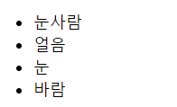
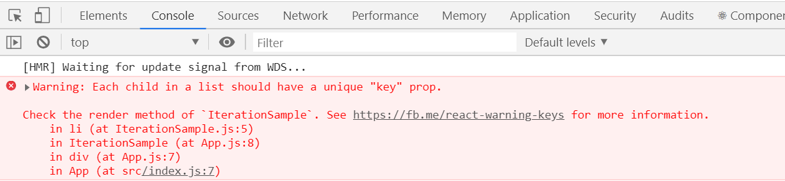
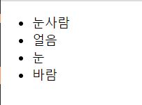
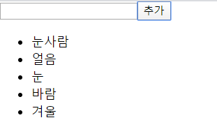
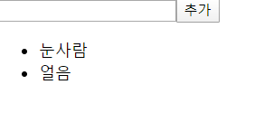

# 컴포넌트 반복 


## 6.1 자바스크립트 배열의 map() 함수 

- 자바스크립트 배열 객체의 내장 함수인 map 함수를 사용하여 반복되는 컴포넌트를 렌더링 할 수 있다.
- map 함수는 파라미터로 전달된 함수를 사용해서 배열 내 각 요소를 원하는 규칙에 따라 변환한 후 그 결과로 새로운 배열을 생성한다.  


### 6.1.1 문법 

```jsx
arr.map(callback, [thisArg])
```

- `callback` : 새로운 배열의 요소를 생성하는 함수로 파라미터는 아래 3가지이다. 
  - `currentValue` : 현재 처리하고 있는 요소 
  - `index` : 현재 처리하고 있는 요소의 index 값 
  - `array` : 현재 처리하고 있는 원본 배열 
- `thisArg` : ( 선택항목 ) callback 함수 내부에서 사용할 this 레퍼런스 


### 6.1.2 예제 

- map 함수를 사용하여 배열 [1,2,3,4,5] 의 각 요소를 제곱해서 새로운 배열을 생성하겠다. 

  ```jsx
  var numbers = [1,2,3,4,5]; 
  var processed = numbers.map(function(num){
      return num*num;
  })
  
  console.log(processed); 
  ```

  ​																				▼ ( ES6 문법으로)

  ```jsx
  const numbers = [1,2,3,4,5]; 
  const result = numbers.map( num => num*num );
  console.log(result); 
  ```

  

## 6.2 데이터 배열을 컴포넌트 배열로 변환하기 

### 6.2.1 컴포넌트 수정하기 

```jsx
import React from "react";

const IterationSample = () => {
  const names = ["눈사람", "얼음", "눈", "바람"];
  const nameList = names.map(name => <li>{name}</li>);

  return <ul>{nameList}</ul>;
};

export default IterationSample;
```


### 6.2.2 App 컴포넌트에서 예제 컴포넌트 렌더링 





위와 같이 "key" prop 이 없다는 경고 메시지가 뜬다. 


## 6.3 key 

- 컴포넌트 배열을 렌더링했을 때 어떤 원소에 변동이 있었는지 알아내기 위해 key 를 사용한다. 


### 6.3.1 key 설정 

- key 값을 설정할 때는 map 함수의 인자로 전달되는 함수 내부에서 컴포넌트 props 를 설정하듯이 설정하면 된다. 
-  key 값은 언제나 유일해야한다.  따라서 데이터가 가진 고유값을 key 값으로 설장해야 한다. 
- 고유번호가 없을 경우에는 map 함수에 전달되는 콜백함수의 인수의 index 값을 key 값으로 사용하면 된다. 

```jsx
// IterationSample.js 
import React from "react";

const IterationSample = () => {
  const names = ["눈사람", "얼음", "눈", "바람"];
  const nameList = names.map((name, index) => <li key={index}>{name}</li>);

  return <ul>{nameList}</ul>;
};

export default IterationSample;
```


## 6.4 응용 

- 동적인 배열을 렌더링 하는 것을 구현하는 실습 

### 6.4.1 초기 상태 설정하기 

- IterationSample 컴포넌트에서 useState 를 사용하여 상태를 설정하겠다. 세가지 상태를 사용하는데 하나는 데이터 배열이고 다른 하나는 텍스트를 입력할 수 있는 input의 상태, 그리고 마지막 하나는 데이터 배열에서 새로운 항목을 추가할 때 사용할 고유 id 를 위한 상태. 

  ```jsx
  import React, { useState } from "react";
  
  const IterationSample = () => {
    const [names, setNames] = useState([
      { id: 1, text: "눈사람" },
      { id: 2, text: "얼음" },
      { id: 3, text: "눈" },
      { id: 4, text: "바람" }
    ]);
    const [inputText, setInputText] = useState("");
    const [nextId, setNextId] = useState(5); // 새로운 항복을 추가할 떄 사용하는 id
  
    const nameList = names.map(name => <li key={name.id}> {name.text} </li>);
  
    return <ul>{nameList}</ul>;
  };
  
  export default IterationSample;
  ```

  


### 6.4.2 데이터 추가 기능 구현하기 

```jsx
// IterationSample.js 
import React, { useState } from "react";

const IterationSample = () => {
  const [names, setNames] = useState([
    { id: 1, text: "눈사람" },
    { id: 2, text: "얼음" },
    { id: 3, text: "눈" },
    { id: 4, text: "바람" }
  ]);
  const [inputText, setInputText] = useState("");
  const [nextId, setNextId] = useState(5); // 새로운 항복을 추가할 떄 사용하는 id

  const onChange = e => {
    setInputText(e.target.value);
  };
  const onClick = () => {
    const nextNames = names.concat({
      id: nextId,
      text: inputText
    });
    setNextId(nextId + 1); // nextId 값에 1을 더해준다
    setNames(nextNames); // names 값을 업데이트한다
    setInputText(""); // inputText를 비운다
  };

  const nameList = names.map(name => <li key={name.id}> {name.text} </li>);

  return (
    <>
      <input value={inputText} onChange={onChange} />
      <button onClick={onClick}> 추가 </button>
      <ul> {nameList} </ul>
    </>
  );
};

export default IterationSample;
```

- `push` 함수는 기존 배열 자체를 변경해주지만, `concat` 함수는 새로운 배열을 만들엊2ㅜㄴ다. 

  


### 6.4.3 데이터 제거 기능 구현하기 

- 각 항목을 더블클릭했을 때 해당 항목이 화면에서 사라지는 기능을 구현 ( 불변성을 유지하면서 업데이트 해줘야 한다 ) 

- 불변성을 유지하면서 배열의 특정항목을 지울 때는 배열의 내장함수 `filter` 를 사용한다. 

  ```jsx
  // filter 사용 예시 
  const numbers = [1,2,3,4,5,6]; 
  const biggerThanThree = numbers.filter(number => number > 3);  //결과 : [4,5,6]
  ```

  

```jsx
import React, { useState } from "react";

const IterationSample = () => {
  const [names, setNames] = useState([
    { id: 1, text: "눈사람" },
    { id: 2, text: "얼음" },
    { id: 3, text: "눈" },
    { id: 4, text: "바람" }
  ]);
  const [inputText, setInputText] = useState("");
  const [nextId, setNextId] = useState(5); // 새로운 항복을 추가할 떄 사용하는 id

  const onChange = e => {
    setInputText(e.target.value);
  };
  const onClick = () => {
    const nextNames = names.concat({
      id: nextId,
      text: inputText
    });
    setNextId(nextId + 1); // nextId 값에 1을 더해준다
    setNames(nextNames); // names 값을 업데이트한다
    setInputText(""); // inputText를 비운다
  };

  const onRemove = id => {
    const nextNames = names.filter(name => name.id !== id);
    setNames(nextNames);
  };

  const nameList = names.map(name => (
    <li key={name.id} onDoubleClick={() => onRemove(name.id)}>
      {name.text}
    </li>
  ));

  return (
    <>
      <input value={inputText} onChange={onChange} />
      <button onClick={onClick}> 추가 </button>
      <ul> {nameList} </ul>
    </>
  );
};

export default IterationSample;

```

