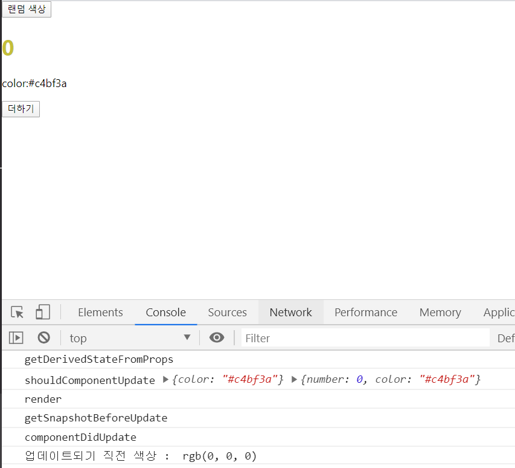
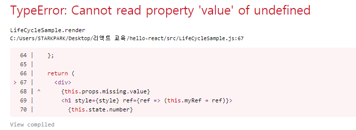

# 컴포넌트의 라이프사이클 메서드 

- 모든 리액트 컴포넌트에는 라이프사이클이 존재한다

- 컴포넌트의 수명은 페이지에 렌더링되기 전인 준비과정에서 시작하여 페이지에서 사라질 때 끝난다.

- 라이프사이클 메서드는 클래스형 컴포넌트에서만 사용할 수 있다. ( 함수형 컴포넌트에서는 사용할 수 없지만 Hooks 기능을 사용하여 비슷한 작업을 처리할 수 있다. )

  

## 7.1 라이프사이클 메서드의 이해 

- 라이프사이클의 메서드의 종류는 총 9가지이다. 
- `Will` 접두사가 붙은 메서드는 어떤 작업을 작동하기 **전**에 실행되는 메서드 
- `Did` 접두사가 붙은 메서드는 어떤 작업을 작동한 **후**에 실행되는 메서드 
- 라이프사이클은 총 3가지 카테고리로 나눈다. 
  - **마운트** : DOM 이 생성되고 웹 브라우저상에 나타나는 것

```
// 마운트할 때 호출하는 메서드 

컴포넌트만들기 -> constructor -> getDerivedStateFromProps -> render -> componenetDidMount
```

- `constructor` : 컴포넌트를 새로 만들 때마다 호출되는 클래스 생성자 메서드 

- `getDerivedStateFromProps`  : props 에 있는 값을 state 에 넣을 때 사용하는 메서드 

- `render` : 우리가 준비한 UI 를 렌더링하는 메서드 

- `componenetDidMount` : 컴포넌트가 웹 브라우저상에 나타난 후 호출하는 메서드 

  

  

  - **업데이트** 

    컴포넌트는 다음과 같은 4가지 경우에 업데이트 한다. 

    1. props 가 바뀔 때 
    2. state 가 바뀔 때 
    3. 부모 컴포넌트가 리렌더링될 때
    4. this.forceUpdate로 강제로 렌더링을 트리거할 때 

    

    ​															**업데이트 할 때 호출하는 메서드** 

    

- `getDerivedStateFromProps` : 마운트 과정에서도 호출되며, 업데이트가 시작하기 전에도 호출된다. 

  props 의 변화에 따라 state 값에도 변화를 주고 싶을 때 사용. 

- `shouldComponentUpdate` : 컴포넌트가 리렌더링을 해야할지 말아야할지를 결정하는 메서드. 

  true 를 반환하면 다음 라이프사이클 메서드를 계속 실행하고, false 를 반환하면 작업을 중지한다. ( 즉 컴포넌트가 리렌더링되지 않는다. )

  만약 특정 함수에서 `this.forceUpdate()` 함수를 호출한다면 이 과정을 생략하고 바로 render 함수를 호출한다. 

- `render` : 컴포넌트를 리렌더링한다 

- `getSnapshotBeforeUpdate` : 컴포넌트 변화를 DOM 에 반영하기 바로 직전에 호출하는 메서드 

- `componentDidUpdate` : 컴포넌트의 업데이트 작업이 끝난 후 호출하는 메서드 

  

  

  - **언마운트** : 마운트의 반대과정으로서, 컴포넌트를 DOM 에서 제거하는 것

    ​													

    ​															**언마운트할 때 호출하는 메서드**

    

- `componentWillUnmount` : 컴포넌트가 웹 브라우저상에서 사라지기 전에 호출하는 메서드 


## 7.2 라이프사이클 메서드 살펴보기 

### 7.2.1 render() 함수 

- 라이프사이클 메서드 중 유일한 필수 메서드 
- 이 메서드 안에서 this.props 와 this.state 에 접근할 수 있으며 리액트 요소를 반환한다. 요소는 div 와 같은 태그가 될 수도 있고, 따로 선언한 컴포넌트가 될 수 있다. 그리고 아무것도 보여주고 싶지 않다면 null 값이나 false 값을 반환한다. 
- **주의사항**
  - 이 메서드 안에서 이벤트 설정이 아닌 곳에서 setState 를 사용하면 안되며, 브라우저의 DOM에 접근해서도 안된다.  만약 DOM 정보를 가져오거나 state 에 변화를 줄 때는 componentDidMount 에서 처리해야한다. 


### 7.2.2 constructor 메서드 

- 컴포넌트의 생성자 메서드로 컴포넌트를 만들 때 처음으로 실행되며, 초기 state 를 정할 수 있다. 


### 7.2.3 getDerivedStateFromProps 메서드 

- 리액트v16.3 이후에 새로 만든 라이프사이클 메서드

- props 로 받아온 값을 state 에 동기화시키는 용도로 사용하며, 컴포넌트가 마운트될 때와 업데이트 될 때 호출된다. 

  ```jsx
  static getDerivedStateFromProps(nextProps, prevState){
      if(nextProps.value !== prevState.value){ // 조건에 따라 특정 값을 동기화
          return {value : nextProps.value}; 
      }
      return null; // state 를 변경할 필요가 없다면 null 반환 
  }
  ```


### 7.2.4 componentDidMount 메서드 

- 컴포넌트를 만들고 첫 렌더링을 다 마친 후 실행한다. 
- 이 안에서 다른 자바스크립트 라이브러리 또는 프레임워크의 함수를 호출하거나 이벤트 등록, setTimeout, setInterval, 네트워크 요청 같은 비동기 작업을 처리한다. 


### 7.2.5 shouldComponentUpdate 메서드 

- props 또는 state 를 변경했을 때, 리렌더링을 시작할지 여부를 지정하는 메서드
- 컴포넌트를 만들 때 이 메서드를 따로 생성하지 않으면 기본적으로 언제나 true 를 반환 
- 이 메서드가 fasle 를 반환한다면 업데이트 과정은 여기서 중지한다. 
- 이 메서드 안에서 현재 props 와 state 는 this.props 와 this.state 로 접근하고, 새로 설정될 props 또는 state 는 nextProps 와 next State 로 접근할 수 있다. 
- 프로젝트 성능을 최적화할 때 , 상황에 맞는 알고리즘을 작성하여 리렌더링을 방지할 때는 false 값을 반환하게 한다. 


### 7.2.6 getSnapshotBeforeUpdate 메서드 

- 리액트 v16.3 이후에 만들어진 메서드 

- 이 메서드는 render 에서 만들어진 결과물이 브라우저에 실제로 반영되기 직전에 호출된다. 

- 메서드에서 반환하는 값은 componentDidMount 에서 세 번째 파라미터인 snapshot 값으로 전달받을 수 있다. 

- 주로 업데이트 하기 직전의 값을 참고할 일이 있을 때 활용 ( ex _ 스크롤바 위치 유지 )

  ```jsx
  getSnapshotBeforeUpdate(prevProps, prevState){
      if(prevState.array !== this.state.array){
          const { scrollTop, scrollHeight } = this.list 
          return { scrollTop, scrollHeight };
      }
  }
  ```

  

### 7.2.7 componentDidUpdate 메서드 

- 리렌더링을 완료한 후 실행 
- 업데이트가 끝난 직후이므로, DOM 관련 처리를 해도 무방하다. 
- 이 메서드에서는 prevProps 또는 prevState 를 사용하여 컴포넌트가 이전에 가졌던 데이터에 접근할 수 있다. 
- getSnapshotBeforeUpdate 에서 반환한 값이 있다면 여기서 snapshot 값을 전달받을 수 있다. 


### 7.2.8 componentWillUnmount 메서드 

- 컴포넌트를 DOM 에서 제거할 때 실행. 
- componentDidMount 에서 등록한 이벤트, 타이머, 직접 생성한 DOM 이 있따면 제거 작업을 해야한다. 


### 7.2.9 componentDidCatch 메서드 

- 리액트 v16 에서 새롭게 도입된 메서드

- 컴포넌트 렌더링 도중에 에러가 발생했을 때 애플리케이션이 먹통이 되지않고 오류 UI 를 보여줄 수 있게 한다.

  ```jsx
  componentDidCatch(error, info){
      this.setState({
          error:true
      });
      console.log({error, info}); 
  }
  ```

  - `error` : 파라미터에 어떤 에러가 발생했는지 알려준다
  - `info` : 파라미터는 어디에 있는 코드에서 오류가 발생했는지에 대한 정보를 준다. 

- 이 메서드를 사용할 때는 컴포넌트 자신에게 발생하는 에러를 잡아낼 수 없고 자신의 this.props.children 으로 전달되는 컴포넌트에서 발생하는 에러만 잡아낼 수 있다. 

  

## 7.3 라이프사이클 메서드 사용하기 


### 7.3.1 예제 컴포넌트 생성

```jsx
// LifeCycleSample.js 

import React, { Component } from "react";

class LifeCycleSample extends Component {
  state = {
    number: 0,
    color: null
  };

  myRef = null; // ref 를 설정할 부분

  constructor(props) {
    super(props);
    console.log("constructor");
  }

  static getDerivedStateFromProps(nextProps, prevState) {
    console.log("getDerivedStateFromProps");
    if (nextProps.color !== prevState.color) {
      return { color: nextProps.color };
    }
    return null;
  }

  componentDidMount() {
    console.log("componentDidMount");
  }

  shouldComponentUpdate(nextProps, nextState) {
    console.log("shouldComponentUpdate", nextProps, nextState);
    // 숫자의 마지막 자리가 4면 리렌더링하지 않는다
    return nextState.number % 10 !== 4;
  }

  componentWillUnmount() {
    console.log("componentWillUnmount");
  }

  handleClick = () => {
    this.setState({
      number: this.state.number + 1
    });
  };

  getSnapshotBeforeUpdate(prevProps, prevState) {
    console.log("getSnapshotBeforeUpdate");
    if (prevProps.color !== this.props.color) {
      return this.myRef.style.color;
    }
    return null;
  }

  componentDidUpdate(prevProps, prevState, snapshot) {
    console.log("componentDidUpdate");
    if (snapshot) {
      console.log("업데이트되기 직전 색상 : ", snapshot);
    }
  }

  render() {
    console.log("render");

    const style = {
      color: this.props.color
    };

    return (
      <div>
        <h1 style={style} ref={ref => (this.myRef = ref)}>
          {this.state.number}
        </h1>
        <p>color:{this.state.color}</p>
        <button onClick={this.handleClick}>더하기</button>
      </div>
    );
  }
}

export default LifeCycleSample;
```


### 7.3.2 App 컴포넌트에서 예제 컴포넌트 사용 

```jsx
import React, { Component } from "react";
import LifeCycleSample from "./LifeCycleSample";

function getRandomColor() {
  return "#" + Math.floor(Math.random() * 16777215).toString(16);
}

class App extends Component {
  state = {
    color: "#000000"
  };

  handleClick = () => {
    this.setState({
      color: getRandomColor()
    });
  };

  render() {
    return (
      <div>
        <button onClick={this.handleClick}>랜덤 색상</button>
        <LifeCycleSample color={this.state.color} />
      </div>
    );
  }
}
export default App;
```


- LifeCycleSample 컴포넌트의 첫 렌더링 

  


- 랜덤 색상 버튼 클릭 후 나타난 결과 

  

- 더하기 버튼 클릭 후 나타난 결과 

  

- 마지막 자리수가 4일 때의 업데이트 취소 결과 

  

  ​														`			render` 이후가 없음을 확인할 수 있다. 


### 7.3.3 에러 잡아내기 

- 방금 만든 LifeCycleSample 컴포넌트의 render 함수에서 의도적으로 에러 한번 발생

  ( render 함수에스는 존재하지 않는 함수를 사용하려하거나 존재하지 않는 객체의 값을 조회할때 발생 )

  ```jsx
  // LifeCycleSample.js 의 render 부분 
  
  render() {
      console.log("render");
  
      const style = {
        color: this.props.color
      };
  
      return (
        <div>
          {this.props.missing.value} // 존재하지 않는 props 의 missing 객체 
          <h1 style={style} ref={ref => (this.myRef = ref)}>
            {this.state.number}
          </h1>
          <p>color:{this.state.color}</p>
          <button onClick={this.handleClick}>더하기</button>
        </div>
      );
    }
  ```

  


​			개발자 화면이 아닐 경우에는 에러 화면이 아닌 이렇게 흰색 화면만 보인다 . 따라서 사용자가 웹 서비스를 실제로 사용할 때 에러가 발생하는 경우 사용자에게 에러가 발생했음을 인지시켜줘야한다. 


```jsx
// ErrorBoundary.js 

import React, { Component } from 'react';

class ErrorBoundary extends Component {
    state = {
        error : false 
    }

    componentDidCatch(error, info){
        this.setState({
            error : true
        }); 
        console.log({error, info}); 
    }

    render() {
        if(this.state.error) return <div> 에러가 발생했습니다! </div>
        return this.props.children; 
    }
}

export default ErrorBoundary;
```

에러가 발생하면 componentDidCatch 메서드가 호출되며 이 메서드는 this.state.error 값을 true 로 업데이트 해준다. 

```
// App.js
import React, { Component } from "react";
import LifeCycleSample from "./LifeCycleSample";
import ErrorBoundary from "./ErrorBoundary";

function getRandomColor() {
  return "#" + Math.floor(Math.random() * 16777215).toString(16);
}

class App extends Component {
  state = {
    color: "#000000"
  };

  handleClick = () => {
    this.setState({
      color: getRandomColor()
    });
  };

  render() {
    return (
      <div>
        <button onClick={this.handleClick}>랜덤 색상</button>
        <ErrorBoundary>
          <LifeCycleSample color={this.state.color} />
        </ErrorBoundary>
      </div>
    );
  }
}
export default App;
```

ErrorBoundary 컴포넌트로 LifeCycleSample 컴포넌트를 감싸준다. 


