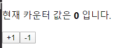
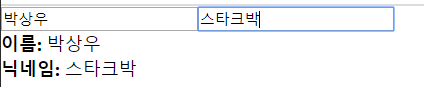
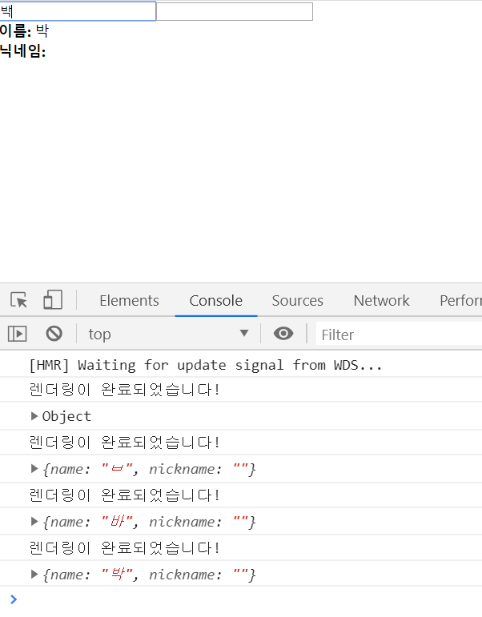
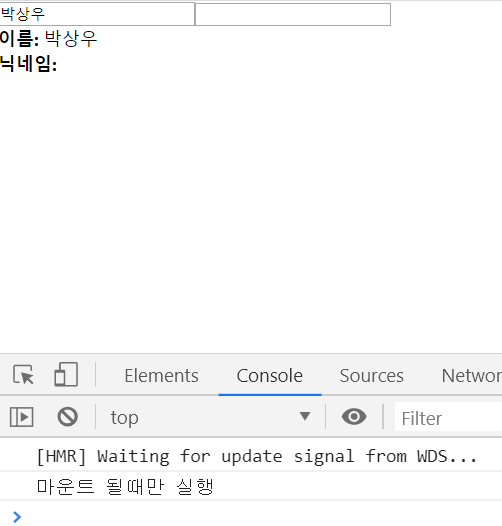
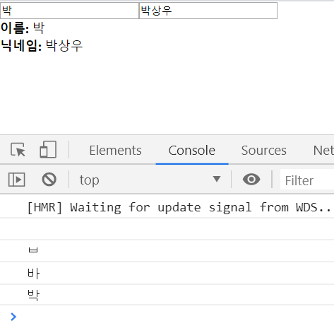
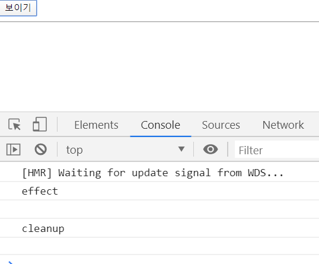
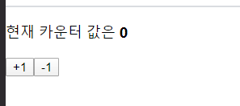
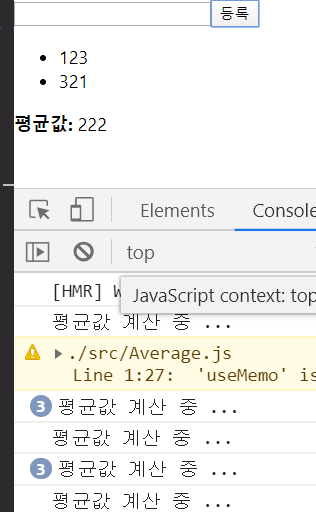
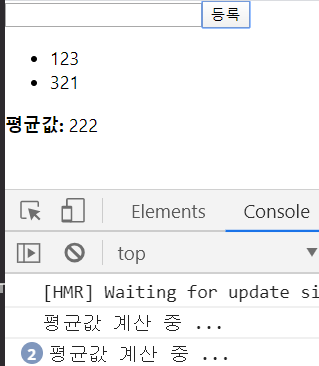
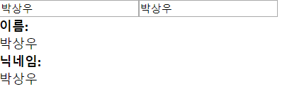

# Hooks 

- Hooks 는 리액트 v16.8 에 새로 도입된 기능으로 함수형 컴포넌트에서도 상태 관리를 할 수 있는 useState, 렌더링 지궇 작업을 설정하는 useEffect 등의 기능을 제공하여 기존의 함수형 컴포넌트에서 할 수 없었던 다양한 작업을 할 수 있게 해준다. 

  

## 8.1 useState 

- 가장 기본적인 Hook 으로, 함수형 컴포넌트에서도 가변적인 상태를 지닐 수 있게 해준다. 

  ```jsx
  import React, {useState} from "react";
  
  const Counter = () => {
    const [value, setValue] = useState(0);
  
    return (
      <div>
        <p>
          현재 카운터 값은 <b>{value}</b> 입니다.
        </p>
        <button onClick={() => setValue(value + 1)}>+1</button>
        <button onClick={() => setValue(value - 1)}>-1</button>
      </div>
    );
  };
  
  export default Counter;
  ```
  
  `useState` 함수의 파라미터에는 상태의 기본값을 넣어준다. 이 함수가 호출되면 배열을 반환하는데 배열의 첫번째 원소는 상태값, 두번째 원소는 상태를 설정하는 함수다. 




### 8.1.1 useState 를 여러 번 사용하기 

- 하나의 useState 함수는 하나의 상태 값만 관리할 수 있다. 

- 컴포넌트에서 관리해야할 상태가 여러개라면 useState 를 여러 번 사용하면 된다. 

  ```jsx
  // Info.js 
  import React, { useState } from "react";
  
  const Info = () => {
    const [name, setName] = useState("");
    const [nickname, setNickname] = useState("");
  
    const onChangeName = e => {
      setName(e.target.value);
    };
  
    const onChangeNickName = e => {
      setNickname(e.target.value);
    };
  
    return (
      <>
        <div>
          <input value={name} onChange={onChangeName} />
          <input value={nickname} onChange={onChangeNickName} />
        </div>
        <div>
          <div>
            <b>이름:</b> {name}
          </div>
          <div>
            <b>닉네임:</b> {nickname}
          </div>
        </div>
      </>
    );
  };
  
  export default Info;
  ```

  


## 8.2 useEffect 

- useEffect 는 리액트 컴포넌트가 **렌더링될 때마다 특정 작업을 수행**하도록 설정할 수 있는 Hook 

- 클래스형 컴포넌트의 componentDidMount 와 componentDidUpdate 를 합친 형태로 봐도 무방

  ```jsx
  const Info = () => {
    const [name, setName] = useState("");
    const [nickname, setNickname] = useState("");
  
    useEffect(() => {
      console.log("렌더링이 완료되었습니다!");
      console.log({
        name,
        nickname
      });
    });
  
    return (
  		.....
    );
  };
  ```

  

  


### 8.2.1 마운트될 때만 실행하고 싶을 때 

- useEffect 에서 설정한 함수를 컴포넌트가 화면에 맨 처음 렌더링 될때만 실행하고, 업데이트될 때는 실행하지 않으려면 함수의 두번째 파라미터로 비어있는 배열을 넣어주면 된다. 

  ```jsx
  // Info.js - useEffect
  useEffect( ()=>{
      console.log('마운트될 때만 실행됩니다.');
  }, []);
  ```

  


### 8.2.2 특정 값이 업데이트될 때만 실행하고 싶을 때 

- useEffect 의 두번째 파라미터로 전달되는 배열 안에 검사하고 싶은 값을 넣어주면 된다. 

  ```jsx
  // Info.js - useEffect
  useEffect( ()=>{
      console.log(name);
  }, [name]);
  ```

  

### 8.2.3 뒷정리하기 

- useEffect 는 기본적으로 **렌더링되고 난 직후**마다 실행되며, 두 번째 파라미터 배열에 무엇을 넣는지에 따라 실행되는 조건이 달라진다. 

- 컴포넌트가 언마운트되기 전이나 업데이트되기 직전에 어떠한 작업을 수행하고 싶다면 useEffect 에서 뒷정리 함수를 반환해줘야한다. 

  ```jsx
  // Info.js - useEffect
  useEffect(() => {
      console.log("effect");
      console.log(name);
      return () => {
        console.log("cleanup");
        console.log(name);
      };
    });
  ```

  ```jsx
  // App.js 
  import React, { useState } from "react";
  import Info from "./Info";
  
  const App = () => {
    const [visible, setVisible] = useState(false);
  
    return (
      <div>
        <button
          onClick={() => {
            setVisible(!visible);
          }}
        >
          {" "}
          {visible ? "숨기기" : "보이기"}{" "}
        </button>
        <hr />
        {visible && <Info />}
      </div>
    );
  };
  
  export default App;
  ```

  

  컴포넌트가 나타날 때 콘솔에 effect 가 나타나고, 사라질때는 cleanup이 나타난다. 

- 오직 언마운트될때만 뒷정리 함수를 호출하고 싶다면 useEffect 함수의 두번째 파라미터에 비어있는 배열을 넣으면 된다. 

  ```jsx
  // Info.js - useEffect
  useEffect(() => {
      console.log("effect");
      console.log(name);
      return () => {
        console.log("cleanup");
        console.log(name);
      };
    }, [name]);
  ```

  

## 8.3 useReducer 

- useState 보다 더 다양한 컴포넌트 상황에 따라 다양한 상태를 다른 값으로 업데이트해 주고 싶을 때 사용하는 Hook. 

- 리듀서는 현재 상태, 그리고 업데이트를 위해 필요한 정보를 담은 액션 값을 전달받아 새로운 상태를 반환하는 함수 

- 리듀서 함수에서 새로운 상태를 만들 때는 반드시 불변성을 지켜주어야한다.

  ```jsx
  function reducer(state, action){
      return {...}; // 불변성을 지키면서 업데이트한 새로운 상태를 반환 
  }
  ```

  액션값은 주로 다음과 같은 형태 

  ```jsx
  {
      type : 'INCREMENT', 
      // 다른 값이 필요하다면 추가로 들어간다 . 
  }
  ```

- useReducer 에서 사용하는 액션 객체는 반드시 type 을 지니고 있을 필요가 없으며, 심지어 객체가 아니라 문자열이나 숫자여도 상관 없다. 


### 8.3.1 카운터 구현하기 

```jsx
// Counter.js 
import React, { useReducer } from "react";

function reducer(state, action) {
  // action.type 에 따라 다른 작업 수행
  switch (action.type) {
    case "INCREMENT":
      return { value: state.value + 1 };
    case "DECREMENT":
      return { value: state.value - 1 };
    default:
      // 아무것도 해당되지 않을 때 기존 상태 반환
      return state;
  }
}

const Counter = () =>{ 
  const [state, dispatch] = useReducer(reducer, {value : 0}); 

  return (
    <div>
      <p>현재 카운터 값은 <b>{state.value}</b></p>
      <button onClick = {()=>dispatch({type:'INCREMENT'})}>+1</button>
      <button onClick = {()=>dispatch({type:'DECREMENT'})}>-1</button>
    </div>
  );
}
```

- useReducer 의 첫번째 파라미터에는 리듀서함수를 넣고 두번째 파라미터에는 해당 리듀서의 기본값을 넣어준다. 

- state 는 현재 가리키고 있는 상태고 dispatch 는 액션을 발생시키는 함수.  

- dispatch(action) 과 같은 형태로, 함수 안에 파라미터로 액션 값을 넣어주면 리듀서 함수가 호출되는 구조. 

- useReducer 를 사용했을 때의 가장 큰 장점은 컴포넌트 업데이트 로직을 컴포넌트 바깥으로 빼낼 수 있다는 것이다. 

  


### 8.3.2 인풋 상태 관리하기 

- useReducer 를 사용하면 기존에 클래스형 컴포넌트에서 input 태그에 name 값을 할당하고 e.target.name을 참조하여 setState 를 해준것과 유사한 방식으로 작업을 처리할 수 있다. 

  ```jsx
  // Info.js 
  import React, { useReducer } from "react";
  
  function reducer(state, action){
      return {
          ...state, 
          [action.name]:action.value
      }
  }
  
  const Info = () => {
    const [state, dispatch] = useReducer(reducer, {
        name:'', 
        nickname:''
    })
  
    const {name, nickname } = state; 
    
    const onChange = e =>{ 
        dispatch(e.target); 
    }
  
    return (
        <>
          <div>
              <input name="name" value={name} onChange ={onChange} />
              <input name="nickname" value={nickname} onChange={onChange} />
          </div>
          <div>
              <div><b>이름:</b></div>{name}
          </div>
          <div>
              <div><b>닉네임:</b></div>{nickname}
          </div>
        </>
    );
  };
  
  export default Info;
  ```

  - useReducer 에서의 액션은 그 어떤 값도 사용 가능하다.  그래서 이번에는 이벤트 객체가 지니고 있는 e.target 값 자체를 액션값으로 사용했다. 


## 8.4 useMemo

- useMemo 를 사용하면 함수형 컴포넌트 내부에서 발생하는 연산을 최적화할수있다. 

  ```jsx
  // 리스트에 숫자를 추가하면 추가된 숫자들의 평균을 보여주는 함수형 컴포넌트 
  // Average.js 
  import React, { useState } from "react";
  
  const getAverage = numbers => {
    console.log("평균값 계산 중 ...");
    if (numbers.length === 0) return 0;
    const sum = numbers.reduce((a, b) => a + b);
    return sum / numbers.length;
  };
  
  const Average = () => {
    const [list, setList] = useState([]);
    const [number, setNumber] = useState("");
  
    const onChange = e => {
      setNumber(e.target.value);
    };
  
    const onInsert = e => {
      const nextList = list.concat(parseInt(number));
      setList(nextList);
      setNumber("");
    };
  
    return (
      <div>
        <input value={number} onChange={onChange} />
        <button onClick={onInsert}>등록</button>
        <ul>
          {list.map((value, index) => (
            <li key={index}> {value} </li>
          ))}
        </ul>
        <div>
          <b>평균값:</b> {getAverage(list)}
        </div>
      </div>
    );
  };
  
  export default Average;
  ```

  

  위의 코드는 인풋 내용이 수정될때도 getAverage 함수가 호출된다. 

  ​																		▼ ( useMemo 를 이용해 최적화 )

  ```jsx
  // 아래 avg 코드 추가 및 {avg} 변경 
  
  const avg = useMemo(() => getAverage(list), [list]);  // !!
  
  return (
      <div>
          <input value={number} onChange={onChange} />
          <button onClick={onInsert}>등록</button>
          <ul>
              {list.map((value, index) => (
                  <li key={index}> {value} </li>
              ))}
          </ul>
          <div>
              <b>평균값:</b> {avg}		// !!
          </div>
      </div>
  ```

  

  list 내용이 바뀔 때만 getAverage 함수가 호출된다. 


## 8.5 useCallback

- useMemo 와 유사한 함수로, 주로 렌더링 성능을 최적화해야하는 상황에 사용. 

- 이 Hook 을 사용하면 이벤트 핸들러 함수를 필요할 때만 생성할 수 있다.

- 8.4 에서 구현한 Average 컴포넌트는 onChange 와 onInsert  가 리렌더링 될 때마다 함수들이 새로 생성되는데, 이러한 경우 컴포넌트의 렌더링이 자주 발생하거나 렌더링 해야할 컴포넌트의 개수가 많아질 경우 최적화를 해줘야한다. 

  ```jsx
  // Average.js 
  import React, { useState, useMemo, useCallback } from "react";
  
  const getAverage = numbers => {
    console.log("평균값 계산 중 ...");
    if (numbers.length === 0) return 0;
    const sum = numbers.reduce((a, b) => a + b);
    return sum / numbers.length;
  };
  
  const Average = () => {
    const [list, setList] = useState([]);
    const [number, setNumber] = useState("");
  
    const onChange = useCallback(e => {
      setNumber(e.target.value);
    }, []);   // 컴포넌트가 처음 렌더링될 때만 함수 생성 
  
    const onInsert = useCallback(e => {
      const nextList = list.concat(parseInt(number));
      setList(nextList);
      setNumber("");
    }, [number,list]);  // number 혹은 list 가 바뀌었을 때만 함수 생성 
  
    const avg = useMemo(() => getAverage(list), [list]);
  
    return (
      <div>
        <input value={number} onChange={onChange} />
        <button onClick={onInsert}>등록</button>
        <ul>
          {list.map((value, index) => (
            <li key={index}> {value} </li>
          ))}
        </ul>
        <div>
          <b>평균값:</b> {avg}
        </div>
      </div>
    );
  };
  
  export default Average;
  ```

  - useCallback 의 첫번째 파라미터에는 생성하고 싶은 함수를 넣고, 두번째 파라미터에는 배열을 넣으면 된다. 이 배열에는 어떤 값이 바뀌었을 때 함수를 새로 생성해야하는지 명시해야한다. 

  - 만약 비어있는 배열을 넣게 되면 컴포넌트가 렌더링될 때 단 한번만 함수가 생성되고, 

    number와 list 를 넣게 되면 인풋 내용이 바뀌거나 새로운 항복이 추가될때마다 함수가 생성된다. 

  - 함수 내부에서 상태값에 의존해야 할 때는 그 값을 반드시 두번째 파라미터 안에 포함시켜 주어야한다. 

  - useCallback 은 useMemo 로 함수를 반환하는 상황에서 더 편하게 사용할 수 있는 Hook 

    숫자, 문자열, 객체처럼 일반 값을 재사용하려면 useMemo 를 사용

    함수를 재사용하려면 useCallback 사용 

    ```jsx
    // 아래 두 코드는 동일한 코드 
    useCallback( ()=>{
    	console.log('hello world');
    },[]); 
    
    useMemo( () => {
    	const fn = () =>{ 
    		console.log('hello world'); 
    	};
    	return fn;
    }, [])
    ```

    


## 8.6 useRef 

- useRef Hook 은 함수형 컴포넌트에서 ref 를 쉽게 사용할 수 있도록 해준다. 

  ```jsx
  // Average 컴포넌트에서 등록 버튼을 눌렀을 때 포커스가 인풋 쪽으로 넘어가도록 코드 작성 
  import React, { useState, useMemo, useCallback, useRef } from "react";
  
  const getAverage = numbers => {
    console.log("평균값 계산 중 ...");
    if (numbers.length === 0) return 0;
    const sum = numbers.reduce((a, b) => a + b);
    return sum / numbers.length;
  };
  
  const Average = () => {
    const [list, setList] = useState([]);
    const [number, setNumber] = useState("");
    const inputEl = useRef(null);  // 이부분 추가 
  
    const onChange = useCallback(e => {
      setNumber(e.target.value);
    }, []); // 컴포넌트가 처음 렌더링될 때만 함수 생성
  
    const onInsert = useCallback(
      e => {
        const nextList = list.concat(parseInt(number));
        setList(nextList);
        setNumber("");
        inputEl.current.focus(); // 이부분 추가 
      },
      [number, list]
    ); // number 혹은 list 가 바뀌었을 때만 함수 생성
  
    const avg = useMemo(() => getAverage(list), [list]);
  
    return (
      <div>
        <input value={number} onChange={onChange} ref={inputEl} /> // 이부분 추가 
        <button onClick={onInsert}>등록</button>
        <ul>
          {list.map((value, index) => (
            <li key={index}> {value} </li>
          ))}
        </ul>
        <div>
          <b>평균값:</b> {avg}
        </div>
      </div>
    );
  };
  
  export default Average;
  
  ```


### 8.6.1 로컬 변수 사용하기 

- 컴포넌트 로컬 변수를 사용해야할 때도 useRef 를 활용할 수 있다. 

  ( 로컬변수란 렌더링과 상관없이 바뀔 수 있는 값을 의미 )

  ```jsx
  // 클래스 형태로 작성된 컴포넌트의 경우에는 로컬 변수를 사용해야 할 때 다음과 같이 작성할 수 있다. 
  
  import React, {Component} from 'react'; 
  
  class MyComponent extends Component{ 
  	id = 1
      setId = (n) =>{
          this.id = n; 
      }
      printId = () =>{
          console.log(this.id); 
      }
      
      render(){
          return(
          	<div>
              	MyComponent
              </div>
          );
      }
  }
  ```

  ​																						▼ ( 함수형 컴포넌트로 )

  ```jsx
  import React, {useRef} from 'react'; 
  
  const RefSample = () =>{ 
  	const id = useRef(1); 
      const setId = (n) =>{ 
      	id.current = n; 
      }
      const printId = () =>{
          console.log(id.current); 
      }
      
      return (
      <div>
        refSample  
      </div>
      );
  }
  ```

  이렇게 ref 안의 값이 바뀌어도 컴포넌트가 렌더링 되지 않는다는 점에 주의해야한다 !! 

  따라서 렌더링과 관련되지 않은 값을 관리할 때만 이러한 방식으로 코드를 작성


## 8.7 커스텀 Hooks 만들기 

- 여러 컴포넌트에서 비슷한 기능을 공유할 경우, 우리들만의 Hook 으로 작성하여 로직을 재사용할 수 있다. 


- 기존의 Info 컴포넌트에서 여러 개의 인풋을 관리하기 위해 useReducer 로 작성했던 로직을 useInputs 라는 Hook 으로 따로 분리해보겠다.

  ```jsx
  // useInputs.js 
  import {useReducer} from 'react'; 
  
  function reducer(state, action){
      return {
          ...state, 
          [action.name] : action.value
      }
  }
  
  export default function useInputs(initialForm){ 
      const [state, dispatch ] = useReducer(reducer, initialForm); 
  
      const onChange = e =>{
          dispatch(e.target); 
      }
  
      return [state, onChange]; 
  }
  ```

  ```jsx
  // Info.js 
  import React from "react";
  import useInputs from "./useInput";
  
  const Info = () => {
    const [state, onChange] = useInputs({
      name: "",
      nickname: ""
    });
    const { name, nickname } = state;
  
    return (
      <>
        <div>
          <input name="name" value={name} onChange={onChange} />
          <input name="nickname" value={nickname} onChange={onChange} />
        </div>
        <div>
          <div>
            <b>이름:</b>
          </div>
          {name}
        </div>
        <div>
          <div>
            <b>닉네임:</b>
          </div>
          {nickname}
        </div>
      </>
    );
  };
  
  export default Info;
  ```

  


## 8.8 다른 Hooks 

- 다른 개발자가 만든 다양한 Hooks 리스트는 다음 링크에서 확인할 수 있다. 
  - https://nikgraf.github.io/react-hooks/
  - https://github.com/rehooks/awesome-react-hooks


