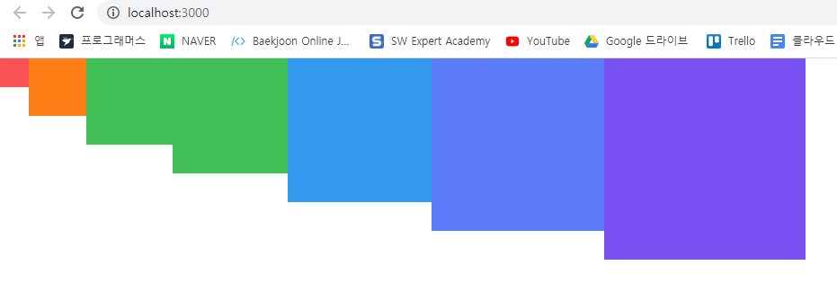
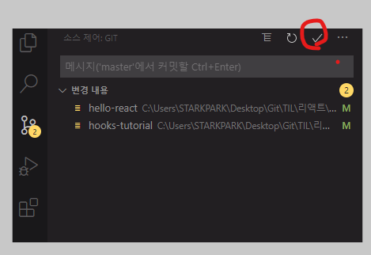

# 컴포넌트 스타일링 

- 리액트에서 컴포넌트를 스타일링할 때는 다양한 방식을 사용할 수 있다. 

  - **일반 CSS** : 컴포넌트를 스타일링하는 가장 기본적인 방법 

  - **Sass** : 자주 사용되는 CSS 전처리기 중 하나로 확장된 CSS 문법을 사용하여 CSS 코드를 더욱 쉽게 작성할 수 있도록 해준다 

  - **CSS Module** : 스타일을 작성할 때 CSS 클래스가 다른 CSS 클래스 이름과 절대 충돌하지 않도록 파일마다 고유한 이름을 자동으로 생성해주는 옵션 

  - **styled-components** : 스타일을 자바스크립트 파일에 내장시키는 방식으로 스타일을 작성함과 동시에 해당 스타일이 적용된 컴포넌트를 만들 수 있게 해준다. 

    

## 9.1 가장 흔한 방식, 일반 CSS 

- CSS 를 작성할 때 가장 중요한 점은 CSS 클래스를 중복되지 않게 만드는 것이다. 
- CSS 클래스가 중복되는 것을 방지하는 여러가지 방식이 있다 
  - 이름을 지을 때 특별한 규칙을 사용하여 짓기. 
  - CSS Selector 를 활용하는 것.


### 9.1.1 이름 짓는 규칙 

- 클래스 이름에 컴포넌트 이름을 포함시킴으로써 다른 컴포넌트에서 실수로 중복되는 클래스를 만들어 사용하는 것을 방지할 수 있다. 

- **BEM 네이밍** : CSS 방법론 중 하나로 , 이름을 지을 때 일종의 규칙을 준수하여 해당 클래스가 어디에서 어떤 용도로 사용되는지 명확하게 작성하는 방식. 

  ```jsx
  예시 
      .card__title-primary
  ```


### 9.1.2 CSS Selector

- CSS 클래스가 특정 클래스 내부에 있는 경우에만 스타일을 적용할 수 있다. 

  ```css
  // .App 안에 들어있는 .logo에 스타일을 적용하고 싶다면 
  
  .App .logo {
      animation : App-logo-spin infinite 20s linear; 
      height : 40vmin; 
  }
  ```

- ```css
  /* App.css */
  .App {
    text-align: center;
  }
  
  /* .App 안에 들어 있는 .logo */
  .App-logo {
    animation: App-logo-spin infinite 20s linear;
    height: 40vmin;
  }
  
  /* .App 안에 들어 있는 header 
      header 클래스가 아닌 header 태그 자체에 
      스타일을 적용하기 때문에 .이 생략되었습니다. */
  
  .App header {
    background-color: #282c34;
    min-height: 100vh;
    display: flex;
    flex-direction: column;
    align-items: center;
    justify-content: center;
    font-size: calc(10px + 2vmin);
    color: white;
  }
  
  /* .App안에 들어있는 a 태그 */
  .App a {
    color: #61dafb;
  }
  
  @keyframes App-logo-spin {
    from {
      transform: rotate(0deg);
    }
    to {
      transform: rotate(360deg);
    }
  }
  
  ```

  ```jsx
  // App.js 
  import React from "react";
  import logo from "./logo.svg";
  import "./App.css";
  
  function App() {
    return (
      <div className="App">
        <header>
          
          <p>
            Edit <code>src/App.js</code> and save to reload.
          </p>
          <a href="https://reactjs.org" target="_blank" rel="noopener noreferrer">
            Learn React
          </a>
        </header>
      </div>
    );
  }
  
  export default App;
  ```

  이런식으로 최상위 html 요소에는 컴포넌트의 이름으로 클래스 이름을 짓고 (.App), 그 내부에서는 소문자를 입력하거나 (.logo), header 같은 태그를 사용하여 클래스 이름이 불필요한 경우에는 아예 생략할 수도 있다. 


## 9.2 Sass 사용하기 

- Sass(Syntactically Awesome Style Sheets) - 문법적으로 매우 멋진 스타일시트 

- CSS 전처리기로 복잡한 작업을 쉽게 할 수 있도록 해준다.

- 스타일 코드의 재활용성을 높여준다. 

- 코드의 가독성을 높여 유지 보수를 더욱 쉽게 해준다. 

- 2가지 확장자 ( `.scss` 와 `.sass` 를 지원 ) . 2 개의 문법은 꽤 다르다. 

  ```scss
  // .sass 
  
  $font-stack: Helvetica, sans-serif 
  $primary-color : #333
  
  body 
  	font: 100% $font-stack
  	color : $primary-color
  ```

  ```scss
  // .scss 
  
  $font-stack: Helvetica, sans-serif ,
  $primary-color : #333,
  
  body {
  	font: 100% $font-stack
  	color : $primary-color
  }
  ```

  - 주요 차이점 

    - `.sass` 확장자는 중괄호와 세미콜론을 사용하지 않는다. 

      반면 `.scss` 확장자는 기존 CSS 를 작성하는 방식과 유사 

  - `scss` 문법이 더 자주 사용된다. 


- `node-sass` 라이브러리 설치 

  ```bash
  > npm add node-sass
  ```

- `SassComponent.scss ` 파일 작성 

  ```scss
  // 변수 사용하기 
  $red : #fa5252; 
  $orange : #fd7e14; 
  $yellow : #40c057;
  $green: #40c057;
  $blue:#339af0;
  $indigo:#5c7cfa; 
  $violet:#7950f2; 
  
  // 믹스인 만들기(재사용되는 스타일 블록을 함수처럼 사용할 수 있음 ) 
  @mixin square($size){
      $calculated: 32px*$size; 
      width : $calculated; 
      height : $calculated; 
  }
  
  .SassComponent{
      display : flex; 
      .box{ // 일반 CSS 에서는 .SassComponent  .box 와 마찬가지
          background : red; 
          cursor : pointer; 
          transition : all 0.3s ease-in; 
  
          &.red{
              // .red 클래스가 .box 와 함께 사용되었을 때 
              background : $red; 
              @include square(1); 
          }
  
          &.orange{
              background : $orange; 
              @include square(2);
          }
  
          &.yellow{
              background : $yellow; 
              @include square(3);
          }
  
          &.green{
              background : $green; 
              @include square(4);
          }
  
          &.blue{
              background : $blue; 
              @include square(5);
          }
  
          &.indigo{
              background : $indigo; 
              @include square(6);
          }
  
          &.violet {
              background : $violet; 
              @include square(7);
          }
  
          &:hover{
              // .box 에 마우스를 올렸을 때 
              background : balck; 
          }
      }
  }
  ```

- Sass 스타일 시트를 사용하는 SassComponent.js 컴포넌트 파일 작성 

  ```jsx
  import React from "react";
  import "./SassComponent.scss";
  
  const SassComponent = () => {
    return (
      <div className="SassComponent">
        <div className="box red" />
        <div className="box orange" />
        <div className="box yellow" />
        <div className="box green" />
        <div className="box blue" />
        <div className="box indigo" />
        <div className="box violet" />
      </div>
    );
  };
  
  export default SassComponent;
  
  ```

- 작업한 이후에는 개발 서버를 재시작해야 Sass 가 성공적으로 적용된다. 

  


### 9.2.1 utils 함수 분리하기 

- 여러 파일에서 사용될 수 있는 Sass 변수 및 믹스인은 다른 파일로 따로 분리하여 작성한 뒤 필요한 곳에서 쉽게 불러와 사용할 수 있다. 

  

- src 디렉터리 밑에 styles 디렉터리 생성 그리고 utils.scss 파일 생성해서 기존 scss 에 작성한 변수와 믹스인 잘라서 이동. 

  ```scss
  //src/styles/utils.scss
  // 변수 사용하기
  $red: #fa5252;
  $orange: #fd7e14;
  $yellow: #40c057;
  $green: #40c057;
  $blue: #339af0;
  $indigo: #5c7cfa;
  $violet: #7950f2;
  
  // 믹스인 만들기(재사용되는 스타일 블록을 함수처럼 사용할 수 있음 )
  @mixin square($size) {
    $calculated: 32px * $size;
    width: $calculated;
    height: $calculated;
  }
  ```

- utils.scss 파일에서 선언한 변수와 믹스인을  기존 scss 에서 사용

  ```scss
  @import './styles/utils';
  
  // 밑은 기존 소스와 동일 
  ```


### 9.2.2 sass-loader 설정 커스터마이징하기 

- 반드시 해야하는 것은 아니지만, 해두면 유용하다. 

  예를 들어, 방금 SassComponent 에서 utils 를 불러올 때 @import './styles/utils' ; 형태로 불러왓지만, 만약 프로젝트에 디렉터리를 많이 만들어 구조가 깊다면 한참을 상위폴더로 거슬러 올라가야한다. 

  위와 같은 문제점은 웹팩에서 Sass 를 처리하는 sass-loader 의 설정을 커스터마이징하여 해결할 수 있다. 

- create-react-app 으로 만든 프로젝트는 프로젝트 구조의 복잡도를 낮추기 위해 세부설정이 모두 숨겨져 있다. 이를 커스터마이징하려면 프로젝트 디렉터리에서 `yarn eject` 명령어를 통해 세부 설정을 밖으로 꺼내주어야한다. 

- create-react-app 에서는 기본적으로 Git 설정이 되어있는데, `yarn eject` 는 아직 Git 에 커밋되지 않은 변화가 있다면 진행되지 않으니 먼저 커밋해줘야한다. 

  

  

## 9.3 CSS Module 

## 9.4 styled-components

