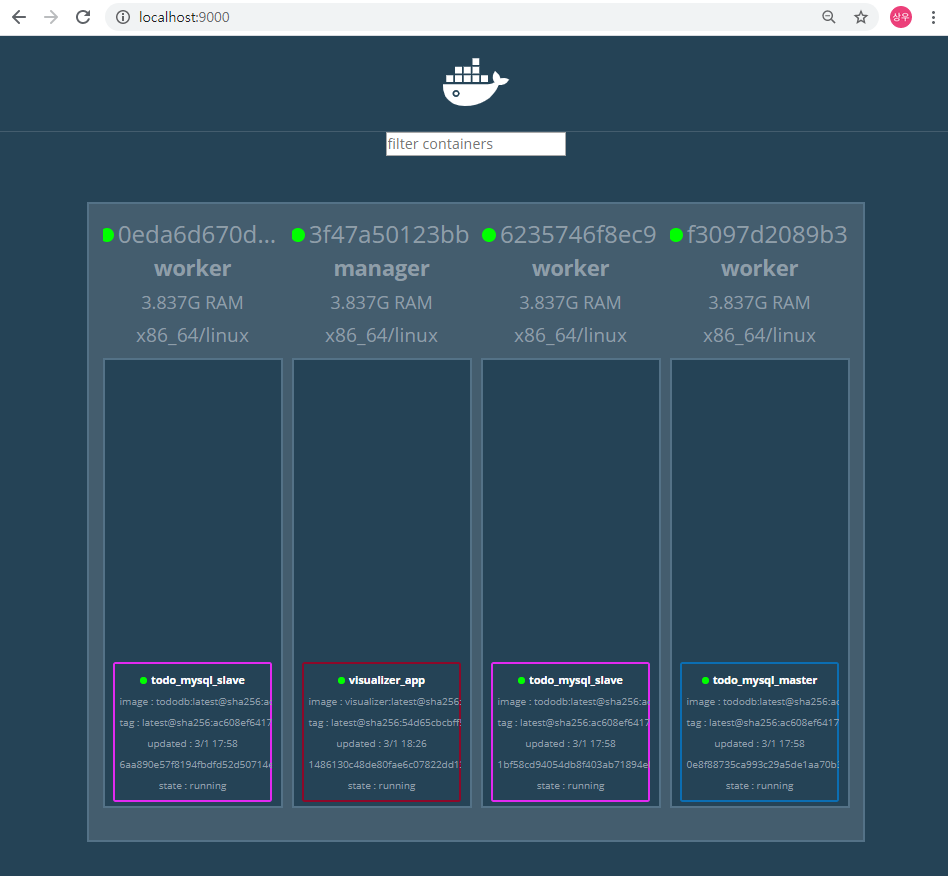

## 스웜을 이용한 실전 어플리케이션 개발 


- 배치 전략
  - 데이터 스토어 역할을 할 MySQL 서비스를 Master-Slave 구조로 구축
  - MySQL 과 데이터를 주고받을 API 구현
  - Nginx 를 웹 어플리케이션과 api 사이에서 리버스 프록시 역할을 하도록 설정 
  - API를 사용해 서버 사이드 랜더링을 수행할 웹 애플리케이션 구현 
  - 프론트앤드 쪽에 리버스 프록시(Nginx) 배치


### MySQL 서비스 구축 


##### 0. overlay 네트워크 생성하기 ( in Manager )

```bash
> docker network create --driver=overlay --attachable todoapp
```


##### 1. Master/Slave 구조 구축

- Docker hub의 Mysql:5.7 이미지로 생성
- Master/Slave 컨테이너는 두 역할을 모두 수행할 수 있는 하나의 이미지로 생성 ( Master 와 Slave 는 각각 서버 ID 가 unique 하게 가져야한다. --> 환경 변수 설정에 따라서 Master 와 Slave 를 분류하여 생성 )
- MYSQL_MASTER 환경 변수의 유무에 따라 Master, Slave 결정 
- replicas 값을 설정하여 Slave 개수 조정 


##### 


강사님 강의자료의  `todo` 디렉터리 복사해서 `day03` 디렉터리 밑에 옮긴다. 그리고 `swarm` 디렉터리 밑의 `todo-mysql.yml` 파일을 `stack` 디렉터리 밑으로 복사한다. ( `stack` 디렉터리가 매니져와 volume 을 공유 )


- Build 및 Swarm Cluster 에서 사용하기 ( `tododb` 디렉터리 밑에서 작업 )

  - Dockerfile 빌드 -> ch04/tododb:latest 이미지 생성

    ```bash
    $ docker build -t ch04/tododb:latest .
    ```

    

  - 생성 된 이미지를 swarm cluster 의 worker node 에서 사용할 수 있도록 localhost:5000/ch04/tododb:latest 태그를붙여 레지스트리에 등록

    ```bash
    # 태그를 변경하는 작업 
    $ docker tag ch04/tododb:latest localhost:5000/ch04/tododb:latest
    ```

    ``` bash
    # 레지스트리에 등록하는 작업
    $ docker tag ch04/tododb:latest localhost:5000/ch04/tododb:latest
    ```

  

  
---

  - 각각의 Worker 에서 `pull` 을 이용하여 레지스트리로 부터 이미지를 다운

  ```bash
    $ docker pull registry:5000/ch04/tododb:latest
  ```

  ```bash
    $ docker images ls
  ```

  - 다운 받은 이미지를 이용하여 컨테이너 실행 
  
    ```bash
    # 우리가 필요한 컨테이너 설치 및 실행 
      $ docker run -d -p registry:5000/tododb:latest 
    ```
  
    ```bash
    # 설치한 컨테이너 목록 확인 
      $ docker container ls 
    ```

---

  위의 명령어는 일일이 작업해야하기 때문에 이를 하나의 stack 으로 묶어서 아래와 같이 작업

  **주의) `.sh` 파일들이 `CRLF`  형식으로 저장되어있으면 오류가 발생하기 때문에 이를 `LF` 로 모두 바꿔준 이후에 작업을 진행해야 오류가 발생하지 않는다 !! **

  - Swarm 에서 Master/Slave 실행 
  
    - MySQL master x 1 (replicas=1), MySQL slave x 2 (replicas=2)
    
      ```yml
      # todo-mysql.yml 코드 
      version: "3"
      
      services:
        master:
          image: registry:5000/ch04/tododb:latest
          deploy:
            replicas: 1
            placement:
              constraints: [node.role != manager]
          environment:
            MYSQL_ROOT_PASSWORD: gihyo 
            MYSQL_DATABASE: tododb 
            MYSQL_USER: gihyo 
            MYSQL_PASSWORD: gihyo 
            MYSQL_MASTER: "true"
          networks:
            - todoapp
      
        slave:
          image: registry:5000/ch04/tododb:latest
          deploy:
            replicas: 2
            placement:
              constraints: [node.role != manager]
          depends_on:
            - master
          environment:
            MYSQL_MASTER_HOST: master
            MYSQL_ROOT_PASSWORD: gihyo 
            MYSQL_DATABASE: tododb 
            MYSQL_USER: gihyo 
            MYSQL_PASSWORD: gihyo 
            MYSQL_ROOT_PASSWORD: gihyo 
            MYSQL_REPL_USER: repl 
            MYSQL_REPL_PASSWORD: gihyo 
          networks:
            - todoapp
      
      networks:
        todoapp:
          external: true
      ```
    
    - 스택 배포하기 
    
      ```bash
      > docker stack deploy -c /stack/todo-mysql.yml todo_mysql
      
      Creating service todo_mysql_master
      Creating service todo_mysql_slave
      ```
    
    - 마스터와 슬레이브의 서비스 구동 상태를 확인 
    
      ```bash
      > docker stack services todo_mysql
      
      ID                  NAME                MODE                REPLICAS            IMAGE                              PORTS
      0kj0fbb05e2k        todo_mysql_master   replicated          1/1                 registry:5000/ch04/tododb:latest
      hxzwbo1fdxui        todo_mysql_slave    replicated          2/2                 registry:5000/ch04/tododb:latest
      ```
    
      
    
      위의 명령들을 순차적으로 실행하면 3개의 worker 중 임의로 마스터 1개와 slave 2개가 지정됨을 확인할 수 있고 아래 컨테이너 시각화 툴 visualizer 를 통해 확인할 수 있다. 
      
      
      
      
    

